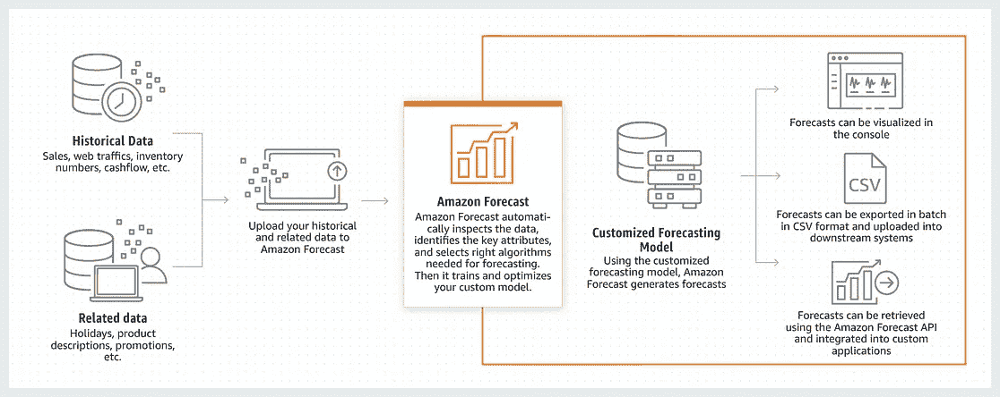
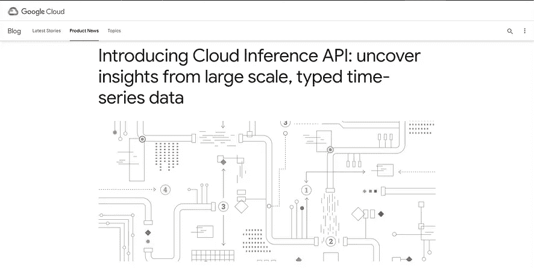
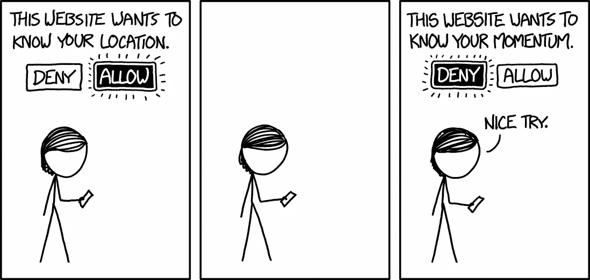
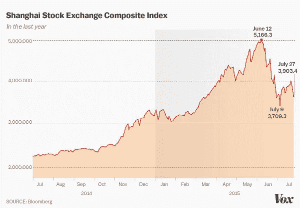
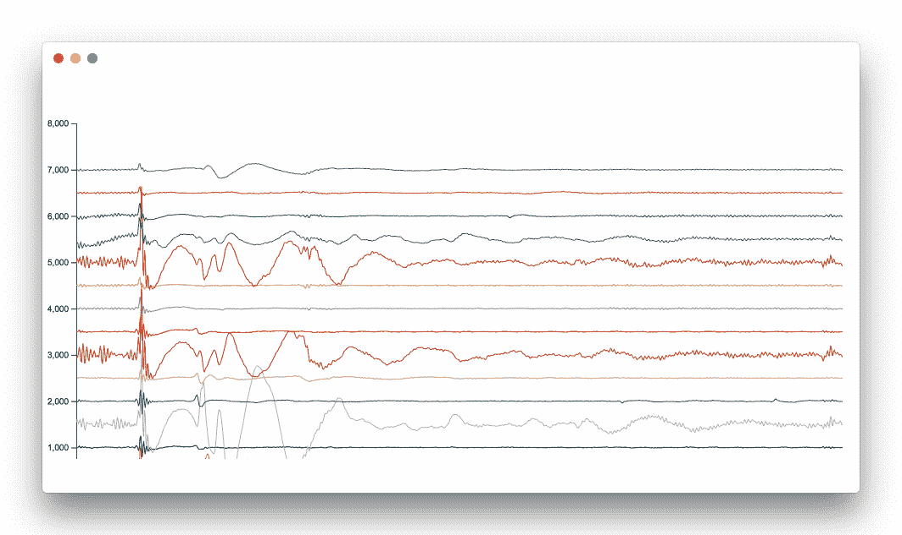
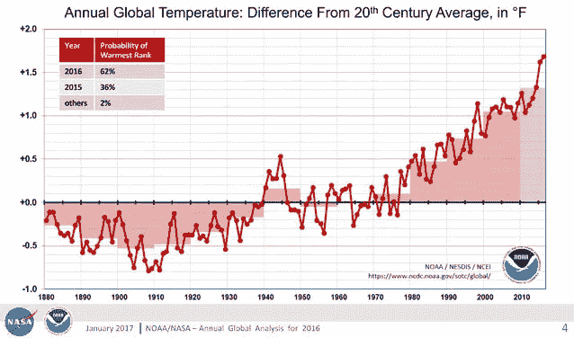
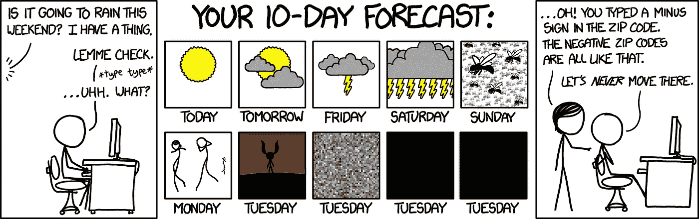

# 揭开时序机器学习的神秘面纱

> 原文：<https://medium.datadriveninvestor.com/demystifying-time-series-machine-learning-405fcd69e663?source=collection_archive---------4----------------------->

## 科技巨头们几乎像淘金热一样疯狂地处理时间序列数据。

Photo by [Chris Liverani](https://unsplash.com/@chrisliverani?utm_source=medium&utm_medium=referral) on [Unsplash](https://unsplash.com?utm_source=medium&utm_medium=referral)

## 流行

2019 年初，亚马逊推出了一个完整的工具来分析时序数据。谷歌在 2018 年 9 月也做出了类似的举动。

Left : Amazon Forecast | Right : Google Cloud Inference API

2018 年 2 月 **InfluxData，**一家在 2014 年开始为时间序列处理构建**开源**工具包的初创公司，宣布了其 3500 万美元的 C 轮融资。今天，他们有超过 12 万的客户使用他们的开源管道和 400 个企业客户。为什么时间序列突然变得如此重要？答案在于目前的技术状态如何产生数据。

## 时序数据

根据定义，任何将“时间”作为变量之一的数据都是时间序列数据。此外，您总能及时收到订购的数据。

 [## DDI 编辑推荐:5 本机器学习书籍，让你从新手变成数据驱动专家…

### 机器学习行业的蓬勃发展重新引起了人们对人工智能的兴趣

www.datadriveninvestor.com](https://www.datadriveninvestor.com/2019/03/03/editors-pick-5-machine-learning-books/) 

> 时序数据是按时间排序的

仅在一个方向接收数据，即，如果时间绘制在 X 轴上，则仅在正确的方向接收数据。过去是固定的。没有新数据会修改旧值。

在当今的物联网和传感器世界中，我们正在获取海量的实时数据。[思科估计](https://www.cisco.com/c/dam/en/us/solutions/collateral/service-provider/global-cloud-index-gci/white-paper-c11-738085.pdf)到 2019 年底，物联网每年将产生超过 500 兆字节的数据。一个 zettabyte 等于(10 亿字节)。

所有这些实时数据都有巨大的机会。这是新时代的金矿。正是这些数据使谷歌地图能够显示交通状况，实现实时飞行、火车和出租车跟踪、污染和天气跟踪等。

从生物学到制造业，实时数据处理在每个领域都有巨大的优势，例如在心脏病发作、股票市场变化甚至机器故障发生前预测它们，以帮助减少停机时间和损失。

xkcd

# 例子

以下所有图片的 x 轴上都有时间。

*   气象数据(温度、风力、降雨量等。)
*   金融数据(股票市场、国内生产总值、汇率)
*   医疗数据(脑电图、心电图、体温、血压)

Left — Stock Exchange [Vox](https://www.vox.com/2015/7/7/8910293/china-stock-market-crash) | Middle — EEG Data [NPM](https://www.npmjs.com/package/wits) | Right — Weather Data [NOAA](https://www.ncdc.noaa.gov/sotc/global/201713)

好吧，我们被时间序列数据包围了，为什么这对我们机器学习的人很重要？

## 时间序列是机器学习的救星

任何按时间排序的数据都有非常有趣的特征，可以从中提取出来。假设一个人的心跳在 2 小时前是正常的，但现在却不稳定。这一信息对预防中风和心脏病发作非常有用。类似的信息可以帮助管理自然灾害、恐怖袭击、金融崩溃和机器故障。

机器学习算法喜欢这类数据。时间序列数据可以以多种方式为机器学习提供信息。

1.  通过查看高活动数据和低活动数据，帮助为数据分配标签。例如正常和不稳定的心跳
2.  提取数据的统计特征，例如上升或下降趋势以及上升速度。
3.  在没有任何其他明确特征的情况下，它可以帮助理解序列本身的生成机制
4.  预测。这些数据可以帮助我们预测未来会发生什么。这在医疗保健、预测地震、销售等方面有非常有用的应用。

[xkcd](https://xkcd.com/1606/)

## 机器学习工程师必须牢记这 10 条戒律

> “时间序列数据往往很大，因此性能和可伸缩性至关重要。处理时序数据的关键要求是能够非常、非常快速地分析和汇总数据。”

1.  **你不应该依赖单一变量—** 时间序列数据非常复杂。很多时候，单个变量不足以决定一个系统。进行多元时间序列分析
2.  **没有两个变量是相似的—** 每个变量可以有不同的采样率。温度可以每小时采样一次，湿度可以每天采样一次。
3.  **你要有耐心——**单一的时间快照可能不足以推断出信号中所有状态的信息。需要对长期数据进行分析。因此，算法需要消化大量的时间历史数据。
4.  **了解你的特征** —手动选择均值、移动平均、高阶导数等特征是不可行的，在大多数情况下也不是很有用。ARIMA、RNNs 和 SAX 等。对于特征提取很有用，并且经常使用，但是现在像 Google 和 Amazon 这样的公司更喜欢无监督的特征提取
5.  **变化(变换)在**之内——通常上述特征提取方法不能直接应用于原始信号。需要变换— *光谱分析、重采样、窗口优化等。*
6.  **品种是生活的调味品——**监督+非监督标注相结合。并不总是可能有整齐标记的数据。因此有必要使用无监督标记。
7.  **管理数据—** 实时处理信号的需求带来了存储挑战。需要预留一定量的内存来缓冲输入模型的信号历史。随着多个信号以不同的采样速率被捕获，同步成为一个关键问题。
8.  **美在于可视化器—** 最后，如果没有一种方法来可视化从机器学习基础设施中获得的洞察力，所有的分析都是无用的。必须向组织提供可操作的见解，以利用实时时间序列数据。

## 从哪里开始？

*   一个很好的开始地方是一本处理它的所有统计方面的书，并且使用语言 r。

 [## 带 R 的介绍性时间序列

### 用 R 书介绍时间序列。阅读来自世界上最大的读者社区的两篇评论。这本书给出了…

www.goodreads.com](https://www.goodreads.com/book/show/6637573-introductory-time-series-with-r) 

*   网上有很多对 TS 数据执行各种机器学习算法的教程。

 [## 如何开始深度学习时间序列预测(7 天迷你课程)

### 时间序列预测速成班的深度学习。把深度学习方法带到你的时间序列项目中 7…

machinelearningmastery.com](https://machinelearningmastery.com/how-to-get-started-with-deep-learning-for-time-series-forecasting-7-day-mini-course/) 

时间序列预测是一个研究得很好但仍在发展的领域。它将彻底改变整个物联网世界，进而改变我们生活的现实。