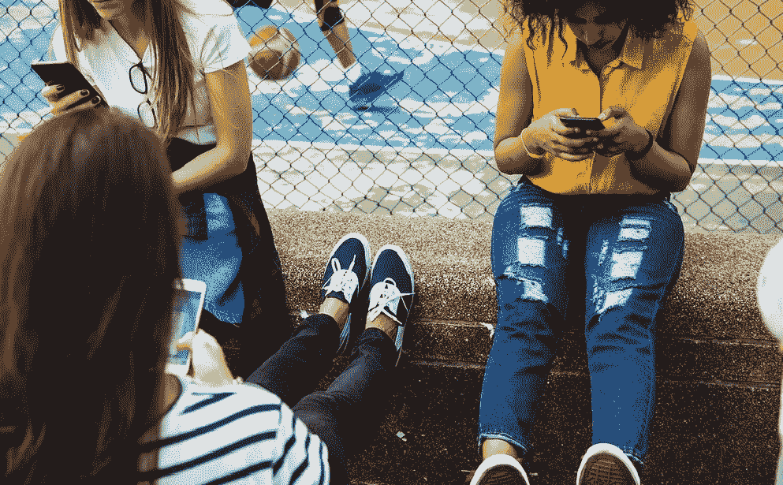
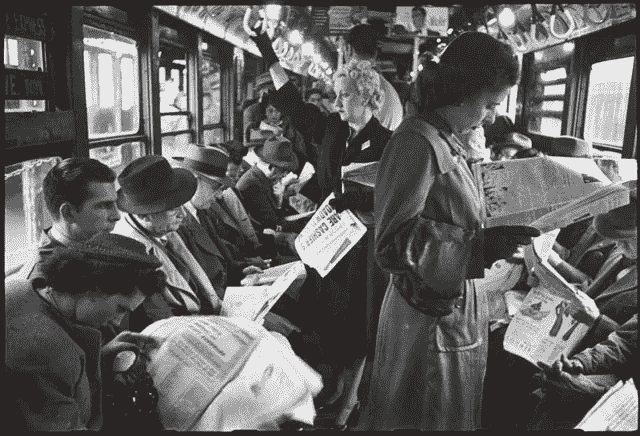

# 拒绝社交媒体是上瘾的另一面

> 原文：<https://medium.datadriveninvestor.com/denial-of-social-media-is-the-other-side-of-addiction-acd89e0369bd?source=collection_archive---------19----------------------->

近年来，人们对社交媒体的幻想破灭了。随着公众对他们的批评越来越多，许多人开始使用短信排毒，甚至完全删除了他们的短信账号。这可以理解。随着社交网络交易或泄露的大量个人数据的曝光，以及关于短信对我们福祉的负面影响的最新研究[，](https://www.independent.co.uk/life-style/health-and-families/social-media-mental-health-negative-effects-depression-anxiety-addiction-memory-a8307196.html],)人们开始担忧。然而，SM 似乎是人们生活中太重要的一部分，不能忽视它们。以前的信徒变成了狂热的仇恨者，开始攻击 SM 巨头的风车，试图回到纯粹主义者，互联网出现之前的状态。

但是，让我们仔细看看，并尝试回答这个问题-敌人是在外面，在 SM 邪恶的做法，还是在我们的内部？脸书和 Instagram 创造了恶魔还是仅仅让它离开了原始洞穴？为了解决这些难题，我将探讨针对社交媒体的四项主要指控。

**1。在社交媒体出现之前，人们有更好的社交生活**

论点是，社交媒体将友谊从一个主动的过程变成了一个被动的过程。而不是和现实生活中的人见面，谈论重要的事情，而是在 SM 上被动的跟随。通讯已经被掏空了。

是的，短信交流通常是无意义的，但是我们正在与一个从未存在过的典范进行比较。当我们说:“过去”时，我们大多描述的是我们的理想愿景。事实上，有些人在三十年前有更好的社会生活。而其他人没有。一些人与家人和朋友共度了美好时光，而另一些人则呆在家里看电视。过去，人们通常在社会上更加孤立，跨文化交流的可能性更小。难怪，当全球范围的互联网到来时，许多年轻人投身于这个勇敢的新世界。因为它有趣、吸引人，并提供令人兴奋的机会。这是一种更好的交流方式！

Intensive social interactions before social media and smartphones.

建立有意义的关系一直是一项艰巨的任务，在过去如此，在数字时代更是如此。你需要这样的技能，比如同理心、倾听的能力、积极寻找与你观点和想法相同的人。我们确实需要刺激活跃的人际关系的社交媒体，但同时，我们可以利用现有的工具来增强我们的社交生活，而不是损害它。

**2。社交媒体传播与他人理想数字图像的比较**

研究人员首先发出了警报，因为他们发现青少年的抑郁症与他们因不断与他人比较而广泛使用社交媒体之间存在联系。但是，我们这些成年人当中，谁没有在看着某个小妞啜饮芒果奶昔的海滩照片，而你却被锁在灰色的办公室墙壁里时，嫉妒得脸色发青呢？

但这几乎不是 SM 创造的恶魔。我们是社会人，我们倾向于通过与他人比较来定义自己的个人价值。我们试图通过不断与周围的人对比来找到自己在这个世界上的位置，并根据我们对他人成功与否的看法来调整这种看法。SM 强化了这种效应，并经常利用人们的低自尊(因此，脸书声称它可以[识别感到“不安全”和“无价值”的年轻人](https://www.theguardian.com/technology/2017/may/01/facebook-advertising-data-insecure-teens)，以进一步利用这些信息进行更精细的定位)。所以，你对自己越失望，就越有可能被社交媒体所吸引。

你可以放弃社交媒体，但是你不能停止和别人比较，除非你改变你的思维方式。让你的自尊有根有据——并仔细过滤你的新闻，这样硅宝贝和法拉利的家伙就不会打扰你的睡眠！

**3。社交媒体的使用刺激了消费主义**

这是事实——SM 希望我们消费。越来越多。无情地。你应该已经注意到这个自由和表达的殿堂很久以前就变成了一个市场。一个商业教练，一个时尚达人，甚至一个有三个孩子的普通妈妈，都试图向你推销一些东西。

即使博主没有直接获得报酬，他仍然在销售。生活方式。旅行。那套昂贵的瑜伽服装。你在 Instagram 上看到的威尼斯咖啡馆里的提拉米苏(然后令人惊讶的是，一个月后你发现自己正坐在那家咖啡馆里！).你被诱惑了。一个账户越有趣，它对推动我们购买和消费的边缘系统的影响就越大。

但这就是我们生活的世界。SM 只是它的触角进入我们思想的另一个孔。我试图意识到 SM 产生的消费刺激，并通过提问来阻止它们——买了这个之后，我的生活会变得更好吗？如果我没有了解到这一点，我会感到更痛苦吗？在大多数情况下，答案是——不。所以，我滚动着诱人的图片，把它从我的脑海中抹去。在社交媒体时代，从商业垃圾中分离有用信息是一项非常有用的技能。

**4。社交媒体的使用侵蚀了我们的决策**

社交媒体公司利用行为心理学的最新进展来创造更有说服力的技术来指导我们的决策，这并不是什么高度机密。行为研究表明，人们并不理性，容易受到各种偏见的影响，精明的公司可以利用这些偏见来获利。我们的自由选择变得有限，因为 SM 优先考虑即时反应而不是思考，并向我们提供过多的信息信号，以至于人们没有时间和精力去思考什么是重要的。问题是——我们能用我们有限的个人努力来对抗这种精神操纵吗？

这不是一个确定的答案。知道你不是理性的，你的决定受到你在 SM 中看到的影响，这可能是解放的第一步。我们仍在等待政府下定决心，限制企业在多大程度上利用我们的偏见——承认这不仅是我们的私人问题，也是对我们社会生活基础的威胁，这一点很重要。在这种情况发生之前，保护我们自由意志的唯一方法是减少花在社交媒体上的时间，并监控那里有什么——我称之为“社交媒体卫生”。

**5。那么，我会删除我的短信账号吗？**

可能不会。现在不会。我觉得如果你负责任地使用它们，它们还是利大于弊。

如果你觉得短信让你浪费时间或感到沮丧，删除账户类似于治标不治本。突然戒除可能会再次肯定社交媒体在你心目中被夸大的地位，就像吸毒是瘾君子的事情一样。你会停止使用它，但你不会停止思考它。相反，更好的解决办法是培养你如何在 SM 上花费时间的自我意识。放弃毫无意义地浏览新闻提要的习惯。通过分享有用和鼓舞人心的信息变得更加积极主动。谨慎选择关注对象，不留遗憾地删除垃圾邮件发送者。保护你的隐私。使用 SM 更好地组织您的离线生活。吃饭或社交时，不要在床上使用智能手机。就是这样。比如从街上回来前洗手。

SM 为我们提供了前所未有的连接性和机会，让我们可以制作有价值的内容并与广大用户分享。我们认为这是理所当然的，但这是珍贵的。想想托尔斯泰那个时代，创作者必须走很长的路才能让世界了解他们的想法——当想法离开创作者的脑海时，它已经变成灰色了。现在比以往任何时候都容易。但对我来说，这也意味着责任——我们应该像托尔斯泰一个多世纪前对待自己的作品一样，以同样的谨慎和智慧对待我们在 SM 上制作和分享的内容。我们应该不断问自己——花在社交媒体上的时间是否值得？