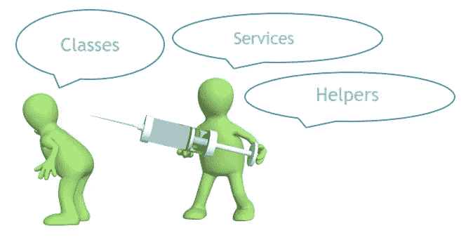

# C#中的依赖注入

> 原文：<https://medium.datadriveninvestor.com/dependency-injection-in-c-cf4e5a659204?source=collection_archive---------5----------------------->


许多软件开发人员都在纠结如何以正确的方式处理他们的服务和助手。随着应用程序变得越来越大，处理依赖关系的责任也越来越大。

这个故事是为所有在处理依赖关系方面没有太多经验的开发人员准备的。

[](https://www.datadriveninvestor.com/2019/01/23/which-is-more-promising-data-science-or-software-engineering/) [## 数据科学和软件工程哪个更有前途？数据驱动的投资者

### 大约一个月前，当我坐在咖啡馆里为一个客户开发网站时，我发现了这个女人…

www.datadriveninvestor.com](https://www.datadriveninvestor.com/2019/01/23/which-is-more-promising-data-science-or-software-engineering/) 

只要你有面向对象编程的经验，我们就可以开始了。

这里有几件事我需要讨论一下。

*   **依赖注入**
*   **紧耦合**
*   **松耦合**

# **什么是依赖注入？**



**依赖注入**是一种编程技术，其中一个对象提供另一个对象的依赖。这有助于我们遵循单一责任原则。

# **界面**

我们将使用接口来打破类内的依赖性。这使得我们的类依赖于接口。当使用依赖注入时，这是非常重要的，它节省了我们大量的时间和代码。

# 服务

我们正在创建的所有依赖项都被称为**服务**。这可以是创建，读取，更新，删除操作，计算或上传功能，你会在开发时间使用。

# **客户端**

客户是将要使用我们服务的人。

# **使用依赖注入**

首先，我将创建一个名为 **IJourneyService** 的接口。它有一个**虚空**法

命名为 **Go()** 因为我们只是返回一条消息。

```
public interface IJourneyService{ void Go();}
```

我还创建了两个名为 **Bike** 和 **Car** 的服务，它们实现了**ijoureyservice**接口。这将继承 **void** 方法，即 **Go()**

```
public class Bike : IJourneyService{ public void Go(){ Console.WriteLine("I'm going to use my Bike"); }}public class Car : IJourneyService{ public void Go(){ Console.WriteLine("I'm going to use my Car"); }}
```

我们的服务已经创建好了，现在是时候创建将使用我们服务的客户端类了。

```
public class JourneyClient : IJourneyClient{ private IJourneyService journey;
    public JourneyClient(IJourneyService journey){ this.journey = journey;
    } public void ServeGo(){ this.journey.Go();
    }}
```

正如您在这里看到的，我们的客户端有一个构造函数，它接受实现 **IJourneyService** 的类的实例，因为该接口无法实例化，它还实现了**ijourneyseclient**接口，以服务于来自 **IJourneyService 的方法。**

# 例子

```
namespace DI{ class Program { static void Main(string[] args) { Bike bike = new Bike(); Car car = new Car(); JourneyClient jc = new JourneyClient(bike); jc.ServeGo(); } }}
```

我们的客户端已经被实例化，但是构造函数需要一个实现 **IJourneyService 的实例化类。**我们可以在这里将任何对象传递给它的构造函数，只要实例化的对象实现了**ijjourneyservice**然后我们调用了 **ServeGo()** 方法来骑自行车或汽车。

# **问题**

如果你的依赖变大了怎么办？你认为我们还需要在每次需要的时候为每个类创建一个实例吗？不会吧。这时我们将使用依赖注入框架，它允许我们根据业务需求和期望轻松调整代码。

请继续关注我的下一篇教程，这是在 ASP.Net Web API 上使用 Ninject 的依赖注入。👌