# 部署用 Kotlin 编写的 Azure 函数

> 原文：<https://medium.datadriveninvestor.com/deploy-azure-functions-written-in-kotlin-f21db8780c92?source=collection_archive---------4----------------------->

[](http://www.track.datadriveninvestor.com/1B9E)

我想用一种编程语言开发一个从前端到后端的应用程序。由于我来自专注于 Android 的移动开发背景，我有两个选择，要么用 Java，要么用 Kotlin。最近，Kotlin 被 Android 开发者广泛采用。我决定尝试使用 Kotlin 进行全栈开发。

我想选择一个可以在整个堆栈上尝试的应用程序，所以我决定选择 Dictionary 应用程序，除了看看 Kotlin 能让我走多远。我不希望我的服务器全天候运行，耗尽我在 Azure 上的所有免费试用积分，所以我决定尝试一些他们提供的无服务器等效功能，并发现 Azure 功能符合我的目标。

[](https://www.datadriveninvestor.com/2019/03/26/agile-management-the-good-the-bad-and-the-downright-ugly/) [## 敏捷管理:好的、坏的、丑陋的|数据驱动的投资者

### 公司不断重塑自己，以获得或保持竞争优势和市场份额。这是…

www.datadriveninvestor.com](https://www.datadriveninvestor.com/2019/03/26/agile-management-the-good-the-bad-and-the-downright-ugly/) 

这篇文章是前两篇的续篇，是我写的。我必须对其进行细分，以增加所呈现信息的深度。如果你需要了解我们是如何用 Kotlin 开发 Azure 函数的，可以看看前面的文章。如果您只关注部署方面，您可以完成这一步。我会根据需要给出前一个的参考文献。

*   [使用 Kotlin 的全栈开发](https://medium.com/@juliuscanute/fullstack-development-using-kotlin-on-android-and-azure-functions-121571587163)
*   [在本地运行用 Kotlin 编写的 Azure 函数](https://medium.com/datadriveninvestor/build-and-test-azure-functions-written-in-kotlin-locally-33522f1fa29a)

> 在这篇文章中，我将展示:
> 1。如何使用 Terraform 在 Azure 中创建所需的基础架构。
> 
> 2.使用 IntelliJ 时，如何从本地机器部署 Azure 函数。由于我来自 Android 背景，所以我广泛使用 IntelliJ，不想仅仅因为它与 Azure 有更好的集成就切换到 Visual Studio。此外，出于某种原因，Kotlin 与 IntelliJ 相处得很好。
> 
> 3.如何使用 Azure DevOps 部署 Azure 功能？因为并不总是只有你一个人在做一个项目，所以我决定建立一个管道来处理构建和部署，我喜欢 Azure DevOps，因为它简单易用，所以我将分享我的发现。

# 使用 Terraform 为 Azure 功能创建基础架构

在部署 Azure 功能之前，我们需要创建它所需的基础设施。如果您遵循前面的方法，我们需要在云中实例化以下资源。
* Azure Cosmos DB(字典应用的后端数据存储)
*应用服务、应用服务计划和应用洞察(部署 Azure 功能的服务)

## 为状态文件创建远程存储

我更喜欢远程存储我的状态文件，因为我不想冒丢失它的风险。此外，它让我可以根据需要自由切换笔记本电脑。为此，我在 Azure 中创建了一个存储帐户和容器，并将状态文件推送到其中。要了解如何创建第一个存储容器，请查看本文并浏览“使用 Terraform 创建基础设施”一节中的步骤 1 至 7。

## 创建函数 App 和 Azure Cosmos DB

1.  从以下链接查看源代码:【https://github.com/juliuscanute/azure-function-kotlin】链接:[T2](https://github.com/juliuscanute/azure-function-kotlin)
2.  切换到 infra 目录并创建两个文件。

```
**infra\terraform.cfg**storage_account_name = ####
container_name = ####
key = "deploy.tfstate"
access_key = ####**infra\terraform.tvars**cosmos_db_name = "example_db"
storage_account_name = ####
container_name = ####
key = "old.tfstate"
access_key = ####
failover_location = "australiacentral"
database_uri = "dbs/####/"
collection_uri = "dbs/####/colls/####"
function_app_name = "sample_app_name"
```

您最初不会有 database_uri 和 collection_uri，但是不要担心现在填充一些空值。这是一个先有鸡还是先有蛋的问题，因为你还没有数据库。创建数据库后，可通过 Terraform 更新 URI。如果您决定使用管道进行部署，那么您也可以从部署管道中更新这些值。

3.请务必仔细阅读该计划，以了解 terraform 将在您的基础架构中带来哪些变化。

3.1 初始化 Terraform，以便它知道在哪里寻找我们的代码使用的状态文件和模块。

```
terraform init --backend-config="terraform.cfg"
```

3.2 请务必仔细阅读计划，了解 terraform 将对您的基础设施带来哪些变化。

```
terraform plan --var-file="terraform.tvars"
```

3.3 一旦被说服，将更改应用于以下内容。

```
terraform apply --var-file="terraform.tvars"Apply complete! Resources: 3 added, 0 changed, 0 destroyed.Outputs:connection_strings = [
    AccountEndpoint=[https://cosmos-db-####.documents.azure.com:443/;AccountKey=####](https://cosmos-db-99924.documents.azure.com:443/;AccountKey=####);,
    AccountEndpoint=[https://cosmos-db-####.documents.azure.com:443/;AccountKey=####](https://cosmos-db-99924.documents.azure.com:443/;AccountKey=####);,
    AccountEndpoint=[https://cosmos-db-####.documents.azure.com:443/;AccountKey=####](https://cosmos-db-99924.documents.azure.com:443/;AccountKey=####);,
    AccountEndpoint=[https://cosmos-db-####.documents.azure.com:443/;AccountKey=####](https://cosmos-db-99924.documents.azure.com:443/;AccountKey=####);
]
database_id = ####
primary_master_key = ####
primary_readonly_master_key = ####
read_endpoints = [
    [https://cosmos-db-####-customid.documents.azure.com:443/](https://cosmos-db-99924-customid.documents.azure.com:443/),
    [https://cosmos-db-####-australiacentral.documents.azure.com:443/](https://cosmos-db-99924-australiacentral.documents.azure.com:443/)
]
write_endpoints = [
    [https://cosmos-db-####-customid.documents.azure.com:443/](https://cosmos-db-99924-customid.documents.azure.com:443/)
]
```

记下输出，因为这些信息将在后续步骤中用于连接到 Cosmos DB。

在应用之后，当您登录到 Azure 门户并验证在资源组下创建的资源时，您应该会发现以下资源类型。

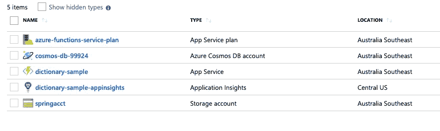

Azure Portal -Resource Group

## 创建宇宙数据库

一旦提供了基础设施，我们需要从 Azure 门户创建一个 Cosmos DB 数据库。我在下面展示了创建数据库的步骤。一旦提供了数据库，您需要使用数据迁移工具迁移数据，如我的前一篇文章中的[所示，使用通过提供基础架构生成的新连接字符串，如上面的 Terraform 输出所示。](https://medium.com/datadriveninvestor/build-and-test-azure-functions-written-in-kotlin-locally-33522f1fa29a)

1.  从资源组中选择 Cosmos DB。

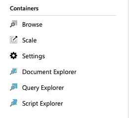

Azure Portal — Cosmos DB

2.打开数据浏览器。

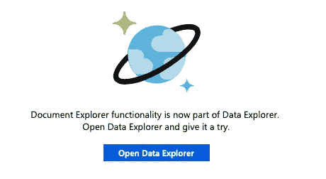

Azure Portal — Data Explorer

3.创建一个 Cosmos DB 容器。

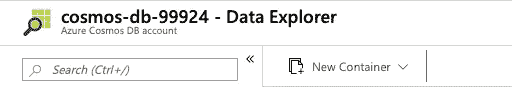

Azure Portal — New Container

4.创建 Cosmos DB 数据库。

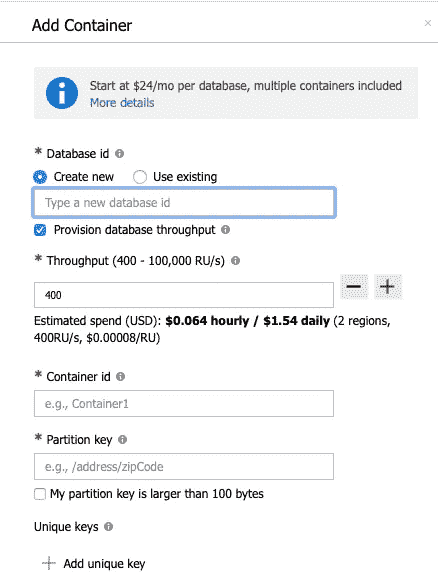

Azure Portal — Create New

5.在迁移数据之后，您可以获得数据库和集合 URI，然后查看装载到 Cosmos DB 中的任何项目。


Azure Portal — Database & Collections URI

5.1 数据库 URI 的形式如下所示。

```
dbs/####/
```

5.2 URI 集合的形式如下所示。

```
dbs/####/colls/####/
```

您可以通过更新“terraform.tvars”中的“database_uri”和“colletion _ uri”来使用 Terraform 重新应用更改，因为您在开始时没有这些信息。

现在 Inra 设置完成了。让我们关注部署。

# 从本地机器构建并部署到 Azure

正如前面所强调的，应用程序完全是使用 Kotlin 编写的。为 Azure 函数生成构件的构建系统基于 Maven。

## 构建和打包

以下命令生成用于部署的工件。确保功能应用程序名称与您用于配置基础架构的名称相匹配。

```
**mvn clean package** -Dbuild.artifactId=<id> -Dbuild.artifactVersion=<verion> -DfunctionAppName=<**function_app_name**>
```

根据触发 maven 命令的构建参数，目标目录应该有以下构件。

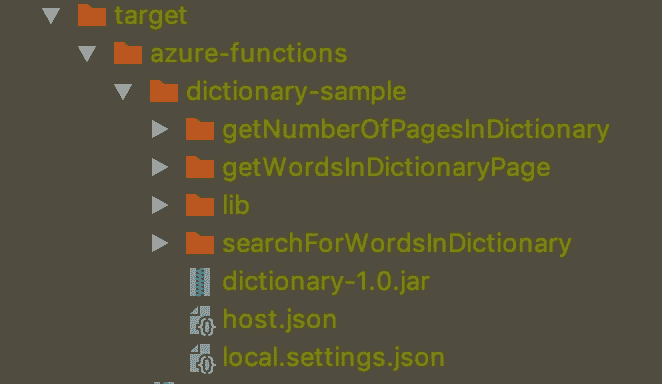

IntelliJ IDEA — Package

## 部署

以下命令要求您在本地计算机上安装了 Azure CLI 工具，并且该工具具有对基础架构进行更改的权限。如果您使用 Terraform 来创建本文中所示的 Infra，我假设这个工具已经安装在您的本地机器上。现在剩下的就是执行下面的命令了，部署工作已经为您完成了。确保功能应用程序名称、功能应用程序区域、功能应用程序资源组与您用于设置基础架构的资源组相匹配。

```
**mvn azure-functions:deploy** -Dbuild.artifactId=<id> -Dbuild.artifactVersion=<verion> -DfunctionAppName=<**function_app_name**> -DfunctionAppRegion=<**region**> -DfunctionResourceGroup=<**resource_group**>
```

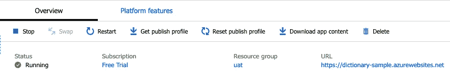

Azure Portal — Function App Dashboard

## 核实

现在，我们可以验证是否从端点获得了响应。您可以使用 Swagger 或简单的 cURL 命令。

```
> curl -X GET "https://<function_app_name>.azurewebsites.net/api/v1/dictionary/pages" -H "accept: application/json"{"start":1,"end":2683,"recordsPerPage":20}
```

# 从 Azure DevOps 构建并部署到 Azure

使用 Azure DevOps，我创建了两条管道，主要用于构建和发布。

## 构建和打包

1.让我们从创建一个新的构建管道开始。

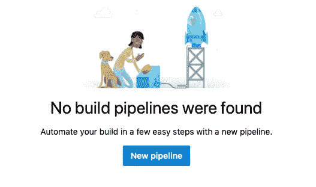

ADO — New Pipeline

2.我在 GitHub 中托管了我的代码:[https://github.com/juliuscanute/azure-function-kotlin](https://github.com/juliuscanute/azure-function-kotlin)

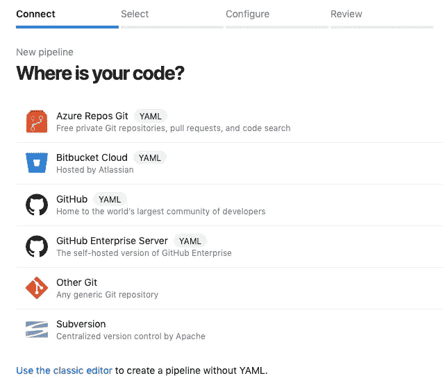

ADO — Pick Provider

3.让我们挑选与 Azure 功能相对应的存储库。

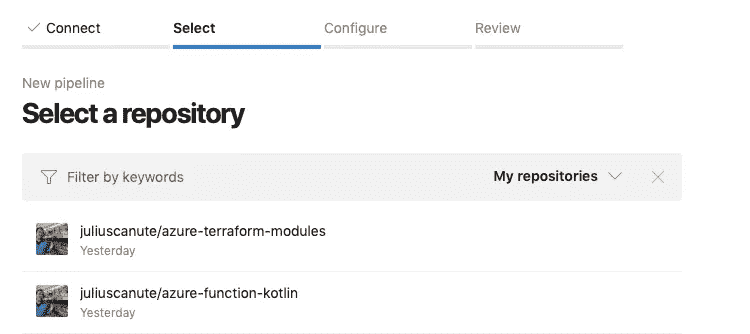

ADO — Pick Repository

4.您可以使用 Yaml 中指定的以下构建管道来构建和打包工件。它基本上做了我们在本地构建包时所做的事情。

azure-pipelines.yml

5.构建作业需要两个参数，一个是 artifactId，另一个是函数应用程序名称。对于 artifactId，您可以随意命名，但是对于 Function App Name，请提供您在创建基础结构时使用的名称。

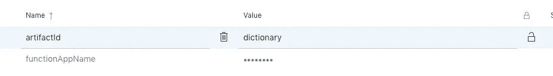

ADO — Build pipeline variables

6.将作业排队并等待大约 5 分钟，构建和打包应该在那时完成。

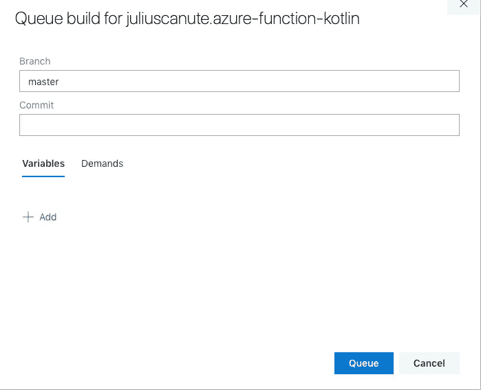

ADO — Trigger Build

7.构建完成后，您可以在右上角查看工件。

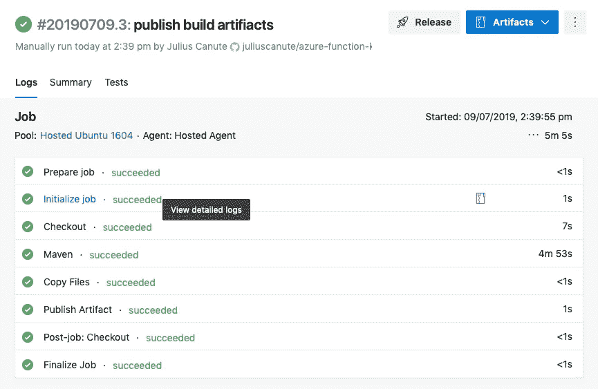

ADO — Build Artifacts

## 部署

1.  让我们从创建一个新的发布管道开始。

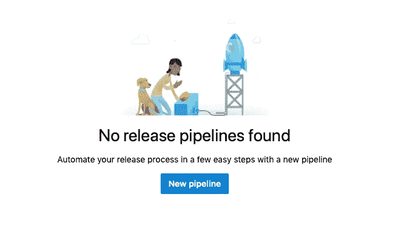

ADO — New Release Pipeline

2.确保从作业模板中选择 Azure App Service deployment。

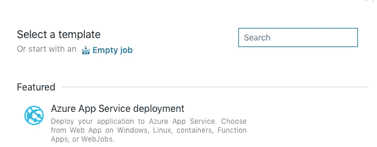

ADO — Azure App Service Deployment

3.在我的例子中，我只有一个部署到 Prod 的阶段。

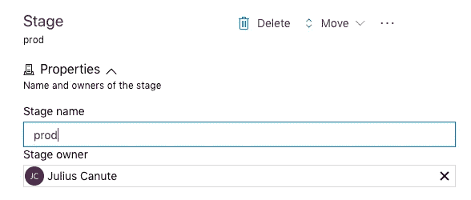

ADO — Create Stage

4.选择您的工件需要从哪个构建管道中提取以进行首次展示。

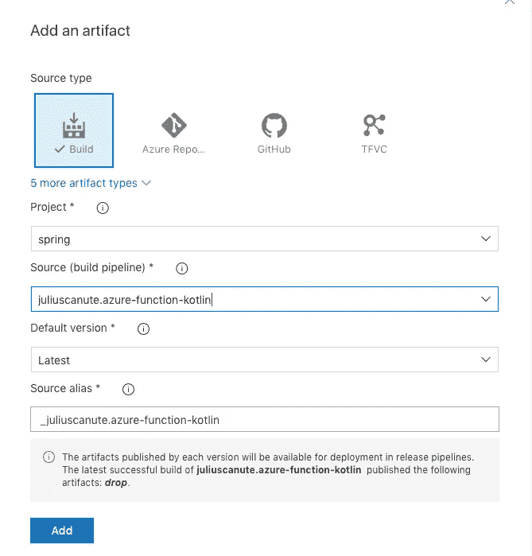

ADO — Add Artifact

5.请记住，在创建宇宙、URI 收藏、URI 数据库的密钥时，你没有精确的信息。这些信息可以从部署管道中应用，如下所示。我将它们创建为管道变量，并将它们链接到作业模板。

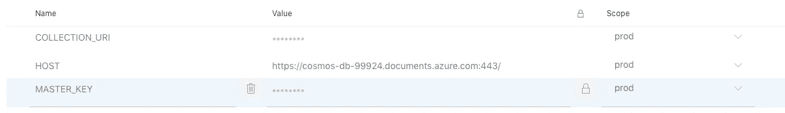

ADO — Pipeline Variables

6.下面的配置显示了我用于作业模板的设置。

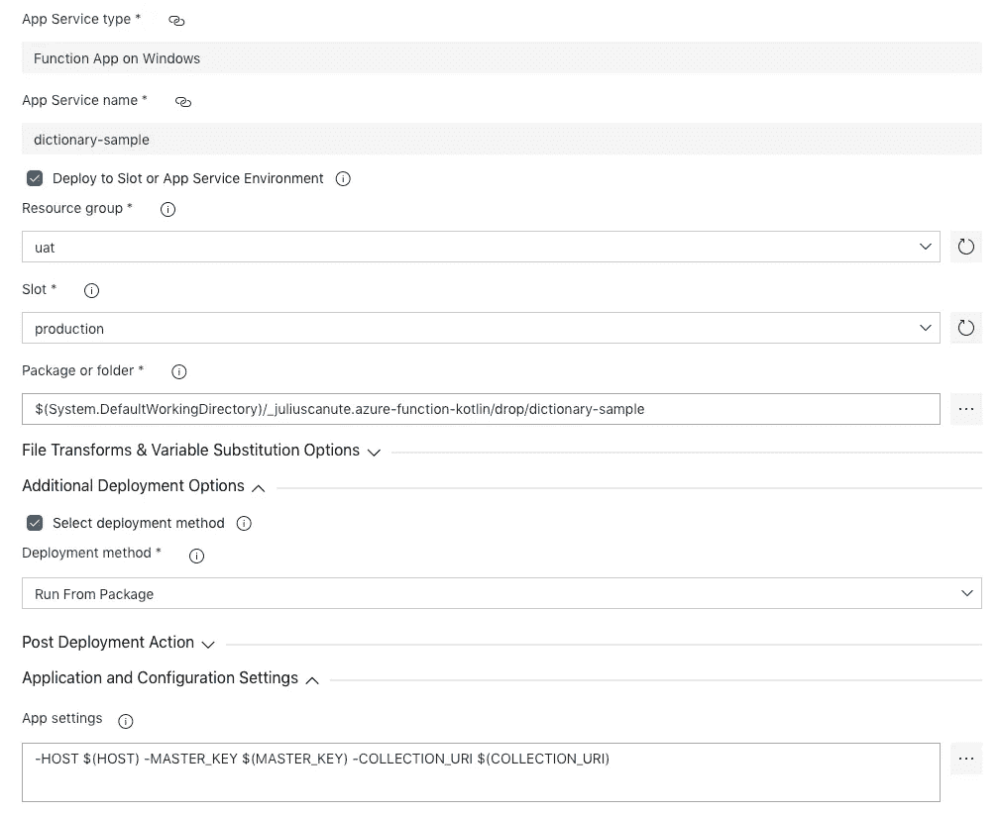

Azure App Service Deployment — Configure

7.让我们创建一个新版本。


ADO — Create Release

8.等待首次展示成功。

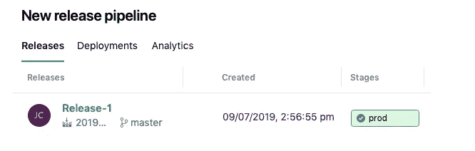

ADO — Deployment Status

9.您可以查看下面的部署日志。

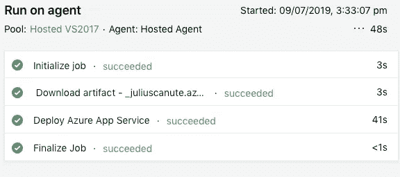

ADO — Deployment Logs

**验证**

1.  让我们使用 Android 应用程序进行验证。我将在我的 Android 代码中做一个更改，使用分配给函数应用程序的 URL。

DictionaryModule.kt

2.当应用程序第一次与 API 联系时，加载时间会稍长，这是预期的冷启动行为。我认为在 Azure 中有一种方法可以通过保留一些计算能力来避免冷启动，但我没有在这个项目中尝试过。

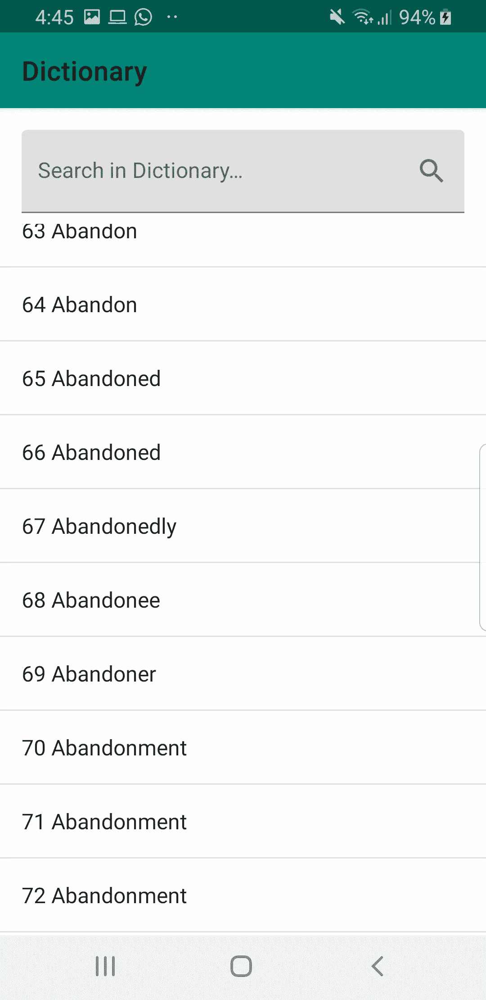

Dictionary App

# **下次**

因为这个系列是关于使用 Kotlin 的全栈开发。接下来，我将展示字典应用程序的 Android 方面。在那之前保重，再见！

# 信用

为了让这个例子更真实一点，我从下面的[链接](https://github.com/manassharma07/English-Dictionary-CSV)中获得了预处理过的词典数据，我要感谢这个人和古腾堡计划让我的工作变得简单了一点。

# 链接

*   https://maven.apache.org【美文】
*   [https://www . terra form . io](https://www.terraform.io)【terra form】
*   [https://github.com/juliuscanute/azure-function-kotlin](https://github.com/juliuscanute/azure-function-kotlin)【代码库】
*   [https://medium . com/@ Julius Canute/full stack-development-using-kot Lin-on-Android-and-azure-functions-121571587163](https://medium.com/@juliuscanute/fullstack-development-using-kotlin-on-android-and-azure-functions-121571587163)【第一部分】
*   [https://medium . com/datadriveninvestor/build-and-test-azure-functions-written-in-kotlin-locally-33522 f1fa 29 a](https://medium.com/datadriveninvestor/build-and-test-azure-functions-written-in-kotlin-locally-33522f1fa29a)【第二部分】