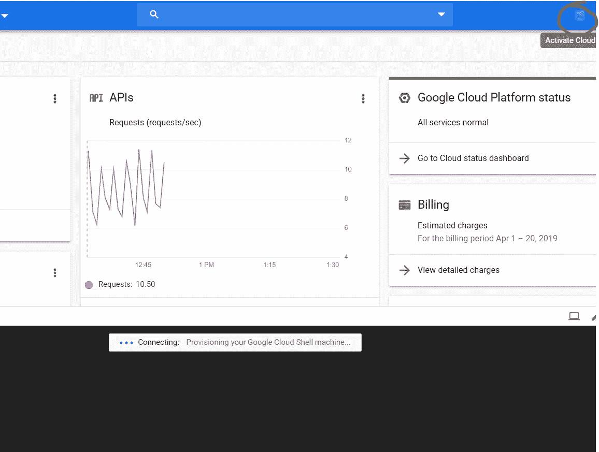
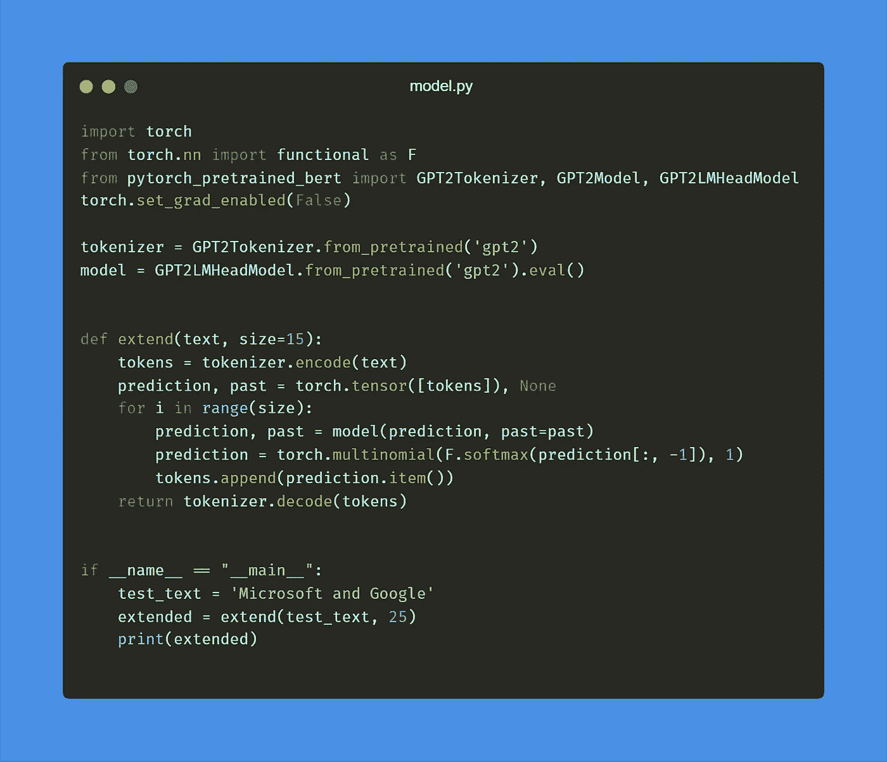
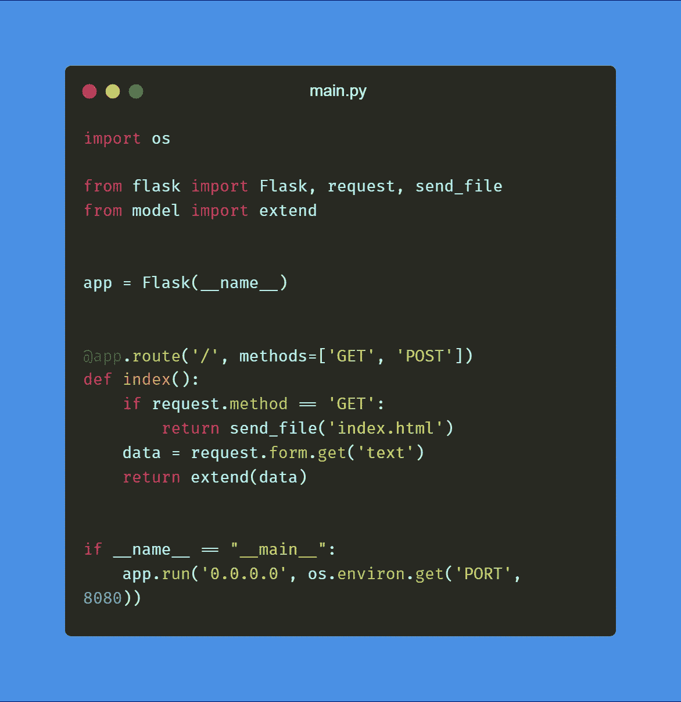
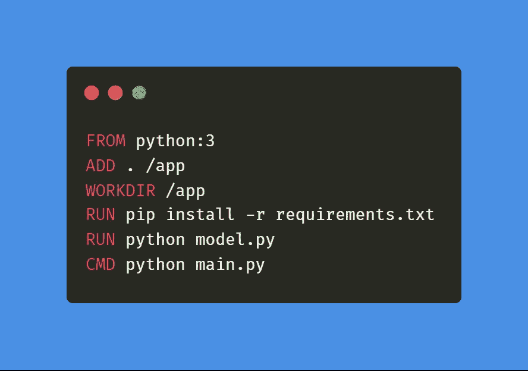
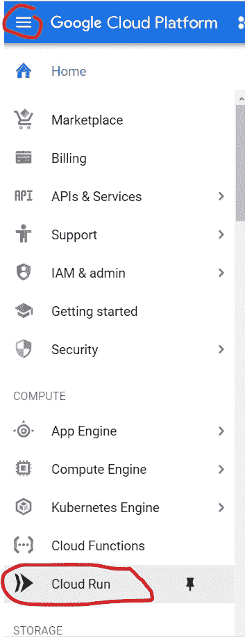
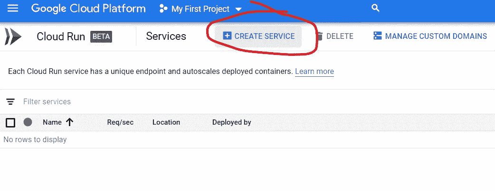
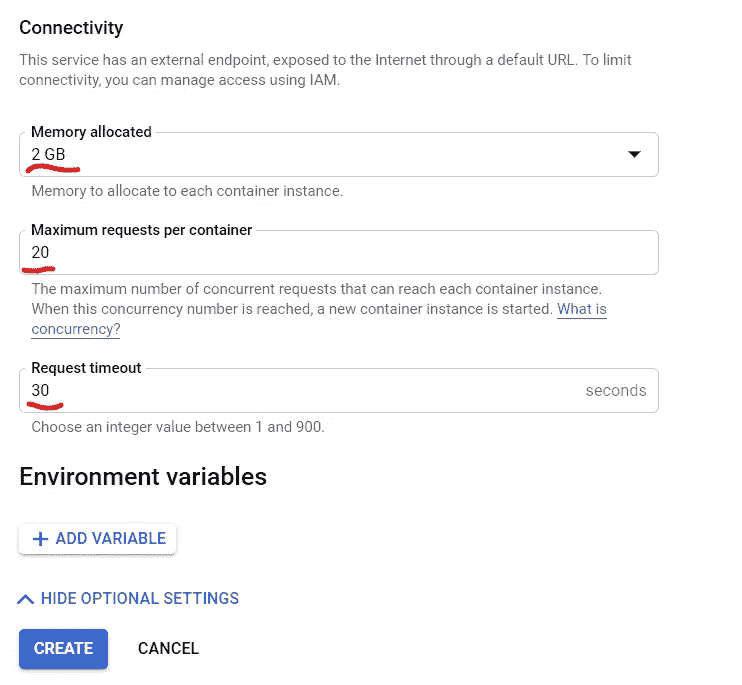
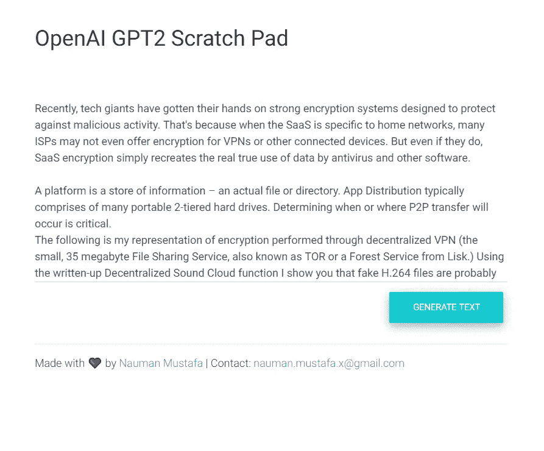

# 使用 Cloud Run 在 Google 云中部署机器学习模型

> 原文：<https://medium.datadriveninvestor.com/deploy-machine-learning-model-in-google-cloud-using-cloud-run-6ced8ba52aac?source=collection_archive---------0----------------------->

你是一个业余机器学习开发者。你会遇到大量与人工智能相关的令人兴奋的新闻。你遵循在线教程，并建立了一些很酷的东西。接下来，你要向世界展示你的创作。

如果你遇到过这种情况，你就会知道你的选择非常少。但这在未来可能会改变。因为谷歌最近宣布改变其云平台。

 [## DDI 编辑推荐:5 本机器学习书籍，让你从新手变成数据驱动专家…

### 机器学习行业的蓬勃发展重新引起了人们对人工智能的兴趣

www.datadriveninvestor.com](https://www.datadriveninvestor.com/2019/03/03/editors-pick-5-machine-learning-books/) 

Cloud Run 是其平台中最令人兴奋的新增功能之一。在本文中，我们将在 Cloud Run 上部署一个开源的预训练深度学习模型。

如果您没有有效的 Google Cloud 帐户，您可以在这里注册。如果你是新用户，你将获得一年 300 美元的免费积分。一旦准备好，你就可以开始云壳。

Start Cloud Shell From Top Right Icon

出于本教程的考虑，我们将使用 GitHub 现有的深度学习项目，并将其部署到 Cloud Run。我创建了一个 [**示例项目**](https://github.com/NaxAlpha/gpt-2xy) ，它使用了 GPT 2 的 [HuggingFace 的 Pytorch 实现](https://github.com/huggingface/pytorch-pretrained-BERT)。

# 到代码中

如果您想部署到云运行，您可以跳过这一节。否则，您可以呆在这里，看看运行中的代码。`index.html`包含用户界面代码。

Minimal Web User Interface for GPT-2

在`model.py`中，我已经使用 GPT-2 模型实现了扩展文本的逻辑。

Load and Test Model by Extending Simple Text Phrase

最后，创建一个 flask 服务器来服务请求(在`main.py`):

Web Server Code: For User Interface and API to Do the Fun Stuff

您可以通过首先安装以下要求来测试它:

*   Pytorch (CPU 版本也可以)
*   变形金刚
*   瓶

准备就绪后，您可以通过`python main.py`启动服务器

接下来，我们需要为我们的项目建立一个 Docker 图像。以便我们可以将它部署到云运行中。我创建了下面的`Dockerfile`，它使用`python:3`作为基础映像，安装依赖项并运行我们的服务器。

Dockerfile to Deploy to Cloud Run

你可以在你的系统上本地构建 docker 镜像，然后推送到 Google Cloud。但是如果你的网速很慢，这可能需要相当长的时间。所以对于这一步，我们将使用云壳。

在以下步骤中，您将需要您的项目 ID。要在 Cloud Shell 中查看您的项目 ID，请使用以下命令:

`gcloud config list — format ‘value(core.project)’ 2>/dev/null`

按照以下步骤设置 docker 映像:(确保用您的云项目 ID 替换[PROJECT_ID]。)

1.  克隆存储库:`git clone [https://github.com/NaxAlpha/gpt-2xy](https://github.com/NaxAlpha/gpt-2xy)`
2.  转到源目录:`cd gpt-2xy`
3.  构建 Docker 映像`docker build -t gcr.io/[PROJECT_ID]/gpt-2xy .`
4.  为谷歌云配置 Docker:`gcloud auth configure-docker`
5.  推送图片:`docker push gcr.io/[PROJECT_ID]/gpt-2xy`
6.  你已经准备好了！

# 部署到云运行

从左上角的图标，转到云运行页面

然后点击创建服务:

不要忘记启用**允许未经认证的调用**。然后点击显示可选设置。

接下来将内存更改为 2GB，其他设置如下(也建议将 CPU 设置为 2，这样会更快):

点击创建，这将需要一些时间，一旦完成，你就可以开始了。

您也可以使用域/子域映射。我在这里部署了自己的版本:[https://GPT 2 . ai-demo . XYZ](https://gpt2.ai-demo.xyz)/下面是一个示例:

I just typed **Recently, tech giants** and rest is written by AI

我希望你喜欢这个教程。你可以在这里得到完整的源代码。如果我对我的文章有任何反馈，请告诉我。另外，请继续关注未来的教程。

**编辑(19–07–2020):**许多人报告了 docker build 的问题，因此我将 repo 更新为最新版本。如果您想跳过构建 docker 映像，您可以使用[中的预构建 docker 映像。并使用](https://github.com/NaxAlpha/gpt-2xy/packages/319570) [Google Cloud shell](https://cloud.google.com/shell) 中的以下命令准备好您的映像:

