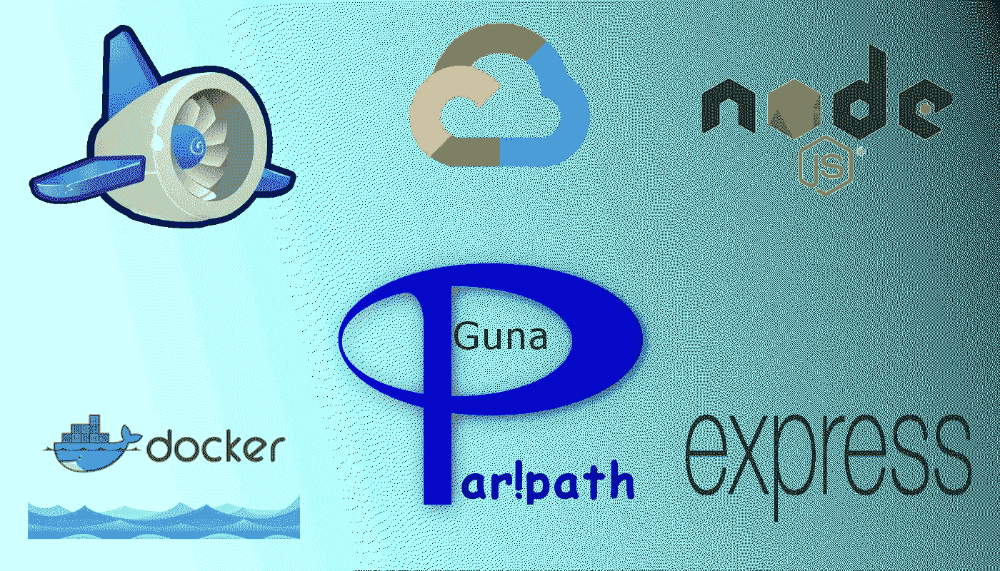
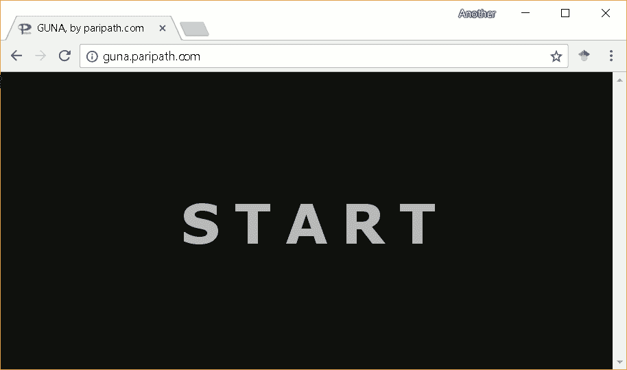

# 在 Google Cloud 中使用 Node.js 和 custom/flex docker 将 CLI 软件部署为 web 终端

> 原文：<https://medium.datadriveninvestor.com/deploy-web-app-using-node-js-and-custom-docker-in-google-cloud-643dd6a85b53?source=collection_archive---------6----------------------->



当我决定接受这个挑战时，我对所有这些技术都是陌生或生疏的。能够将一个定制的应用程序(*一个用 C++/Tcl 编写的低级软件，带有 shell/CLI* )部署到云上最终是值得的。我们使用前端开源库在浏览器中模拟术语，并将其连接到后端运行的云服务器。本文详细介绍了我的经历，并提供了如何将您的原生软件作为 web-app 部署到 google cloud 的分步指导。

# 材料

1.  您的定制应用程序(*用 C++/Tcl 编写的低级软件)*带 shell/CLI。
2.  [谷歌云](http://cloud.google.com)账号。

# 工具

1.  **Webapp:** Web-app 是一个客户端-服务器计算机程序，客户端(包括用户界面和客户端逻辑)在 Web 浏览器中运行。
2.  [**node . js**](https://nodejs.org/en/)**:**它是基于 [Chrome 的 V8 JavaScript 引擎](https://developers.google.com/v8/)构建的一个流行的 JavaScript 运行时。
3.  [**Docker**](https://www.docker.com)**:**它是一个开放的平台，供管理员构建、发布和运行分布式应用。

# 步骤 1:服务器端后端

1.  为部署创建一个目录。*[% mkdir cloud terml；*
2.  使用*[% gsutil CP-r my _ software GS://my-bucket/cloud term]*上传您的软件

# 步骤 2:客户端前端

1.  下载[开源 hterm](https://chromium.googlesource.com/apps/libapps/+/master/hterm/) 和 [express 作为框架](http://expressjs.com)来设计你的 web 终端。
2.  使用 ssh/tcl 层将 hterm 连接到后端定制应用程序。
3.  创建将 hterm 和 ssh/tcl 放在一起的应用程序。 *[%vi app.js]*

# 步骤 3:在本地测试整个堆栈

1.  通过在本地运行来测试你的应用*【node app . js】*
2.  这将启动 web-server(比方说， *http://localhost:3000)* 并且您的 app.js 将连接到后端运行的自定义应用服务器。

# 步骤 4:创建 Dockerfile

Dockerfile 包含一组命令，用于安装操作系统、自定义应用程序和启动自定义应用程序，监听前端应用程序 app.js 发出的套接字请求。

**Dockerfile 样本**

```
FROM gcr.io/google_appengine/nodejs

ADD . /cloudTerm

# Add custom app startup script here
COPY --chown=gunauser:gunauser .gunarc /home/gunauser

WORKDIR /cloudTerm
RUN npm install --unsafe-perm
RUN apt-get update

EXPOSE 8080

ENTRYPOINT ["node"]
CMD ["app.js", "-p", "8080"]
```

# 步骤 5:部署应用引擎

创建一个列出您的应用程序引擎首选项的 app.yaml 文件。

**app.yaml 示例**

```
# runtime custom lets us configure environment entirely with docker
runtime: custom
env: flex
```

现在是时候部署引擎了。

```
paripath:$ **gcloud app deploy**
Services to deploy:

descriptor:      [/home/paripath/GunaCE-GAE-Docker/app.yaml]
source:          [/home/paripath/GunaCE-GAE-Docker]
target project:  [guna-cloud]
target service:  [default]
target version:  [20180606t111129]
target url:      [https://guna.appspot.com]

Do you want to continue (Y/n)?  Y
```

# 完事了吗？

耶！我们都准备好了。🎉🎊不，等确认了再庆祝。

```
Updating service [default] (this may take several  minutes)...done.
Setting traffic split for service [default]...done.
...
This operation may take some time to complete. ...
Deployed service [default] to [https://guna.appspot.com]...
paripath $
```

# 观看古纳的行动

我们完了。让我们看看我们的 guna 应用程序是如何运行的。



Guna characterization in the cloud

如果你想试用 guna 应用程序，请点击这里[paripath.com/cloud](http://www.paripath.com/cloud)。

如果你需要更多的信息，请随时联系我。

玩得开心！👍

# 参考:

1.  关于[数字电路表征和建模的书](http://amzn.to/1N69IdH)
2.  [请求更多关于古纳的信息](http://www.paripath.com/Products/collateral)
3.  [关于人物塑造的教育视频](http://www.paripath.com/blog/videos)