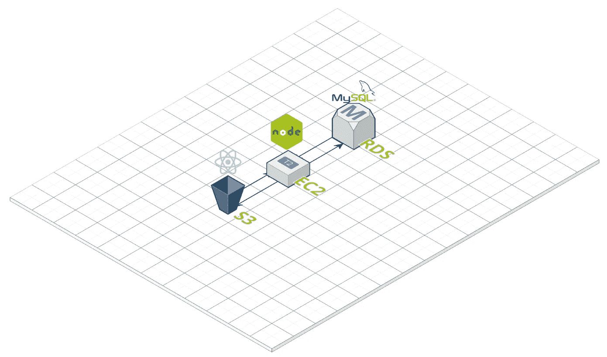

# 使用 AWS S3、EC2 和 RDS 部署您的第一个 Web 应用

> 原文：<https://medium.datadriveninvestor.com/deploy-your-first-web-app-using-aws-s3-ec2-and-rds-4dd165d77b4f?source=collection_archive---------0----------------------->

## 通过 Amazon Web Services 部署的介绍

您已经开发这个应用程序几个月了，现在您终于想部署它了。但是怎么做呢？你不可能让你的电脑全天候运行。我们需要一个远程环境来托管我们的服务，这样任何人都可以在任何时候访问它。

这就是亚马逊网络服务发挥作用的地方。有了 AWS，您就有了一个存储和服务客户端文件的地方(S3)，一个只要您需要就能保持运行的虚拟服务器(EC2)，以及一个完整的云中数据库管理系统(RDS)。

Basic deployment architecture using S3 (Client), EC2 (Server), RDS (Database).

当然，AWS 还提供了大量其他服务。然而，在这篇文章中，我将重点解释上面提到的三种服务。最后，希望您能更好地理解 AWS 是如何帮助您的应用程序为世界其他地方所用的。

 [## 2019 年移动应用开发之路|数据驱动的投资者

### 任何在移动应用程序开发行业工作的人，无论他们是专注于在伦敦开发 iOS 应用程序还是…

www.datadriveninvestor.com](https://www.datadriveninvestor.com/2019/01/15/the-path-of-mobile-app-development-in-2019/) 

## 1.亚马逊 S3(简单存储服务)

在其核心，S3 是一个存储任何类型数据的服务——几乎任何东西。作为此类数据的容器，S3 存储桶提供自动缩放(即，没有固定的存储大小)。这些存储桶中的文件可以以低延迟水平交付给客户端，这使得 S3 成为需要数据库环境之外的存储的在线服务的理想选择。

S3 的所有文件都启用了 HTTP(s ),这意味着它们可以通过 URL 访问。这些文件的公共访问配置可以通过 S3 存储桶策略直接设置，允许存储桶所有者控制可以访问存储桶的身份。

S3 还允许静态网络托管，这意味着客户端文件(HTML，CSS，JS)可以从 S3 桶直接提供给浏览器。如果需要，可以很容易地修改这样的应用程序，以便对虚拟服务器(比如 EC2 实例)进行 API 调用。

## 2.亚马逊 EC2(弹性计算云)

假设我们在 S3 上使用静态文件托管设置了一个 SPA。为了使这个应用程序具有动态性，还需要构建一个后端来处理来自 S3 的 API 请求。这可以通过 Amazon EC2 来实现，它允许在云中运行虚拟服务器。

EC2 为用户提供了基于 Linux、Ubuntu、Windows 等操作系统的计算环境——称为实例。你可以把它想象成亚马逊给你它拥有的数百万台电脑中的一台，这样你就可以在上面存储和运行你的文件。

Imagine that you’re getting one of these computers to run your EC2 server on. Source: [Hipertextual](https://hipertextual.com/imagen-del-dia/data-center-facebook)

这些实例可以通过 SSH 和 HTTP 等协议远程访问，允许用户在这些虚拟环境中长时间运行服务器端程序。还可以在 EC2 实例的本地环境中创建和管理数据库(例如 MySQL、PostgreSQL)。

## 3.亚马逊 RDS(关系数据库服务)

Amazon RDS 为用户分配专门为数据库管理开发的 EC2 实例。这些数据库实例可以基于以下六种关系数据库引擎中的任何一种:MySQL、MariaDB、PostgreSQL、Oracle、SQL Server 和 Aurora。您可以在这些实例上创建和管理数据库，就像在本地机器上一样。

很自然，许多第一次使用的用户会问:既然可以在 EC2 实例上手动创建数据库，为什么还要使用 RDS 并支付额外的费用呢？答案是 RDS 自动化了困难的数据库管理任务，潜在地节省了用户大量的时间和金钱。

例如，您可以轻松地更改数据库实例的 CPU、存储和 IOPS，从而增强可伸缩性。该服务还自动执行备份和恢复。将数据库实例放在虚拟专用云(VPC)——虚拟数据中心——也提供了额外的安全性，因为除了指定的 EC2 服务器之外，任何实体都不能访问数据库。

最后，下面是使用 AWS 进行部署时应该遵循的步骤:

1.上传您的客户端文件到 S3 桶，并启用静态文件托管。确保您的存储桶权限设置正确，否则，您的文件将保持私有。

2.将您的服务器端程序移动到 EC2 实例，并确保您的客户端代码对该实例的 IP 地址进行 API 调用。

3.在 RDS 中创建一个数据库实例，并确保您的服务器端代码引用该数据库实例中的数据库。

现在启动你的服务器，瞧！您现在有了一个工作的 web 应用程序。