# 使用 Flask 部署您的机器学习模型—现在变得简单了

> 原文：<https://medium.datadriveninvestor.com/deploy-your-machine-learning-model-using-flask-made-easy-now-635d2f12c50c?source=collection_archive---------1----------------------->

在 10 分钟内部署您的 ML 模型的快速备忘单。

## **你已经**用 python 建立了一个机器学习模型。事实证明，它非常酷，预测结果非常好。如果有一种方式可以和你的朋友和家人分享这件事，那就太好了。那么，我们如何做到这一点呢？有更简单的方法吗？

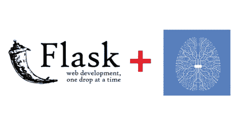

**Flask + ML model**

最简单的方法是使用 flask 部署模型。当我们开始学习机器学习时，最初我们通过运行一个简单的监督学习模型来完成。最重要也是最容易理解和使用的是一个**回归模型**。这篇博客是基于这样的假设:这个人对运行 python 代码有相当的了解，并且熟悉简单的 ML 库，比如 **Sci-kit Learn** ，P **和 as** ，N **umpy** 。

当谈到他们想要使用的 python IDE 类型时，不同的用户有不同的选择。一些流行的 IDE 有 **Spyder** 、 **Jupyter** Notebook、 **PyCharm** editor 或者你可以在 python 编译器上运行它。

[](https://www.datadriveninvestor.com/2019/03/03/editors-pick-5-machine-learning-books/) [## DDI 编辑推荐:5 本让你从新手变成专家的机器学习书籍|数据驱动…

### 机器学习行业的蓬勃发展重新引起了人们对人工智能的兴趣

www.datadriveninvestor.com](https://www.datadriveninvestor.com/2019/03/03/editors-pick-5-machine-learning-books/) 

当你想一行一行的运行，检查输出的时候，用 Jupyter 笔记本去也是闲的。当你想运行一大块代码时，Spyder 是更好的选择，如果你想让你的整个项目看起来有组织，有很多文件，你想让它看起来有条理，那么使用 PyCharm IDE 是很好的选择。

在我们的博客中，我们将使用 Spyder 框架作为由 Anaconda Navigator 提供的 IDE。你可以使用任何你喜欢的东西。

在本文中，我们将使用 scikit-learn 的内置的 **LinearRegression()** 函数构建一个简单的回归模型。首先，让我们看看我们的数据是什么样子的。

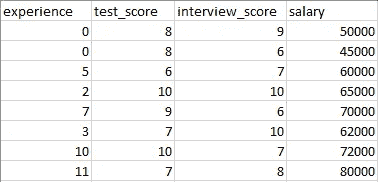

**hiring.csv (Dataset)**

这是一个非常简单的数据集，有 4 个属性和 8 行。所有的列都是数字列，所以在构建分类器(回归模型)之前，我们需要对数据进行修剪或清理，以将分类数据转换为数字数据。这里使用的数据是干净的，并准备应用于分类器。

通常，你必须首先清理你的数据，比如填充数据集中的空值，将你的分类数据转换成数字数据，归一化等等；作为我们数据清理和修剪的一部分。但是这篇博客的目的主要是为了使用 flask 部署模型，所以我们考虑了更简单的数据，这些数据已经很干净，不需要进一步的预处理。

在这里，class 标签将是最后一个 salary 列，我们将使用我们的模型对其进行预测。在我们的模型构建完成后，我们将使用一个名为 pickle 的库来保存我们训练好的模型。

**泡菜**

Python pickle 模块用于序列化和反序列化 Python 对象结构。Python 中的任何对象都可以被腌制，以便保存在磁盘上。pickle 所做的是在将对象写入文件之前先“序列化”对象。Pickling 是一种转换 python 对象(list、dict 等)的方法。)转换成字符流。这个想法是，这个字符流包含在另一个 python 脚本中重建对象所需的所有信息。

下面是构建一个简单回归模型，然后通过使用 pickle 序列化来保存模型的代码。

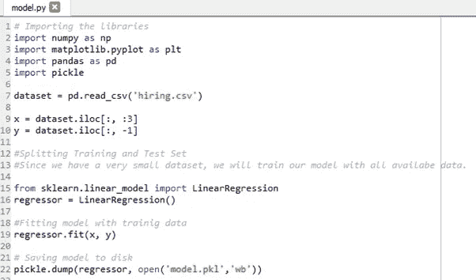

**model.py**

当您运行此命令时，您的模型现在已经定型，并且您的模型保存在本地计算机中项目文件的存储目录中。

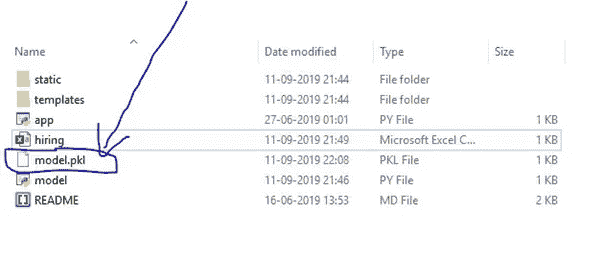

**Project directory**

既然您的模型已经准备好并保存了。是时候我们开始建立一个烧瓶模型了。

# **在本地主机上设置 flask-app:**

确保烧瓶已安装。

```` **pip install flask** ````

`**The flask code can be explained in three sections:**`

## `**1.Loading the saved model**`

`We load the model.pkl file and initialize the flask app.`

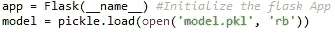

**Loading the saved model ( model.pkl )**

**2。将 API 重定向到主页 index.html**

初始化应用程序后，我们必须告诉 Flask 当网页加载时我们要做什么。行`@app.route("/", methods = ["GET","POST"])` 告诉 Flask 当我们加载我们网站的主页时该做什么。

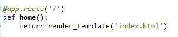

**Redirecting the API (Routing)**

我们使用 **@app.route('/')** 来定义函数，这些函数用于根据 API 将它们重定向到任意数量的 URI。因此，在我们的例子中，当您启动 flask 服务器时，它默认重定向到 index.html 文件。

**3。重定向 API 以预测结果(薪水)**

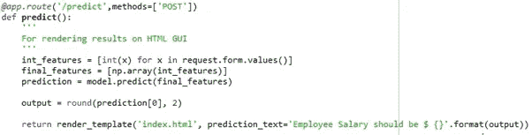

**Predict API**

因为这是一个**‘POST’**请求，所以它将从 request.form.values()中读取输入值。现在我们已经有了变量 **int_features** 中的输入值，我们将把它转换成一个数组，然后使用模型来预测它，并将最终预测四舍五入到两位小数。

当我们单击 index.html 中的预测按钮时，它预测用户输入的值(3 个输入)的工资，然后传递从模型输出的变量` `` **output** ` ``` ` ',并将其作为 **prediction_text** 发送回 index.html 模板。

让我们看一下 index.html 的档案

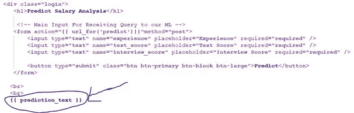

**index.html**

您在这里看到的 **{{ prediction_text }}** 占位符是您从模型中得到的输出预测(预测工资)将被放入我们的 index.html 文件中的位置。

**4。启动烧瓶服务器**

这将调用`app.run()`并在本地运行我们的网页，托管在您的计算机上。

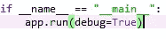

**Starting the Flask Server**

以下脚本在本地主机和默认端口(5000)上启动 flask 服务器，生成 [http://127.0.0.1:5000/](http://127.0.0.1:5000/)

只需在浏览器上粘贴[**http://127 . 0 . 0 . 1:5000/**](http://127.0.0.1:5000/)(或)[**http://localhost:5000**](http://localhost:5000)按回车键即可看到服务器工作。

# **项目总体结构:**

这个项目有四个主要部分:

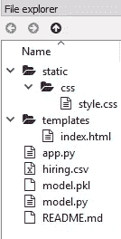

**Project Directory Structure**

**1。model.py** —它包含我们的机器学习模型的代码，根据 **'hiring.csv'** 文件中的培训数据来预测员工的工资。

**2。app . py**——它包含 Flask APIs，通过 GUI 或 API 调用接收员工详细信息，根据我们的模型计算预测值并返回。

**3。模板** —该文件夹包含 HTML 模板(**index.html**)，允许用户输入员工详细信息并显示预测的员工工资。

**4。静态** —该文件夹包含 **css** 文件夹和 **style.css** 文件，该文件具有 index.html 文件所需的样式。

# **运行项目:**

**1。确保您位于项目主目录中。通过在命令提示符下运行以下命令来创建机器学习模型-**

```

**python model.py**

```

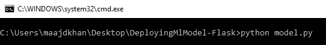

**model.py**

这将编译我们的线性回归分类器，构建训练好的模型，并创建我们模型的序列化版本，并将其保存为名为 **model.pkl** 的文件

**2。使用下面的命令运行 app.py 来启动 Flask API**

```

**python app.py**

```

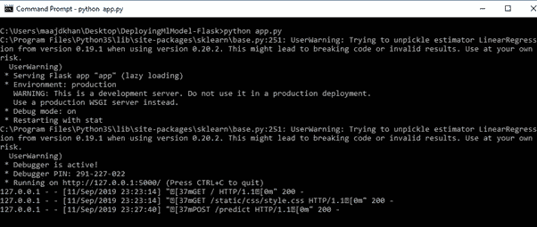

**app,py**

默认情况下，flask 将在端口 5000 上运行。

**3。导航到 URL**[**http://127 . 0 . 0 . 1:5000/**](http://127.0.0.1:5000/)**(或)**[**http://localhost:5000**](http://localhost:5000)

您应该可以查看主页。

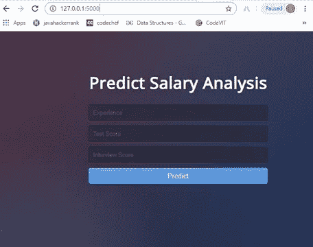

**Home page (index.html)**

在所有 3 个输入框中输入有效数值，并点击按钮**预测**。

如果一切顺利，您应该可以在 HTML 页面上看到预测的工资值！

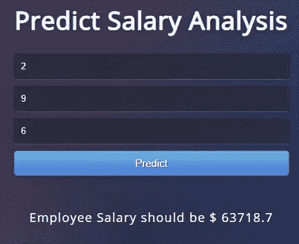

**Predicted value**

这就是所有的人。使用 flask 部署应用程序就是这么简单。我希望你喜欢这篇文章。现在，您可以开始着手这项工作，并构建自己的应用程序。这个项目的代码可以在我的 GitHub 页面上找到:

> **https://github.com/MaajidKhan/DeployMLModel-Flask**

感谢您的阅读，请关注我的下一篇关于使用 Flask 部署深度学习模型的文章！