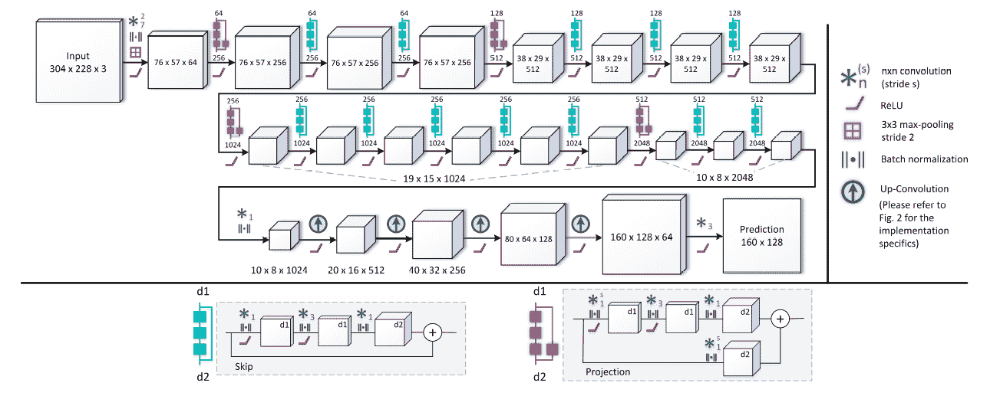
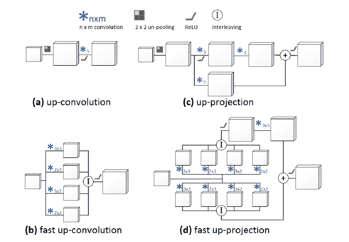
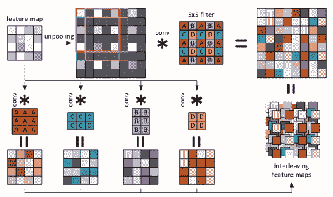
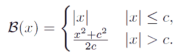
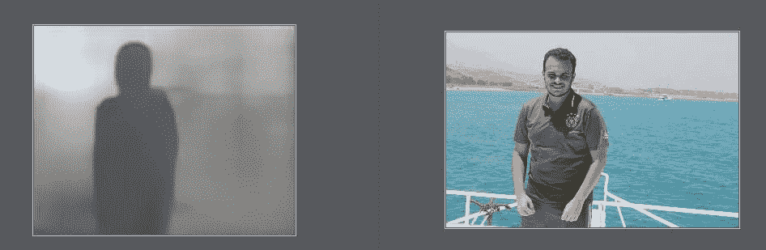

# 深度神经网络深度估计第二部分

> 原文：<https://medium.datadriveninvestor.com/depth-estimation-with-deep-neural-networks-part-2-81ee374888eb?source=collection_archive---------1----------------------->

这是我们第二个关于深度估计的微博。如果你还没有读过第一部，我真心推荐你去读一读。

我们今天将讨论“[使用全卷积残差网络进行更深深度预测](https://arxiv.org/abs/1606.00373)”的论文，这是一篇非常好的论文，当我们将它用于一些依赖于精细深度的有趣应用时，它表现出了很好的耐用性。“我们将在稍后讨论这一点”，我们还提供了本文的 Tensorflow 实现。

首先，我们必须承认，图像深度数据集比与分类或对象检测等流行任务相关的其他数据集少得多，因此我们应该使用迁移学习技术。无论使用什么样的架构。为了不消耗我们宝贵的稀有标记数据，学习一些在其他任务中已经学习过的关于场景的基本特征。

但现在重要的问题是什么编码器“一个预先训练的模型，我们将使用它来将图像转换成它的‘基本特征’”，最重要的标准是最后一个卷积层的感受域，它越大，我们从这个模型中可以获得的基本特征就越好。

架构:

Deeper Depth 2016 Architecture

他们使用 ResNet 作为编码器，因为它具有 483*483 的感受域，因此足以完全捕获 304*228 的输入图像。

主要贡献是他们使用了剩余的上卷积而不是完全连接的层，因为 FC 层本质上是有区别的，所以它不适合像深度估计这样的回归问题，另一方面它非常消耗内存。

本文展示了不同上投影块之间的巨大比较。让我们深入比较一下。

a)普通上卷积:它使用非池化层“池化的反向操作，其中我们将输入特征图中的每个像元值映射到输出图中的 2*2 像元，其中输入值占据左上角像元，其他像元为零。”接下来是 conv 图层，但是不合并大大削弱了生成的特征图，这使得很难从这个稀疏的地图中学习到任何有用的东西。

b)普通向上投影:它很像第一块，但是它使用投影，以便使模型更容易学习。通过使用两个独立分支之间的融合来获得更密集的特征图。但最终的特征地图仍然很糟糕，作者受到了 ResNet 上的投影块的启发。

C)快速上卷积:这里，他们通过将 5*5 conv 滤波器权重分成不重叠的组提出了一个很大的贡献，在图中用不同的颜色和 A{3*3}，B{3*2}，C{2*3}，D{2*2}表示。它们中的每一个将产生一个单独的特征图，并且所产生的特征图将是每个类别输出的交错。

他们称之为快速，因为他们发现使用这种积木可以减少 15%的训练时间。

Figure

d)快速向上投影:他们刚刚把新的交错技术应用到向上投影方法中。

损失函数:他们使用了反向 Huber 损失函数，因为他们不希望数据集异常值对梯度流有很大影响，所以当深度差超过某个阈值时，他们使用 l1 范数。

Huber loss function

输出:产生的深度图很好，但很模糊，这可能代表了一个很酷的应用程序中的一个问题“我们稍后会讨论它，请保持关注”。

;

Tensorflow 实现:这是我们的 [github repo](https://github.com/MahmoudSelmy/DeeperDepthEstimation) 。