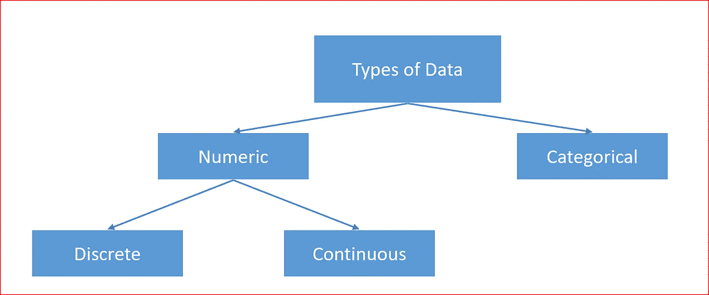
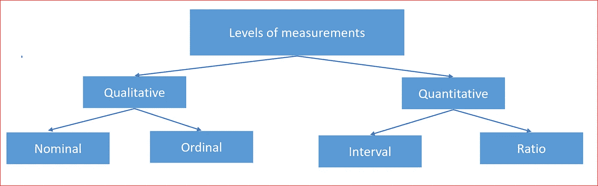
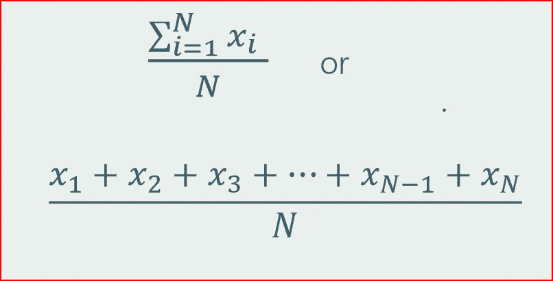
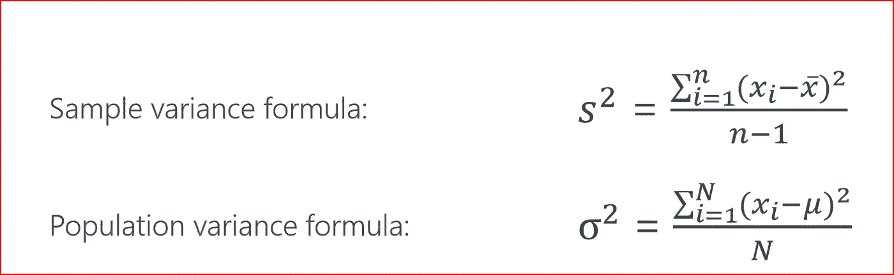
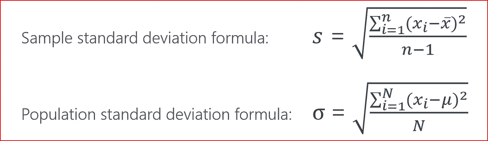
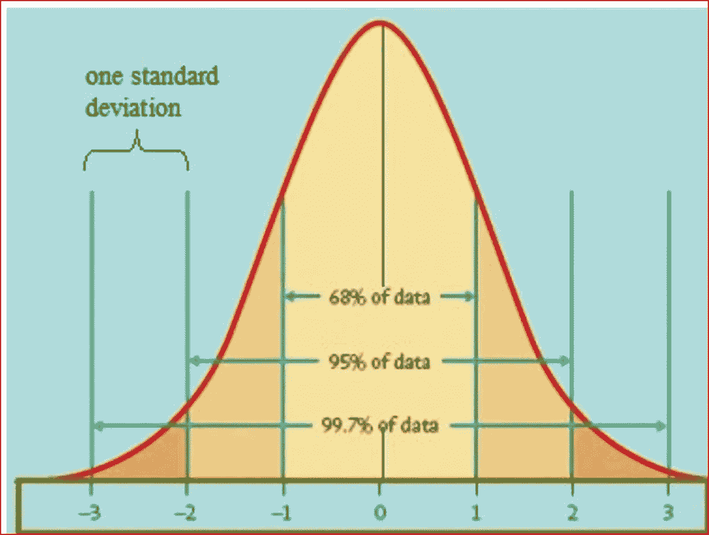
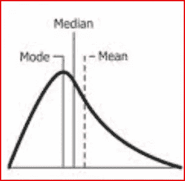
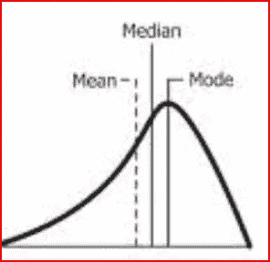
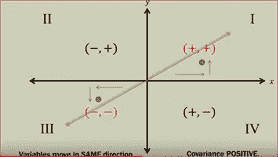
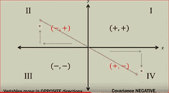

# 描述统计学

> 原文：<https://medium.datadriveninvestor.com/descriptive-statistics-bc01594c4cbe?source=collection_archive---------6----------------------->

有助于更好地理解数据的基本统计概念。


# *什么是描述统计？*

它是描述数据基本特征的统计汇总。它提供了关于样本及其测量的简单摘要。

描述性统计显示数据的详细信息，但不做任何推断。为了做出推论，我们使用推论统计学

*让我们从最基础的开始*

# 不同类型的数据



Different types of data

数据可以分为

*   **数值**
*   **分类的**。

**数值**顾名思义就是和数字有关。它可以是**连续的**比如一个学生的 GPA 分数为 4.6，或者一个价值为 23.4 美元的项目的成本，或者上市股票的股价为 98.99 美元

数字数据可以**离散**比如一个人的年龄比如 28 岁或者你这周吃了多少个冰淇淋，可能是 3 个冰淇淋。

**分类**数据代表类别或组，如公司中的职务——分析师、经理、董事、副总裁等。或者飞机上的座位——经济舱或商务舱。

让我们从《泰坦尼克号》中选取样本数据集，并尝试理解描述性统计数据。

*泰坦尼克号数据集和数据字典在这里可以找到*-[https://www.kaggle.com/c/titanic](https://www.kaggle.com/c/titanic)

Titanic 数据集的输出示例


Display first three rows from the Titanic dataset

上述数据集中的分类特征是

*   具有值 0 和 1 的存活列，其中值 0 表示人没有存活，值 1 表示人存活
*   值为 1、2 和 3 的 Pclass
*   性，是具有男性和女性价值观的性别
*   带着价值观 S、Q 和 C 出发

离散特征是

*   年龄，
*   SibSp 和
*   烤

连续的特征是

*   票价

# 测量水平

描述变量值中信息的性质。变量可以描述为具有四个测量级别之一

*   名义上，
*   序数，
*   间隔或
*   比例



Levels of measurements

广义地说，我们可以把信息描述为

**定性**，非数字的值，可以放入类别中。

更多定性变量可以是名义变量或序数变量。

**名义**，其中类别可以按任意顺序放置。不存在等级或顺序。与包含值的性别栏一样，男性和女性是名义上的，因为性别没有等级或顺序。

**序数**类别可以像列 Pclass 一样进行排序，其中我们有第一类、第二类和第三类

**定量**，由计数或测量组成的数值。

数量变量可分为区间和比率。

**区间—** 从低到高对测量进行分类和排序，并确保标尺上每个区间之间的距离相等。一个例子是温度，其中 75 度和 76 度之间的距离与 90 度和 91 度之间的距离相同。

**比率** —在这一级别的测量中，除了具有相等的间隔之外，它还可以具有零值。

*让我们探讨一些描述性统计中常用的术语*

**平均值** —平均值是数据集中所有观察值的平均值。异常值会极大地影响平均值。最常见和最广泛使用的集中趋势传播



Formula for mean where N is number of observation in the dataset and x1, x2.. xn are observations

理解数据请参考我的帖子

```
data_set.describe(include='all')
```


describes the descriptive statistics for all the features in the data set

**Mode** :数据集中出现频率最高的值。

例如，如果数据集的值为 1，3，4，6，4，3，1，2，3，那么最常出现的值是 3，这就是数据集的模式

**Median** :有序数据集的中间点。在有序数据集中，中值是(n+1)/2，其中 n 是数据集中的观察次数。

如果观察值是偶数，那么我们取最接近(n+1)/2 所得值的两个数值的平均值

例如，如果我们有一个值为 1，3，4，6，10，13，15，17 的有序数据集，其中有 8 个观察值，那么我们将取 4 和 5 个位置的平均值，即 6 和 10，因此中位数为 8

中位数的优点是它不会被离群值扭曲，离群值可能太小或太大

**方差和标准差**

方差和标准差都衡量平均值周围数据点的离差。

对于样本和总体有不同公式。

**总体**是您想要研究的个体或数据点的完整集合，而**样本**是总体的一个小子集



Variance formula for population and sample. n is the number of observations in the sample and N is the number of observations in the population

方差是每个观察值与平均值偏差的平均平方。

标准差是方差的平方根



Standard deviation formula for sample and population

标准差与原始观察值具有相同的测量单位

因为方差和标准差是基于平均值的，所以它们很容易受到异常值的影响

**偏斜度**

它是不对称的量度，表明观察是否集中在一侧。

钟形曲线具有对称分布，这意味着左侧和右侧是镜像。



Bell curve which is perfectly symmetric and standard deviations

**正偏斜**数据右侧有一条长尾。这里的均值和中值大于众数



Positively skewed data

负向倾斜的数据在左侧有一条长尾。这里的均值和中位数小于众数



**协方差**是指定两个变量是否一起变化的度量。

它是关于两个变量之间的变化方向。两个变量之间关系的强度是由相关性决定的。

可以是**正协方差，接近零或负协方差**

一个变量的变化对另一个变量有线性影响。在下面的例子中，道琼斯指数随标准普尔指数线性变化。


linear relationship between Dow jones and S&P

协方差没有上限或下限，其大小取决于变量的大小

线性关系可以是正的也可以是负的

**正协方差**:当一个变量的增加对另一个变量有类似的影响



positive covariance

**负协方差**:当一个变量的增加对另一个变量产生相反的影响



Negative covariance

**相关性**是指一个变量的变化可能导致另一个变量的变化，不像**协方差**那样决定两个变量如何相互变化。

相关性告诉我们两个变量是如何相互关联的

相关性在+1 到-1 之间变化，并且是标准化的。

相关值与变量的规模无关，这也是它有时优于协方差的原因

相关性的一个例子是外部温度和能量消耗如何相互关联。外部温度的升高导致使用空调的能耗增加。

温度和能量消耗是不同的单位，但是它们之间的关系总是在+1 和-1 之间

相关性由**r-皮尔逊系数**表示

相关性为 1 意味着如果一个变量增加，它将导致另一个变量也增加。

相关性为 0 意味着两个变量之间没有关系

相关性为-1 意味着当一个变量增加时，会导致另一个变量减少

相关性并不总是意味着因果关系