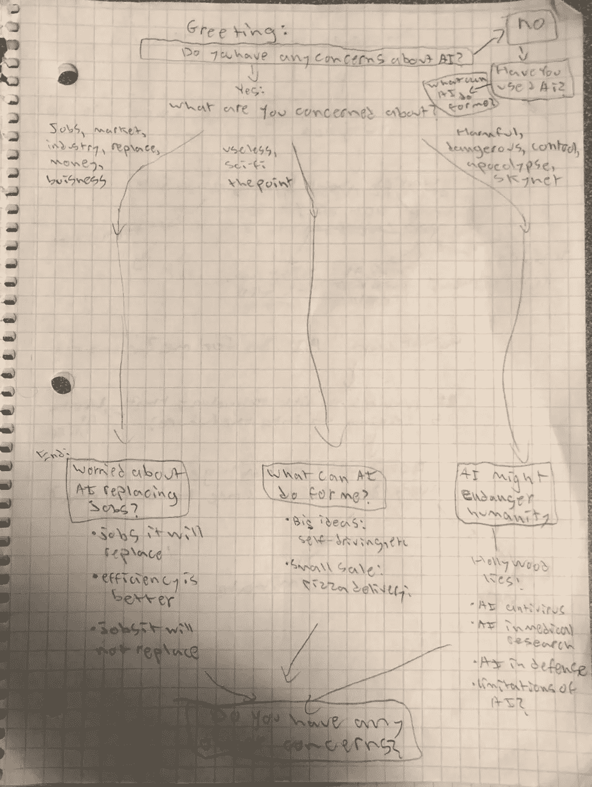
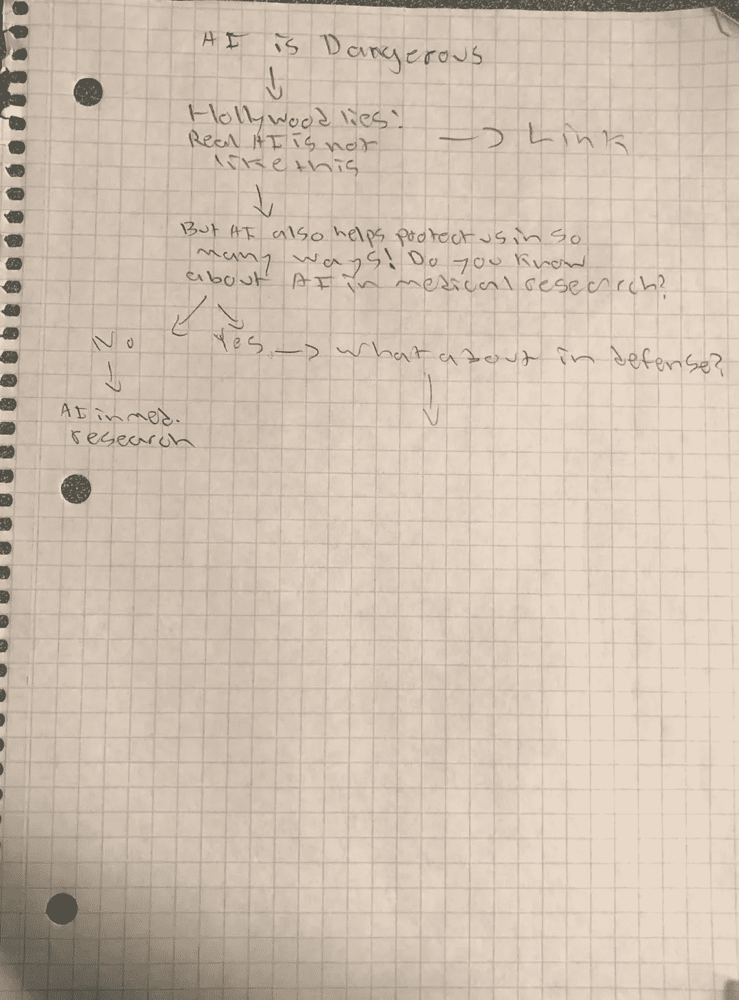
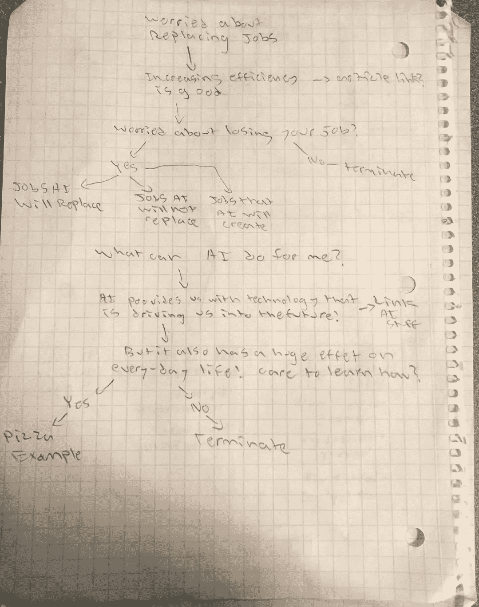
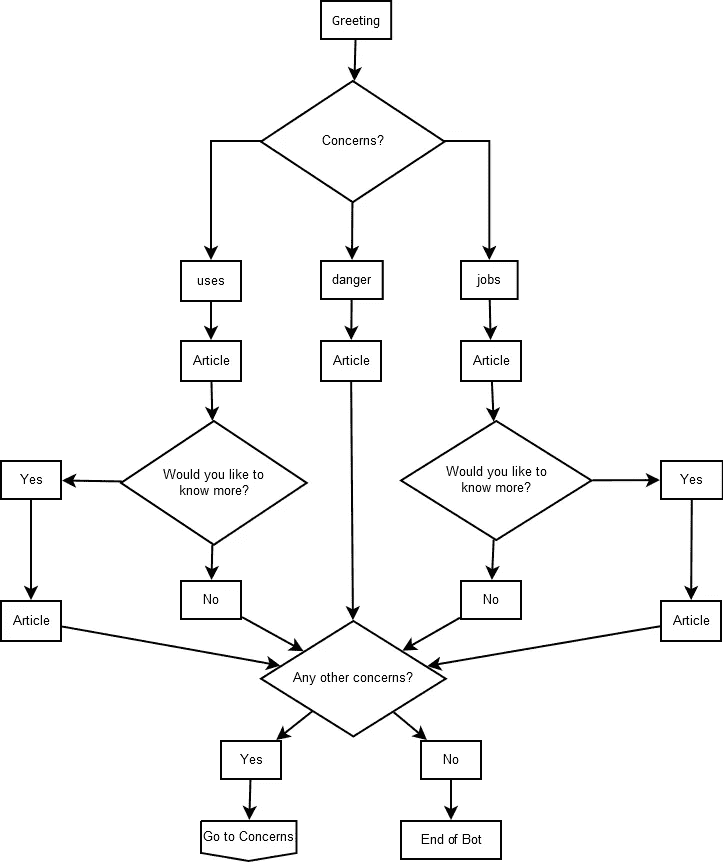
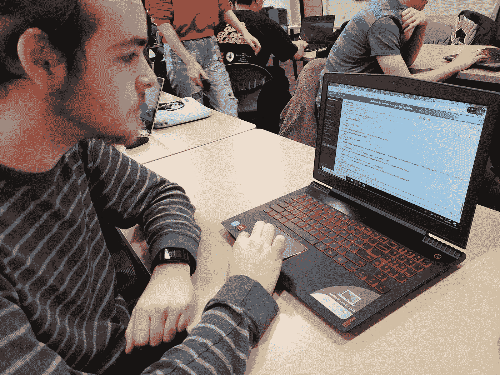

# 张力设计文件

> 原文：<https://medium.datadriveninvestor.com/design-documentation-of-tension-779f023a98ff?source=collection_archive---------43----------------------->

人口统计:人们认为他们的工作将被人工智能取代

团队成员:西蒙·雷丁、高阳、梅根·弗林和尼古拉斯·平格尔

## 介绍

对于我们的聊天机器人，我们使用人工智能作为我们的主题。这是一种讽刺，因为聊天机器人实际上是一种人工智能。然而，人们并没有真正注意到这一点。现在的人害怕 AI，是因为不了解 AI，不知道 AI 的背景。对人工智能的刻板印象是出现在好莱坞电影或其他小说电影中的杀手 AI，这并不是关于 AI 的真正事实。因此，我们想列出人工智能的事实和真相，并可能说服或至少消除用户对人工智能的担忧，让用户真正了解人工智能是什么。

## 头脑风暴

因此，在头脑风暴期间，我们主要考虑了人们对人工智能的所有担忧，我们提出了三大类别——就业市场，人工智能的使用，以及人工智能对人类的危险。

## 设计

对于每一个类别，我们考虑了用户可能对人工智能的关键词或主要关注点。对于不同的关注点，它会引出不同的关于这是否是关注点的具体问题，然后链接到实际上谈论这个话题的具体文章。我们有了这个基本的流程图，并对不同的人进行了测试，询问他们关注的是什么。

“人工智能有可能比人类更聪明。”2 测试人员给我们这种反应，导致我们到危险分支。于是，在那个分支中，我们明确定义了 AI 并没有你在电影中看到的那么危险。然后阐明它实际上在许多研究中帮助了我们，特别是在医学领域。

"人工智能不会取代所有的工作并增加美国的失业率吗？"这类问题将归入我们的就业市场部门。我们想在这里澄清的是，人工智能实际上提高了工作效率，这是一件好事，因为大多数时候人工智能实际上是在接管人类正在做的任务，而不是真正的人的工作。同时，他们在完成任务的同时，实际上为人们创造了更多的就业机会。如果人们真的担心失去工作，我们将把他们引向人工智能会取代和不会取代的工作，以及人工智能为就业市场创造的工作机会。

“人工智能对我的日常生活毫无用处。”在这些类型的关注中，我们将引导用户使用人工智能，人工智能究竟能为我们做什么。每个人都使用 siri 或其他助手、点餐应用程序或其他人工智能。我们很容易注意到，人工智能已经开始融入我们的日常生活。自动驾驶汽车将是人工智能影响我们日常生活的另一个典型例子。所以我们不能只说停止开发 AI 或者停止使用 AI。我们，人类，不知何故实际上喜欢使用人工智能。

在画完草图后，我们创建了这个流程图来模拟聊天机器人的实际流程。

## 最终原型

对话中的措辞是我们聊天机器人遇到的问题。例如，我们有“嗨！不知道大家对人工智能有没有顾虑？”测试人员认为这是一个冷的开始，我们可以改变措辞，使它更有趣或更有创意。然而，我们这样设计是因为我们想用这种方式来吸引更多人的眼球。

外部链接是大多数测试人员认为有用和有趣的部分。如果能在链接前有几句文章摘要就更好了。因此，用户会更清楚地看到文章中真正发生了什么。

## 结论

我们对聊天机器人的测试实际上是充分的，大多数测试人员都导航到了“不再担心”。这个聊天机器人的意思是，我们不希望人们对 AI 产生误解，并实际接受它。

如果我们有更多的时间，我们会修复聊天机器人的措辞，这样它就更像一次对话，而不是多种选择。然而，我们遇到的困难部分是试图弄清楚如何使用 Flow XO。它实际上不可能将所有的关键词都存储到输入中。因此，输入关键字和排列顺序需要做大量的工作。

## 演示视频和文章链接

**就业市场**

AI 将取代任务而非乔布斯:[https://www . Forbes . com/sites/joemckendrick/2018/08/14/artificial-intelligence-will-replace-tasks-not-jobs/# 7 db 7 DCD 4 a 7 fa](https://slack-redir.net/link?url=https%3A%2F%2Fwww.forbes.com%2Fsites%2Fjoemckendrick%2F2018%2F08%2F14%2Fartificial-intelligence-will-replace-tasks-not-jobs%2F%237db7dcd4a7fa&v=3)

10 个 AI 无法取代的工作:[https://www . toptenz . net/10-Jobs-人工智能-cant-take-away-humans.php](https://www.toptenz.net/10-jobs-artificial-intelligence-cant-take-away-humans.php)

将被 AI 取代的工作:[https://blog . hubspot . com/marketing/jobs-artificial-intelligence-will-replace](https://slack-redir.net/link?url=https%3A%2F%2Fblog.hubspot.com%2Fmarketing%2Fjobs-artificial-intelligence-will-replace&v=3)

人工智能创造的就业机会:[https://www . Forbes . com/sites/amitchowdhry/2018/09/18/artificial-intelligence-to-create-5800 万个新就业机会-到 2022 年-says-report/#460947634d4b](https://www.forbes.com/sites/amitchowdhry/2018/09/18/artificial-intelligence-to-create-58-million-new-jobs-by-2022-says-report/#460947634d4b)

**人工智能的用途**

披萨的例子:[https://interesting engineering . com/dominos-will-use-ai-to-make-every-pizza-these-serve-is-perfect](https://slack-redir.net/link?url=https%3A%2F%2Finterestingengineering.com%2Fdominos-will-use-ai-to-make-sure-every-pizza-they-serve-is-perfect&v=3)

自动驾驶汽车:[https://www . ucsusa . org/clean-vehicles/how-self-driving-cars-work #。W_xVTi2ZMqI](https://www.ucsusa.org/clean-vehicles/how-self-driving-cars-work#.W_xVTi2ZMqI)

AI 正在影响我们的日常生活:[http://knowledge . Wharton . upenn . edu/article/artificial-intelligence-powering-daily-tasks/](http://knowledge.wharton.upenn.edu/article/artificial-intelligence-powering-everyday-tasks/)

AI 能为我做的 10 件事:[https://think growth . org/10-things-AI-can-do-for-you-today-2350 cc 5a E4 BF](https://thinkgrowth.org/10-things-ai-can-do-for-you-today-2350cc5ae4bf)

**艾的危险**

好莱坞的谎言:[https://venturebeat . com/2017/05/22/9-ways-ai-not-going-to-be-like-Hollywood/](https://slack-redir.net/link?url=https%3A%2F%2Fventurebeat.com%2F2017%2F05%2F22%2F9-ways-ai-isnt-going-to-be-like-hollywood%2F&v=3)

AI 用于医学研究:[https://blogs . Microsoft . com/on-the-issues/2018/09/24/using-AI-to-help-save-lifes/](https://blogs.microsoft.com/on-the-issues/2018/09/24/using-ai-to-help-save-lives/)；[https://www . medical device-network . com/comment/can-ai-bring-health care-medical-research/](https://slack-redir.net/link?url=https%3A%2F%2Fwww.medicaldevice-network.com%2Fcomment%2Fcan-ai-bring-healthcare-medical-research%2F&v=3)