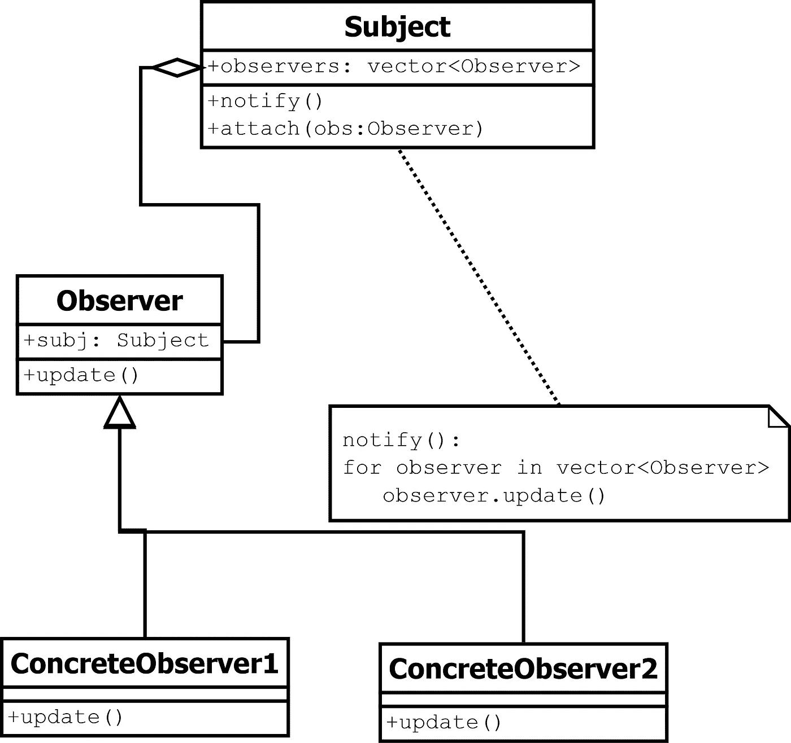

# 设计模式——观察者模式快速指南。

> 原文：<https://medium.datadriveninvestor.com/design-patterns-a-quick-guide-to-observer-pattern-d0622145d6c2?source=collection_archive---------0----------------------->


**观察者**图案是一种非常常用的图案。事实上，它是如此普遍，以至于在许多编程语言/库中被标准化。在 Java 中，它存在于`java.util.Observer`(Java 9 中已弃用)。在 Python 中，它就像一个`pip install pattern-observer`。在 C++中，我们有时可以使用 boost 库，更准确地说是`#include <boost/signals2.hpp>`。然而，它作为一种定制的解决方案在工业中被广泛使用。为了能够正确使用它并理解它的复杂性，我们需要深入研究它。

> **观察者**模式属于行为设计模式。行为设计模式特别关注类/对象之间的通信。【由[设计模式简单解释](https://sourcemaking.com/design-patterns-ebook)

什么是**观察者模式**？除了一个播放模拟电视的行走监视器(如图)。该模式的目的是定义一个一对多的关系，这样当一个对象改变**状态**时，其他对象会被**通知**并且**会自动更新**。更确切地说，它希望被告知系统中发生的事件。让我们分三步把拼图拼在一起。

**第一步—关键词**

定义**关键词**是这一系列快速指南中的秘方。这种方法帮助我真正理解了设计模式，将它们硬编码在我的脑海中，并理解了其他设计模式之间的差异。

1.  **主题:** It 被认为是信息、数据或业务逻辑的守护者。
2.  **注册/附加**:观察者将自己注册到主题，因为他们希望在有变化时得到通知。
3.  **事件:**事件作为主题的触发器，通知所有观察者。
4.  **通知:**根据实现的不同，主体可以将信息“推”给观察者，或者，如果观察者需要来自主体的信息，他们可以“拉”。
5.  **更新:**观察器独立于其他观察器更新它们的状态，但是它们的状态可能根据触发的事件而改变。

**步骤 2 —图表**



让我们把这个设计分成不同的类来简化一下。

*   **concrete observer**是包含特定于当前实例的信息的类。更新函数由主体的`notify()`操作调用。观察器基于它们的当前状态独立地更新。
*   **观察者**是具体观察者的父类。它包含一个主题实例。当一个观察者被初始化时，它将自己注册/连接到主体。
*   主题类有一个观察者的列表或集合。当一个事件被触发时，它调用`notify()`操作，该操作通过调用所有观察器的更新函数来遍历所有观察器。

**第 3 步——示例编码**

我建议从我的 [**git 库“Andreas Poyias**](https://github.com/Poyias/DesignPatterns)**”或下面的代码片段(按照提供的顺序)中逐个类地复制代码，并将其粘贴到任何可用的在线 C++编辑器中，如 [c++shell](http://cpp.sh/) 、 [jdoodle](https://www.jdoodle.com/online-compiler-c++) 、 [onlineGDB](https://www.onlinegdb.com/online_c++_compiler) ，并运行它到**观察输出**。然后阅读下面的评论或描述。慢慢来，通读一遍(这意味着一分钟，不多也不少)。**

****举例:**考虑一场足球比赛。许多支持者正在观看比赛。我们把支持者按年龄分成两类，年轻人和老年人。当他们的球队得分时，支持者根据他们的年龄和兴奋程度做出不同的反应。
现在，我们来谈谈观察者模式的术语:**

*   **游戏是**主体**支持者是**观察者**。**
*   **所有观察者都**连接/注册**到主题，当他们的足球队得分时**通知他们**(触发事件**是他们的球队得分)。****
*   **观察者**根据收到的通知更新**他们的行为。**

*****主题*** 对于这个类，我们需要访问一个观察者列表。当观察者将要注册时，他们调用`attach(this)`函数将自己添加到可用列表中(`this`是观察者的实例)。当一个事件被触发时，我们`notify()`所有的观察者独立地更新他们的状态。在这个例子中，触发器是如果观察者的足球队得分。**

```
**#include** <iostream>
**#include** <vector>
**using** namespace std;**class** Subject {
    **vector** < class Observer * > observers; 
    **bool** scored;                    *// trigger, event***public:** *// register observers*    **void** attach(Observer *obs) {
        observers.push_back(obs);
    }

 *// This is the EVENT
   // set the if scored and notify ALL observers*
   **void** setScored(bool Score) {
      scored = Score;
      notify();
   }**bool** getScored() {
      **return** scored;
   } * // notify implementaion is further down
   // so that the script compiles and runs*
   **void** notify();
};
```

*****观察者*** 这个类依赖于它注册的主体。当具体的观察者被初始化时，它们将自己连接到`Subject`。在这个例子中，每个观察者的**状态**就是他关于游戏的`excitementLevel`。**

```
**class** Observer 
{
    **Subject** *subj;
    **int** excitementLevel;               *// state* **public**:
    Observer(Subject *mod, int excLevel) 
    {
        subj = mod;
        excitementLevel = excLevel;
        *// Observers register/attach themselves with the Subject*
        subj->attach(this);
    } **virtual void** update() = 0; **protected**:
    **Subject** *getSubject() {
       **return** subj;
    } **void** setExcitementLevel(int excLevel) {
       excitementLevel = excLevel;
    } **int** getExcitementLevel() {
       **return** excitementLevel;
    }
};
```

**这是`Subject::notify()`声明，正如我们之前提到的，它的任务是通知所有观察者更新他们的状态。**

```
**void** Subject::notify() {
  for (int i = 0; i < observers.size(); i++)
    observers[i]->**update**();
}
```

*****具体观察者*** 具体观察者继承自 Observer 类，它们都必须具有更新功能。在这个例子中，具体的观察者被区分为年轻和年老的支持者。如果他们的兴奋程度太高，年长的支持者有心脏病发作的风险，年轻的支持者有酒后驾车的风险。它们的状态独立更新，我们将在下面的 main 函数中进一步证明。**

```
**class** Old_ConcreteObserver: **public** Observer 
{
   **public**:
 *// Calls parent constructor to register with subject*     **Old_ConcreteObserver**(Subject *mod, int div)
        :Observer(mod, div){} // For older people, if the excitement level 
 *// is over 150 they run risk of heart attack*     **void** update() 
     {
        **bool** scored = getSubject()->getScored(); 
        setExcitementLevel(getExcitementLevel() + 1); **if** (scored && getExcitementLevel() > 150) 
        {
          **cout** << "Old Observer's team scored!!" 
               << " His excitement level is " 
               << getExcitementLevel() 
               << " watch out of heart attacks!" << **endl**;
        }**else**{
          **cout** << "Team didn't score. Yeeeih nothing to worry about"
               << **endl**;
        }
    } // end update()
};**class** Young_ConcreteObserver: **public** Observer 
{
   **public**:
 *// Calls parent constructor to register with subject*   **Young_ConcreteObserver**(Subject *mod, int div)
       : Observer(mod, div){} // For older people, if the excitement level 
 *// is over 100 they run risk of heart attack* **void** update() 
     {
        **bool** scored = getSubject()->getScored(); 
        setExcitementLevel(getExcitementLevel() + 1); **if** (scored && getExcitementLevel() > 100) 
        {
          **cout** << "Young Observer's team scored!!" 
               << " His excitement level is " 
               << getExcitementLevel() 
               << " dont't drink and drive!!" << **endl**;
        }**else**{
          **cout** << "Team didn't score. Yeeh nothing to worry about"
               << **endl**;
       }
    } // end update()
};
```

*****主要功能***具体的观察者向`Subject`实例注册自己。他们的状态是兴奋程度，这是第二个参数。当事件被触发`subj.setScored(true)`，那么`Subject::notify()`被调用来更新注册的观察者。在下面的场景中，我们有三个观察者，`youngObs1`过度兴奋，有酒后驾车的风险，`oldObs1`也过度兴奋，有不同的风险(心脏病发作)。最后，`youngObs2` 和第一个一样年轻的他没有什么好担心的，因为他没有过度兴奋。**

> **值得注意的是，三个观察者根据他们的状态(兴奋程度)和类型(年轻或年老)独立更新。**

```
**int** main() {
   **Subject** subj;
   **Young_ConcreteObserver** youngObs1(&subj, 100); 
   **Old_ConcreteObserver** oldObs1(&subj, 150); 
   **Young_ConcreteObserver** youngObs2(&subj, 52);
   subj.setScored(true);
}// Output
// Young Observer's team scored!! His excitement level is 101
// dont't drink and drive!! // Old Observer's team scored!! His excitement level is 151 watch 
// out of heart attacks! Team didn't score. // Yeeh nothing to worry about
```

**使用观察者模式有几个**好处**以及使用这种模式时需要注意的几点[【学习 Python 设计模式】](https://www.amazon.co.uk/Learning-Python-Design-Patterns-Second/dp/178588803X/ref=sr_1_2?s=books&ie=UTF8&qid=1545412098&sr=1-2&keywords=learning+python+design+patterns)。**

*   **观察者模式提供了一种设计，其中主题和观察者是松散耦合的**。主体不需要知道 ConcreteObserver 类。可以在任何时间点添加任何新的观察点。添加新的观察者时，不需要修改主题。观察者和主体并不捆绑在一起，彼此独立，因此，主体或观察者的变化不会相互影响。****
*   ****没有组合选项，因为观察者接口可以被实例化。****
*   ****如果观察器被误用，很容易增加复杂性并导致性能问题。****
*   ****通知可能不可靠，并可能导致竞态条件或不一致。****

****下一篇博客将快速介绍**桥**设计模式。这是一种结构设计模式，在行业中被广泛使用。别忘了喜欢/鼓掌我的博客帖子，关注我的账户。这给了我帮助其他开发者的满足感，并促使我继续写作。如果你想了解某个特定的设计模式，请告诉我，这样我就可以在未来为你提供。****

******其他设计模式快速指南:******

1.  ****[设计模式——抽象工厂**快速指南**。](https://medium.com/@andreaspoyias/design-patterns-a-quick-guide-to-abstract-factory-ab500dc12e6c)****
2.  ****[设计模式——**桥接模式**快速指南。](https://blog.usejournal.com/design-patterns-a-quick-guide-to-bridge-pattern-9ebf6a77baed)****
3.  ****[设计模式——构建器模式的快速指南。](https://medium.com/@andreaspoyias/design-patterns-a-quick-guide-to-builder-pattern-a834d7cacead)****
4.  ****[设计模式——快速指南**装饰**模式**模式**。](https://medium.com/@andreaspoyias/design-patterns-a-quick-guide-to-decorator-pattern-2159b97863f)****
5.  ****[设计模式——立面模式的快速指南。](https://medium.com/@andreaspoyias/design-patterns-a-quick-guide-to-facade-pattern-16e3d2f1bfb6)****
6.  ****设计模式——观察者模式的快速指南。****
7.  ****[设计模式——单体模式**快速指南**。](https://medium.com/@andreaspoyias/design-patterns-a-quick-guide-to-singleton-pattern-60732ed43956)****