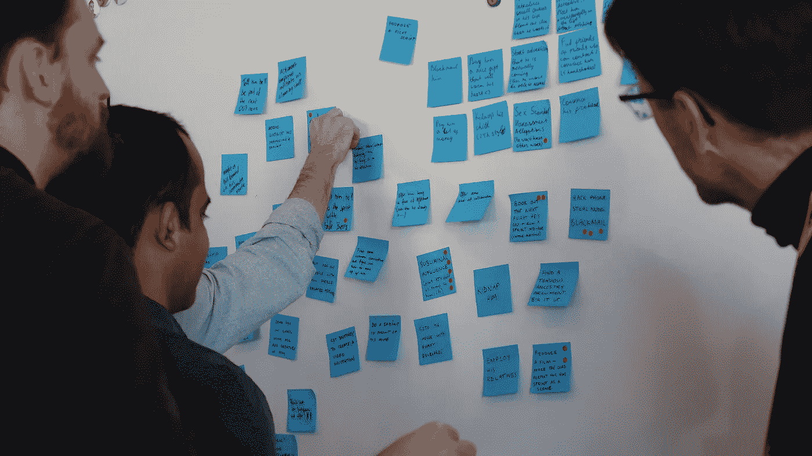
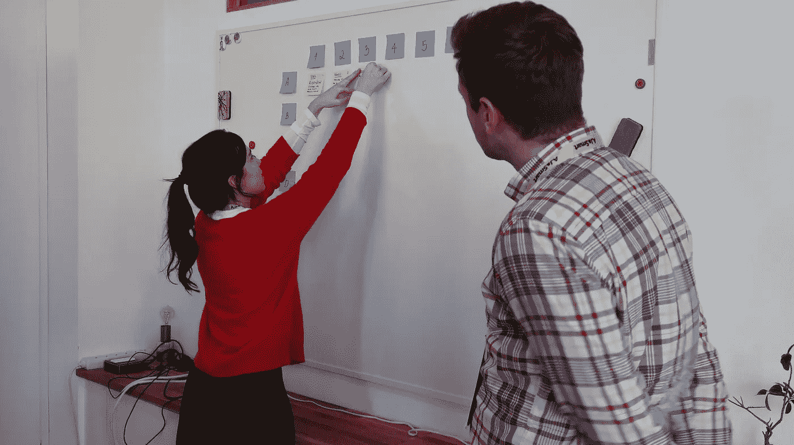
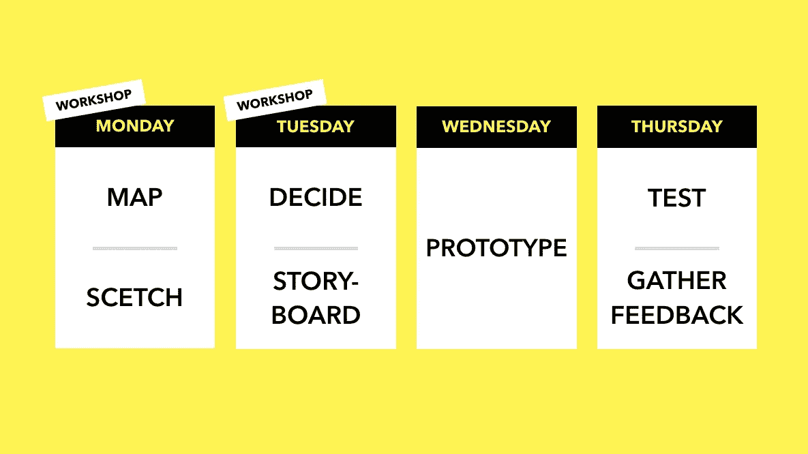

# 设计冲刺 2.0 一览:4 天的过程

> 原文：<https://medium.datadriveninvestor.com/design-sprint-2-0-at-glance-the-4-day-process-672f178fc5ac?source=collection_archive---------3----------------------->

Design Sprint 是一个相当新的高效框架，帮助数百家硅谷和财富 500 强公司成功推出了价值数百万美元的产品和服务。

这个术语是杰克·纳普[在他 2016 年出版的书](https://www.thesprintbook.com/)中创造的。他强调，他运用设计哲学、思维和方法来解决各种组织挑战，如推出新产品或新功能、增长、内部流程改进、创新和发展。

结合设计思维的最佳实践，精益 UX 和敏捷纳普创建了一个清晰、高效、快速和适应性强的框架，以降低创新风险，将团队团结在同一愿景上，并最终节省资金和时间(根据多个证明，最长可达 6 个月[)。](https://phase.com/magazine/whats-the-design-sprint-2-0/)

自从这本书发布以来，许多组织都在尝试设计冲刺框架，试图提高它的效率和价值。

在 [SprintUX](https://www.sprintux.com/) ，我跟随设计 Sprint 2.0:由 [AJ & Smart](https://ajsmart.com/) 开发的最新、半官方、改进版本(看看他们，他们棒极了！)连同[杰克·纳普。](https://jakeknapp.com/)

你可以在这里阅读更多关于[设计冲刺的价值。](https://www.sprintux.com/sprint-q-a)在本文中，我将介绍该流程的日常概况。

# 设计冲刺团队

设计冲刺团队通常由 5-7 名具有不同专业领域的主要利益相关者组成。

让后来负责实施该想法并拥有成功所需的关键技能/专业知识的人加入进来是一个好主意。

例如，对于数字产品，可以是:it 工程师/产品所有者、设计师、沟通/营销专家、社区/销售经理、财务经理和 CEO。

# 第一天:定义、绘制地图、绘制草图

*第一天的内容是找到需要关注的正确问题以及解决问题的多种解决方案。*

它从简短的专家访谈开始。Sprint 团队邀请组织内部和外部的专家分享他们在挑战的各个方面的知识。这有助于缩小知识差距。团队听取专家的意见，做笔记，并将他们分享的挑战重新组织成机会。

有了新的知识和积极的视角，团队开始定义设计冲刺的主要问题以及新企业的长期目标。这有助于正确看待事物，关注问题的主要、最重要的方面。

团队使用记录和投票的方法(使用便利贴)来排除不必要的讨论和单独的头脑风暴，让每个人都把他们的想法和意见放在桌子上。这两种方法贯穿于设计冲刺阶段，是成功的关键。

考虑到长期目标和冲刺问题，团队开始绘制客户旅程(此时非常基础)并选择此旅程中最关键的领域，这将作为冲刺的主要焦点。

在尽可能多地了解了问题之后，在吃了午饭和喝了咖啡之后，剩下的时间就用来寻找解决方案了。团队成员展示闪电演示，或者换句话说，展示同一领域已经存在的成功解决方案，以获得一些灵感。

有了新的想法，每个团队成员都试图单独制作多个代表未来解决方案的草图。之后，每个团队成员再次单独使用纸、胶带、胶水和记号笔创建一个概念的适当的 3 帧草图。

# 第二天:决定和故事板

第二天的重点是选择一个概念，并对其进行细化。

它从回顾第一天匿名创建的概念开始。团队成员使用贴纸对每个概念中他们喜欢的部分进行投票，创建意见热图。

随后由主持人介绍概念，然后进行投票。这用于帮助决策者(即真正的老板)做出明智的决定，并选择一个概念(或将两个概念融合在一起)，整个团队将在稍后构建原型。

在这一天的第二部分，团队致力于创建一个用户测试流。每个团队成员单独创建一个 6 步客户体验流程(使用便利贴):从发现开始，到成功解决问题结束。

这有助于团队调整事件的顺序:先做什么，后做什么。最后，团队通过聚集主要步骤并排除多余的步骤来创建一条主线。

使用这条主线，团队开始绘制故事板草图。他们详细描绘了用户旅程的每一步，包括解决方案的低保真度线框(如果是数字产品)，信息和文本的精确副本，颜色，元素的位置等。故事板是在第三天创建原型的基础。

# 第三天:原型

*第三天专门用于构建原型。*

团队根据现有的技能将这项任务分成不同的角色。一到两个人使用草图软件(如果是数字产品)创建线框(制作者)，另一个人搜索设计资产，如图片、照片、背景、标志(收集者)，第三个设计冲刺团队成员负责消息和文本(作者)，最后第四个人将整个流程缝合在一起并执行质量控制(缝合者)。

该团队旨在创建未来解决方案的“门面”。一方面，它应该在视觉上看起来足够好，足以让测试人员信服。另一方面，功能应该是最小的，只关注测试设计冲刺的主要假设。

同时，第五个团队成员准备第四天的面试(面试官)并招募测试人员。他负责起草面试问题，制定筛选调查，只选择代表目标受众的人，通过社交媒体渠道或在线公告板发布测试人员的号召，安排时间，与测试人员一起签到，以确保他们准时到达。

# 第四天:测试

第 4 天专门用于用户测试。

这些是开放式的定性访谈，用户将试用原型并给出他们的反馈。通常会有 5 到 8 次这样的面试。这可能看起来不多，然而，这是[统计证明](https://www.nngroup.com/articles/why-you-only-need-to-test-with-5-users/)在第五次面试后，新的有用信息的数量急剧下降。

因为在这个阶段，你想了解大局，5 次采访通常足以了解你的解决方案是否能打动观众。测试人员会告诉你他们对这个概念的看法，他们是否觉得它解决了一个重要的问题，它对他们来说是否足够清晰，它是否有他们需要的功能，他们是否愿意为此付费，等等。

在面试过程中，每个团队成员都用便利贴做笔记。这些笔记随后被收集起来，并按照与用户测试流程相似的方式进行分组，以便提出设计冲刺阶段的主要分析结论。

# 走向

根据用户测试的反馈，你可以做出结论并采取进一步的行动。

无论你的设计冲刺的结果是什么，都应该被认为是一个胜利。

即使解决方案会彻底失败，你只用了 4 天就明白了。你在实际编码/构建/开发上以最小的风险和零成本做到了这一点。想想不抓住机会进行设计冲刺的代价，以及你会花费多少时间和金钱去理解这是一个错误的方向。

如果你的解决方案有好的反馈:你就节省了 3 到 6 个月的证明工作。

你让你的团队有了相同的愿景，得到了一个有形的原型，这将帮助你获得更多的资金，并为前进创造了信心和动力。

如果你的解决方案有混合反馈:你在正确的轨道上，你知道如何前进。使用所有这些新的知识和数据，做一些调整，如果需要，重新定义你的受众，并再次测试，直到你对结果满意。

# 如何设计 Sprint 2.0 更好？

有几个主要的变化使得 Design Sprint 2.0 更加高效、灵活和方便:

这个过程需要 4 天。本来是 5。通过用一些新的元素(用户测试流程)改进一般流程，改变练习的顺序(从专家访谈开始)和它们的结构(映射系统)，这成为可能。对于那些不能用一周时间完成冲刺的人来说，这是个好消息。

**高管仅参与 2 天**。最初，为了让事情顺利进行，你需要在设计冲刺的整个过程中有一个决策者(首席执行官、高级执行官、总监)。这是一个严重的瓶颈，因为高管们经常无法明确他们的时间表。在 Design Sprint 2.0 中，你可以把最后两天留给设计师和面试官，让 CEO 和管理层去做。他们随后将收到包含所有见解的报告。

**扩大组织重点。**既然 Design Sprint 是谷歌风投为了帮助科技初创公司而开发的，它自然是根据他们的需求量身定制的。Design Sprint 2.0 扩展了这个框架。迄今为止，它被用于帮助不同行业的公司和小企业、非营利组织、政府机构和政府间组织。

[**【设计冲刺】**](https://www.linkedin.com/feed/topic/?keywords=%23designsprint) [**【创新】**](https://www.linkedin.com/feed/topic/?keywords=%23innovation) [**【设计】**](https://www.linkedin.com/feed/topic/?keywords=%23design)[**【UX】**](https://www.linkedin.com/feed/topic/?keywords=%23ux)[**【敏捷】**](https://www.linkedin.com/feed/topic/?keywords=%23agile) [**【创意】**](https://www.linkedin.com/feed/topic/?keywords=%23creative) [**【设计思维】**](https://www.linkedin.com/feed/topic/?keywords=%23designthinking)