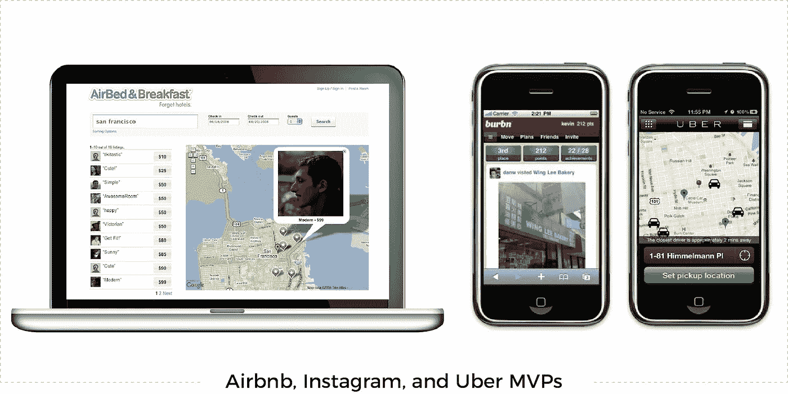
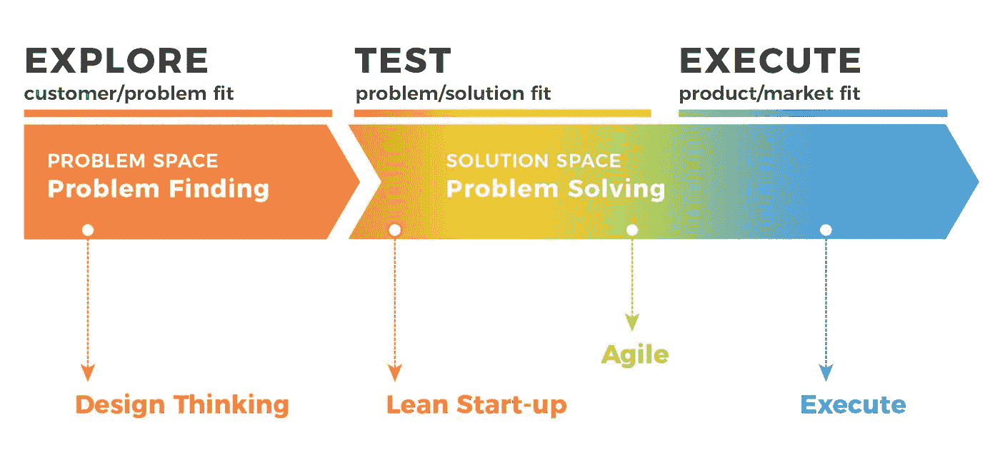
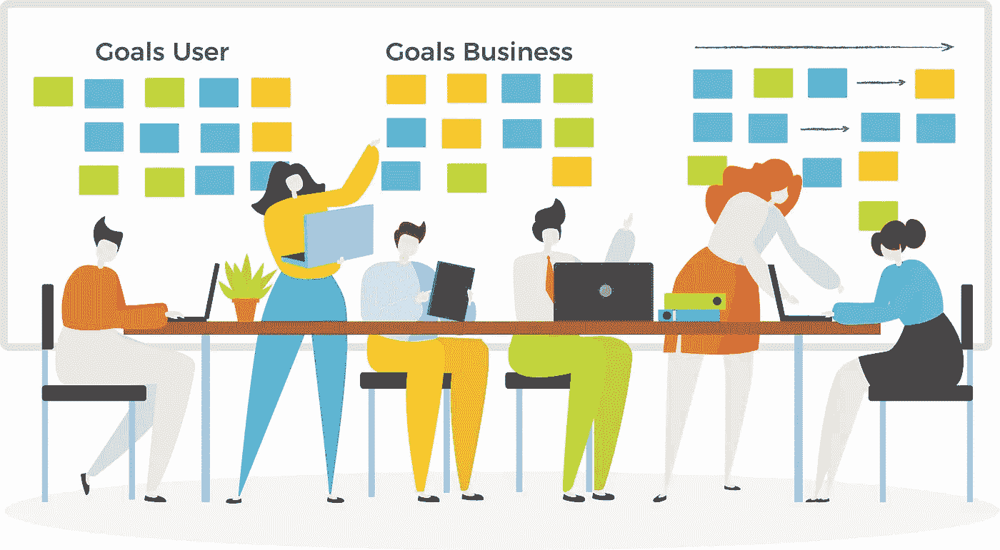
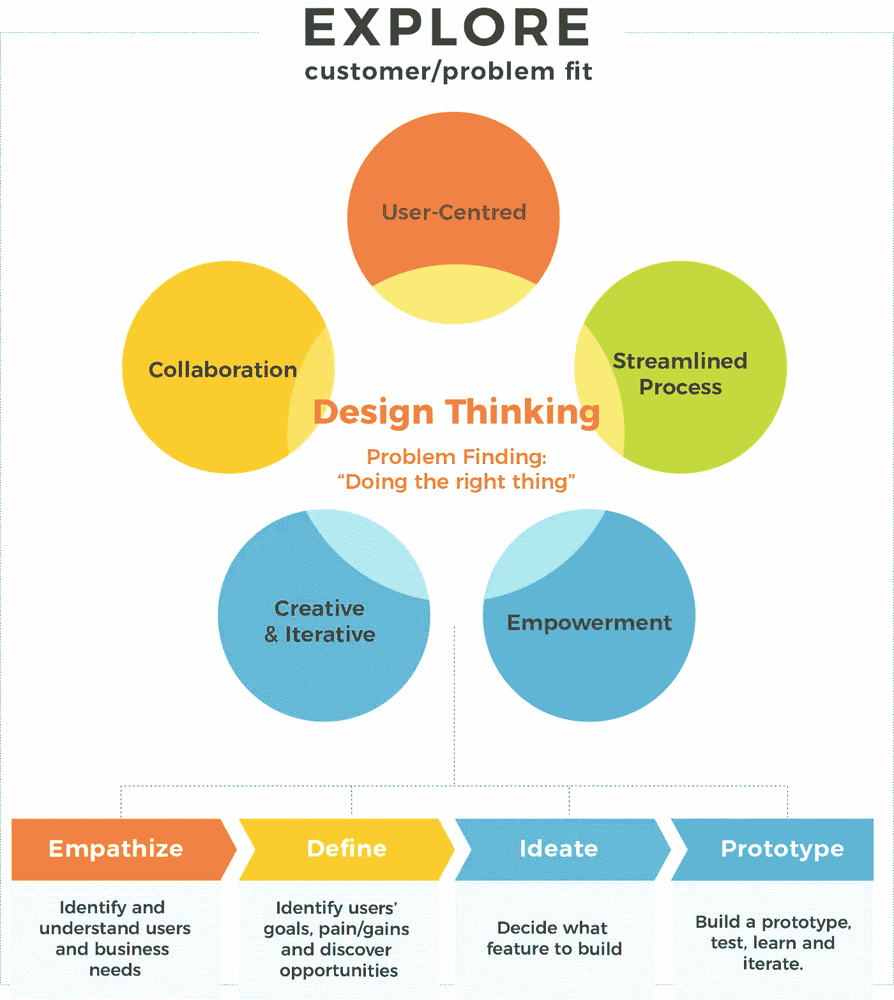

# 设计思维:将最小的可行性转化为最有价值的产品

> 原文：<https://medium.datadriveninvestor.com/design-thinking-turning-minimum-viable-into-most-valuable-product-1891f8465e1e?source=collection_archive---------0----------------------->

优步、Airbnb、Instagram 甚至 iPhone 有什么共同点？除了具有开创性、颠覆性和巨大成功的服务和产品之外，它们都有一个共同的起点——它们都是从 MVP 开始的。

MVP 或最小可行产品是 Eric Ries 的精益创业公司中宣传的一个概念，强调在新产品开发中学习。它可以被定义为新产品的一个版本，具有“足够”的功能来吸引和满足早期采用者，从中可以收集反馈并为未来的开发学习。

通常，任何新产品开发都是一项昂贵的努力——也就是说，直到企业开始借鉴创业剧本。现在，通过利用 MVP，组织可以快速开发，降低新产品开发成本，降低投资风险，在现场测试概念，从用户那里学习，并迭代添加新功能。

 [## 金融科技初创公司正在颠覆全球银行业|数据驱动的投资者

### 传统的实体银行从未真正从金融危机后遭受的重大挫折中恢复过来…

www.datadriveninvestor.com](https://www.datadriveninvestor.com/2018/10/20/fintech-startups-are-disrupting-the-banking-industry-around-the-world/) 

今天，你不仅要学习如何开发和计划一个 MVP，还要学习如何在[设计思维](https://perspectives.mobilelive.ca/blog/design-thinking-opportunities)过程的帮助下，将前所未有的注意力放在最重要的事情上——用户。

# 为什么要设计思维？

当涉及到新产品开发时，通常，资源被分配给“听起来像一个伟大的想法”的项目，因此，被给予时间、人员和预算来探索。可悲的是，我相信很多人都有同感，这已经一次又一次地被证明是对宝贵资源的低效浪费。

幸运的是，有一种新的思想流派，它不会说“这听起来像是一个好主意”，或者至少在回答了“证明这是一个花费资源的好机会的证据在哪里”这个问题之前不会说。这就是设计思维在创新生命周期中发挥作用的地方。

设计思维在创新生命周期的初始阶段起着至关重要的作用，它帮助找到“客户/问题”的契合点:对于目标客户群来说，什么是需要解决的正确问题？在这个阶段，目标是通过发现用户未满足的需求和他/她想要解决的未解决的问题来“发明未来”。

但是设计思维到底是如何帮助定义和计划 MVP 的呢？它首先通过探索客户/问题匹配来帮助找到正确的问题并“做正确的事情”这是通过移情、定义、构思、原型和测试来完成的。

# MVP 验证的设计思路

## 1.识别和理解业务需求

一切都始于新的或创新的小创意。但是你怎么知道这个想法是有效的或者值得投资呢？换句话说，你如何知道你的商业价值主张实际上是有价值的？

设计思维的一个显著特征是它强调协作，特别是涉及到与业务相关的每个人，从设计师到开发者，从企业主到整个市场。通过邀请他们一起工作，它提供了对所提出的概念的不同观点，并可以帮助确定想法背后的市场和业务需求，以确定产品的长期目标，巩固共同的愿景，确认项目背后的推理，并定义成功标准。

通过这种合作，组织可以利用不同利益相关者和客户的独特知识来发现最有价值的机会，并为项目创造一种支持和主人翁感，这不仅会加速项目的实施，还会在提高创新潜力的同时最大限度地降低失败的风险。

## 2.识别用户和发现机会

根据您的业务价值主张，确定用户及其独特需求是至关重要的。毕竟，建造没人想要的东西是件糟糕的事情。那么，你如何确保你的潜在解决方案会有用户呢？你如何识别他们？他们的需求是什么？

设计思维也被称为以人为中心的设计，因此，需要与客户、利益相关者和顾客合作，以带来真正的用户成果。通过这种以用户为中心的方法，它不仅强调理解用户，还强调识别他们当前的[体验](https://perspectives.mobilelive.ca/blog/digital-transformation-is-an-imperative)、目标和需求，以帮助确定真正的问题是什么。这是通过结合定量和定性的用户研究方法实现的，这些方法专门用于回答关于用户行为、偏好、习惯和价值主张的关键问题。这一方法的价值在于它防止了虚假共识效应，即人们倾向于高估自己的观点、信仰、偏好、价值观和习惯在多大程度上是他人的正常和典型的偏见。虽然很难承认，但记住“你不是用户”是明智的，值得投入时间和精力来理解“真实用户”的上下文

## 3.决定要构建什么功能

到目前为止，您应该已经确定了您的用户、他们的独特需求以及您的业务价值主张。然而，你可能也注意到了其他的事情也在同步发生——你的想法开始变得更加具体。当这种情况发生时，你就知道是时候设想并开始设计核心特性了。

集思广益过程中的协作对于最终确定要开发的核心功能列表至关重要。该列表应基于收集的机会陈述、基于建议功能分解的详细产品路线图，以及最终的优先级矩阵。牢记用户和企业的最终目标，从不同的角度审视产品，利用各种可用的专业知识，这些都将有助于你不仅做出正确的决定，而且“做正确的事情”

设计思维工作坊特别采用工具、方法和技术，通过合作的方式带来最好的想法。它们与典型的会议和讨论会截然不同，在典型的会议和讨论会上，权力距离关系、个性类型和组织文化经常会妨碍协作。

## 4.建立一个原型，测试，学习和迭代

构建一个快速原型是允许用户测试概念的最好方法，并且为设计师、开发人员和产品经理提供关于用户如何与之交互的有价值的信息。一旦完成，您就可以在构建实际的 MVP 之前，根据用户反馈对原型进行迭代。事实证明，在花费大量时间、金钱和精力来构建和发布产品概念之前，这是构建和验证产品概念的最快、最具成本效益的方式。

IDEO 说，“如果一张图片胜过千言万语，那么一个原型就相当于一千次会议！”

虽然 MVP 由核心特性组成，但保持灵活性是很重要的。产品必须根据市场和用户的需求不断发展。通过测试和反馈，你将了解到关于你产品想法的假设是否真的有效。然而，有时(在某些情况下，经常)你的假设并没有根据反馈得到验证，或者它们可能事实上是错误的。但是不要担心——这不是一件坏事。在打造更好产品的过程中，你希望失败得早，失败得便宜。

# MVP 与超越的设计思维

数字产品和他们称之为家的生态系统是动态的，不断发展的——就像用户、他们的需求和期望一样。正是在这种环境下，我们看到了设计思维方法的无与伦比的价值，以及它以用户为中心的方法、早期用户参与和协作性蓬勃发展。通过利用设计思维来解决用户的真正需求，并反过来“做正确的事情”，这种实践不仅会给市场带来创新和价值，而且有能力改变一个组织及其人员。

到目前为止，您已经知道了如何利用设计思维来创建 MVP，但是这只是等式的一半。在你建立了你想要用你的 MVP 测试的东西之后，你必须选择哪种 MVP 验证方法将为你提供来自真实用户的最可靠和可操作的数据；技术，我们将在下一篇文章中讨论。

(首次发表于 [mobileLIVE perspectives](https://perspectives.mobilelive.ca/blog/design-thinking-and-mvp) )