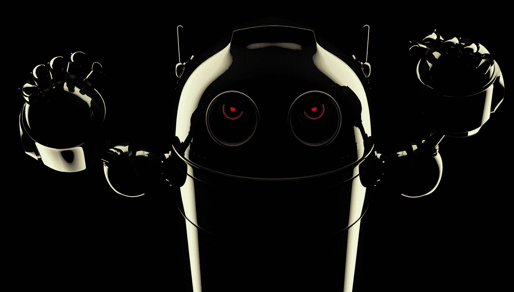
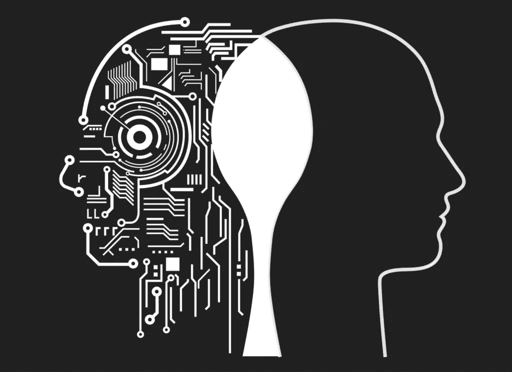

# 设计师与机器人:人工智能能真正为人类需求设计吗？

> 原文：<https://medium.datadriveninvestor.com/designer-vs-the-bot-can-ai-truly-design-for-human-needs-969c7643590?source=collection_archive---------32----------------------->

*3–4–2017*人工智能(AI)会对我们的工作产生什么样的影响？这个问题一直让我们很忙。之前，我们探索了[人工智能对内容创作者的意义](https://afrogleap.squarespace.com/afrogleap/fun/copywriter-vs-bot-adapt-give-way)。现在[机器人已经加入了 SXSW](https://afrogleap.squarespace.com/afrogleap/updates/robots-panel-discussion-sxsw) 的小组讨论，下一步是什么？是时候从设计师的角度来看待‘人类对机器人’的竞赛了。智能机器能在多大程度上接管它们的任务？设计师是否预见到任何困难，或者也许是巨大的好处？在试图找到答案的同时，让我们记住我们对机器人替代反应的不同阶段，正如我们的启发者之一凯文·凯利所建议的:

1.  机器人/计算机不可能做我做的工作
2.  *【后来。]“好吧，它可以做很多那些任务，但它不能做我做的所有事情。”*
3.  *【后来。]“好吧，它能做我做的一切，除了它出故障时需要我，这是常有的事。”*
4.  *【后来。]“好吧，它在日常工作中运行完美，但我需要训练它完成新任务。”*
5.  *【后来。]“好吧，好吧，它可以做我以前的无聊工作，因为很明显，这不是人类应该做的工作。”*
6.  *【后来。]“哇，现在机器人在做我的老工作，我的新工作有趣多了，工资也高了！”*
7.  *【后来。]“我很高兴机器人/计算机不可能做我现在做的事情。”【重复】*

UX 设计师擅长理解人类行为。他们被训练有以用户为中心的方法来设计问题，这对机器人来说可能是一个相当大的挑战！AI 能真正知道人类想要什么，需要什么吗？让我们在**设计师对机器人**中了解更多。

# 现实检验:AI 追赶的速度有多快？

人工智能网站生成器

设计师的目标是创造出色的用户体验。设计师找到优化用户交互、准备视觉资产和构建创新数字产品的方法。方法是[使用有效的图标](https://afrogleap.squarespace.com/afrogleap/design-series/design-series-icons-can-make-difference)，创造[有意义的动画](https://afrogleap.squarespace.com/afrogleap/design-series/top-5-meaningful-animations-apps)和设计平滑的[微交互](https://afrogleap.squarespace.com/afrogleap/design-series/design-series-future-micro-interactions)。像 [TheGrid.io](https://thegrid.io/) 和 [Wix](http://www.wix.com/) 这样的公司已经提供了使用人工设计智能的工具。

在这一过程中，根据可用数据生成独特的新网站至关重要:“Wix ADI 从包括布局、图像、文本、联系方式等在内的数十亿种组合中，选择最适合您的组合，打造独一无二的免费网站。”

我们不得不承认，他们的作品看起来很有前途，可能会抢走设计师的一些工作。

视觉识别软件

在 2016 年底参观阿姆斯特丹 Adobe Creative meetup 期间，我们参加了 Adobe 图像识别工具 [Adobe Sensei](http://www.adobe.com/nl/sensei.html#m3704b4499a04d64c7685b211ffde6ea4) 的介绍。这个活动是关于创造力和设计的未来。Sensei 正在将人工智能和机器学习与大量内容和数据资产相结合。这个工具使设计师能够轻松地混合和匹配，操纵和调整图形设计。

除了图像，在人工智能工具如拟阵的帮助下，快速扫描数百万小时的视频的可能性越来越大。这些类型的识别工具似乎可以让设计师更有效地工作。

自动化标志设计

[Mark Maker for logo design](http://emblemmatic.org/markmaker/#/) 并不是一个超未来派的例子，但它可以让不是经验丰富的设计师的人“设计”出一个好看的 logo。它是这样工作的:你填写你的公司名称和马克制造商为你生成一个标志。通过基于心(❤️)检索用户反馈，该工具保存用户收藏夹并从这些数据中学习:

> 遗传算法允许系统学习你的偏好并改进它的设计。每次会议开始时，都会根据随机的“基因库”生成徽标。当标志被❤️化时，它们的基因得到强化，新的标志通过借用和重组它们的特征而产生。例如，如果您的所有徽标都是红色的，当您继续向下滚动时，系统会建议更多的红色徽标。
> 
> *❤️*ed 徽标也保存在共享数据库中。你看到的标志是基于网站上其他人最近 *❤️* 编辑的设计，你 *❤️* 的标志也会激发他们看到的设计。通过这种方式，系统学习设计趋势，并且当趋势改变时，系统可以随之改变。

# 半场比分是多少？

人工智能有助于设计师自动化耗时和无聊的任务。这使我们处于机器人更换的第 4 和第 5 阶段之间。我们对此很满意，因为这让设计师可以花更多的时间在创造性的问题解决上。智能机器可以比设计师更快地处理日常任务，但我们仍然需要设计师来解释客户简报，并决定为哪些数字频道设计。我们相信 **AI 应用+数字设计师**的总和会产生我们之前没有想到的令人兴奋的新概念。设计师的角色在适应人类行为和情绪方面至关重要——目前，给予❤️s 反馈仍是计算机的弱点。

“设计师”的定义会随着时间的推移而调整。今天，当我们说设计师时，我们不再仅仅指那些处理形状和颜色的人。同时，还不清楚设计师的责任范围会扩大到什么程度。我们是指所有参与创造智能机器的人吗？我们是指每个人都在监控和管理数字用户体验吗？什么类型的新设计专业将会出现？目前，我们不知道，但这里有一个[“未来的工作”——列表](http://www.futuristspeaker.com/business-trends/162-future-jobs-preparing-for-jobs-that-dont-yet-exist/)已经让我们兴奋了！也许我们很快就会有新一波的“无人驾驶乘坐体验”设计师站出来。

对人工智能将如何影响其他专业感兴趣？在不久的将来，我们的开发者也将分享他们对这个话题的看法。AI 的兴起对不同类型的工作意味着什么？我们的任务会不会一眨眼就被取代，还是不会那么快？让我们展示你的未来。联系[ai@afrogleap.com](mailto:ai@afrogleap.com)。

*最初发表于*[*【afrogleap.com】*](https://afrogleap.com/blog/strategy/designer-vs-bot-can-ai-design-for-human-needs)*。*