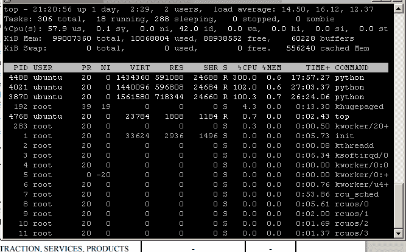
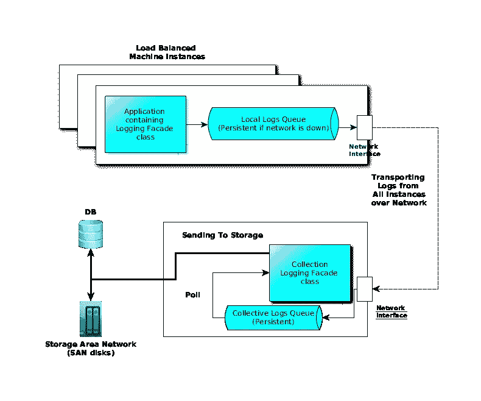

# 设计集中式日志记录应用程序

> 原文：<https://medium.datadriveninvestor.com/designing-a-centralized-logging-application-da5e0272791?source=collection_archive---------1----------------------->

*这个故事最初发表在我的博客@linqz.io* [*这里*](https://www.linqz.io/2018/05/how-to-design-a-centralized-logging-app.html) *。*

*为什么我需要一个集中的日志应用程序？*

*在哪种情况下，必须有一个集中的日志记录应用程序？*

我的应用程序与 IO 紧密相关，如何提高其性能？

如果以上任何一个问题的答案是肯定的，那么这篇博客将会给你一些解决以上问题的方法。

任何应用程序设计，如果能对所有三个头(即`IO`、`Memory`、&、`CPU`)进行最佳利用，那么它就是最佳的。如果它们中的任何一个被大量使用，都会对应用程序的性能产生连锁反应。在内存廉价的当今世界，RAM(内存)不再是应用程序的阻碍因素。

**如何发现应用是 CPU、IO 还是内存绑定？**

运行`top`并查看 cpu 使用率行。高用户百分比表示它受 CPU 限制，这意味着进程的进展速度受到 CPU 速度的限制。

高 wait %( `wa`)表示它是 IO 绑定的，因为任务是磁盘绑定的。



要检查应用程序是否受内存限制，请检查`%MEM`，这将给出该进程使用的总可用内存份额。`VIRT`给出进程的虚拟内存占用量，其中只有`RES`量当前在物理内存中(其余的被换出，当前不在表中显示),即进程进行的速率受到可用内存量的限制&内存访问的速度。

## 那么，如果我的应用程序受限于 I/O，我们如何提高性能呢？

如果我们分析应用程序的 IO 模式，我们会发现各种类型的日志，即应用程序日志、定期监控/状态检查日志、活动/请求日志等。应用程序利用以下方法来控制日志文件:

1)外部 cron 作业，如在午夜循环的 logrotate。2)使用 log4j 将日志写入应用程序特定的日志，而不是用 catalina 定期刷新缓冲区来写入所有内容。

大多数开发人员开始减少应用程序中的日志记录，但很多时候在大量使用的应用程序中，会生成数 TB 的日志，这种日志记录的减少对减少 IO 没有任何影响。

# 解决方案？

构建一个集中式日志应用程序。

下面是一个集中式日志应用程序的架构图，它使用最少的应用程序内存和 cpu 开销。这个日志记录过程尽可能地异步。通过以序列化格式传输信息(如 protobuf /thrift 对象)可以获得最大的好处。通过网络点击 阅读更多关于序列化 [**的内容。**](https://medium.com/@vaibhav0109/serialization-techniques-for-highly-scalable-systems-a8bf2130fe7f)



```
**Networking requirements:** Gigabit Ethernet or 10 Gigabit Ethernet**CPU requirements :** 1 core at most**Memory Requirement:** Very low**IO requirement on Application Instances:** Zero (or high only when network is down which usually never happens)
```

下面的包装类可用于异步记录到远程系统，本地队列继续传输到中央记录应用程序，在网络不可用的情况下，facade 将本地转储到磁盘，并在网络恢复在线时再次开始传输。

```
public final class LoggingClientFacade 
{
   public static void log(int logLevel, String hostname, int instanceId, String className, String message);

      public static void logWithContext(int logLevel, String hostname, int instanceId, String className, String message, Object[] contextInfo);

      public static void logWithException(int logLevel, String hostname, int instanceId, String className, String message, int errorCode, Throwable exception);

...

}
```

需要注意的两件重要事情是:

明智的做法是**而不是**使用消息代理或桥进行传输或使用集中式队列(没有 JMS 或 AMQP)并对其进行远程调用。基于 KAFKA 的系统或任何基于 JMS 的队列都会增加额外的基础设施成本，因此我不建议使用它们。

使用提供日志收集器和处理器功能的程序，但不使用聚合器，因为这样可以降低额外基础设施的成本。更好的选择是 [FluentBit](https://fluentbit.io/) (只需要 450 KB 的内存，速度超快)[脸书 Scribe](https://github.com/InMobi/scribe) (由 Inmobi 维护的 fork)或者 [NSQ](https://nsq.io/) 。

有问题吗？建议？评论？

下一步是什么？ [**在媒体上关注我**](https://medium.com/@vaibhav0109) 成为第一个阅读我的故事的人。