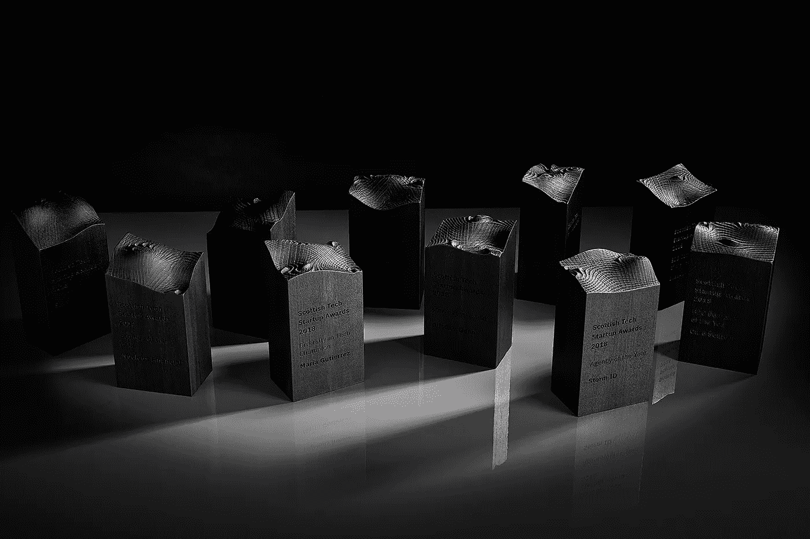
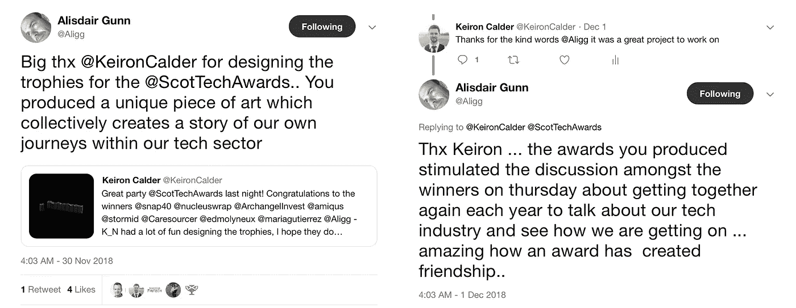
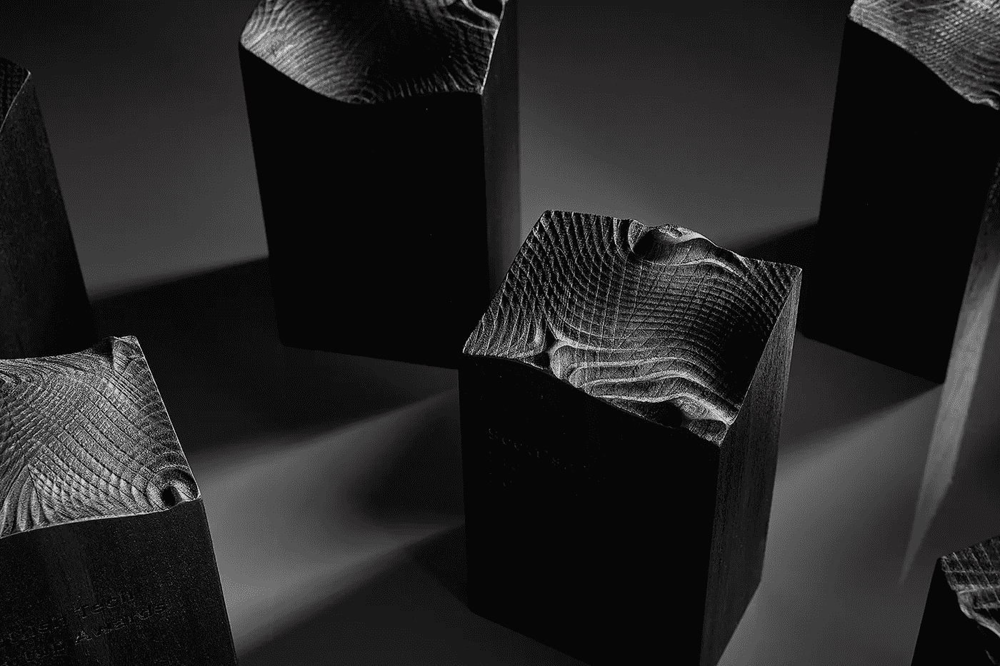
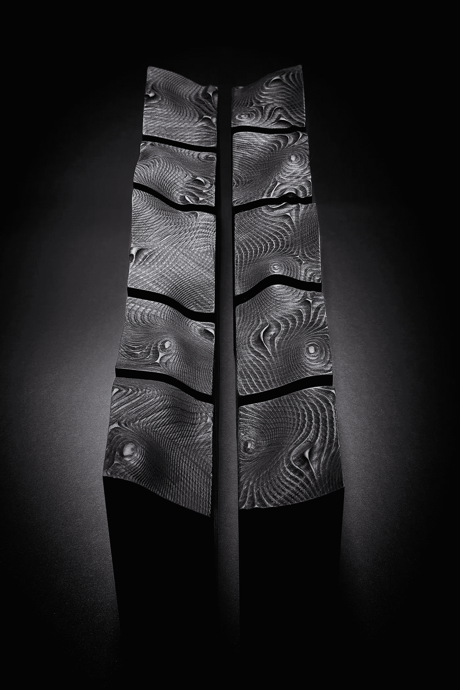
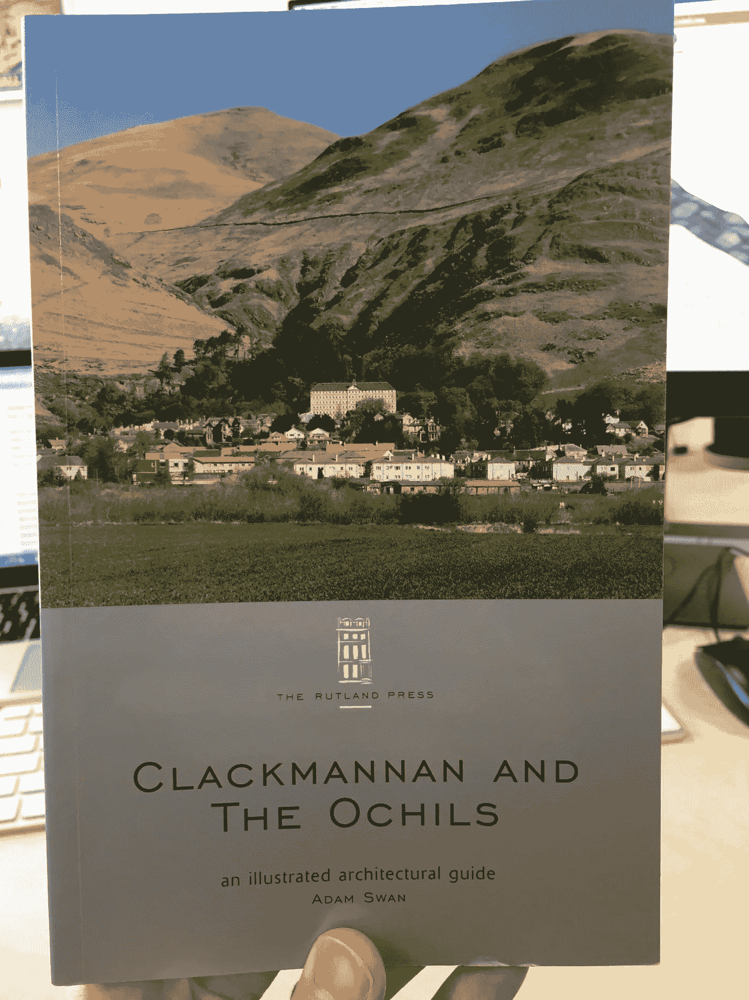
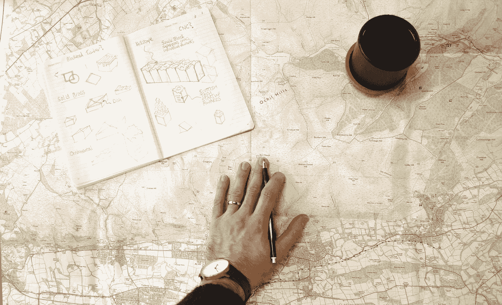
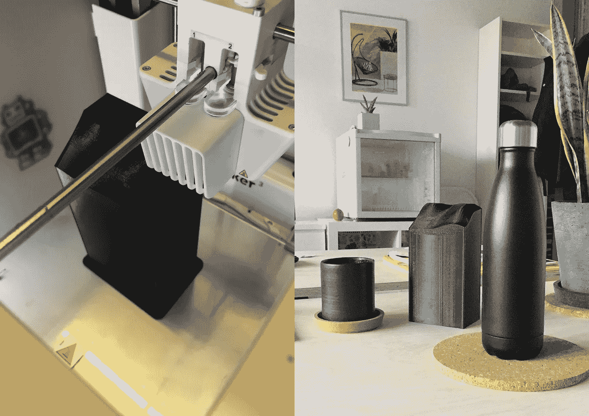
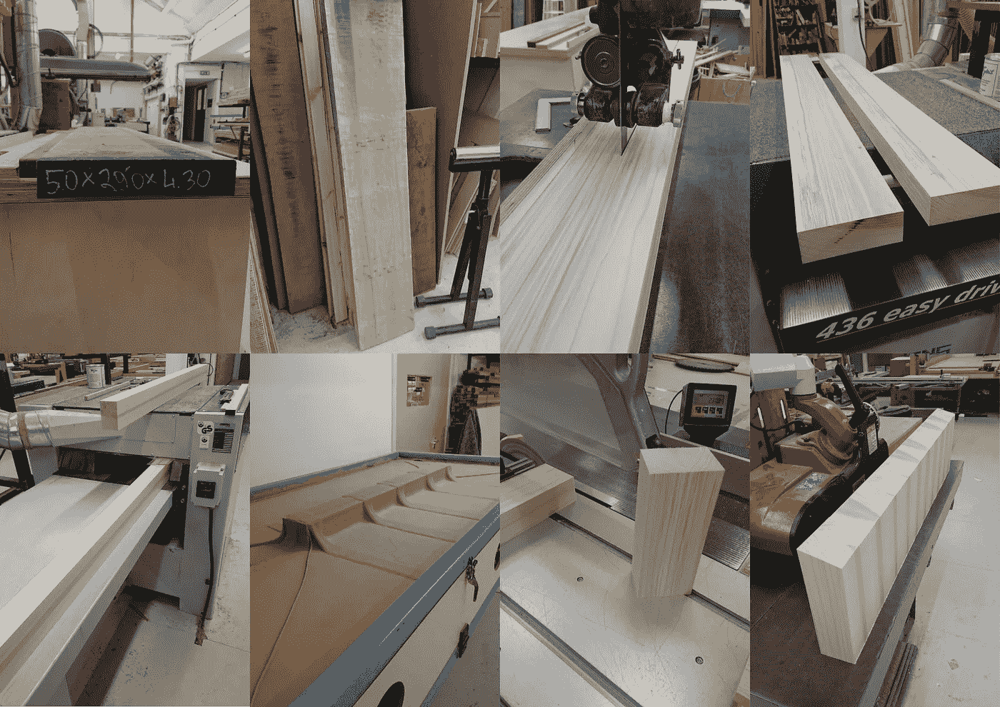
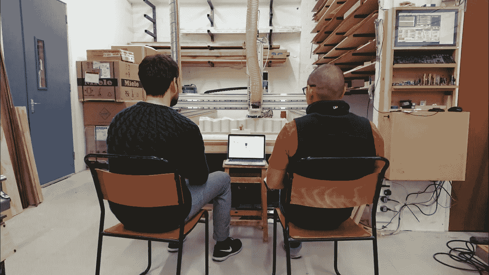
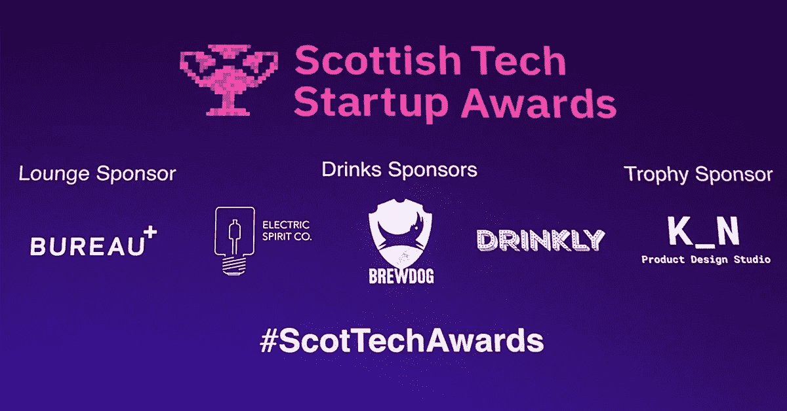

# 为技术先锋设计奖项

> 原文：<https://medium.datadriveninvestor.com/designing-awards-for-tech-pioneers-de156610155d?source=collection_archive---------21----------------------->

The Award Trophies (photo by [Matt Beech Photography](http://www.mattbeechphotography.com))

【2018 年苏格兰科技创业奖背后的发展过程

**项目**

上个月 **K_N** [**设计工作室**](https://k-n.studio) 有幸设计出真正一次性的东西。图灵节上可爱的人们找到我们，为首届苏格兰科技创业奖设计奖杯。一个令人兴奋的项目。

受我家乡阿尔瓦地形的启发，我决定奖项不应该完全相同。我们在一条连续的线上模拟了所有 10 个。当它们排列在一起时，就形成了一条连贯的山脉。分离后，它们各自成为岩石中独一无二的一块。这是每个奖项的获奖者的象征，每个人都是独一无二的，但却因为对更美好世界的共同愿景而团结在一起。

[Tweet from Alistair Gunn, winner of the Ecosystem Award](https://twitter.com/Aligg/status/1068475708689788928)

参加颁奖典礼非常有趣，我很自豪地看着获奖者接受他们的奖项。晚会真是一个壮观的夜晚，我很高兴这些设计得到了好评。我最喜欢引用的是获得生态系统奖的 Alistair Gunn(上图)的一条推文。得知我们想要传达的信息已经传达给最终用户，我感到非常欣慰，我很高兴我们的工作公正地对待了每一位获奖者令人难以置信的成就，以及他们所做的杰出工作。

The Award Trophies (photo by [Matt Beech Photography](http://www.mattbeechphotography.com))

**幕后——颁奖**

**概念**

作为一个[工业设计工作室](https://k-n.studio)，我们习惯于为大规模生产开发产品，所以当这个机会出现时，我很高兴接受这个挑战。我一直想设计一个奖杯。它们是如此重要的物品。代表巨大成就和成就的装饰品。

这个项目是独一无二的，原因有很多，其中之一就是信任我们创造我们的愿景的自由。简报很简单，送 10 个代表苏格兰科技奖杯。每一个都有同等的价值，而且足够强壮，经得起被撞来撞去(颁奖典礼毕竟是一个圣诞晚会！).我的第一个想法是“科技行业的人会觉得什么很酷？”而我的思绪立刻跳到了科幻。

Initial Concept — Solid Bronze

我喜欢科幻小说，我最初的设想是一个雕塑般的有机物体。功能上无法区分的形式。我们希望它们看起来像电影中的背景道具，坐在《银翼杀手》场景中的桌子或咖啡桌上。他们应该是神秘的，没有品牌，任何写在前面的副本消失在物体中，只有在寻找时才清晰可辨。我们提出的第一个概念是一个实心的黄铜立方体，从顶部表面随机凸起。像波浪或融化的蜡。这在技术上太困难，太昂贵，但方向是正确的。

The Award Trophies (photo by [Matt Beech Photography](http://www.mattbeechphotography.com))

我最大的挑战是如何将苏格兰融入其中。它可能很容易结束 twee 或陈腔滥调(我肯定想避免威士忌和格子呢！).从立方体上升起的肿块和隆起的最初概念给了我观察地形的灵感。特别是我的家乡。

My home town ALVA (foreground), The Ochil Hills (background)

我在一个叫阿尔瓦的小镇长大。它坐落在穿过中央地带的狭长村庄中间，在 Ochil 山脚下。从小到大，群山总是笼罩着我们，为我们的日常生活提供了一个令人惊叹的背景。当我开车回家拜访家人时，我仍然会起鸡皮疙瘩，随着我的接近，它们的规模扭曲，天空变得越来越松散。

Initial sketches / concept development, map reading and coffee!

地形数据本身就很漂亮。我从中获得了灵感，开始摆弄形状。克拉克曼南郡有着丰富的工业历史，最著名的是毛纺厂、港口和运河。18 世纪，阿洛亚走在了时代的前面，成为英国最早工业化的城镇之一。更广泛的地区仍然是许多国家啤酒厂和合作社的所在地。《克拉克曼南希尔和奥其尔斯，图解建筑指南》一书的作者亚当·斯旺将其描述为“缩影中的苏格兰”。

Modelling the awards in the **K_N** Studio at CodeBase (photo by [Matt Beech Photography](http://www.mattbeechphotography.com))

该奖项旨在表彰那些铺平道路、颠覆和引领行业的勇敢的技术人士。我可以清楚地看到与这一地区历史的相似之处。我开始用 CAD 手绘这个形状。我创建了一个由网格划分的平面，并开始在各个点上推拉，以达到所需的效果。我操纵并扭转飞机，直到群山以一种视觉上吸引人的方式稳定下来。我把形状合并成一个实心块，然后分成 10 等份。我研究了每一部分，以确保它们单独看起来和放在一起一样有趣。

**设立奖项/实现愿景**

3D printing the prototype (left), and testing it out in our studio (right)

我们在[代码库](https://www.thisiscodebase.com)工作室下面的[鹰实验室](https://labs.uk.barclays/locations/edinburgh)3D 打印了一份概念证明。这使我们能够向客户展示最终产品的实物。当你可以展示一个触觉原型时，推销一个想法是很容易的，因为奖项很小，我们印了一个全尺寸的给客户拿在手中。现在这个概念被签署了，我们需要把它们生产出来。

Testing the CNC path in Fusion 360

我和才华横溢的乔纳森·庞一起制作最后的作品。谈到木材，Jonny 拥有丰富的知识，并制作出令人愉悦和惊喜的定制产品。我与他密切合作，了解数控切割的局限性，我们能够运行计算机辅助测试，这有助于完善最终的概念。主要的限制是山的形状有多深，以及它们弯曲的角度。

Jonny’s process, from raw timber, to pre-cut blocks

乔尼用的是一块他刨平并切割成一定尺寸的木头。木材被切成两半，然后重新层压在一起，以达到所需的厚度。他小心翼翼地对齐纹理，并在压袋机中将其层压。我们只有一次机会，所以为了减轻 CNC 刀片的压力，他将顶面预先切成一个角度，给切割机一个先发制人的机会。奖杯采用了很多工艺，手工制作技术和计算机辅助制造的结合为我们提供了最终产品。

‘A watched pot never boils’ — Keiron Calder (left) & Jonathan Pang (right) watching the CNC router

乔纳森推荐郁金香木作为理想的强度与柔软度比。我们切割的是末端纹理，所以我们需要一种能够承受高强度摩擦的木材。我们将 CNC 推向了新的极限，因为车间里没有人使用它来做类似的事情。伴随着兴奋而来的是故障排除，并且获得初始设置是困难的。这是技术知识渊博的人的集体努力，以及耐心和毅力，让我们获得了成功的最终结果。

CNC Router cutting the hill-scape

将 3D 模型导入 CNC 软件，将其转换为数据。CNC 机器一行一行地逐步切割，将模型分解成坐标。切割刀片旋转时会留下美丽的阶梯状边缘，代表来自原始地图的地形数据。它需要几个小时来完成，运行最后一遍，给它一个光滑的边缘。

Lining up the awards, post laser engraving, pre staining

一旦我们有 10 块切割成型，艺术阶段就开始了。我们用激光雕刻机蚀刻出获胜者的名字。对于这一部分，我们再次利用了我们大楼里的 [Eagle Lab](https://labs.uk.barclays/locations/edinburgh) 。我创建了最终的艺术品，汉娜设置了激光在一些废木料上试运行。她调整了设置，一旦我们对完成的质量感到满意，我们就运行最后的 10 个奖项。在给他们一个全面的打磨之后，我们开始了最后的修整。

Applying the Sumi Ink (very messy business!)

为了达到黑化木材的效果，我使用了 Sumi 墨水(日本印刷术墨水)。这一部分很轻松，但很费时间，我用手绘了每个奖项。一旦完全干燥，我修复任何瑕疵，然后涂上一层天然的润饰油来保护表面。我重复了这个过程几天，因为干燥需要时间和耐心。在移交它们之前，我们做的最后一件事是记录它们。[马特·比奇摄影](http://www.mattbeechphotography.com)在黑暗的背景下捕捉到了它们，产生了你之前看到的戏剧性图像。

Behind the scenes of the photoshoot with [Matt Beech Photography](http://www.mattbeechphotography.com)

这是最有趣、最有趣的项目之一 **K_N** 有幸参与其中，投入了大量的爱、慷慨和社区。我们在设计清单上勾掉了一个大目标，伸展了我们的创意肌肉，并在此过程中开始合作和发展新的友谊。最重要的是，我们有幸标志着科技产业在苏格兰的重要性。奖励有才华的创新者，因为他们取得了成就，突破了界限，以不同的方式做事。为我们所有人塑造一个更美好的未来。为此，我真诚地感谢他们。

Our logo up on the big screen, in very good company at the award ceremony!

感谢阅读！要了解更多关于 K_N，和检查过去的项目，请访问我们下面的网站。

 [## K_N 设计工作室-关于

### 产品\家具\室内

k-n .工作室](https://k-n.studio/about)