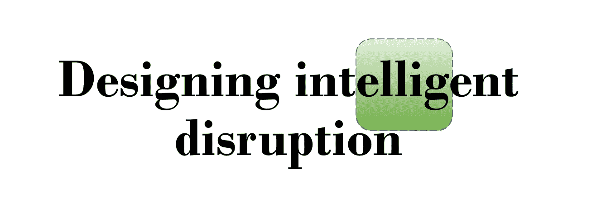
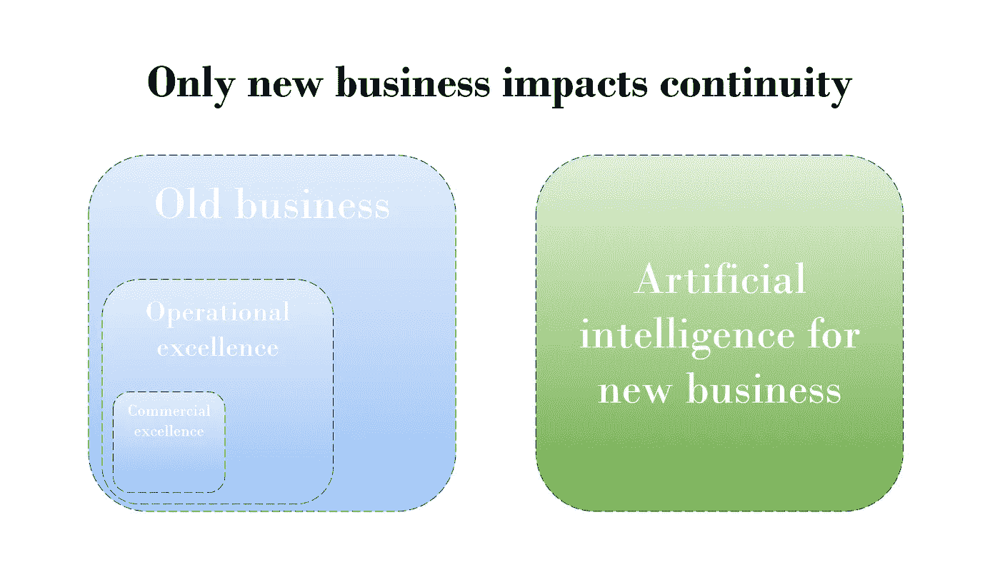
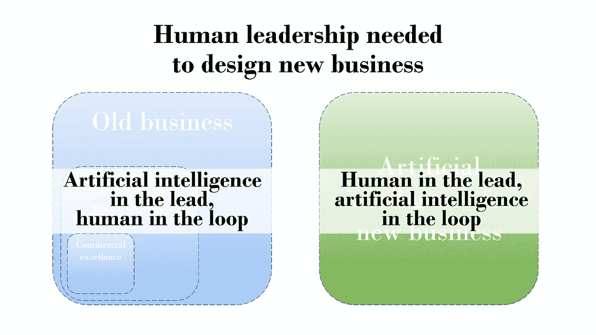
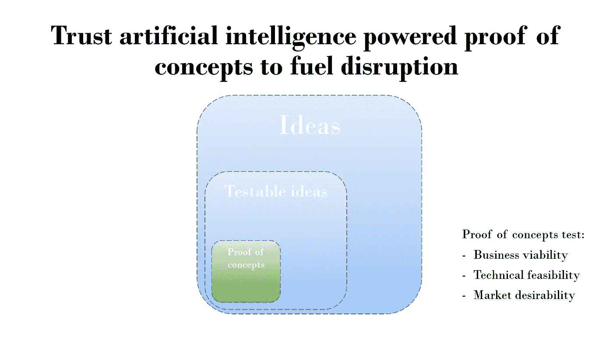
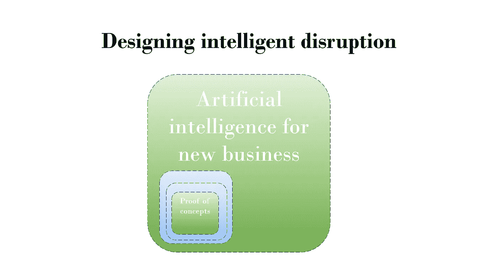
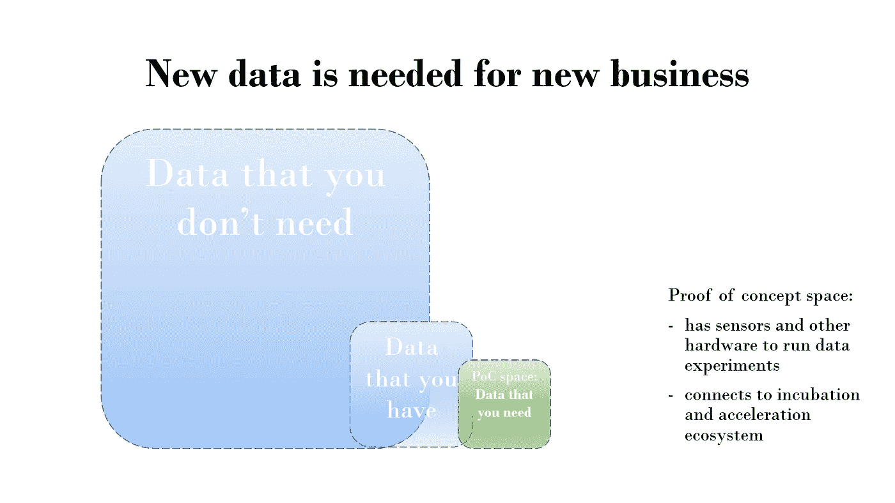

# 设计智能颠覆

> 原文：<https://medium.datadriveninvestor.com/designing-intelligent-disruption-e44770e2ccf0?source=collection_archive---------5----------------------->

## 创建人工智能驱动的概念证明，积极影响您组织的连续性

经过一些激烈但仍然友好的讨论后，产品设计遇到了人工智能的讨论，在过去的几天里，我与[安德烈·赫拉西姆丘克、](https://medium.com/u/143d9c53d3b6?source=post_page-----e44770e2ccf0--------------------------------)T2、安德斯·托克斯博和[吉安卢卡·莫罗](https://medium.com/u/7b41aaf99092?source=post_page-----e44770e2ccf0--------------------------------)讨论了如何智能地应对人工智能的兴起。

这是我正在准备的一个研讨会的新幻灯片，我懒得写关于它的详细帖子。希望你仍然喜欢它！

Why bother with automating old business processes? This has impact on your bottom line, but will not take into account disruption. Be relevant and only choose new business concepts that add 50% revenue or more.

And oh yeah, more and more tasks from business as usual will be automated. Creating new business will be out of reach for computers in the nearby future. Let humans use their supercomputer abilities.

Brainstorming is for amateurs. Break new grounds one experiment at a time.

Laserfocus will bring happiness.

