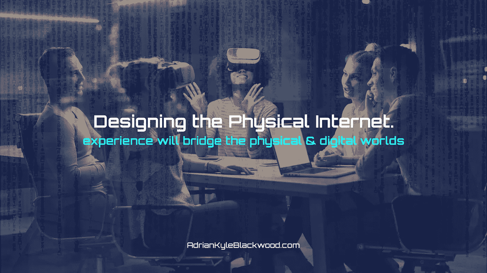
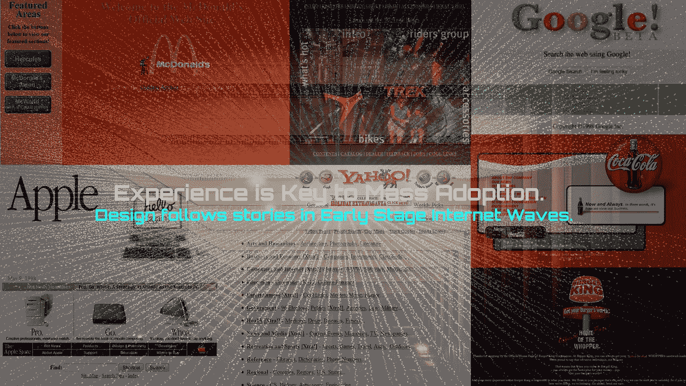
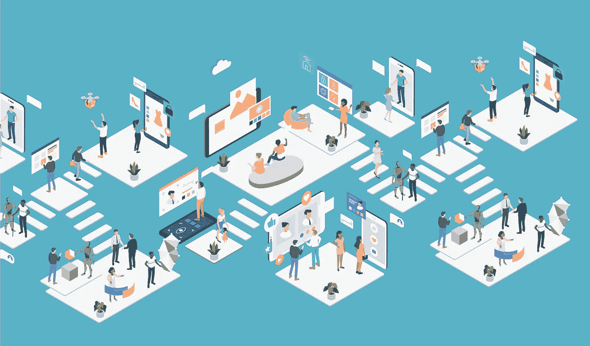

# 设计物理互联网。

> 原文：<https://medium.datadriveninvestor.com/designing-the-physical-internet-8a7038042196?source=collection_archive---------4----------------------->

## 无缝体验将成为数字世界和现实世界之间的桥梁。

第六集探索组合互联网的未来:混合人工智能、物联网、区块链和数据的艺术&科学。跟随媒体上的系列:【https://medium.com/@AkBlackwood 

## 物理互联网将改变你的生活，但首先它需要伟大的设计

获取人类知识和智慧的途径正以前所未有的方式发生着变化，这是我们将在本系列关于互联网未来的第六篇文章中探讨的有趣话题。

> **在 2018 年和 2019 年，我们看到越来越多的组织分享如何将人工智能系统实施到物联网中；与此同时，驱动它们的体验设计的复杂程度也在增加。**

## 环境和空间用户体验的兴起。

随着虚拟现实和混合现实的出现，以及现在扩展现实(XR)的出现，对环境和空间用户体验的设计和体验专业化的需求越来越大。与此同时，应该而且将会出现专门的认证、称号和学位，这些都将支持创造引人入胜的混合智能和交互环境的技能，在这种环境中，内容和技术混合在一系列技术的有用交互中。

超越每一次互联网浪潮早期阶段常见的技术优先的方法，将需要对物理互联网进行史诗般的讲述。

More of the same: Internet interface always sucks in the early internet waves.

# 首先为{物理}互联网设计。

## 2019 年，我们开始看到设计和体验在推动物理互联网的技术中占据前列。

## 下一个互联网的科学艺术

想象自己是一名销售伟大创意作品的数字艺术家；一幅现代版的达芬奇杰作，作为数码艺术家，我们能在身边创作出什么样的杰作呢？如何组合我们也能接触到的技术调色板；新的颜色、感觉、三维沉浸感、声音和振动都增加了艺术可以唤起的情感；有专家指导这些组合，一切皆有可能。

在物理互联网中，[第四波互联网](https://medium.com/datadriveninvestor/the-waves-model-of-internet-growth-cb034cbe1154)我们可以创造大师画作、木制飞机、螺旋直升机和详细解剖草图的数字等价物；哇，未来。

 [## 物联网危险剪断-数据驱动的投资者

### 物联网危险剪断-数据驱动的投资者

物联网危险剪断——数据驱动的 Investorwww.datadriveninvestor.com](https://www.datadriveninvestor.com/2018/09/26/infographic-dangers-of-the-internet-of-things/iot-dangers-snip/) 

# 响应式设计

物理互联网的伟大之处在于，通过设备、平台和位置，技术层支持他的物理互联网足够强大，具有低功耗嵌入式物联网，可以跟踪人类体验的情感、状态和活动，并制作实时响应的数字交互。

# 在数字世界中模拟

在过去 40 多年的互联网发展中，设计和体验之间的差距几乎与我们经历的每一项重大技术引进都是平行的。物理互联网最终将是一样的，进展到大规模采用和大多数人理解它的简单成就。

## 物联网中的技能集和活跃的项目社区。

从贴纸到节点到微型计算机，数字物理交互首先从物联网设备开始，但需要物理产品组件。

为了大规模采用，这些需要是低成本、坚固、精确和具有多年电池。我们还没到那一步。

## 换句话说，它是环境和空间的。

在达芬奇的时代，一个项目可能需要十年；在当今快速发展的基于项目的工作流程中，我们作为创作者最好不要花 10 年时间。我们可以把成熟的艺术技术专家的努力结合起来，放在我们身边，进一步激发灵感。

Now even clip art designers understand the usability need for the Spatial Web: design.

# 第四次互联网浪潮的兴起。

万一你错过了；通过一些无情的自我宣传， [The Waves Internet Mode](https://medium.com/datadriveninvestor/the-waves-model-of-internet-growth-cb034cbe1154) l 描述了无孔不入的 web 的兴起如何不可避免地导致我们人类成为界面。正如设计主宰了互联网第一波浪潮的快节奏、高增长阶段一样，实体互联网将需要设计和设计师。

因此，慢慢地，我们开始接受这一想法，走过物联网实施的新奇之处，以及它如何应用于几乎所有的业务/使用/测试/ etc 案例，并共同理解人工智能和物联网是相辅相成的，体验将是它们如何连接我们人类。

# 那就一起去吧

花生酱和果酱、玉米片和牛奶，单独吃都很好，但一起吃更好。人工智能和物联网也是如此，由区块链验证，并存储在精益数据中，通过厚厚的和深思熟虑的经验设计层进行接口，更好的技术将让我们走一部分路，也许是大部分路；但是，即使回答像[为什么人工智能和物联网需要真正的区块链](https://medium.com/@AKBlackwood/why-ai-and-iot-need-real-blockchains-ded94ddeb573?source=your_stories_page---------------------------)这样的问题，或者他们提供了一个无限的可能性和各种口味的帖子。

**故事作者:**

## 阿德里安·凯尔·布莱克伍德

目前正在探索:|元宇宙|环境辅助生活|空间商业|空间网络|

查看更多:**adrianblackwood.com**

【linkedin.com/in/adriankyleblackwood/ 号