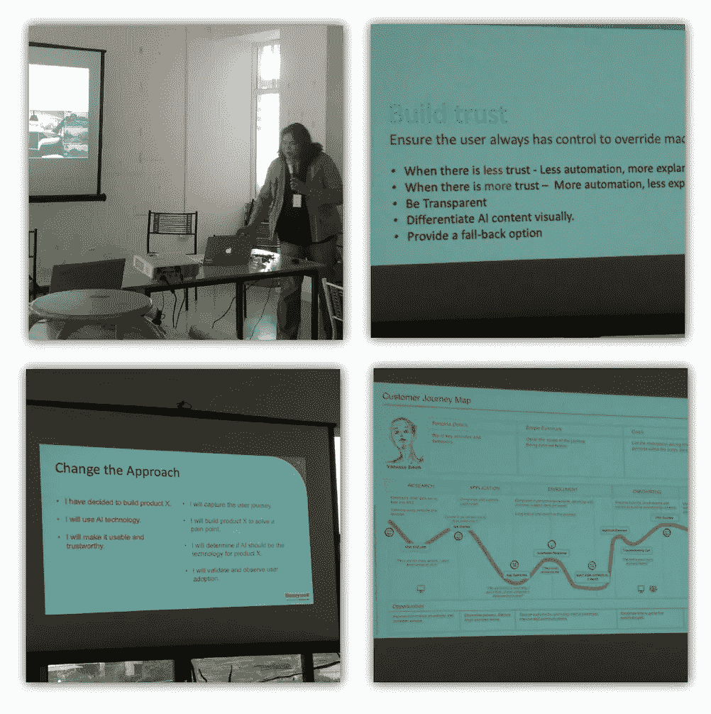
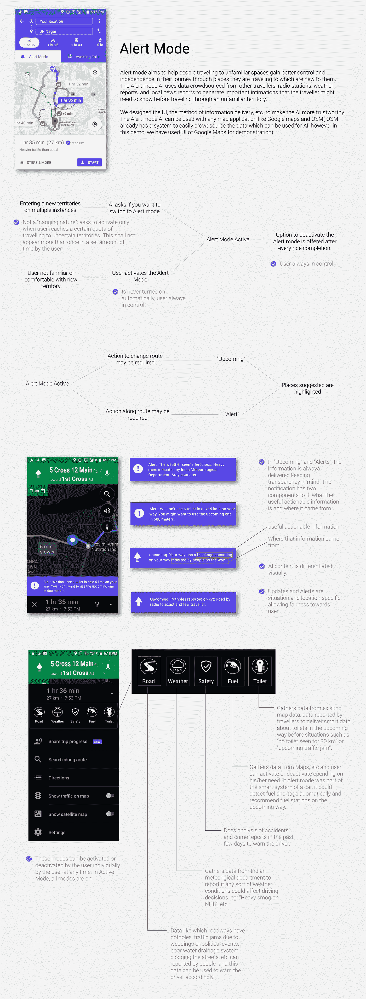
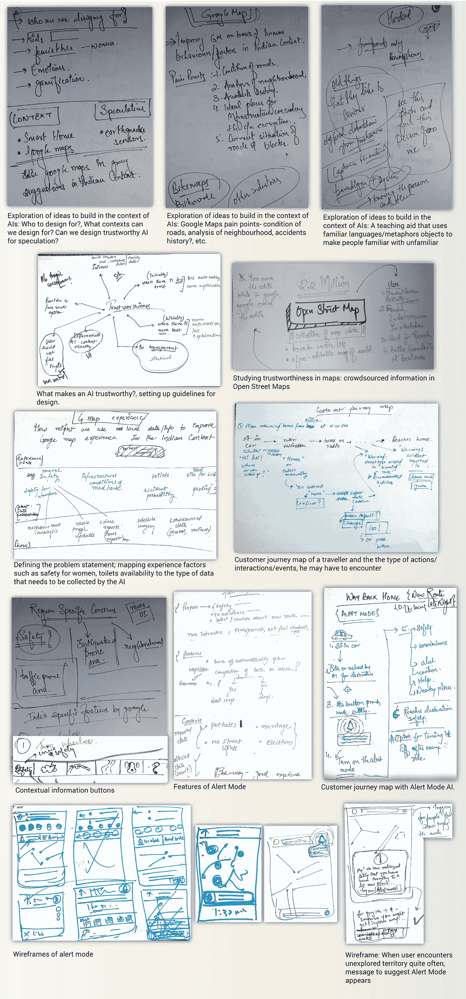

# 人工智能的地图和可信的 UX:我的第一次黑客马拉松！

> 原文：<https://medium.datadriveninvestor.com/designing-trustworthy-ai-for-navigation-my-first-hackathon-e2384509a6da?source=collection_archive---------30----------------------->

*我参加了****【MLH】【大联盟黑客】*** [***当地黑客日***](https://localhackday.mlh.io/lhd-2018/events/625-srishti-institute-acm-sigchi-student-chapter) *(与****Github****和* ***微软*** *)于 2018 年 12 月 1 日在* [*Srishti 艺术、设计与技术学院黑客马拉松的主题是“设计值得信赖的人工智能”。这篇文章是关于我第一次参加黑客马拉松的经历(我也是组织团队的一员)。*](http://srishti.ac.in/)

活动持续时间从上午 9 点到晚上 9 点。当天的前半段时间，我们与行业专家进行了互动交流(霍尼韦尔的[苏曼·巴斯卡拉](https://www.linkedin.com/in/sumanbhaskara/)和 IBM 的[斯里拉姆·苏亚纳拉亚南](https://www.linkedin.com/in/sriramsury/))。

Interactive sessions with industry experts(Suman Bhaskara**(*left)*** from Honeywell and Sriram Suryanarayanan **(righ*t)*** from IBM).

苏曼的演讲让我们更深入地思考，不仅是关于人工智能的 UX，还有人工智能如何被用来建设一个更好的 UX。她给出了她过去在 Honeywell Aerospace 工作的例子和其他来自行业的例子，展示了如何设计值得信赖的人工智能的各种方法，此外还为我们提供了如何使用系统级思维使我们的过程更有价值的提示。她总结说，人工智能的下一步是增强人类的能力，让我们的生活变得更好。Sriram 的演讲同样令人愉快，他鼓励我们不要构建 MVP(最小可行产品)，而是 MDEs(最小令人愉快的产品)。除了与我们分享 IBM 的企业设计思想，他还就设计一个值得信赖的人工智能的意义给出了非常有用的提示，如用户应该负责的权力边界，而不是构建唠叨的产品等等。

黑客马拉松的挑战是 ***设计一个值得信赖的人工智能干预*** 。虽然我们可能没有达成一个最终产品来击败“[恐怖谷](https://www.wikiwand.com/en/Uncanny_valley)”,其中不完美的人类相似性证明了人类的厌恶，我们可能没有通过所有的行业准则，如[微软的人工智能的 6 项可信原则](https://www.microsoft.com/en-us/ai/our-approach-to-ai)，但我们确实学到了很多东西。

为了了解什么是可信的人工智能，我在黑客马拉松之前做了一些研究，并写了 [*设计可信人工智能的初学者指南*](https://medium.com/srishti-institute-acm-sigchi-student-chapter/a-beginners-guide-to-designing-trustworthy-ai-19efc45ec2ad) 来记录相同的内容。老实说，我必须承认，我和我的队友在活动开始之前并没有真正考虑过我们到底要在活动中做什么。这是一个额外的挑战！所以基本上，我们在大约 5 个小时内完成了整个设计过程。这让我们更加体会到在有限的时间内规划和构建设计过程的价值。

# 我们的项目

***团队:***[***Sweta Bisht***](https://medium.com/@swetab.sht)***和***[***Shreya Chopra***](https://medium.com/@shreyachopra711)

***项目名称:面向人工智能的地图和值得信赖的 UX****——在印度背景下为陌生道路上的导航带来值得信赖的体验*

***产品名称*** *:预警模式*

城市化、混凝土和结构催生了一个庞大的道路网络——无处不在，数量和需求与日俱增。像 OSM 和谷歌地图这样的地图应用使导航变得更加容易，我们不时会看到新的改进。然而，我们认为，在人工智能的帮助下，更具情境性的方法可以使驾驶体验更好，而且更安全，更准确地到达所述位置。

考虑到腐败等因素，我们以印度的情况为例，如坑洼、因婚姻和政治家到来而造成的道路堵塞或道路排水系统设计不佳，遗憾的是，这将需要很长时间才能消除，并设计了一个名为**“警报模式”**的功能，可以作为这些地图应用的一部分。该产品对于探索或遇到陌生地方的旅行者特别有用。

## 产品原型:

## 流程文件:

Process documentation