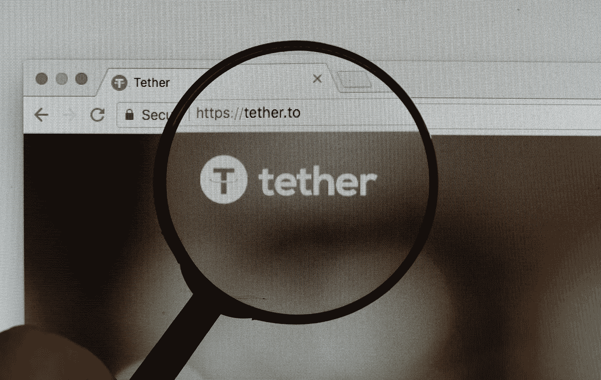
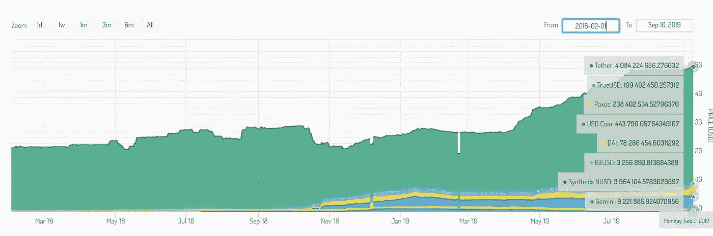
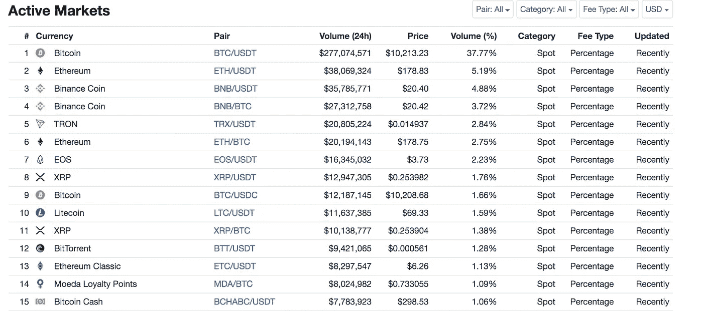

# 尽管存在争议和竞争对手，Tether 仍然是稳定的王者。币安能改变这一点吗？

> 原文：<https://medium.datadriveninvestor.com/despite-controversy-and-competitors-tether-remains-the-stablecoin-king-can-binance-change-that-4cb82c20e75a?source=collection_archive---------7----------------------->

Source: [Marco Verch](https://www.flickr.com/photos/149561324@N03/)

上周，币安宣布加入稳定的货币供应国行列，推出美元支持的币安美元(BUSD)。世界上最大的加密货币交易所寻求为投资者提供完全支持的稳定货币，并接受监管监督，[已获得纽约金融服务部(NYDFS)](https://www.coindesk.com/binance-to-list-its-new-dollar-backed-busd-stablecoin-next-week) 的批准。我们可以预期，一旦 BUSD 被激活并建立起来，它可能会被用在交易对中，而泰瑟(USDT)目前就在交易对中。这将产生有影响的后果，但首先应该解决这一问题的背景。

在过去的两年里，菲亚特支持的 stablecoins 已经发布了几十款，并且有十几款正在积极交易。对于其中的一些，币安(大型零售加密货币交易所)的竞争对手只是选择提供自己的稳定货币，而不是使用自 2015 年以来与交易所 Bitfinex 挂钩的 Tether。圈和比特币基地的 USDC，双子座的 GUSD 就是这种情况。

 [## ieo 在币安 Launchpad |数据驱动型投资者网站上获得 3 次代币销售，势头强劲

### 在无情的熊市之前，ICOs 在 2017-18 年期间为加密/区块链项目创造了第一次融资热潮…

www.datadriveninvestor.com](https://www.datadriveninvestor.com/2019/03/26/ieos-gather-momentum-with-3-token-sell-outs-on-binance-launchpad/) 

对其他人来说，独立公司和加密货币平台通过宣传其法定支持的透明性质(与 Tether 的[经常被批评缺乏专业的第三方审计](https://www.forbes.com/sites/francescoppola/2019/03/14/tethers-u-s-dollar-peg-is-no-longer-credible/#6b6c179e451b)有关)，或者通过使用创新的分散化解决方案来维持与法定货币的挂钩，如戴的情况最明显。

Stablecoin dominance from February 2018 to present. [Source: stablecoinindex.com](https://stablecoinindex.com/marketcap).

然而，总的来说，挑战泰特尔霸权的人并没有成功。系绳受益于其先发优势，并被大多数交易所采用，以至于购买稳定的硬币以确保收益或防止损失的常见说法是“系绳”行为。与 USDT 超过 40 亿美元市值最接近的竞争对手是 USDC，只有其十分之一的规模。就交易量而言，对比甚至更为明显——作为任何一天交易量最大的货币，泰铢通常不是第一就是第二(与 BTC 一起)。通过提前起跑，stablecoin 在活跃用户方面可能会有不可逾越的领先优势。

币安可能是最有可能挑战这一地位的国家。该交易所在保护客户方面有着良好的声誉(见:基金是 safu memes，交易所在 5 月份被黑客攻击了 4000 万美元),并且正在以类似于 Gemini 和 Paxos 的方式公开努力纳入监管机构。然而，更重要的是，大量的实际交易量通过币安进行，该交易所拥有一个庞大的资产目录，[，其中列出了 1300 多种货币(尽管许多货币交易不活跃)](https://info.binance.com/en/all)。如下图所示，Tether 是币安交易对中最常用的资产，交易量很大。

Top 15 Binance trading pairs by volume (September 12th). Source: [coinmarketcap](https://coinmarketcap.com/exchanges/binance/)

因此，币安将寻求推广其新的稳定币作为 Tether 的替代品是合理的，或者通过在比 USDT 更多的贸易对中展示稳定币，或者甚至在当前活跃的贸易对中替换 Tether。在试图只列出真实、非操纵交易量平台的交易所追踪器中，[币安在加密/加密交易所领域占据主导地位](https://openmarketcap.com/exchanges/ranking/volume)，因此它处于一个很好的位置来取代 Tether 成为网站上的稳定币选择，从而对稳定币经济产生更广泛的影响。

币安的 stablecoin 是与 Paxos 合作创建的，Pax OS 已经提供了一种美元支持的 stablecoin，并且[目前正在推出一种黄金支持的加密货币(也获得了纽约 DFS 的批准)](https://www.coindesk.com/paxos-launches-gold-backed-cryptocurrency)。币安美元将于下周与 BTC 和 BNB 成对在币安交易所推出。

Viewnodes 编辑拜伦·墨菲的文章。所有观点均为作者个人观点。Viewnodes 通过赌注、委托和主节点提供被动令牌收入机会。你可以在 viewnodes.com 找到我们。