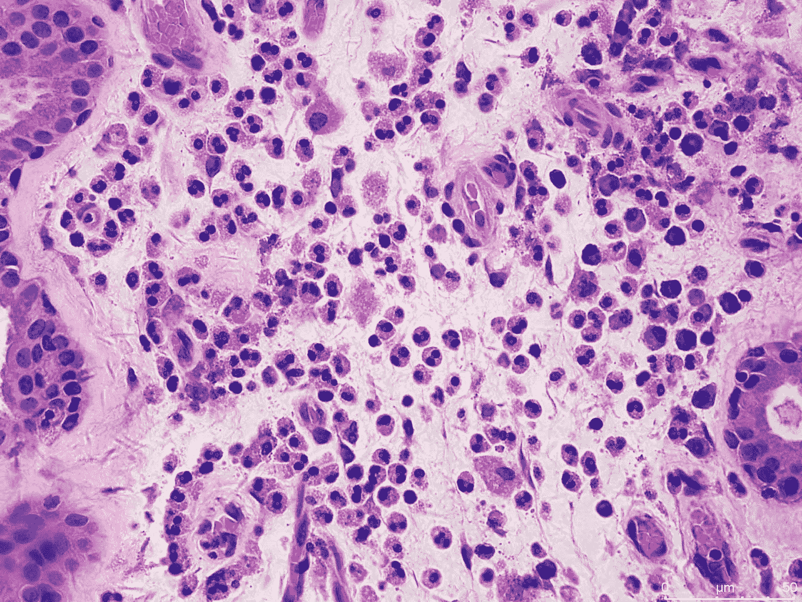
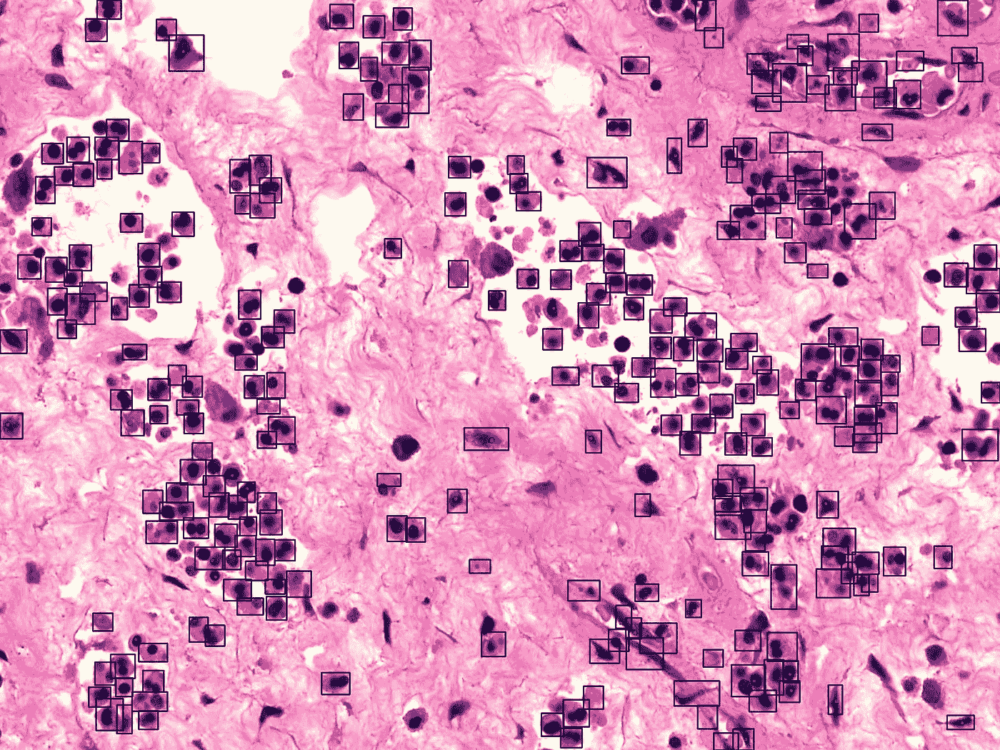
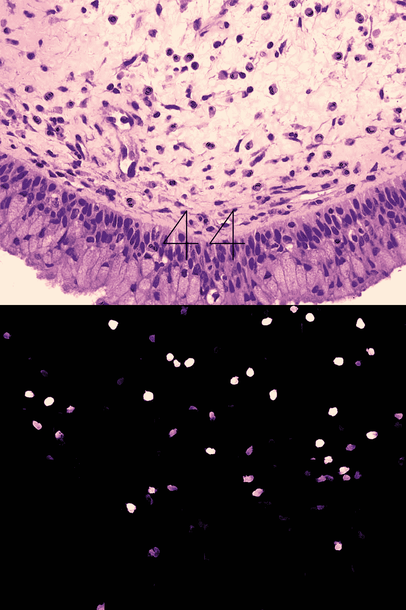
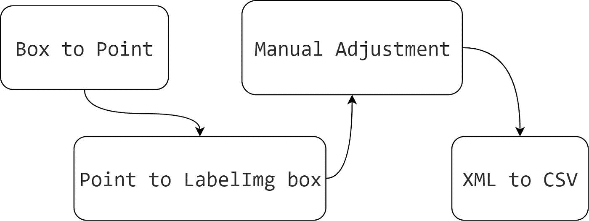
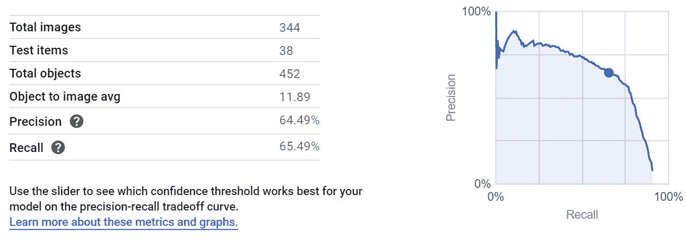
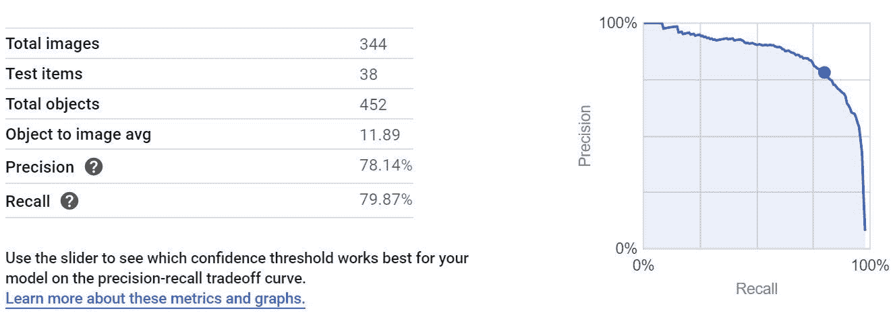
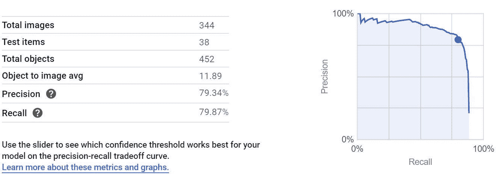
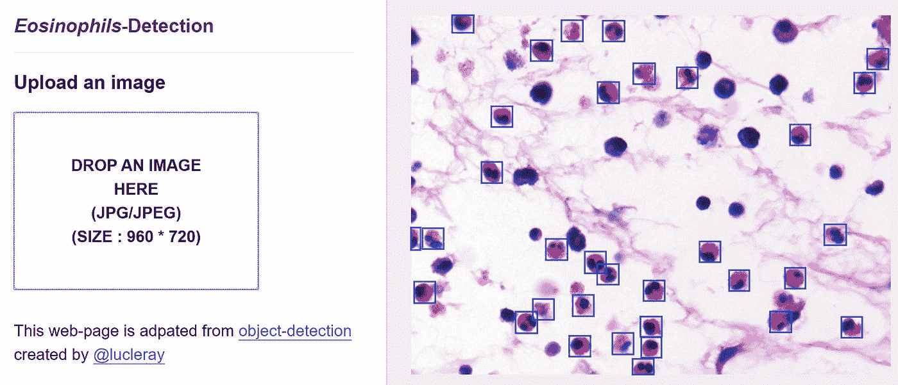
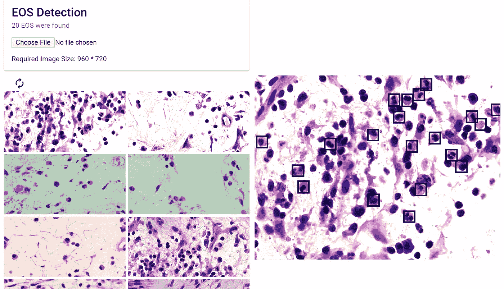
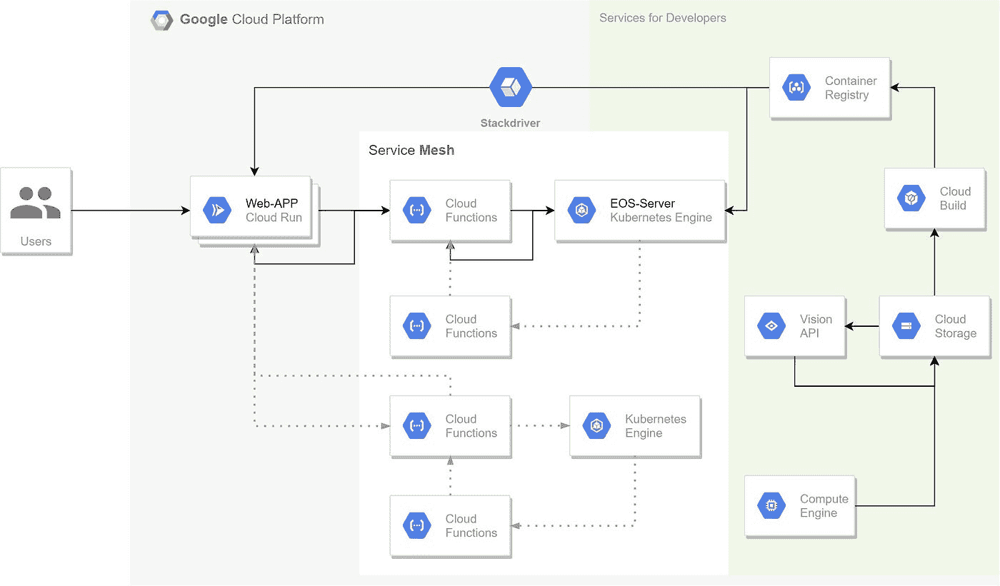

# GCP 嗜酸性粒细胞检测

> 原文：<https://medium.datadriveninvestor.com/detect-eosinophils-on-gcp-5a437ad61a8d?source=collection_archive---------2----------------------->

本文是一个端到端的演示，展示如何在 Google 云平台上创建和部署计算机视觉模型。

Google Drive 上提供测试幻灯片，点击 [**此处**](https://drive.google.com/file/d/13lXgS3ZmFv3YtQhQAzb5Iw8Mf2DOkmI5/view) 。

在这个过程中，我将重用我以前的一个项目中的数据。首先，我将处理数据以匹配 Google Cloud 的 AutoML Vision 的请求格式。然后，我将利用 AutoML 视觉在这些经过处理的数据上训练一个“对象检测”模型。接下来，我将在谷歌云的 Kubernetes 引擎(GKE)上部署这个模型。最后，我将使用 Cloud Run 实现一个无状态网站来展示这个模型是如何工作的。

现在，请让我引导你走过这段旅程。这个故事有五个部分。它们是:

这是一个漫长炎热的夏夜。我坐在我的桌面前，试图调整我的*小*分水岭算法的参数，以便它可以很好地分离背景和我感兴趣的区域——*。*

*该项目由中山大学数据与计算机科学系和中山纪念医院共同发起。它旨在建立一个框架，可以用来训练一个模型来“学习”他们想要检测的任何类型的细胞。他们选择的第一种类型是*嗜酸性粒细胞*，这在临床测试中至关重要，也比较容易识别。*

* [## 创建折衷书架的程序员指南|数据驱动的投资者

### 每个开发者都应该有一个书架。他的内阁中可能的文本集合是无数的，但不是每一个集合…

www.datadriveninvestor.com](https://www.datadriveninvestor.com/2019/03/25/a-programmers-guide-to-creating-an-eclectic-bookshelf/) 

我和另外两个医学生被邀请去试水。这个模型应该用于个人电脑，尤其是笔记本电脑。我们从三张带标签的幻灯片开始。在每张载玻片上，大约有 100-200 个嗜酸性粒细胞。下图就是一个例子。

我读过一些关于物体检测的文章。我尝试在 Tensorflow 中使用 [Google 的对象检测 API](https://github.com/tensorflow/models/tree/master/research/object_detection) 来训练一个模型，这个模型是基于 faster-RCNN 架构的。它失败了，当然，仅仅是因为图像的数量太少。还有，我意识到更快的型号-RCNN 是一百多 MB，这是相当大的，在普通笔记本电脑上运行是不可能快的。幸运的是，Kaggel 已经在 T2 举办了一场关于细胞检测的比赛。从那次比赛中，我认识了一个模型架构， [U-net](https://en.wikipedia.org/wiki/U-Net) 。该竞赛中的许多团队成功地使用了这种架构。此外，它速度快，相对较小，功能强大，符合我们用户的需求。尽管如此，三张幻灯片还是不够。

所以第一件事是获得足够的数据。我们决定训练一个易于创建的 CNN 模型来帮助我们标记幻灯片。首先，我们使用分水岭和其他算法从载玻片上分割出细胞样的“瓦片”。然后，我们使用这些小图像来训练一个分类 CNN 模型。该模型运行良好。并且我们使用它来分类由分水岭算法在未标记的载玻片上分割的细胞样对象。这是给幻灯片加标签的一种间接方式。在那之后，我们只是纠正了错误的标签，我们可以超级快速地获得带标签的幻灯片，因为 CNN 模型已经标记了许多细胞。结果就像下面这样。带方框的是模型制作的标签，我们用绿点来“纠正”它的标签。

在我们有了 40 到 50 张幻灯片后，我们开始使用 U-net 作为我们下一个模型的架构。然而，U-net 只能生成一个可能性热图，并且需要热图来训练。请记住，用户问的是细胞计数，而不是可能性热图。因此，U-net 模型不能单独工作，我们必须设计一个管道，让其他组件补充 U-net 模型。

为了训练，首先，我们将每张大幻灯片裁剪成小图片。然后，我们使用分水岭算法将我们以前的标签“转换”为“掩码”，以便可以训练 U-net。当谈到预测时，我们首先将用于预测的幻灯片裁剪成小图像；接下来，我们使用 U-net 生成遮罩；然后，遮罩被组合成一个大遮罩，以匹配原始幻灯片。最后，利用分水岭等算法检测细胞区域。因为 U-net 的预测遮罩会将感兴趣的区域显示为白色，将背景显示为黑色，所以分水岭很容易将像元从这种纯背景中分离出来。最终结果和它的遮罩如下所示。然后，我们做到了！

更多详情，请看 [**这里**](https://github.com/Moo-YewTsing/EOS-Detection) 。

我不得不承认这是一个复杂的过程。分水岭算法的调整过程是一个不可预测的反复试验，或者说是一种折磨。由于细胞的大小和重叠方式不同，很难手动调整参数以适应所有情况。而且，因为分水岭算法说了算，所以模型的性能上限受到这种老式算法的限制。结果，即使 U-net 运行良好，但整体精度为 0.81，召回率仅为 0.72。

从 Coursera，我知道谷歌云的[自动视觉令人印象深刻。所以我决定试一试。它需要的数据是图像和标签框的坐标。然而，我有的是带点和方框的幻灯片。我尝试再次使用分水岭算法将这些标签“转换”为坐标。结果很糟糕，其中有很多重复的坐标。为 U-net 模型准备数据不是问题，因为它所喂养的数据都是掩膜，不会因为重复而受到影响。但是，对于这种端到端的预测模型，它会直接从坏数据中学习。因此，它会认为重复的标签是不同的，并导致严重的过量计数。](https://cloud.google.com/vision/automl/docs/)

我发现细胞的大小是相似的。此外，AutoML 视觉模型的损失函数基于[图](https://medium.com/@jonathan_hui/map-mean-average-precision-for-object-detection-45c121a31173)。这意味着标签框的位置和覆盖范围不需要非常精确。于是，我开始给所有贴了标签的幻灯片重新贴标签，不管是用黄点还是黑框，用绿点。然后，我创建了以每个点为中间点的盒子标签，线的长度呈随机正态分布变化。我将这些盒子标签数据保存到 XML 文件中，以便我可以使用 [LabelImg](https://github.com/tzutalin/labelImg) 进行检查和手动调整。总是“垃圾进垃圾出”，必须检查数据质量。最后，我将这些 XML 文件转换为 CSV 文件，并将线的绝对长度(像素)转换为相对长度，这是 AutoML Vision 所要求的。

视觉模型的架构是秘密的。尽管如此，从模型的响应有效载荷中，我看到 AutoML Vision 会将图像调整为 512 * 512 像素。此外，根据经验，要获得更小的模型，每个输入实例都应该更小。因此，我将每张 1920 * 1440 的幻灯片分成四张 960 * 720 的图片，并相应地更改了它们的标签值。

在本地，我随机地将整个数据分成训练数据集和测试数据集。然后，将训练数据集及其标签 CSV 上传到云存储中。我测量了云服务模型(大模型)和边缘模型(小模型)在不同设置下的不同性能。云提供的模型不能从云中提取，所以我不能调整阈值，也不能将模型移动到其他地方。对比如下。

“移动高精度”类型中的边缘模型表现良好，并且可以在其他地方使用。利用谷歌人工智能的专业知识是一个很好的选择。于是，我把它提取出来，准备部署。

这里至少有三种解决方案。

首先，单击“部署模型”，GCP 将处理与部署相关的所有流程和网络调整。它也是自动扩展的。然而，一个缺点是它会帮助 T1 过滤结果，然后，只有可能性大于 0.5 的结果会从服务器返回。此外，价格为每个节点每小时 0.0791 美元，高于以下选项。

第二，可以自己部署模型，使用 docker 让模型服务容器化是选项。基于 [TensorFlow Serving](https://github.com/tensorflow/serving) 编写 Dockerfile 并使用 [Google Build](https://cloud.google.com/cloud-build/) 将模型包装到容器中并部署到您想要的地方，这是超级快的。例如，您可以选择 [Kubernetes](https://cloud.google.com/kubernetes-engine/) ，“一个用于部署容器化应用程序的可管理的生产就绪环境”。只有一种小型机器类型的“集群”对于这种型号来说就足够了，它有 0.5 个 CPU 和 1.7GB RAM，每小时只需 0.0257 美元。

最后，为了实现最大程度的 DIY，你可以选择使用虚拟机，做你想做的事情。但是，在这种情况下，您必须设置网络转发规则、安全规则等..

在这里，我选择了第二种解决方案，并使用了 Kubernetes 的力量。我更改了 TensorFlow 的 Dockerfile 的一部分，使 REST 端口遵循容器的环境变量。然后，我使用 Cloud Build 创建了一个基于 Dockerfile 的容器映像。Cloud Build 自动将映像提交到容器注册表，“一个管理 Docker 映像的单一位置”，它位于云存储上，以便其他服务可以立即使用此映像。

按照上面的描述创建集群后，我使用 Kubernetes 将容器部署到集群中。在集群上，Kubernetes 创建两个 pod 用于运行模型，一个 pod 作为负载平衡器并导出 REST API。然后，这种用于检测嗜酸性粒细胞的微型服务器被部署，可以在任何地方使用。

为了展示这个模型的性能，我制作了一个改编自一个 Github [库](https://github.com/lucleray/object-detection/)的 Web 应用程序。Next.js 构建它。我不是 Web 应用程序开发人员，所以这个应用程序几乎只是一个复制-粘贴-更改的产品。在幕后，它读取本地图像，将其转换为 JSON 中的 Base64 字符串，并调用 Kubernetes 提供的模型的 REST API。此外，因为这个 Web 应用程序可以容器化，所以我也可以使用 Kubernetes。在这里，为了省钱，我使用了[云运行](https://cloud.google.com/run/)，“一个管理计算平台，可以自动扩展你的无状态容器。”

听起来像库伯内特斯。没错，就是抽象 Kubernetes，你需要做的就是提供一个容器。我认为我的模型也可以这样服务。由于 Cloud Run 将按请求向您收费，因此它可以在云上闲置，成本为 0。然而，Kubernetes 是按集群的运行时间收费的，所以它就像一个统一的价格。如果你想一天 24 小时听电话，你必须支付 24 小时的费用，不管你的服务器处理多少请求。对于旨在展示原型可以工作的项目，即只有 1 或 2 个请求存在，云运行会便宜得多，可能会停留在免费层。

再次演示[T5 这里](https://practice-118b5.firebaseapp.com/) (以前是在云上运行，使用 Google Kubernetes 引擎作为后端。为了降低成本，我将模型改编为 TensorflowJs，这将花费你在浏览器中加载模型的时间。所以第一次测试时，你可能会觉得网页没有反应。请耐心等待；).Google Drive 上提供了测试幻灯片，点击 [**此处**](https://drive.google.com/file/d/13lXgS3ZmFv3YtQhQAzb5Iw8Mf2DOkmI5/view) 。

The old one adapted from “@lucleray”

The new one created by self and using TensorflowJs

想看看这个网络应用的 Github 库吗？ [**这里**](https://github.com/Moo-YewTsing/eos-next-web) 你走吧！

这是整个建筑。

您可以注意到，在 Web-APP 和模型服务器之间有一个称为“[云功能](https://cloud.google.com/functions/)”的层。它是“一个无服务器的计算平台，使得在云中运行和扩展代码变得容易”。我用它来隐藏我的模型服务器 API，并作为未来添加的接口。

因为每个部分都是一个微服务器，所以您可以更改一个服务器或添加更多服务器，而不会影响其他部分。例如，如果我想添加身份验证，我可以使用云函数在 Web-APP 和云函数之间添加一个层，或者在云函数中添加一些代码。同时，使用另一个容器作为数据库来提供认证信息。然后就完事了。

想知道这种“微服务器”架构的优势是什么？看看来自 *Google Cloud Next 2019* 的一个 [**演示**](https://www.youtube.com/watch?v=IblDMVwSSk4&list=PL5eBvoNpSYNuLeXA6empS77NarQXkumLi&index=63&t=6s) 。

谢谢！* 

**最初发表于*[https://github.com/Moo-YewTsing/eos_cloud](https://github.com/Moo-YewTsing/eos_cloud)*。**