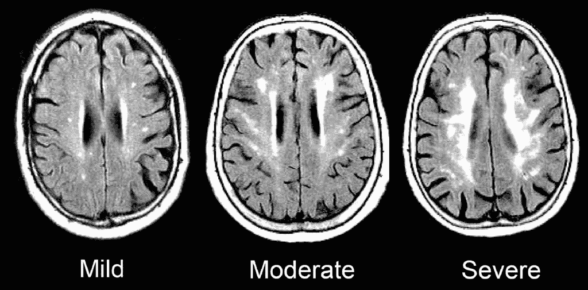
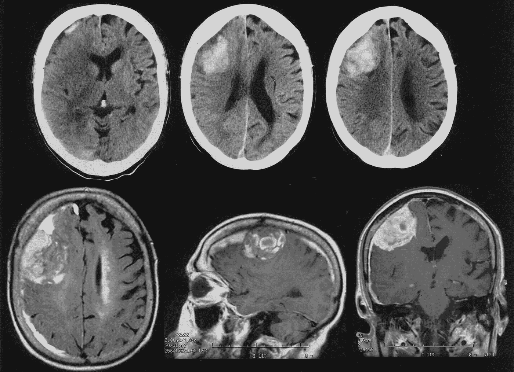
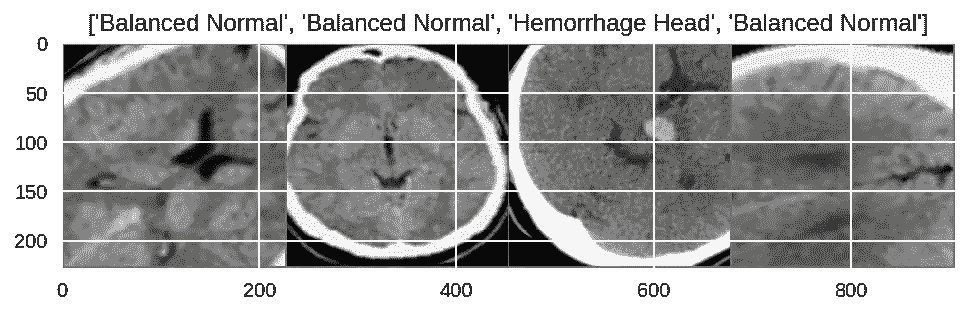
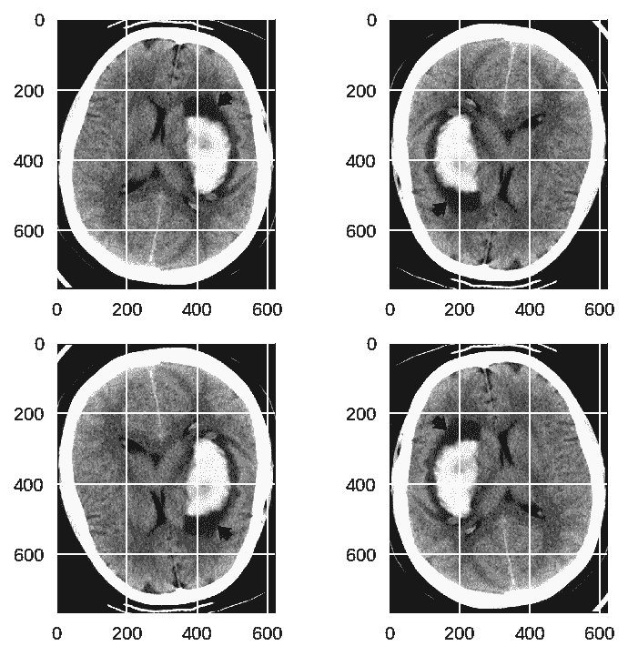
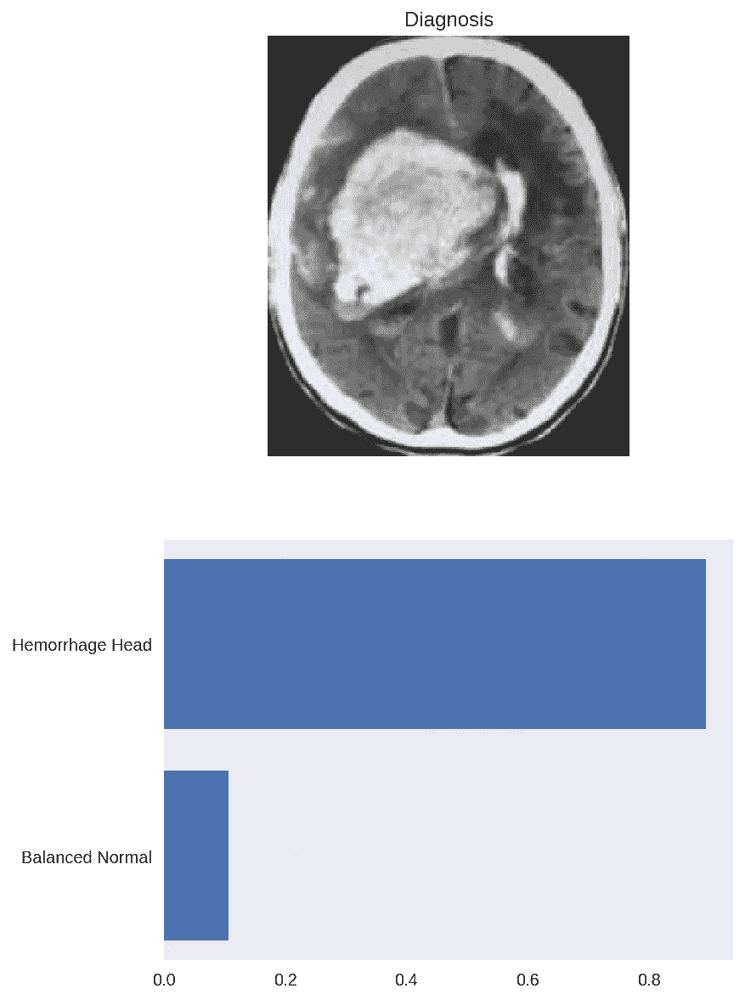
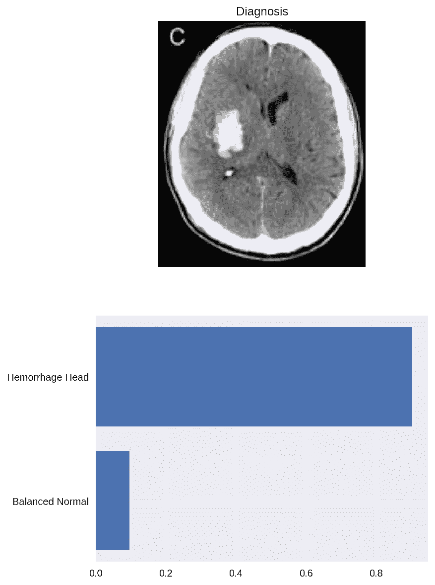
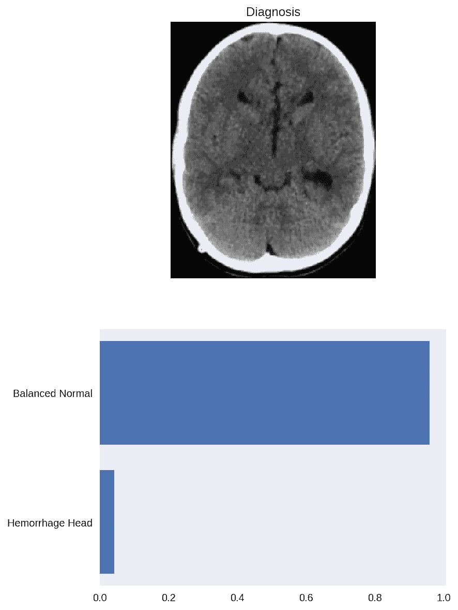
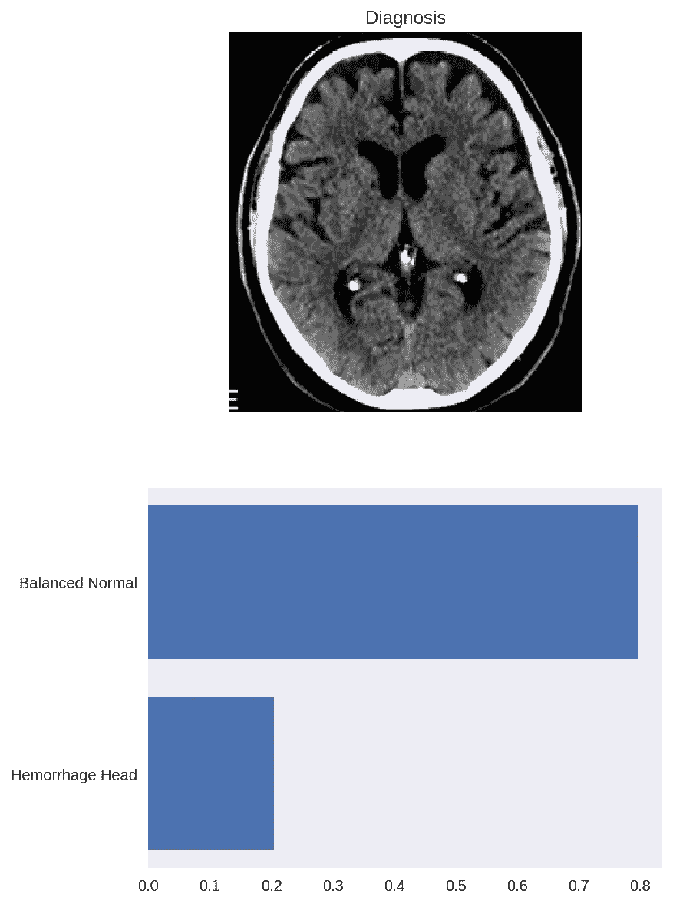

# 在计算机断层摄影(CT)成像中检测脑出血

> 原文：<https://medium.datadriveninvestor.com/detecting-brain-hemorrhage-in-computed-tomography-ct-imaging-d1276cb6bdb7?source=collection_archive---------4----------------------->

# 当生物学遇到大数据

应用于医疗保健的深度学习有助于节省医学成像、诊断和开始治疗之间的时间。由于这些计算机视觉模型，自动化诊断可以在几秒钟内完成。

虽然深度学习可以帮助检测医学成像中的异常，但找到有价值的数据集并预处理这些数据可能会很痛苦。

在这篇文章中，我将通过深度学习、大脑的计算机断层扫描(CT)和我最喜欢的深度学习框架 PyTorch 来诊断脑出血。

# 什么是大脑的计算机断层扫描？

> 大脑 CT 是一种非侵入性的诊断成像程序，它使用特殊的 X 射线测量来产生大脑的水平或轴向图像(通常称为切片)。与头部的标准 X 射线相比，脑 CT 扫描可以提供关于脑组织和脑结构的更详细的信息，从而提供更多与脑的损伤和/或疾病相关的数据。

# 没有相当于医学成像的 ImageNet

卷积神经网络是用 Densenet、Inception 和 Alexnet 等非医学图像预先训练的，但一旦我们选择最后一个完全连接的层进行训练(转移学习)，这是实现我们特定目标的一种优秀技术。

# 数据集

数据集包含 100 个正常的头部 CT 切片和 100 个有出血的切片(数据集在 Kaggle 上，我分享了这篇帖子下面的链接)。我不会对不同种类的出血进行分类，我的目标是预测 ct 切片显示的是出血还是正常的头部。

为了达到良好的准确性，我尝试使用不同的数据增强。

# 数据扩充

**什么是数据增强？**

我们知道，我们拥有的数据越多，我们的模型就会表现得越好。但是从野外收集大量数据可能是一项艰巨的任务。

数据扩充是深度学习中使用的一种技术，它增加了当前数据的大小，而不是从野外收集数据。

一些数据扩充的例子是:添加噪声或应用数据转换，如水平和垂直翻转和颜色失真。

以下是在当前数据集中使用垂直和水平翻转的示例:

通过扩充数据集，您可以用少量数据获得出色的结果。我做了一些关于专门用于医学成像的数据增强的研究，当你给图像添加对比度时，模型会达到更好的准确性。可以使用各种增强策略来获得更好的结果。

# 训练模型

我再次选择了预先训练好的型号 Resnet-152。正如在过去的项目中所做的那样，我只训练了 Resnet-152 的最后一个全连接层。

数据集的 80%用于训练，20%用于测试。

实验表明，Resnet-152 在数据集上运行 10 个历元，准确率达到 95%！

# 结果

# 结论

深度学习技术可以帮助医生检测 CTs 大脑中的脑出血，但分类结果在很大程度上取决于训练过程中使用的数据量。因此，如前所述，尝试不同的数据扩充以获得更高的准确性，或者您可能需要使用一个好的 web scraper 来收集您的数据(这是一件好事，我一直在使用 ScrapeStorm 为其他项目收集数据)。

想想你如何应用需要使用医学成像的深度学习…在大脑扫描中检测抑郁症怎么样？还是检测酒精中毒？许多像这样的疾病会改变大脑结构，你可以使用计算机视觉模型和医学成像来获得有趣的结果。

我会准备好笔记本在我的 GitHub 上分享！

# 资源

 [## 医学成像分类任务的差分数据扩充技术

### 数据扩充是训练判别卷积神经网络(CNN)的重要组成部分。各种各样的…

www.ncbi.nlm.nih.gov](https://www.ncbi.nlm.nih.gov/pmc/articles/PMC5977656/) 

# 数据集可在此处找到:

[https://www . ka ggle . com/MRD folk/head-CT-出血-检测-with-keras/data？UTM _ medium = email&UTM _ source = intercom&UTM _ campaign = data notes-2019](https://www.kaggle.com/mrdvolk/head-ct-hemorrhage-detection-with-keras/data?utm_medium=email&utm_source=intercom&utm_campaign=datanotes-2019)

 [## viritaromero -概述

### 软件工程师，对数据科学和机器学习充满热情。-维里塔罗梅罗

github.com](https://github.com/viritaromero)