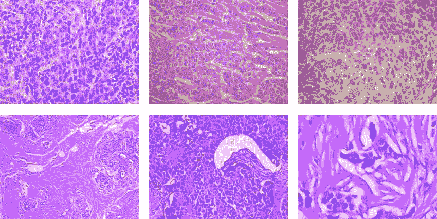
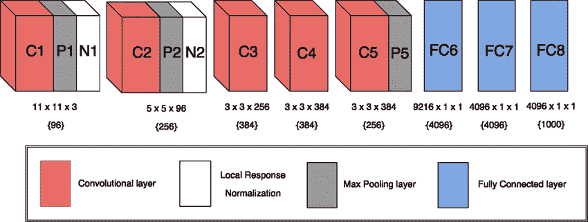
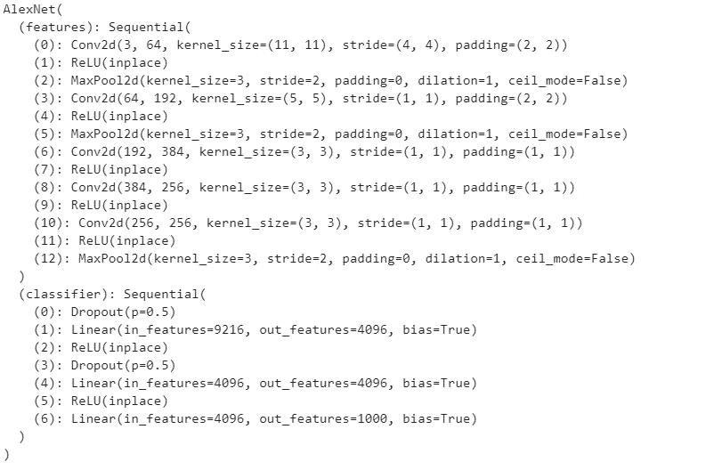
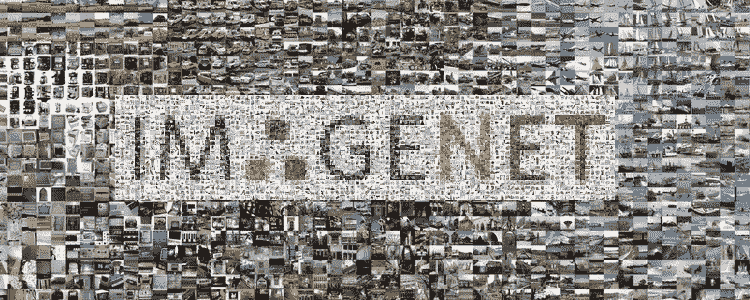

# 使用深度学习检测组织病理学图像中的乳腺癌

> 原文：<https://medium.datadriveninvestor.com/detecting-breast-cancer-in-histopathological-images-using-deep-learning-a66552aef98?source=collection_archive---------0----------------------->

乳腺癌是女性死亡率第二高的疾病，仅次于肺癌。根据临床统计，每 8 名妇女中就有 1 名在其一生中被诊断患有乳腺癌。然而，定期的临床检查和自我测试有助于早期发现，从而大大增加存活的机会。

侵入性检测技术导致肿瘤破裂，加速癌症向邻近区域扩散。因此，出现了对更稳健、快速、准确和有效的非侵入式癌症检测系统的需求(Selvathi，D & Aarthy Poornila，A. (2018)。使用医学图像分析进行乳腺癌检测的深度学习技术)。

早期发现可以给患者更多的治疗选择。为了检测癌症的迹象，来自活检的乳腺组织被染色以增强细胞核和细胞质用于显微镜检查。然后，病理学家评估任何异常结构变异的程度，以确定是否有肿瘤。

建筑变形(AD)是乳房组织的一种非常微妙的收缩，可能代表癌症的最早迹象。由于它很可能不会被放射科医生注意到，多年来已经提出了几种方法，但没有一种方法使用深度学习技术。

我相信，人工智能将成为医疗保健领域的一股变革力量，很快，当研究人员获得更多医学成像数据集时，计算机视觉模型将能够获得更高的准确性。

我将开发一个计算机视觉模型来检测组织病理学图像中的乳腺癌。本项目将检测两类:**良性和恶性。**

# 乳腺癌组织病理学数据库

乳腺癌组织病理学图像分类(BreakHis)由使用不同放大因子(40X、100X、200X 和 400X)从 82 名患者收集的 9，109 幅乳腺肿瘤组织的显微图像组成。迄今为止，它包含 2，480 个良性样本和 5，429 个恶性样本(700X460 像素，3 通道 RGB，每个通道 8 位深度，PNG 格式)。该数据库是与巴西巴拉那的 P&D 实验室——病理解剖学和细胞病理学合作建立的。

数据集 BreaKHis 分为两个主要组:良性肿瘤和恶性肿瘤。组织学上的良性是指不符合任何恶性标准的病变，例如，明显的细胞异型性、有丝分裂、基底膜破裂、转移等。正常情况下，良性肿瘤相对来说是“无辜的”，生长缓慢，并保持局部化。恶性肿瘤是癌症同义词:病变可以侵入和破坏邻近结构(局部侵入)并扩散到远处部位(转移)导致死亡。

该数据集目前包含四种组织学上不同类型的良性乳腺肿瘤:腺病(A)、纤维腺瘤(F)、叶状肿瘤(PT)和管状腺瘤(TA)；以及四种恶性肿瘤(乳腺癌):癌(DC)、小叶癌(LC)、粘液癌(MC)和乳头状癌(PC)。

我只使用了这个项目 2 类:良性和恶性。我们将确定是否存在癌症。

我将完整的数据集分别分为 70%的训练数据集和 30%的验证数据集。

# 挑选一个预先训练好的模型:Alexnet

我决定使用预先训练好的 Alexnet 来提取分类特征。

**AlexNet** 是一个卷积神经网络，它根据 ImageNet 数据库中超过一百万张图像进行训练。该网络有 8 层深，可以将图像分为 1000 种对象类别，如键盘、鼠标、铅笔和许多动物。因此，该网络已经学习了各种图像的丰富特征表示。网络的图像输入大小为 227 x 227。

Alexnet architecture

Alexnet detailed architecture

糟糕的是，这个模型是在不同种类的图像中训练的，而不是肿瘤图像，所以我们不能将整个模型用于这个项目。

Imagenet Dataset

由于我仍然需要预先训练的模型来从图像中提取特征，我们将删除最后一个完全连接的层，因此网络将被用作*特征提取器*，为每张图像提供 1000 维特征向量。我将为此使用的技术叫做:**迁移学习**。

**迁移学习**是在不同的问题上重用预先训练好的模型。在这种情况下，将组织病理学图像分类为良性或恶性。这是一种在深度学习中非常流行的技术，它允许你用小数据集训练深度神经网络。此外，很难找到好的标记数据来训练这样复杂的模型，因此，我建议在图像分类项目中使用预训练的模型。

我决定使用数据增强来获得更多的图像，并应用随机旋转，随机调整作物大小和随机水平翻转。我用的优化器是 SGD，学习率 0.001。运行了一些纪元后。我得到了 80%的准确率。

虽然模型精度不够好，不能用于实际情况，但我们仍然可以得到更好的结果，微调预训练的模型，可以改变一些超参数或网络结构。

我可能会尝试不同的预训练模型或使用更多的纪元来获得更高的准确性！

计算机视觉已经成为我最喜欢的深度学习领域，它对医疗保健的方式产生了巨大的影响。当我们生活在一个人们可以使用带摄像头的智能手机等普通设备自行进行医疗诊断的世界时，不要感到惊讶。医疗应用将成为现实，可穿戴设备将取代许多去医生办公室的服务。

不要误会我的意思，我绝对不认为这项技术是替代品，而是一个额外的帮助。我将引用计算机视觉专家*费-李非*在演讲中的话:**“我们如何教计算机理解图片”**，在一次正式的 ted 会议上发表，这也是我的想法:

*“首先，我们教他们看。然后，他们帮助我们看得更清楚。第一次，人类的眼睛将不再是唯一思考和探索我们世界的眼睛。我们将不仅利用机器的智能，我们还将以我们甚至无法想象的方式与它们合作”。*

如果你想检查完整的代码。查看我的 GitHub 个人资料:

 [## 病毒/乳腺癌检测

### 人工智能应用程序在组织病理学数据库中检测乳腺癌-病毒/乳腺癌-检测

github.com](https://github.com/viritaromero/Breast-Cancer-Detection) 

如果你想看费和谈话的完整视频: