# 使用定制视觉和 PyTorch 在胸部 X 射线中检测肺炎

> 原文：<https://medium.datadriveninvestor.com/detecting-pneumonia-in-chest-x-rays-with-custom-vision-and-pytorch-e270e071e982?source=collection_archive---------2----------------------->

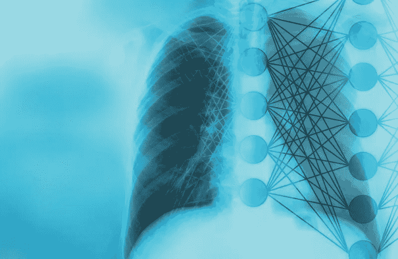

# 医疗保健中的人工智能

医疗保健中的 AI 将永远是我开始在人工智能领域挖掘的原因。范围是巨大的，你对世界的影响也是巨大的。做出一个解决医学问题的样机，永远是一个值得骄傲的理由。

令人难以置信的是，人工智能正在改善医疗保健领域，特别是在医疗诊断方面。人工智能将改善医生诊断和治疗疾病的方式。这不是一场比赛，而是一个联手的机会！

这一次，在胸部 x 光图像中检测肺炎，是一次很棒的经历。我将向您展示两种在胸部 X 射线中检测肺炎的方法:使用微软 Azure 的自定义视觉服务和带有 PyTorch 的卷积神经网络(这是我的最爱！).

# 什么是肺炎？

根据美国肺脏协会的说法，肺炎是一种感染，会使肺部的气囊(肺泡)发炎。气囊可能会充满液体或脓，导致咳嗽、发烧、发冷和呼吸困难等症状。

# 肺炎症状

最常见的肺炎症状是:

*   咳嗽，可能产生绿色、黄色甚至带血的粘液
*   发烧，出汗和颤抖发冷
*   气促
*   快速浅呼吸
*   当你深呼吸或咳嗽时，剧烈或刺痛的胸痛会加剧
*   食欲不振、精神不振和疲劳
*   恶心和呕吐，特别是在小孩身上
*   困惑，尤其是在老年人中

# 使用 Microsoft Azure 的自定义视觉检测肺炎

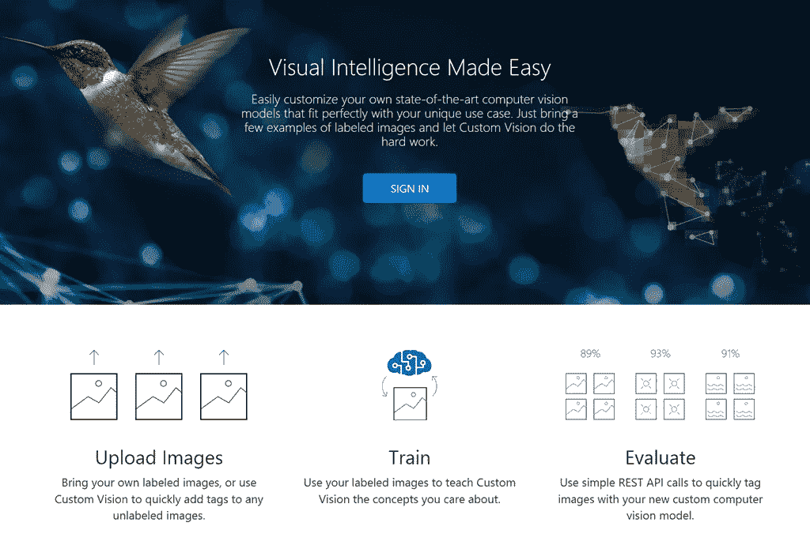

先说自定义视觉。您可以轻松地使用这项服务为您的个人项目创建最先进的计算机视觉模型。过程非常直观。你只需要上传一些带标签的图片，定制的视觉为你做脏活。您还可以导出您的训练模型，以便在设备上运行或作为 Docker 容器运行。

我将创建一个计算机视觉模型来检测胸部 X 射线中的肺炎，并向您展示在定制视觉服务中要遵循的步骤

# 步骤 1-创建定制远景项目

首先要做的是在 Custom Vision 中创建一个项目:

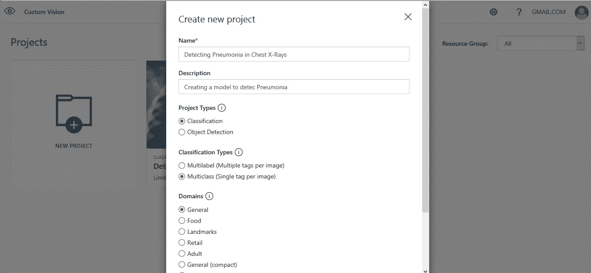

# 步骤 2-上传图像

## 胸部 x 光图像(肺炎)

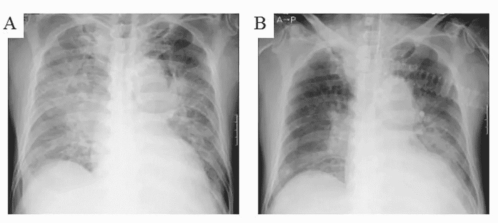

我将使用**胸部 x 光图像(肺炎)数据集。**你可以在 Kaggle 找到这个数据集。它被组织成 3 个文件夹(训练、测试和 val 集)，并包含每个图像类别(肺炎/正常)的子文件夹。有 5，863 个 x 光图像(JPEG)和 2 个类别(肺炎/正常)。

胸部 X 线图像选自广州市妇女儿童医疗中心 1 至 5 岁的儿童患者回顾性队列。所有的胸部 x 光成像都是作为患者常规临床护理的一部分进行的。

我会上传图片，并把它们分为两类:**正常和肺炎。**

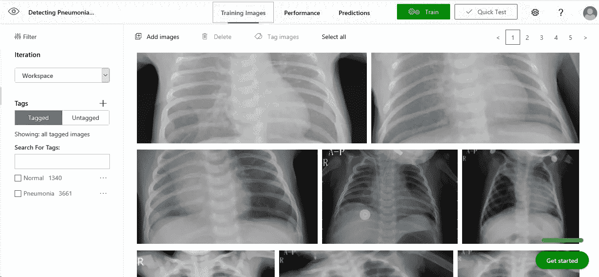

总共有 1，340 张图像被标记为正常，3，661 张图像被标记为肺炎。

# 第三步-训练

我将使用我标记的图像来教授 Custom Vision 我希望它学习的功能:

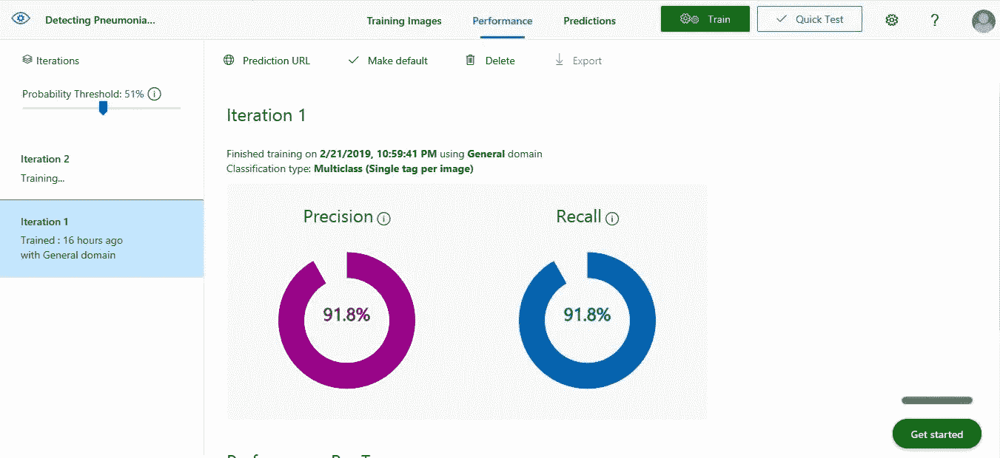

正如你在图中看到的，我得到了 91.8%的准确率和 91.8%的召回率。

# 第四步-测试

我将测试模型上传从未在培训过程中使用的图像:

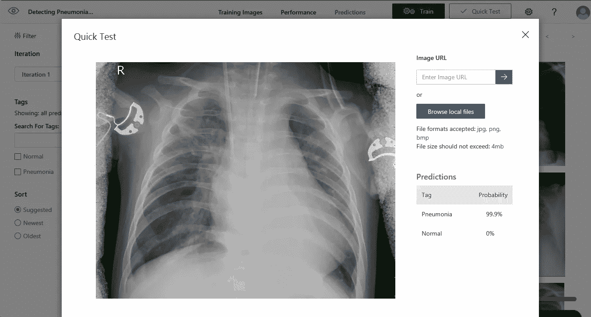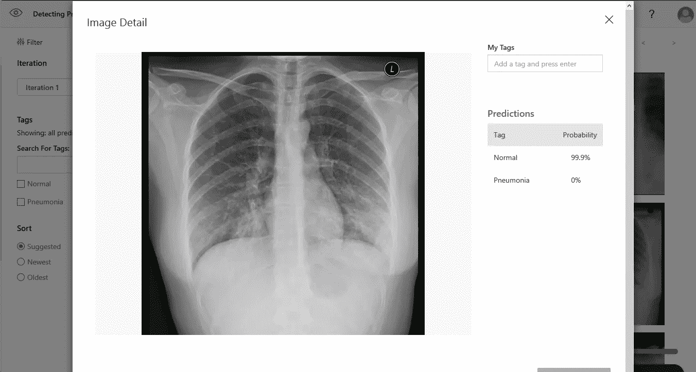

你能看出区别吗？

我不是医生，但我在这里看到的模式是肺炎的胸部 x 光片有混浊。根据我所做的研究，乳浊是由气道内的液体或固体物质引起的，**导致**肺部相对衰减的差异。

所有预测都保存在预测选项卡中:

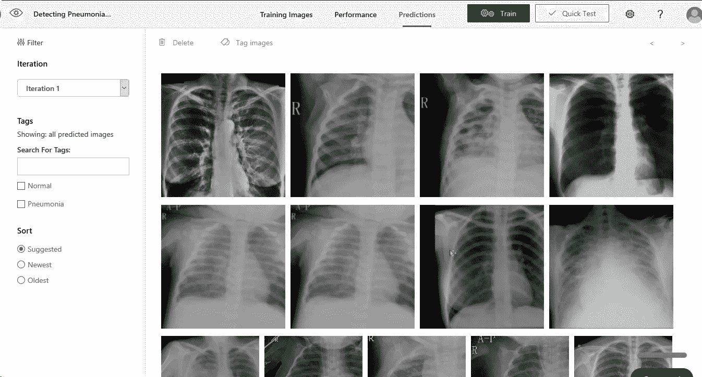

# 第五步-评估

我们可以使用简单的 REST API 调用，通过新的自定义计算机视觉模型对图像进行分类，或者我们可以将模型导出到设备，以运行实时图像理解。

# 使用 Pytorch 检测肺炎

受这篇论文的启发:**“CheXNet:放射科医生级别的肺炎检测胸部 X 射线与深度学习”，**在这篇论文中，一组研究人员开发了一种算法，可以在超过执业放射科医生的水平上从胸部 X 射线中检测肺炎。chex net 是一种 121 层的卷积神经网络，在 ChestX-ray14 上训练，这是最大的公开可用的，包含 14 种疾病的 100，000 多张正面 X 射线图像，我在 PyTorch 中创建了一个模型来实现类似的目标。

由于数据集中包含的图像是灰度图像，必须转换为 RGB。

**预训练模型:** Resnet-152

**历元数:** 10

**优化:**亚当

**学习率:** 0.0001

**损失函数:**负对数似然损失(NLLLoss())

# 结果

我可以得到 88%的准确率。请看下面的预测:

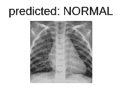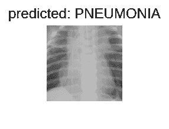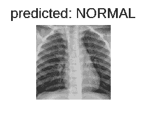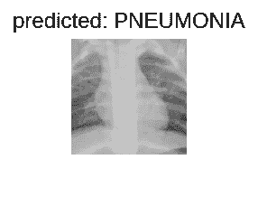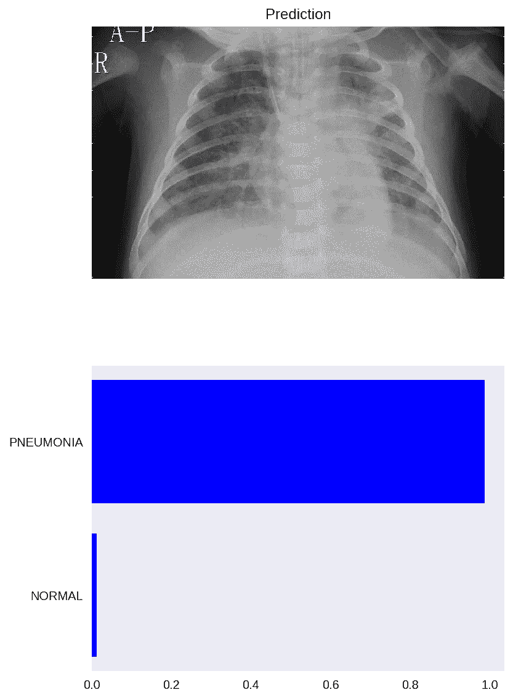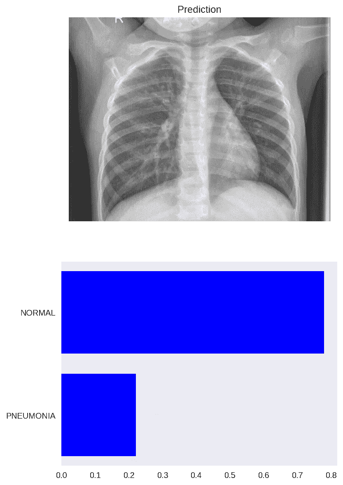

# 结论

*   我相信我们达到 100%准确率的那一天一定会到来
*   有许多医疗保健问题可以用人工智能来解决
*   出于研究目的，我们需要更多可用的医学影像数据集
*   我计划在 Azure 上部署这个模型。仍在学习如何部署 Android 应用程序。

# 参考

**数据集**

**数据:**[https://data.mendeley.com/datasets/rscbjbr9sj/2](https://data.mendeley.com/datasets/rscbjbr9sj/2)

**许可:** [抄送通过 4.0](https://creativecommons.org/licenses/by/4.0/)

**引用:**[http://www . cell . com/cell/full text/s 0092-8674(18)30154-5](http://www.cell.com/cell/fulltext/S0092-8674(18)30154-5)

**CheXNet:利用深度学习对胸部 x 光片进行放射科医生级别的肺炎检测**

在 GitHub 上关注我:

 [## viritaromero -概述

### 软件工程师，对数据科学和机器学习充满热情。-维里塔罗梅罗

github.com](https://github.com/viritaromero)