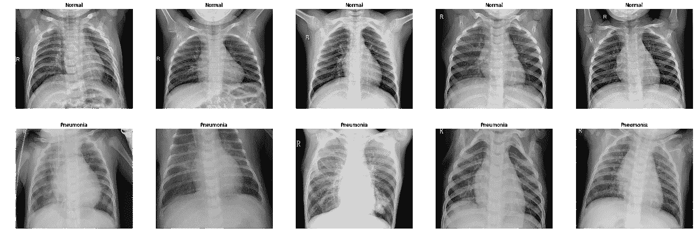
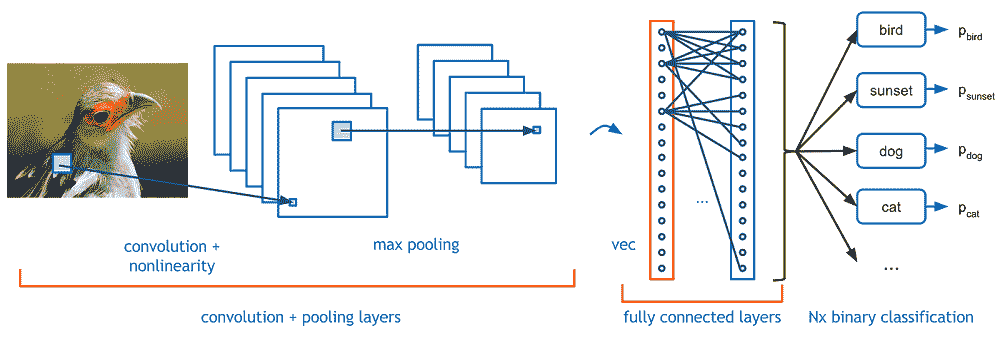
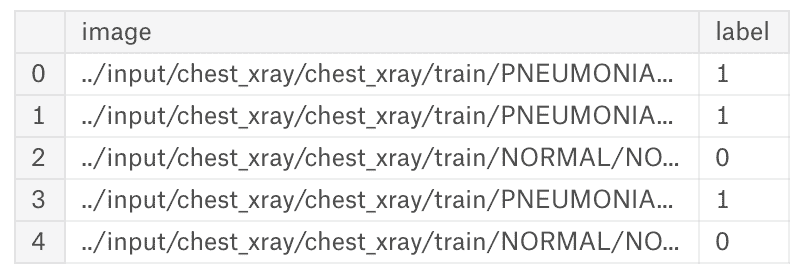
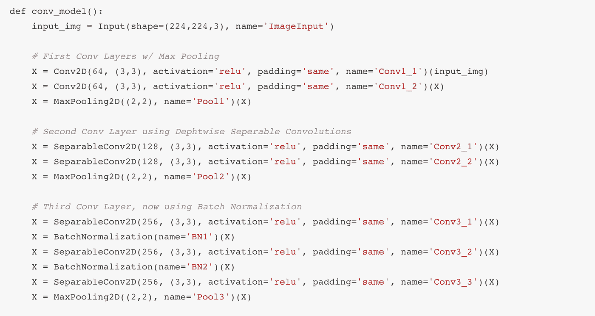
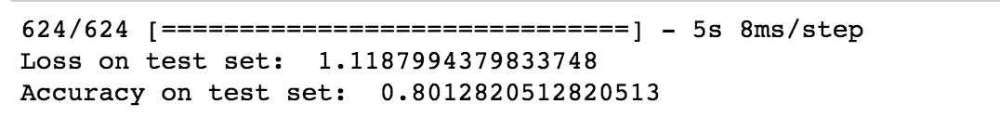

# 用深度学习检测肺炎:卷积神经网络的软介绍

> 原文：<https://medium.datadriveninvestor.com/detecting-pneumonia-with-deep-learning-a-soft-introduction-to-convolutional-neural-networks-b3c6b6c23a88?source=collection_archive---------1----------------------->

随着神经网络的高度普及，研究人员和工程师已经能够为计算机视觉找到许多改变世界的应用。深度学习现在允许我们轻松地创建人工智能，以帮助自动化分析技术，这在以前被认为是计算机不可能的。

今天，我想向你们展示一个例子。通过获取肺炎胸部 x 射线扫描的标记数据集，我能够在一个下午内快速构建和原型化人工智能模型，以 80%的准确率识别肺炎病例。

肺炎是一种常见疾病，我们已经与之斗争了几千年。虽然今天我们在西方采取了许多预防措施，但在整个非洲和小亚细亚仍有大量病例发生。自动化这种检测任务将大大提高放射科医生的效率，只需要他们的专业知识来分析可疑的边缘病例。

那么…从哪里开始呢？

# 计算机视觉和卷积神经网络

如果我们想从 x 射线扫描中自动检测肺炎，我们需要了解我们的问题域。任何属于分析图像并向软件提供对图像的高级理解的事情都被归类为计算机视觉问题。这看起来很简单，对吗？现在我们需要做的就是定义一个实用有效的算法来处理计算机视觉。

对我们来说幸运的是，深度学习并不(完全)是巫毒魔法的黑盒子。我们可以使用已经成为计算机视觉中神经网络模型的主食；**卷积神经网络**，或简称 CNN(不要和有线新闻网搞混了)。CNN 与定义深度学习的传统前馈网络非常相似，只是它们实现了一种称为卷积的数学运算:

用简单的英语来说，这是什么意思呢？对于不太懂技术的人来说，关于 CNN，要记住的最重要的事情是:

> 与传统的神经网络相比，它们在处理图像数据方面效率更高。

这是因为当我们建立人工智能网络时，它将给定图像的所有像素值作为输入，每个像素值都是 3 个不同的 RGB(红绿蓝)值，然后对每个像素值进行线性操作和激活。将所有这些操作乘以网络中的节点数和层数，哎呀！突然之间，你有数以亿计的业务！仅仅处理一张图像就需要大量的计算能力和时间。

通过应用卷积，我们可以更有效地进行这些运算。我们使用“过滤器”来分析图像的各个部分，而不是逐个像素地进行分析。这是一个如此强大的模型，它可以将简单网络中的操作数量从数亿减少到不到一千万。这就是工程生产力！

现在我们知道了计算机视觉将使用什么，让我们开始吧！

# 组织我们的 x 光扫描

感谢 [Kaggle](https://www.kaggle.com/) ，我能够获得肺炎 x 光扫描的数据集，它已经被标记了！有一个文件夹名为“正常扫描”和另一个“肺炎扫描”。因此，对于真正聪明的人来说，这是有意义的，但我们如何让一台愚蠢的计算机来区分这两者呢？

在 x 射线扫描中检测肺炎是一个简单的二元分类问题:要么我们检测到肺炎，要么我们不检测。我给你二进制的好提示了吗？

为了帮助我们的计算机小朋友，我们可以用数字来表示！ **0** 表示我们没有检测到肺炎，而 **1** 表示我们检测到了。通过一点 Python 的魔力，我为每张图片创建了一个数据帧，根据其文件夹用 0 或 1 标记，然后将它们混在一起。这里有 5 个随机的例子，这样你就能有个概念了:

我很幸运有这个特殊的数据集。在大多数真实世界的场景中，您收集的数据永远不会完全符合您的需求。这个也不完美；“肺炎”图像大约是“正常”图像的 3 倍，这导致了数据的不平衡。此外，并不是所有的图像都以同样的方式格式化，所以我不得不将它们统一制作成 224x224 像素的 RGB 图像。

数据科学家和机器学习工程师不得不一直与数据搏斗，这值得完全分开讨论。

# 构建我们的模型

深度学习之所以如此有效，是因为它可以在多个维度上有效地分析数据。一般来说，你在网络中构建的层次越多，你可以处理的复杂人工智能问题就越多(因此有了“深度学习”这个术语)。

那么，一个人如何实际构建他们的神经网络呢？这完全取决于你，你的喜好，以及你可能有的任何限制，比如时间和金钱。不过，这里有一个通用的规则:*当你刚刚入门的时候，尽快创建一个原型。*你越早开始处理模型并理解数据的复杂性，你就有越多的时间来调整和改进你的模型。

一个很棒的原型库/工具是 [Keras](https://keras.io/) 。Keras 是一个高级 API，可以让你快速构建神经网络，而不必太担心它们的复杂性。Keras 在后端使用了一个更复杂的框架，你可以自己定义。对于这个肺炎检测示例，我使用 Keras 和一个 [Tensorflow](https://www.tensorflow.org/) 后端。这是我的模型的一大部分，所以你有一个想法:

即使您没有技术知识，您也可以看到所有的线路看起来非常相似，每一条都定义了我的网络中的不同层！这就是为什么机器学习工程师认为 Keras 非常有用，因为你可以马上开始训练模型。

**训练和测试网络**

现在有趣的部分，让我们训练网络！

从根本上说，我们正在自动化的过程非常简单。我们的网络从一些随机的**权重**和零**偏差**开始。这些“参数”将影响我们网络对一幅图像是否是肺炎扫描图像的决策。一旦我们的输入数据通过我们的网络使用这些权重和偏差进行处理，它将使用一个激活函数，该函数将返回 0(未检测到肺炎)或 1(检测到肺炎)。

我们将所做的预测与地面实况进行比较，并且我们使用损失函数来计算所述预测的误差幅度。随着损失函数的求解，我们使用一个真正神奇的过程，称为[反向传播](https://en.wikipedia.org/wiki/Backpropagation)(它实际上只是微积分中的链式法则，但这是一回事)，它调整我们网络的权重和偏差，以做出更好的预测！

因此，我们为所有的训练数据循环这个过程。当我们开始训练时，我们的损失函数会有一个非常高的值，但随着时间的推移，我们应该会看到它变得越来越小:

在培训结束时，我们应该(希望)有一个像样的模型来测试。那么测试是如何工作的呢？

通过测试，我们为训练好的模型提供输入数据(因此需要更多的 x 射线),但我们不会在最后告诉它数据的标签。我们只是进行预测，而没有调整参数，以真正看到我们的神经网络是有效的。完成测试后，我们可以比较我们做出正确预测的扫描次数的准确性:

**80%的准确率！对于我们的第一次运行来说还不错！**

# 一些总结性的想法

虽然这个肺炎探测器不是一个将改变世界的完全充实的独角兽产品，但你可以看到它是多么容易上手。建立一个卷积神经网络是快速和无痛的，在一个像样的 GPU 上进行训练不到一个小时！这就是今天深度学习令人兴奋的地方:伟大用例的准入门槛已经大大降低。

不管你是否有技术背景，我希望这能让你对现代计算机视觉技术的工作原理有所了解。如果你有兴趣做一些深度学习，不要害怕接触！我非常乐意让你朝着正确的方向开始。