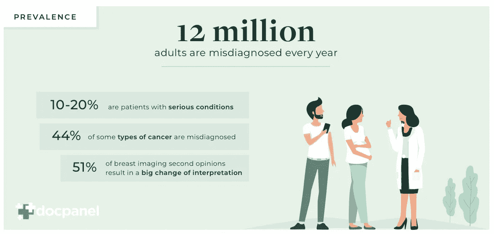
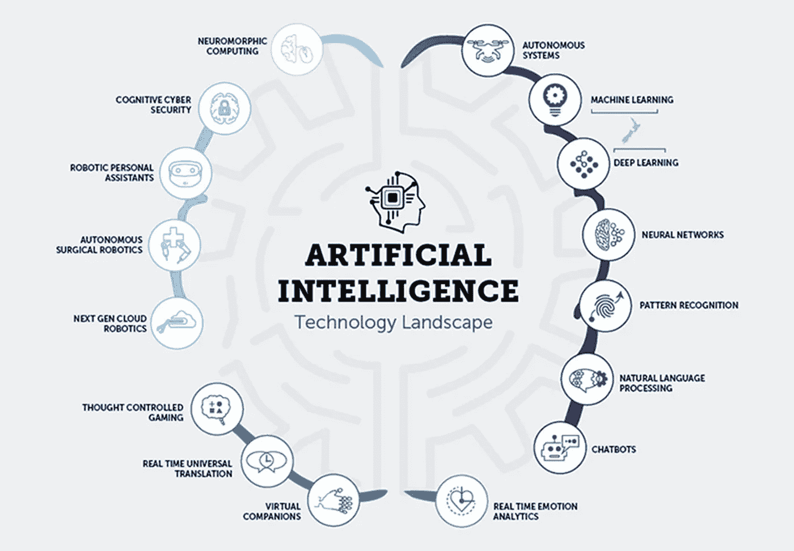
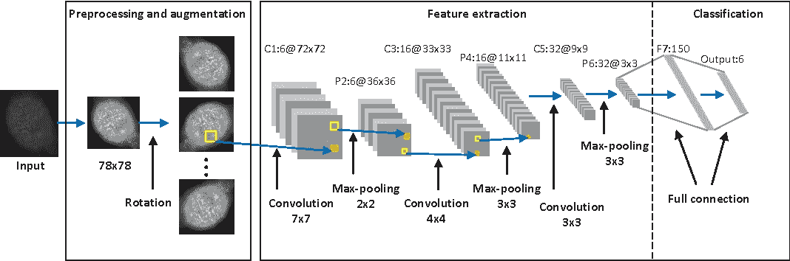

# 侦探深度学习

> 原文：<https://medium.datadriveninvestor.com/detective-deep-learning-66d41253880c?source=collection_archive---------12----------------------->

我第一次听说癌症是在我三岁的时候。我的祖父被诊断出患有癌症，但我真的不在乎，因为我太小了，不明白。

 [## 深度学习用 7 个步骤解释-更新|数据驱动的投资者

### 在深度学习的帮助下，自动驾驶汽车、Alexa、医学成像-小工具正在我们周围变得超级智能…

www.datadriveninvestor.com](https://www.datadriveninvestor.com/2019/01/23/deep-learning-explained-in-7-steps/) 

几年后，当我上二年级的时候，我认识的一个人被诊断出患有白血病。他死时只有 10 岁。他被误诊了大约 3 个月，直到他们发现他患有白血病，但医生无法帮助他，因为为时已晚…

在美国，大约有 1200 万人是*误诊的受害者。统计数据证明，医院里大约有 4 万到 8 万人因为诊断错误而死亡。*

> *每九分钟，就有一个人在美国医院死于错误的医疗诊断。*

***但是如果误诊已经成为过去的事情怎么办***

*随着人工智能的使用，误诊可以成为过去。嗯，不是直接的人工智能，而是它的一个组成部分，深度学习(深度神经网络)。*

***人工智能***

*人工智能是计算机科学的一个分支，它是人脑的计算机版本。它创造了*智能机器，可以执行需要人类智能但没有任何人类干预的任务*。*

**

***深度学习***

*深度学习是人工智能的一个子领域，当机器执行通常需要人类智能的任务时*。一些例子是虚拟助手，翻译等。深度学习也有很多领域，为了解决误诊，需要深度神经网络。**

**

***深度神经网络***

*深度神经网络*使用复杂的数学方法才有一个结果*。它有一个输入图层和一个输出图层，在图层中有一个隐藏图层，该图层执行复杂的数学算法来生成输出图层。*

***现在怎么办？🤷‍♀️***

*为了通过神经网络，肿瘤的扫描可以用作输入数据 x 和作为函数的斑块分类器，其中函数的输出满足 f(x ), c 是斑块的类别数。这些类别是:良性钙化、恶性钙化、良性肿块、恶性肿块和来自乳房 x 光照片的每个斑块的背景。f 作为卷积神经网络(隐藏层)。*

**

*结果可以告诉我们这是什么疾病，是良性还是恶性肿瘤。*

*这种方式可以改善误诊，如果没有解决到指数级。医生也会犯错，他们也是人。但是，当他们犯错误时，他们会危及他人的生命。深度学习可以检测疾病，特别是在癌症方面，他们可以检测肿瘤是良性还是恶性。*

***伦理道德🚩***

*许多人认为，使用技术来检测肿瘤是个问题，因为他们认为机器是错误的，因为它们可以被破坏。虽然我不反对他们，但我也认为这些机器是真正解决癌症领域误诊的解决方案。医生可以有效地预测事情，但是这些机器可以更有效地做*。医生通过机器输入图像来再次检查他们的预测应该没有问题。许多人因为误诊而死亡，而误诊的原因是医生的过错。**

*🔑外卖食品*

1.  *误诊是健康领域最大的问题之一，可以通过深度神经网络来解决。*
2.  *深度神经网络可以进行检测，并跟踪所有步骤，如执行数学函数，以确定这是一种疾病还是肿瘤是良性的。*

*感谢您阅读本文！希望你学到了新的东西。*

*👋我是 Swatee，我是一个 15 岁的知识社会的创新者，我想用新兴技术解决世界上最大的问题。如果你想联系我——*

*联系信息…*

* [## Swatee Barman -创新者-知识社会(TKS) | LinkedIn

### 查看世界上最大的职业社区 LinkedIn 上 Swatee Barman 的个人资料。Swatee 有一个工作列在他们的…

www.linkedin.com](https://www.linkedin.com/in/swatee-barman-028a27192/)  [## Swatee 酒保-中等

### 阅读写作从 Swatee 酒保在媒体上。每天，斯瓦特·巴曼和成千上万的其他声音阅读，写作，和…

medium.com](https://medium.com/@swateebarman) 

Gmail-swateebarman@gmail.com*