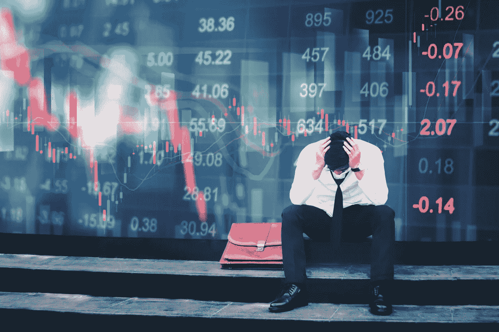

# 现在就制定一个财务计划，为下一次衰退做准备

> 原文：<https://medium.datadriveninvestor.com/developing-a-financial-plan-now-for-when-the-next-downturn-comes-b89acae4d6ea?source=collection_archive---------10----------------------->

Contrary to popular opinion, you can in fact plan for another financial recession or even crisis.

*这篇文章最初在 PrepperDepot.org**出现在我的博客上*

*几年前，我在我的年度准备会议上谈到了另一次金融衰退的风险。我想，当我说:*

*伙计们，这是关于下一次金融危机的好消息。我们现在知道一个人看起来和感觉起来像什么。我们知道它是可以存活的。最重要的是，我们现在知道如何保护我们的财务。*

*也许他们对我在讨论下一次金融危机时使用“好消息”一词感到吃惊。虽然毫无疑问，十年前我们经历的危机改变了无数人的生活和我们国家的历史，但在那个时代，我们也对自己、我们的经济和我们的政府有了很多了解。*

*快进十年。在过去的一年里，我在 YouTube 上做了几个视频,都是关于在市场下一次大衰退时需要有一个财务计划。今天，我想让我们来讨论一下这意味着什么，以及如何去做。*

*我说的不是我们不时看到的普通品种市场调整，这是健康市场所必需的。我说的是，如果我们看到类似 2008 年金融危机的情况，我们需要一个计划。*

*我不会花太多时间来证明这样的金融危机可能会再次发生。当我与人们谈论另一场危机的前景时，我发现人们要么相信它会再次发生，要么不相信。我的工作不是让你相信它会发生。我的目标是给那些相信它可以的人提供思路。*

****通货膨胀还是通货紧缩？****

*我们首先要问自己的一个问题是，我们是否预期会发生通货膨胀或通货紧缩。简而言之，下一场危机会是价格快速上涨——比我们的工资上涨还快吗？还是会出现另一个 2008 年，不仅是股票，汽车、住房和消费品的价格都大幅下跌？*

*那些担心另一场危机风险的人经常对此展开热烈讨论。我认为没有必要争论这个问题；我宁愿为任何一种情况做好准备，而不是担心猜测哪种危机会降临到我们头上。*

*《福布斯》撰稿人 Clem Chambers 列举了五项在通胀危机中表现良好的投资，作为应对通胀危机的指导。它们包括:*

1.  *金色的*
2.  *财产*
3.  *股票*
4.  *外币*
5.  *另类资产，如收藏家的汽车、艺术品和硬币*

*与此同时，反向投资金融专家詹姆斯·里卡德斯建议，我们应该为*通货紧缩和通货膨胀危机做好准备。在题为“[为什么你应该对通货膨胀和通货紧缩都做好准备](https://dailyreckoning.com/prepared-inflation-deflation/)”的文章中，里卡兹概述了在这两种情况下你应该如何投资。**

**对于通缩危机，里卡德斯推荐现金、债券和荒地。在通胀危机中，他推荐黄金和石油等大宗商品、持有大量硬资产的蓝筹公司股票，以及艺术品等收藏品。**

**为了帮助你确定在市场低迷时你可能会选择哪些股票，Kiplinger 列出了一份在通货紧缩情况下你应该考虑的蓝筹股清单。**

**里卡德斯建议我们“为这两种情况做好准备，仔细观察，保持敏捷。”**

**如果你预计会出现另一场 2008 年风格的危机，为什么不投资那些当时表现良好的东西呢？**

**你当然可以，幸运的是，我们有一些关于如何做的好线索。《美国新闻》列出了在上一次金融危机中表现良好的七只股票。当你浏览这些股票想法时，你会看到许多你认识的名字。你也会很快发现这些股票的趋势:销售低成本产品和娱乐选择的公司在 2008-2009 年表现良好。**

*****股市下跌时能赚钱吗？*****

**考虑投资一只反向 ETF，它会随着股市下跌而升值。投资这些基金非常简单——如果你使用网上交易账户，就像买股票一样。对于那些真正喜欢冒险的人来说，股票代码为 [SDS](https://finance.yahoo.com/quote/SDS/) 的反向 ETF 是一种杠杆反向 ETF。简单来说，标准普尔 500 指数每下跌 1%，SDS 就会上涨 2%。当然，问题是标准普尔 500 指数每上涨 1 %, SDS 就会下跌 2%。**

**这不是胆小的人的交易，但在股市下跌的通货紧缩事件中，它确实能提供有意义的收益。**

*****你能用你的 401(k)做什么？*****

**401(k)问题很棘手，因为大多数人的投资选择非常有限。你最好的办法是研究你 401(k)范围内的每一个投资选项，看看它们在 2008-2009 年的表现如何。这将让你知道在通货紧缩时期你的最佳选择是什么。在这种情况下，你可能会发现最好是把你的 401(k)放在现金中，安然度过低迷期，知道你账户中的美元在增值(在通货紧缩事件中，美元相对于其他货币和投资增值。)**

**对于通货膨胀事件，上面列出的建议是可靠的——找到一个投资硬资产的共同基金选项，如大宗商品和房地产。**

**同样，这需要您做一些研究，但这并不难做到。**

*****如何创建你的计划*****

**我不是财务顾问。但我会告诉你我现在在做什么，我的计划是什么，以努力给你一些想法。**

**首先，我目前完全投资于股票市场。我相信，正如许多专家所做的那样，我们应该期待股市在未来一段时间内继续走高。这并不是说某些事件不会导致大规模抛售或通胀飙升。但目前，我的计划是按兵不动，继续投资股票。**

**一旦我决定是时候改变我的投资策略了，我会采取两个步骤:**

1.  **确定我预期的是通货膨胀还是通货紧缩。这应该是相当明显的。**
2.  **从任何不符合上述指导的投资头寸中撤资。**
3.  **决定做什么新的投资，如果有的话。在通货膨胀的情况下，这一决定需要比通货紧缩的情况下更快做出，因为在通货紧缩的情况下，现金变得更有价值，反之，在通货膨胀的情况下，现金变得不那么有价值。**
4.  **关于我的 401(k ),我已经为每种情况确定了一些选项。我会将当前资金和未来资金重新分配到适合情况的资金中。**

**这没有你想象的那么难。这确实需要你做一些研究。花时间和你信任的财务顾问在一起也是对你时间的一个很好的利用。**

***** * *建议行动项目*******

1.  **确定你的计划是什么——哪些投资你会卖掉，哪些你会保留，哪些你会为通货膨胀事件购买？通货紧缩事件？使用上面的指导，你应该能在一个小时内想出一些表面上的计划。**
2.  **开始关注财经新闻。不要只专注于一个来源或一条思路。**
3.  **做好基本工作——偿还债务，想办法减少开支，存更多的钱。**

**准备不是买一堆枪和军用口粮，等待“大的”为了更好地准备，你要做的大部分事情将会是单调乏味的。**

**这是个好消息——如果你发现你的准备工作单调乏味，这可能意味着你做得对。**

***最初发表于*[T5【www.prepperdepot.org】](http://www.prepperdepot.org/blog/developing-a-financial-plan-now-for-when-the-next-downturn-comes)*。***