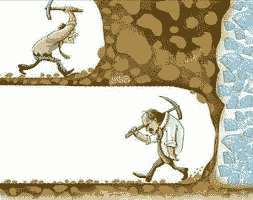
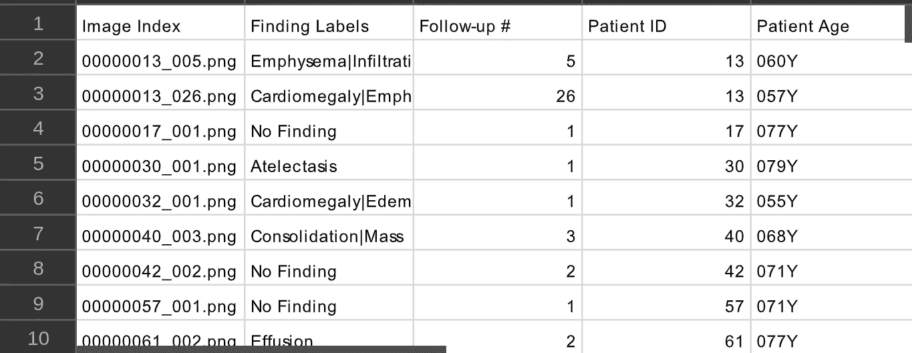
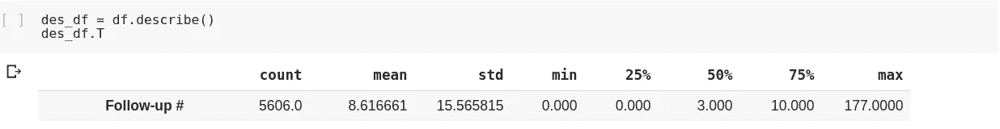
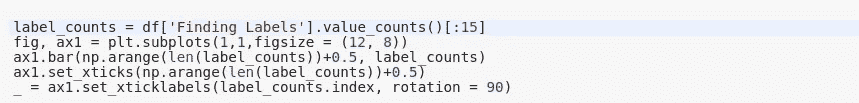
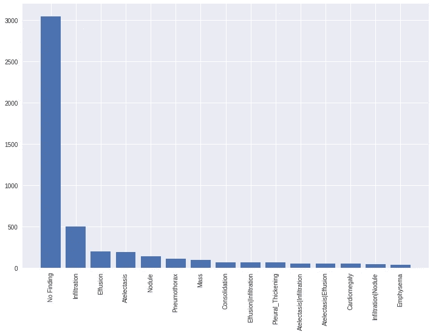
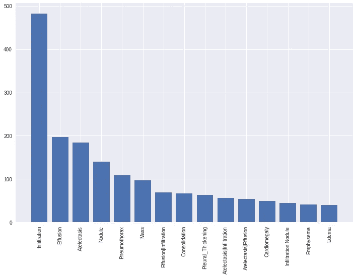
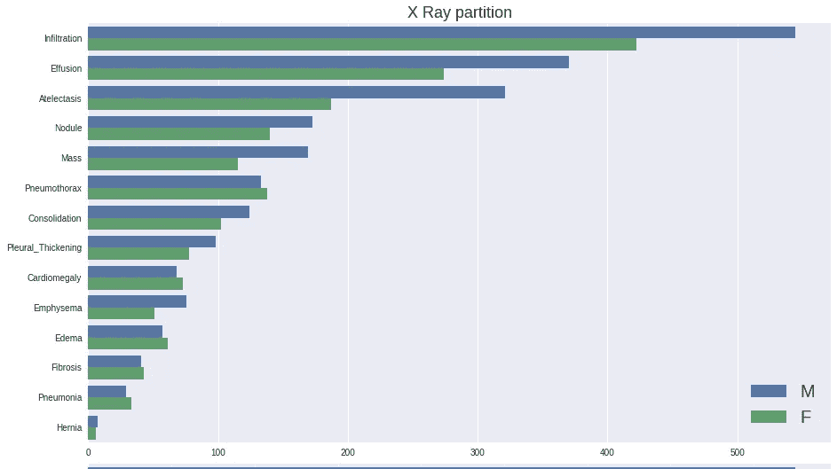
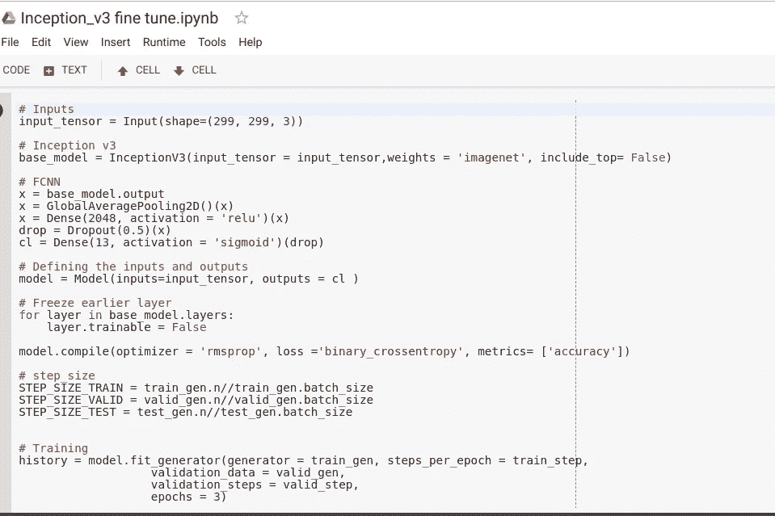

# 在压力下开发人工智能项目

> 原文：<https://medium.datadriveninvestor.com/developing-ai-projects-under-pressure-202cbab7428f?source=collection_archive---------11----------------------->

在这篇文章中，我将与你分享我最近与一位好朋友一起开发的一个惊人的计算机视觉项目的经验。

上周，我有幸见到了我的一位好友丹尼尔·菲里，他是 Parul Univesity 的 Github 校园专家，Hasura 的开发者倡导者和 Uniphyd(一个技术社区)的创始人。在叙旧的时候，他提到了他正在做的一个项目，需要一点人工智能的魔力，当然，作为一名人工智能工程师和爱好者，我不假思索地答应了。

令我惊讶的是，这个问题与我见过的任何问题都不一样，数据集比我想象的要大得多(准确地说是 42GB 的图像)，我花了一段时间来研究和搜索更合适的数据样本，但几天后我在 Kaggle 上找到了我要找的东西，这是一个很大的解脱。

> Kaggle 拥有最好的人工智能数据集、内核和令人惊叹的比赛(现金奖励)，我个人还没有找到一个更好的人工智能平台，可以同时提供所有这些服务。

事情变得越来越困难，他必须在最后期限前完成。

# 在 60 分钟内开发一个模型

在这个时代，大多数人工智能算法不需要从零开始学习，你可以下载一个预先训练的模型并调整它，以便它可以将其先前的知识转移到你的特定问题上，这个过程被称为**微调**或**转移学习**。

> 例如:假设你擅长数学，这种知识可以应用到其他领域，如物理、化学或会计，另一方面，如果你擅长文字，这种知识可以帮助你获得法律等领域的学位。

在你天真地跳进来建立一个模型之前，在人工智能中事情有点不同。你必须看到数据并理解它试图告诉你什么隐藏的秘密或故事，这个过程被称为**探索性数据分析**(简称 EDA)，不要让这个名字吓到你，它不是外星语言，你肯定不需要博士学位来做它或理解它，尽管它是开发解决方案的最重要的部分。

**数据**是新的黄金、钻石、石油和能源，它与人类已知的最珍贵的液体(水)不相上下，因为它所包含的预测能力，正如 Patrick Bet David 所说:

> "如果你想了解未来，就去研究过去."

有了数据，公司可以知道或者至少非常准确地预测你的未来，想象一下？

> [DDI 编辑推荐— Python 用于数据科学和机器学习训练营](http://go.datadriveninvestor.com/pybootcamp/matf)

# 我的系统

我建立了一个关于如何相对容易地开发项目的系统，我想给你这个我在所有项目中使用的系统。

1.  检索数据
2.  探索性数据分析
3.  可视化数据
4.  迁移学习

这是一个可以在大约 60 分钟内完成的系统。

> **注意**:在我们开始之前，我想推荐你学习如何使用或使用 Google Collab 来访问免费的 Nvidia K80 GPU，这将提高培训和处理速度，除非你有一台强大的笔记本电脑供你使用。

# 获取数据

我用于**微调**的数据集的名称是[国立卫生研究院胸部 X 射线数据集](https://www.kaggle.com/nih-chest-xrays)，这是一个为了利用人工智能改善具有挑战性的 X 射线诊断而创建的数据集。

总共有 12 个 zip 文件，大小从 2 GB 到 4 GB 不等。此外，他们随机采样了这些图像的 5%,并创建了一个较小的数据集供内核使用。随机样本包含 5606 个 X 射线图像和类别标签，您可以在此处 找到此样本的 zip [**。**](https://www.kaggle.com/nih-chest-xrays/sample)

下载后，只需将其解压缩到一个文件夹中。

# EDA 和可视化

在这一步中，我们将读取数据并尝试将其可视化，以便更好地理解它。

该数据集附带一个 CSV 文件(逗号分隔值),其中包含关于数据集的所有信息，如标签、患者性别等。

为了读取 CSV 文件，我们将使用著名的 python Pandas Dataframe 库，我使用 matplotlib 绘制图形。

只需查看“Finding Labels”列，我们就可以发现每张图像有多个标签。这是一个问题，称为**多标签分类**，我们希望为每张图像预测一个或多个标签。

将 CSV 文件读入数据帧后，我们将使用一个名为 **describe()** 的函数来计算**平均值**和**标准偏差**，这有助于我们了解数据与中心值的接近程度，以及这些值的变化或分布情况。

我们可以看到,“跟进”列中的所有值都非常接近中心值，并且没有分散太多。这意味着我们所有的价值观都集中在中心价值周围。

我们得到的数据样本包含比任何其他类别更多的无任何疾病患者的图像，这是一个会影响模型预测能力的问题。如果我们用这个数据训练我们的模型，由于这个数据的不平衡，它会认为病人 80%的时间是健康的。

在这种情况下，我决定消除“无发现”类，这样我们可以有一个更平衡的数据集，更少偏向一个类别。

它并不完美，但却是一个很好的起点。我们可以在不久的将来探索更多的选择。

此外，我们可以绘制一个图表，显示性别与某些疾病的相关性，换句话说，我们将看到有多少男性和女性患者感染了特定的疾病。

该图表明，被诊断患有这些疾病的男性患者多于女性患者——所有这些变量都可以用来帮助模型学习如何预测诊断。

但是在我们的例子中，我们只是想利用图像来预测标签，利用计算机视觉。

# 迁移学习

现在好戏开始了！

对于这项任务，我们将使用谷歌大脑在 2015 年建立的一个名为 **Inception_V3** 的模型，用 **Imagenet** 数据集进行训练，该数据集包含+14 M 图像，分为 1000 个类别。

该模型在 **Imagenet** 上进行了预训练，准确率为 93.2%。这是一个很高的精确度，但以今天的标准来看，这是惊人的。

深度学习库，如 **Tensorflow、Pytorch、Fastai** 和 **Keras** 都有这个模型和许多其他内置在库中的模型。对于这个项目，我使用了 **Keras** 高级 API。这个 API 不仅对初学者友好，而且对快速原型制作也有奇效。

事不宜迟，让我们定义和训练我们的模型。

这是您使用 **Keras** 进行**迁移学习**以及利用预先培训的知识并将其应用于新数据集所需的所有代码。

> 这将进一步缩小，因为今天晚些时候将在 TensorFlow Dev Summit 19 上发布一些惊人的公告，还有很多惊喜！！！

我们首先定义一个层，其中包含我们要用来训练模型的图像的大小，即(高度、宽度、通道)。

之后我们调用内置模型，指定你希望之前的知识(权重)从哪里来。**权重**是网络随着时间的推移学习和调整的值，以更好地对图像进行分类，基本上是在数据集上训练时获得的知识。

**FCNN** (全连接神经网络)它是**模型**的一部分，接收学习到的特征，并试图**对这些特征进行分类**。我们的最后一层有 **13 个神经元**，对应于我们想要分类的类的**数量，我选择的激活是 **sigmoid** ，因为它总是为我们数据集中的每个类输出 0 到 1 之间的值。该激活与**二元交叉熵**一起使用。**

> **交叉熵损失**，或对数损失，测量分类模型的性能，其输出是 0 和 1 之间的概率值。交叉熵损失随着预测概率偏离实际标签而增加。

建立模型后，我们使用。fit()方法对数据进行 3 次迭代，在 3 个时期后，我们获得了大约 91.15%的准确度。

我将模型推到了极限，得到了一个 **92.31%的准确度**，你可以在不到 **60 分钟**内得到这个。

有很多需要改进的地方，甚至有更好的模型架构。

所有的代码都在这个 Google Colab 笔记本里。

 [## 谷歌联合实验室

### 编辑描述

colab.research.google.com](https://colab.research.google.com/drive/1cHCVZSdnX-z9UE4JKNh3H6A7TGzjg4TS) 

去看看这个笔记本，看看你有什么可以改进的地方，然后在 Twitter 上给我发消息，把你的改进版本发在 [@CanumaGdt](https://twitter.com/CanumaGdt) 上，最好的代码将会在我的网站和下一篇文章中被大声喊出来。

感谢您的阅读。如果你有任何想法，评论或批评，请在下面评论。

在推特上关注我的 [**卡努玛王子**](https://twitter.com/CanumaGdt) **，**这样你就可以一直了解 AI 领域的最新动态**。**

如果你喜欢并认同它，请给我**点掌声**👏👏 👏(+50)和**分享给你的朋友**。

编辑披露:编辑有时会发布有用资源的链接。如果你发现它们有用并购买，我们会赚很多钱。不，我不是说要把我的薯条做大。我说的是超大披萨上的意大利香肠。感谢您一直以来的支持，我们将继续为 p̶e̶p̶p̶e̶r̶o̶n̶i̶出版而努力。