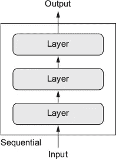
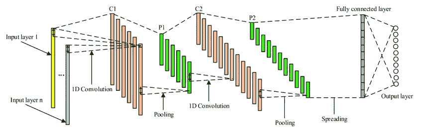
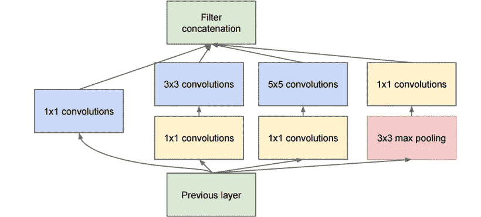
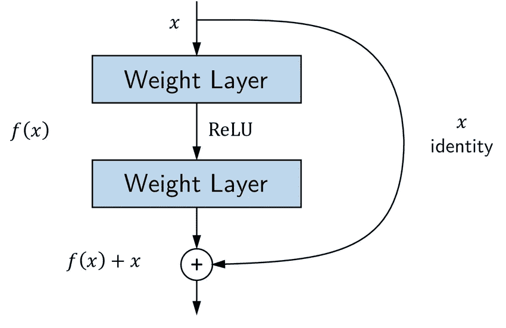

# 使用 Keras 功能 API 进行开发

> 原文：<https://medium.datadriveninvestor.com/developing-with-keras-functional-api-6017828408cd?source=collection_archive---------3----------------------->



Sequential Model

Keras sequential api 是创建任何深度学习模型的流行模型。然而，该模型有一个假设，即它将接受一个输入，只有一个输出。当需要不止一个输入和输出时，这种结构的模型没有用。此外，一些深度学习网络可能有多个内部分支(例如*初始模块*)，这与传统的顺序模型非常不同。要处理这样的架构，keras 的功能 api 非常方便。



(A multi-input architecture where sequential api fails)

在函数式 api 中，我们将层视为函数，它将张量作为输入，同时也输出张量。

## 函数式 API 的语法:

与顺序 api 不同，在函数 api 的情况下，我们必须提供输入的形状。所以第一步是提供输入的形状。

```
from keras.layers import Input
from keras.models import Modelx = Input(shape=(32,))
```

在上面的代码块中，我们将一个张量作为输入。

```
y=layers.Dense(16,activation= ‘relu’)(x)y=layers.Dense(16,activation= ‘relu’)(y)z=layers.Dense(10,activation= ‘softmax’) (x)
```

在这里，我们已经建立了简单的深度学习模型，我们可以看到甚至层被用作函数。最后它会产生一个张量作为输出。

```
model=Model(x,z)
```

在最后一步，我们将输入和输出张量转换成模型对象。通过对输入张量 ***x*** 进行变换，得到最终的输出张量*****z***。如果我们试图为模型提供除已定义形状之外的任何形状，这将导致运行时错误。**

**[](https://www.datadriveninvestor.com/2019/02/25/6-alternatives-to-the-yahoo-finance-api/) [## 雅虎财经 API |数据驱动投资者的 6 种替代方案

### 长期以来，雅虎金融 API 一直是许多数据驱动型投资者的可靠工具。许多人依赖于他们的…

www.datadriveninvestor.com](https://www.datadriveninvestor.com/2019/02/25/6-alternatives-to-the-yahoo-finance-api/) 

我们可以使用 keras 函数 api 形成有向无环图。这里要注意的关键一点是，我们只能对非循环图作循环图，可以有这样的条件，其中张量 x 可以成为产生 x 的另一层的输入，这在逻辑上是不正确的。

# 使用功能 API 的初始模型:



(Structure Of An Inception Model With Multiple Parallel Branches)

上图显示了一个基本的初始架构。该模型有一个非常复杂的架构，我们无法用基本的顺序 api 进行编码。这里我们可以看到独立网络的分支。不要深究一个初始模块的理论方面，让我们看看它的编码部分。

```
from keras import layers
part_a = layers.Conv2D(128, 1,activation=’relu’, strides=2)(x)
part_b = layers.Conv2D(128, 1, activation=’relu’)(x)
part_b = layers.Conv2D(128, 3, activation=’relu’, strides=2)(part_b)
part_c = layers.Conv2D2D(128,1, strides=2)(x)
part_c = layers.Conv2D(128, 5, activation=’relu’)(part_c)
part_d = layers.MaxPooling(128, 3, activation=’relu’)(x)
part_d = layers.Conv2D(128, 1, activation=’relu’)(part_d)
output = layers.concatenate([part_a, part_b, part_c, part_d], axis=-1)
```

这里的每一部分指的是一个初始模块的一个分支。这里我们可以看到 x 是前一层的输入。 ***部分 _a*** 指的是第一个分支，其具有 128 个 1*1 内核。在第二个分支 ***part_b*** 中，我们有一个初始的 1*1 卷积和一个 3*3 卷积。最初的 1*1 卷积从前一层(即 x)获取输入，而第二个 3*3 卷积从前者的输出(即 part_b 的第一层的输出)获取输入。同样，我们也可以理解 part_c 和 part_d 的代码。在最后一步中，我们连接了所有四个分支的输出。

这里有一个关键点应该注意到，我们已经为所有层保持步幅为 2。这样做是为了在最终的连接中，我们可以得到相同形状的所有输出，否则会显示错误。

# 使用功能 API 的剩余连接:

剩余连接有助于解决较长网络的消失梯度问题。它直接从前一层提供给后一层。



(A Basic Residual Block)

```
from keras import layers,Input
x=Input(shape=(None,))
y=layers.Conv2D(128, 3, activation=’relu’, padding=’same’)(x)
y=layers.Conv2D(128, 3, activation=’relu’, padding=’same’)(y)
y=layers.Conv2D(128, 3, activation=’relu’, padding=’same’)(y)
y=layers.add([y, x])
```

上面的代码不言自明。这里的关键是，我们使用早期层的输入作为后期层 y 的输入。如果形状出现任何差异，我们可以利用 1*1 卷积来获得所需的形状。

# 将模型用作层:

我们也可以像使用层一样使用模型。例如，假设我们有一个名为 ***mod*** 的训练模型。我们希望使用模型模块，就像我们使用层实例一样。例如，考虑以下要点

```
y=mod(x)
```

这里 mod 是一个已经训练好的模型，我们用它来产生中间层的输出。当我们提供 x 作为中间张量输入时，我们得到了输出张量 y。

本文展示了 functional api 的强大功能，它使我们能够创建任何类型的复杂模型架构，这是基本顺序模型所不能达到的。**