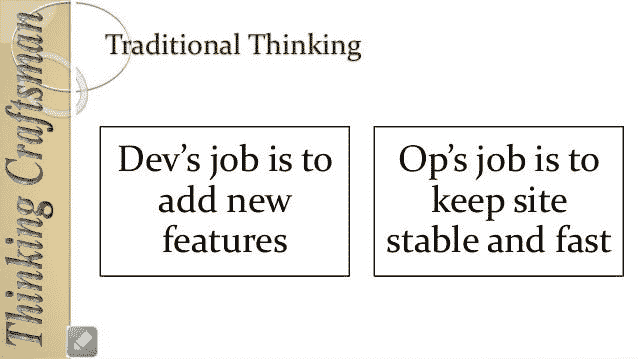
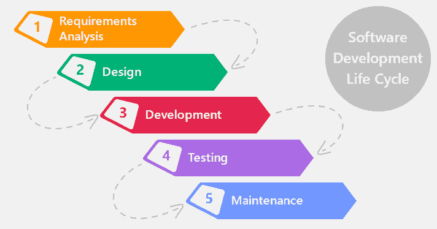
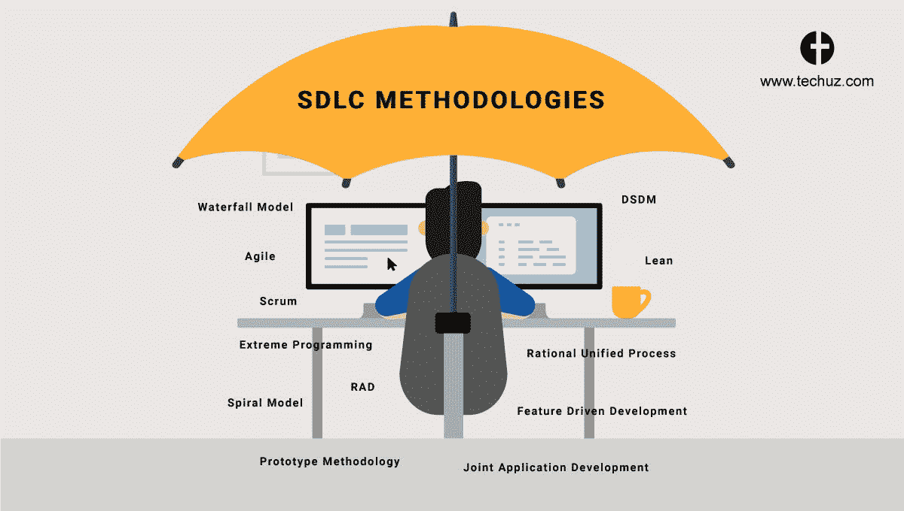
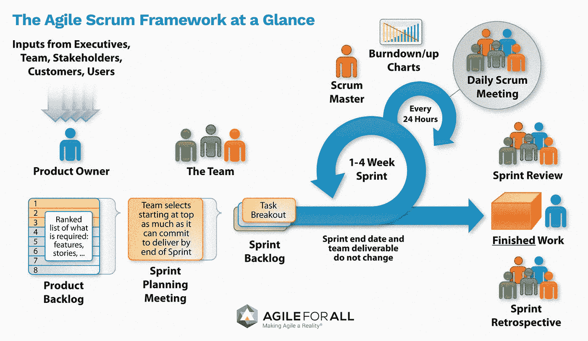
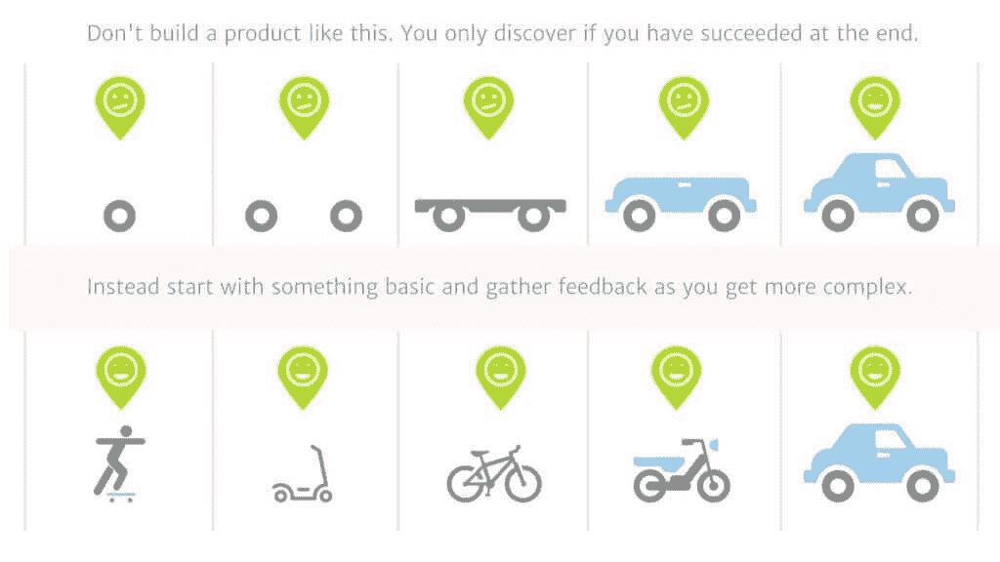
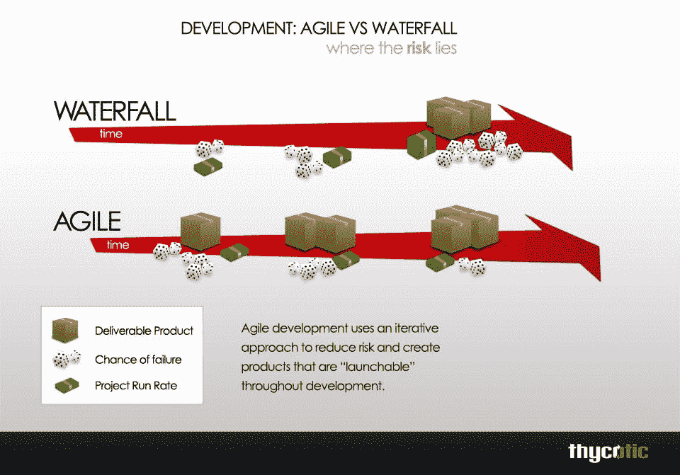
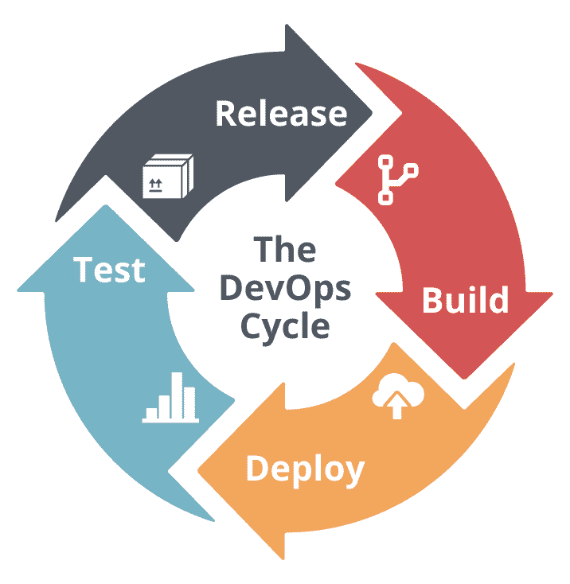
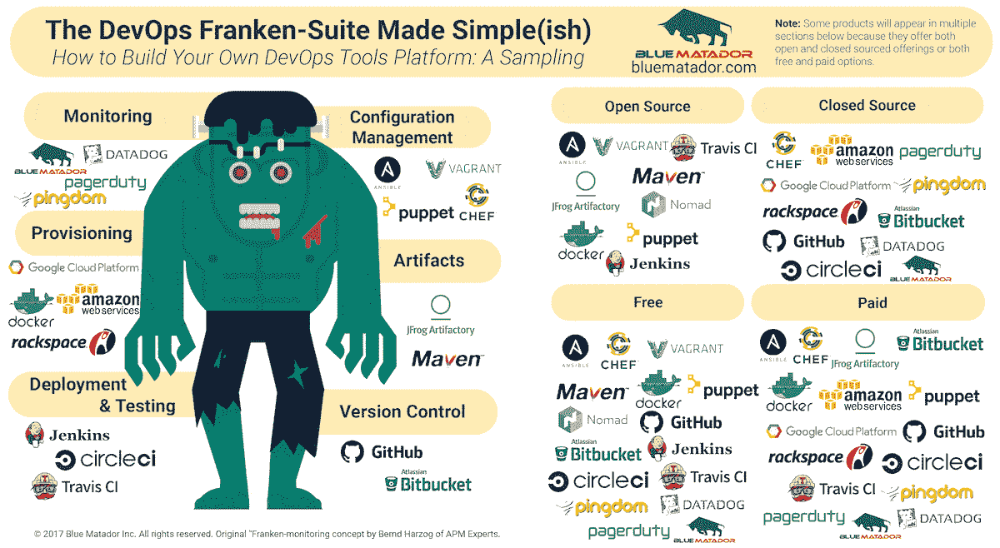

# DevOps

> 原文：<https://medium.datadriveninvestor.com/devops-f9a20d15390e?source=collection_archive---------9----------------------->

如今 DevOps 是一个非常著名的概念。大多数人对 DevOps 有错误的认识。DevOps 不是一个流程、技术或标准。有些人认为 DevOps 是 IT 工作名称，就像 IT 运营一样。但是 DevOps 是软件生命周期。敏捷更好。

DevOps 是一套软件开发实践，它结合了软件开发(Dev)和信息技术操作(Ops ),以缩短系统开发生命周期，同时根据业务目标频繁地提供功能、修复和更新。基本的开发运维实践包括敏捷规划、持续集成、持续交付和应用监控。

首先，我们必须知道软件是如何开发的。当客户想要一个软件时，他联系软件公司。因此，软件公司向客户发送 BA(业务分析)来收集客户的需求。根据客户需求，建筑事务管理局编制用户需求规格(URS)文件和系统需求规格(SRS)文件。URS 文档有用户需要的细节。SRS 文档详细说明了系统需要什么，比如系统使用哪种编程语言，以及系统的数据库是什么。它包含了系统的所有细节。

 [## 敏捷管理:好的、坏的、丑陋的|数据驱动的投资者

### 公司不断重塑自己，以获得或保持竞争优势和市场份额。这是…

www.datadriveninvestor.com](https://www.datadriveninvestor.com/2019/03/26/agile-management-the-good-the-bad-and-the-downright-ugly/) 

接下来，开发人员将使用这些 SRS 文档来开发系统。在大公司，他们会开发系统的一个小单元。在他们创建单元之后，他们执行单元测试。他们把代码交给了 QA(质量分析师)。QA 组合单元并进行完整性测试和其他测试。如果测试失败，那么 QA 指导开发人员重新创建或纠正他的错误。QA 和开发者之间会打起来。因为代码可以在开发人员的机器上运行，但不能在 QA 的机器上正确运行。这是 QA 和开发者的通病。

在每个测试案例成功后，QA 将系统交给 IT 运营部门。IT 运营将系统放在云端或他们自己的服务器上，并维护系统。当系统运行时出现任何问题，客户将进行 IT 操作。为了纠正这个问题，他会在任何时候指导 QA 和开发者，有时甚至在午夜。QA 和开发人员不喜欢与 IT 运营人员交谈。大多数人认为这是 DevOps 的工作。但这是错误的。他们混淆了开发运维与 IT 运维。

这是旧的软件生命周期方法瀑布。这里我只指定重要的 IT 工作。设计师、产品经理和支持团队也在这个系统中工作。在瀑布方法的需求分析中，设计、开发、测试、部署和维护是重要的阶段。一个阶段结束后，下一个阶段就可以开始了。通常需要很长时间，比如 8 个月。BA 花了 2 到 3 个月的时间创建这些文档。开发人员花了 3-6 个月来开发系统，QA 花了 1-2 个月来测试系统和纠正错误。IT 运营部门花了 3-4 个月的时间来安装系统并确保所有系统正常工作。在这段时间里，用户需求可能会改变，或者会引入新的技术，因此瀑布中 75%的软件产品都会失败。

在此之后，许多软件开发生命周期(SDL)像原型，增量软件开发。但这些都不出名。敏捷现在非常有名。使用敏捷的软件产品会带来成功。所以大多数公司都使用敏捷。在敏捷中 Scrum 是非常有名的。用这张图来解释 Scrum。

在敏捷 SDL 中，产品所有者(用户、客户、利益相关者)将用户故事放在产品待办事项中。那就像用户的要求。用户故事非常简单。在敏捷中，文档部分非常低。我们可以减少 BA 花费的时间。在产品 backlog 中，用户故事是按优先级排列的，哪些用户故事必须立即实现，它们具有高优先级。

敏捷团队召开了一次冲刺计划会议。在那次会议上，他们选择具有高优先级的用户故事，以及完成高优先级用户故事所需的其他用户故事。选择的用户故事被放入 sprint backlog 中。他们完成 sprint backlog 的时间通常被称为 sprint。冲刺阶段可能是 1-4 周，通常是 2 周。在冲刺阶段，每天早上他们都有站立会议。在站立会议中，团队成员讲述他们完成了什么，他们将要完成什么，以及他们面临什么困难。scrum master 将帮助团队解决团队成员面临的问题。这个团队是自组织的。Scrum master 不像产品经理。在瀑布和其他 SDL 方法论中，产品经理监督其他人的工作并告诉其他人该做什么。Scrum master 不喜欢他的工作只是帮助团队成员解决他们的问题。团队成员自己决定做什么。Scrum master 不要说。他与产品所有者和其他利益相关者交流。

当一个 sprint 完成时，他们就有了一个可交付的产品。用户有一个可用的增量。在 sprint 结束时，他们召开 sprint 评审会议，他们知道产品如何取得成功，或者它需要实现更多。在那次会议中，产品所有者、用户、团队成员和 scrum master 都将参加。如果他们有任何问题，他们会将它们放在产品待办事项中。

大多数人认为敏捷就像第一步。就像如果我们考虑一个网站，我们建立网页

索引页面->联系页面->关于我们->其他子页面

每个页面都可以在一次 sprint 中实现，但敏捷不一样。这是增量软件开发。在敏捷中，每年春天我们可以给任何用户可用的增量。所以每个 sprint 结束(2 周)的用户都得到可用的产品。在图片的第一个步骤中，用户不能使用它。第二步，用户得到可用的产品。这就是敏捷开发。

在瀑布中，我们只在最后阶段使用产品，所以失败的几率非常高。但是在敏捷中，我们可以在每次冲刺中纠正我们的错误，我们可以适应需求的变化。我们的最终产品不会失败。

但是在敏捷中，我们花了 2 周时间给出一个可用的产品。这两个星期的时间现在已经很长了。我们可以在 1 小时内建一座房子。我们可以在 28 天内建起一栋大楼。我们需要改变我们的敏捷流程。客户希望非常快速地开发系统，因此开发人员愿意越来越快地推出软件。为此，解决方案是 DevOps。开发运营是软件开发生命周期过程的自动化。由此，我们可以节省时间。

“如果你在没有 DevOps 的情况下进行敏捷开发，就好像你试图用拖拉机而不是汽车来比赛。你可以去跑几圈，但不会跑得很快，你可能会消耗很多燃料，而且不会很有趣。”

— Frederic Veron，房利美首席信息官(“真正的敏捷软件开发需要 DevOps”，首席信息官，2016 年 11 月 15 日)

DevOps 只是将敏捷原则扩展到代码之外，扩展到整个交付的服务。这个术语是由“开发”和“运营”两个词组合而成的。DevOps 文化是:

1.协作——开发和 IT 运营部门合作，而不是相互指责。他们之间的联系非常紧密。开发人员可以使用 git 技术为系统做出贡献。

2.自动化—每个流程都将自动运行。DevOps 依赖于自动化。当我们将代码发布到 git 存储库时，它会自动构建、测试并自动部署到系统中。

3.持续集成(CI)——强迫开发人员将他们的工作与其他开发人员的工作集成经常会比瀑布开发更早地暴露集成问题和冲突。

4.连续交付(CD) —代码变更被自动构建、测试，并为发布到生产环境做好准备。它通过在构建阶段之后将所有代码变更部署到测试环境和/或生产环境中，在持续集成的基础上进行扩展。当连续交付被正确地实现时，开发人员将总是拥有一个已经通过标准化测试过程的部署就绪的构建工件。

5.持续测试——持续测试不仅仅是一个 QA 功能；事实上，它始于开发环境。开发人员可以简单地把代码扔给 QA，然后说“开始吧”的日子已经过去了。在 DevOps 环境中，质量是每个人的工作。开发人员将质量构建到代码中，并提供测试数据集。QA 工程师配置自动化测试用例以及测试环境。

DevOps 环境中的测试功能有助于开发人员平衡质量和速度。使用自动化工具降低了测试成本，并允许测试工程师更有效地利用他们的时间。最重要的是，连续测试通过允许在过程的早期进行集成测试，缩短了测试周期。

6.持续监控——通过持续监控，团队测量软件的性能和可用性以提高稳定性。持续监控有助于快速确定问题的根本原因，从而主动预防停机并最大限度地减少用户问题。一些监控专家甚至主张服务的定义必须包括监控——他们认为这是服务交付的一个组成部分。

现在大多数大公司，像脸书、微软和谷歌都使用这些 DevOps。所以他们可以每天发布两到三个新功能。如果我们更改代码，一切都会实现自动化，它会自动运行开发、测试和部署流程，如果成功，它会发布新功能。

这是 DevOps 的生命周期。

在 IT 组织中实施 DevOps 自动化在很大程度上依赖于工具，这些工具需要覆盖系统开发生命周期(SDLC)的不同领域:

基础设施作为代码— Ansible、Terraform、Puppet、Chef

CI/CD — Jenkins、TeamCity、Shippable、Bamboo、Azure DevOps

测试自动化— Selenium、Cucumber、Apache JMeter

集装箱化——码头、火箭、联合

编排— Kubernetes、Swarm、Mesos

软件部署—弹性豆茎、章鱼、鞋面

监控— NewRelic、Kibana、Datadog、DynaTrace

ChatOps — Hubot、Lita、Cog

自动化过程中使用的工具。在这幅图中，它是类别。您可以使用这些工具，或者在 Microsoft azure 中创建自己的 DevOps 项目并查看这些功能。它拥有运行 DevOps 项目的所有工具。

参考

1)微软文档

[https://docs . Microsoft . com/en-us/azure/devo PS/learn/what-is-devo PS](https://docs.microsoft.com/en-us/azure/devops/learn/what-is-devops)

2)[https://newrelic.com/devops/what-is-devops](https://newrelic.com/devops/what-is-devops)

3)devo PS——维基百科

https://en.wikipedia.org/wiki/DevOps