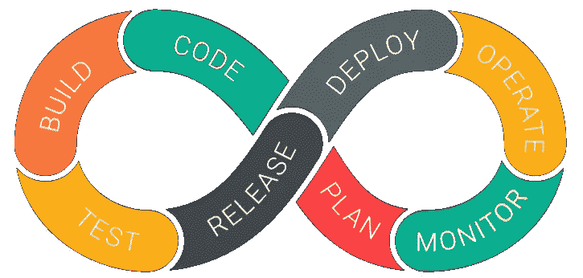

# DevOps —快速失败，经常失败，快速恢复

> 原文：<https://medium.datadriveninvestor.com/devops-fail-fast-fail-often-recover-quickly-b66b52fbd73e?source=collection_archive---------4----------------------->

构建软件的整个过程被分解成小的可操作的块，称为 sprints。在敏捷模型中，产品只在开发人员的计算机上进行测试，而不在生产系统上进行测试，开发人员和运营团队也在独立的环境中工作。

DevOps 已经成为一个流行词，对很多人来说意味着很多不同的事情。它只是一个软件开发策略(不是工具，不是框架，不是技术，也不仅仅是一个工作角色)，它在公司的 Dev(开发人员)和 Ops(运营)之间架起了一座桥梁。它解决了一些冲突，比如当开发团队需要敏捷性，而运营团队需要稳定性时，将公司的开发和运营结合在一起。它是一种文化，促进开发人员和运营团队之间的协作，以自动化和可重复的方式更快地将代码部署到生产中。

DevOps 是敏捷软件开发的产物——诞生于跟上敏捷方法已经实现的软件速度和吞吐量增长的需求。一开始，**敏捷团队**最初是由开发人员组成的。随着这些敏捷团队在生产软件方面变得越来越有效，很明显将**质量保证(QA)** 和开发作为独立的团队是低效的。敏捷发展到包括 QA 以提高软件交付的速度，现在敏捷再次发展到包括交付和支持成员以扩展从构思到交付的敏捷。

 [## 敏捷管理:好的、坏的、丑陋的|数据驱动的投资者

### 公司不断重塑自己，以获得或保持竞争优势和市场份额。这是…

www.datadriveninvestor.com](https://www.datadriveninvestor.com/2019/03/26/agile-management-the-good-the-bad-and-the-downright-ugly/) 

DevOps 理念通过在构建、验证、部署和交付阶段进一步简化软件变更，同时赋予跨职能团队从设计到生产支持的软件应用程序的完全所有权，从而扩展了敏捷开发实践。

> Jez Humble 提出的定义是，DevOps 是“一个跨学科的实践社区，致力于研究大规模构建、发展和运营快速变化的弹性系统。”

实际的定义可以是，

# **“devo PS 是运营和开发工程师共同参与整个服务生命周期的实践，从设计到开发流程再到生产支持**”

DevOps

不了解 DevOps 的生命周期，就不可能理解 DevOps。这里有一条关于持续开发运维生命周期的简短信息

**1。开发**

在这个 DevOps 阶段，软件的开发持续进行。在这个阶段，整个开发过程被分成几个小的开发周期。这有利于 DevOps 团队加速软件开发和交付过程。

**2。测试**

QA 团队使用 Selenium 这样的工具来识别和修复新代码中的错误。

**3。整合**

在这个阶段，新的功能被集成到流行的代码中，并进行测试。只有通过持续的集成和测试，持续的开发才有可能。

**4。展开**

在此阶段，部署过程会持续进行。它是以这样一种方式进行的，即任何时候在代码中所做的任何更改都不应该影响高流量网站的运行。

**5。监控**

在此阶段，运营团队将处理生产中发现的不适当的系统行为或错误。

# DevOps 的需求

DevOps 的需求完全取决于项目的规模。如果你的目的是发布一个最小可行产品(MVP)来测试你的想法，很有可能你可以不用 DevOps 系统。如果你的软件已经发布了几个版本，是时候开始考虑规模和竞争力了——想想 DevOps。

# DevOps 的阶段

DevOps 成熟有几个阶段。在持续集成之前，开发团队会花三到四个月的时间写一堆代码。然后那些团队会合并他们的代码来发布它。不同版本的代码会有很大不同，会有很多变化，实际的集成步骤可能需要几个月的时间。这一过程非常低效，因此按照 CI/CD(又是一个时髦词)解释如下:

**持续集成**

持续集成是将新开发的代码与将要发布的代码主体快速集成的实践。当团队准备发布代码时，持续集成节省了大量时间。

这个术语不是由 DevOps 引入的，持续集成是一种源自极限编程方法的敏捷工程实践。这些术语已经存在一段时间了，但是 DevOps 采用了这个术语，因为需要自动化来成功地执行持续集成。持续集成通常是这条道路的第一步。从 DevOps 的角度来看，持续集成过程包括检入您的代码，将其编译成可用的(通常是二进制可执行的)代码，并运行一些基本的验证测试。

**连续交货**

持续交付是持续集成的延伸。它位于持续集成之上。当管理连续交付时，您添加了额外的自动化和测试，这样您不仅合并了代码，而且您几乎可以在没有人工干预的情况下部署代码。这是一个让代码库持续处于随时可部署状态的系统。

# 使用的一些工具

# 因此，DevOps 通过开放的、基于标准的平台有效地管理项目，通过协作提高项目的可视性和可追踪性，从而提高质量并降低开发成本。