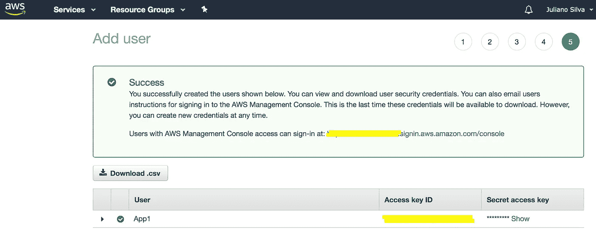
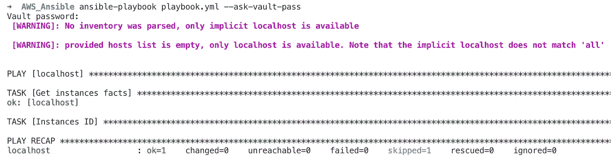
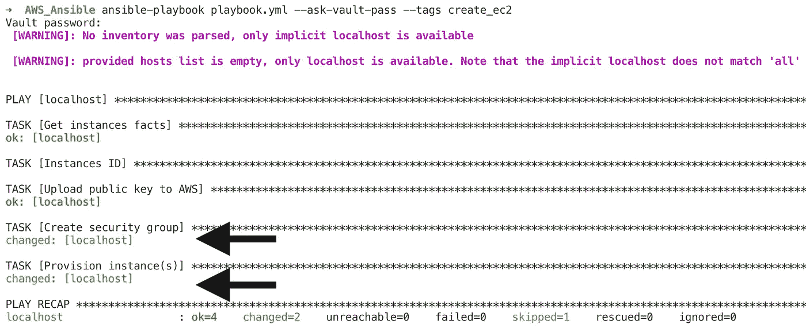
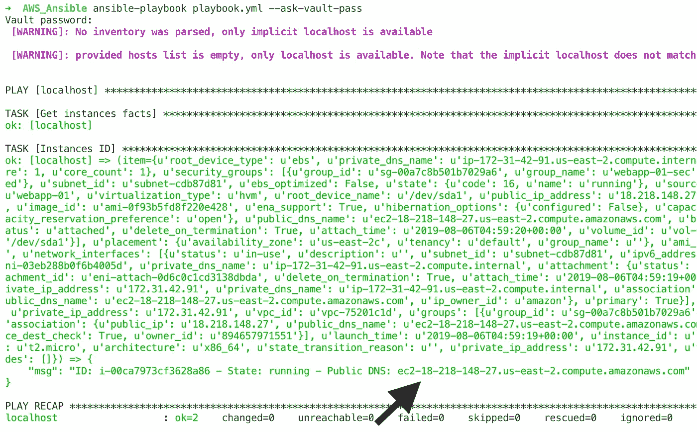
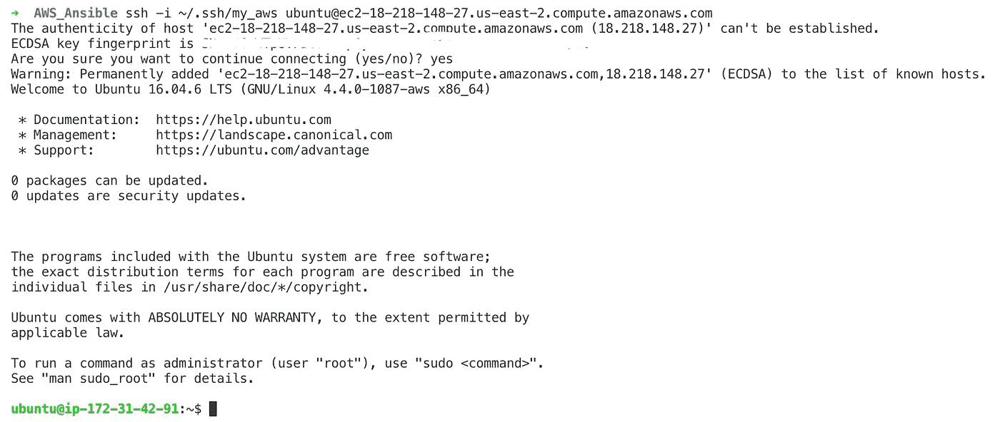

# DevOps:使用 Ansible 提供 AWS EC2 实例

> 原文：<https://medium.datadriveninvestor.com/devops-using-ansible-to-provision-aws-ec2-instances-3d70a1cb155f?source=collection_archive---------0----------------------->

[](http://www.track.datadriveninvestor.com/1B9E)

用 Ansible 在 Amazon Web Service EC2 上提供实例的实用方法。

欢迎，本文展示了使用 Ansible 提供 AWS EC2 实例的简单方法。

[](https://www.datadriveninvestor.com/2019/03/26/agile-management-the-good-the-bad-and-the-downright-ugly/) [## 敏捷管理:好的、坏的、丑陋的|数据驱动的投资者

### 公司不断重塑自己，以获得或保持竞争优势和市场份额。这是…

www.datadriveninvestor.com](https://www.datadriveninvestor.com/2019/03/26/agile-management-the-good-the-bad-and-the-downright-ugly/) 

[**Ansible**](https://docs.ansible.com/ansible/latest/index.html) 是一款配置管理工具，广泛用于配置 IT 环境、部署软件或集成到 CI/CD 管道中。开发了许多可行的 [**模块**](https://docs.ansible.com/ansible/latest/modules/list_of_cloud_modules.html#amazon) 来简化与 AWS 云管理相关的任务。

本文将执行以下步骤来展示 Ansible 和 AWS Cloud 集成的强大功能:

*   创建 AWS 用户
*   安装 Ansible 和 Ansible EC2 模块依赖项
*   创建 SSH 密钥
*   创建可转换的结构
*   运行 Ansible 来提供 EC2 实例
*   通过 SSH 连接到 EC2 实例

## 创建 AWS 用户

打开 AWS [控制台](https://console.aws.amazon.com)，搜索 IAM(身份和访问管理)并按照此 [**步骤**](https://docs.aws.amazon.com/IAM/latest/UserGuide/id_users_create.html#id_users_create_console) 创建一个用户，记下 Ansible 将用于设置实例的访问密钥和秘密密钥。



## 安装 Ansible 和 EC2 模块依赖项

```
sudo apt install python
sudo apt install python-pip
pip install boto boto3 ansible
```

本文是用 ansi ble 2 . 8 . 0 版和 Python 版编写的。

## 创建 SSH 密钥，以便在配置后连接到 EC2 实例

```
ssh-keygen -t rsa -b 4096 -f ~/.ssh/my_aws
```

## 创建可行的目录结构

```
mkdir -p AWS_Ansible/group_vars/all/
cd AWS_Ansible
touch playbook.yml
```

或者，您可以使用 Git(或 SVN)来保持这个目录的版本控制。

## 创建一个 Ansible Vault 文件来存储 AWS 访问和密钥。

```
**ansible-vault create** group_vars/all/**pass.yml**
New Vault password:
Confirm New Vault password:
```

每次执行剧本或编辑 pass.yml 文件时，都会询问此处提供的密码。

本文将遵循上面的方法，但是，如果您不想每次都提供密码，一种不安全的方法可以通过指定哈希密码文件来创建 pass.yml 文件:

```
openssl rand -base64 2048 > vault.pass**ansible-vault create** group_vars/all/pass.yml **--vault-password-file** vault.pass
```

使用哈希密码文件，您必须在运行 Ansible playbook 时指定 vault-password-file 参数，并且不会被要求输入密码:

```
**ansible-playbook** playbook.yml **--vault-password-file** vault.pass
```

## 编辑 pass.yml 文件并创建密钥全局常量

创建变量 **ec2_access_key** 和 **ec2_secret_key** ，并设置用户创建(IAM)后收集的值。

```
**ansible-vault edit** group_vars/all/**pass.yml** 
Vault password: ec2_access_key: AAAAAAAAAAAAAABBBBBBBBBBBB                                      
ec2_secret_key: afjdfadgf$fgajk5ragesfjgjsfdbtirhf
```

## 目录结构

```
➜  AWS_Ansible tree
.
├── group_vars
│   └── all
│       └── pass.yml
└── playbook.yml2 directories, 2 files
```

## 打开 playbook.yml 文件，粘贴以下内容

## 关于行动手册的注释

*   出于安全考虑，剧本将默认只执行收集 AWS 信息的任务。如果指定了标签 **create_ec2，将执行负责提供实例的任务。**
*   创建用户(IAM)的第一步也可以用 Ansible [**iam**](https://docs.ansible.com/ansible/latest/modules/iam_module.html#iam-module) 模块来执行，但这里是在 AWS 控制台上演示以显示交互。

## 运行 Ansible 以提供实例

如果执行 Ansible 时不带 tags 参数，创建任务将不会执行。

```
ansible-playbook playbook.yml --ask-vault-pass
```



## 创建实例

```
ansible-playbook playbook.yml --ask-vault-pass **--tags create_ec2**
```



## 获取公共 DNS

```
ansible-playbook playbook.yml --ask-vault-pass
```



## 通过 SSH 连接到 EC2 实例

```
**ssh -i ~/.ssh/my_aws** [ubuntu@ec2-18-218-148-27.us-east-2.compute.amazonaws.com](mailto:ubuntu@ec2-18-218-148-27.us-east-2.compute.amazonaws.com)
```



恭喜，您已经使用 Ansible 自动化了 EC2 实例供应流程。

感谢您的阅读！欢迎提问、反馈和建议😀

问候。