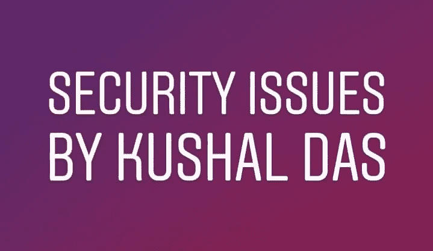

# DG plug Class-25/06/18:Kushal Das 在 IRC 上发表的“安全问题”

> 原文：<https://medium.datadriveninvestor.com/dgplug-class-25-06-18-security-issues-by-kushal-das-on-irc-b0c1287cdcb0?source=collection_archive---------4----------------------->



在参加了一个月的 dgplug 培训后，我认为我的学习规模在上升，但在 2018 年 6 月 18 日的会议上，mbuf(IRC 中的昵称)询问了我们的时间管理和生产力，我意识到我需要分析我所学到的东西，在这里我得到了一个现实检查，我可能不记得一个多月来所教的大多数东西。

意识到这是毁灭性的，我决定再次通过日志[https://dgplug.org/irclogs/2018/](https://dgplug.org/irclogs/2018/)。所以，这是我的第一个博客，关于 KUSHAL DAS 给出的关于“安全问题”的培训课程。

# [中的**会话:**中的](https://dgplug.org/irclogs/2018/Logs-2018-06-25-13-29.txt)

会议从与 she bang([https://en . Wikipedia . org/wiki/she bang _(Unix)](https://en.wikipedia.org/wiki/Shebang_(Unix)))、Tar 文件([https://en . Wikipedia . org/wiki/Tar _(计算)](https://en.wikipedia.org/wiki/Tar_(computing)))相关的问题开始，然后 Kushal 提出了几个问题:

```
[14:06] <kushal> What do you want to protect?
[14:06] <kushal> Who do you want to protect it from?
[14:06] <kushal> How bad are the consequences if you fail?
[14:06] <kushal> How likely is it that you will need to protect it?
[14:06] <kushal> How much trouble are you willing to go through to try to prevent potential consequences?
```

通过分别回答这些问题，他告诉我们“*资产是你重视并想要保护的东西，比如用户名/密码、电子邮件、电话号码、联系人列表*”和“*确定谁可能会针对你或你的信息*很重要，因为“*首席执行官的对手不同于大学生*”。

一个例子澄清了问题的答案，即“律师可能试图做许多额外的步骤来发送加密的电子邮件。一个正常人发搞笑的猫咪照片或者视频是不会这样的。这意味着一些电子邮件毫无价值，加密的电子邮件需要得到保护，而猫视频则不需要。

章节[https://summer training . readthe docs . io/en/latest/Threat model . html](https://summertraining.readthedocs.io/en/latest/threatmodel.html)是讲述“威胁建模”的章节。

现在问题来了"*在一切都是开放的自由软件世界里，这有什么用？*”。

就此而言，我们真的需要了解"**"[的](https://kushaldas.in/pages/hacker-ethic-and-free-software-movement.html)[历史](https://kushaldas.in/pages/hacker-ethic-and-free-software-movement.html)https://kushaldas . in/pages/hacker-ethic-and-free-software-movement . html这将给我们一个关于开源、黑客伦理的确切概念，它是从哪里开始的，以及开源是如何进一步壮大的。**

# ****安全密码:****

**进一步谈到安全性，我们首先看到需要保护的“密码”。试图记住一个好的密码是困难的。拥有这些额外的特殊字符也无助于对抗强大的现代计算机。**

**因此[https://en.wikipedia.org/wiki/Diceware](https://en.wikipedia.org/wiki/Diceware)是一种可以帮助我们解决这个问题的技术。你可以从[http://world.std.com/~reinhold/diceware.html](http://world.std.com/~reinhold/diceware.html)那里了解更多关于 [**骰子**](http://world.std.com/~reinhold/diceware.html) 】。**

**您可以使用 pip 或 dnf 简单地安装“Diceware ”:**

```
[14:33] <kushal> you can simply install it using pip or dnf.
[14:33] <kushal> For Fedora users: use: sudo dnf install diceware
[14:34] <kushal> I don’t think it is packaged for debian, that case you can use the pip command
[14:34] <kushal> pip install diceware — user
[14:34] <kushal> Use passwords at least 6–7 words long.
[14:35] <kushal> example command:
[14:35] <kushal> diceware -n 7
[14:35] <kushal> This will give you a good strong passphrase
```

**现在，这里有一个关于记住这么长密码的东西。在这个问题上，库沙尔说:**

```
[14:35] <kushal> But. remembering these will be difficult.
[14:36] <kushal> So we all have to use a good password manager: https://summertraining.readthedocs.io/en/latest/opsec.html#use-password-managers
[14:37] <kushal> Use KeePassXC as a good local option
[14:37] <kushal> https://medium.com/@mshelton/keypass-for-beginners-dc8adfcdad54
[14:37] <kushal> Then you will have to remember only one big master passphrase, not everything.
```

**他建议使用类似“ *KeePassXC* ”的密码管理器(KeePassXC 是一个很好的本地选项)。想了解“ [KeePassXC](https://medium.com/@mshelton/keypass-for-beginners-dc8adfcdad54) ”这里有个博客“https://medium . com/@ mshelton/key pass-for-初学者-dc8adfcdad54”。**

**在会议的后半部分，建议在您的笔记本电脑上安装*摄像头，因为有很多人可以在不认识您的情况下访问您的摄像头，并记录您的活动，以此来对付您。***

***如果你认为有人使用网络摄像头时，它会发光。答案是**没有**。在大多数情况下，攻击者访问网络摄像头时不会发出任何光。***

# *****保持机器更新:*****

***接下来的事情是建议保持你的机器更新保持你的机器更新[https://summertraining.readthedocs.io/en/latest/opsec.html](https://summertraining.readthedocs.io/en/latest/opsec.html)为了安全起见，并获得新的更新。有时候小事情对我们有很大的帮助。***

# ***备份:***

```
*[14:52] <kushal> https://summertraining.readthedocs.io/en/latest/opsec.html#take-regular-backups
[14:52] <kushal> Backups are important.
[14:52] <kushal> Remember to take regular backup
[14:53] <kushal> But, that also brings in the discussion about encrypted drives https://summertraining.readthedocs.io/en/latest/opsec.html#take-regular-backups
[14:53] <brute4s99> kushal, honestly one would love to maintain backup, but they are just too large. Cloud storage capacities are so minute compared to that, what to do ?
[14:54] <kushal> brute4s99, you backup the most important parts.*
```

***是的，[备份](https://summertraining.readthedocs.io/en/latest/opsec.html)很重要。建议定期备份，如果您有关于空间消耗的问题，答案是“*备份最重要的部分*”。不要备份你喜欢的所有东西。***

# ***需要记住的事项:***

***电子邮件是最容易受到攻击的方式，因此为了降低风险，千万不要点击随机链接，因为它们可能是恶意软件。不要从你怀疑的邮件中下载任何东西。***

***第二章中的一个例子解释道:“假设你收到一封你叔叔的电子邮件，里面有他孩子的照片，但你意识到你从未要求过，那么首先从你叔叔那里确认他是否给你发过邮件”。这种意识可以让你免受攻击者的攻击。***

***千万不要从随机的邮件和网站下载任何证书。尽量不要从随机链接下载任何应用到你的安卓手机上。***

***最后，我想说的是，在当今这个技术狂热的世界里，100%的保护是不可能的。因为有些人学会了进步，但是很多人只是喜欢麻烦别人。因此，在这种情况下，我们只能通过了解我们周围的威胁并找到解决这些威胁的方法来尽力保护我们，如果没有合适的解决方案，那么就想办法让威胁远离我们。***