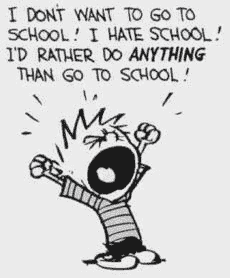

# 学校真的教育过你吗？

> 原文：<https://medium.datadriveninvestor.com/did-school-truly-ever-educate-you-1fefd9050d01?source=collection_archive---------6----------------------->

## 一个高中生对当今教育程度的看法。

受过良好教育的人和受过良好教育的人之间仍然存在明显的区别，尽管许多人可能无法区分这两者，并决定用一个词来代替另一个词。

人们可能从他们的 APUSH 课堂上知道关于每个总统的所有事实，或者从他们的 pre-calc 课堂上知道三角恒等式，但这并不意味着当他们被扔出教室环境进入现实世界时，他们准备好充分发挥他们的潜力。

 [## 教科书行业如何最终被颠覆，并将继续改变-数据驱动…

### 就此而言，教科书产业在美国乃至全世界都有着悠久的历史。事实上，他们已经…

www.datadriveninvestor.com](https://www.datadriveninvestor.com/2018/09/25/how-the-textbook-industry-has-finally-been-disrupted-and-will-continue-to-change/) 

受过良好教育的人和受过良好教育的人之间的区别，可以比作人们说某人“书本型聪明”或“街头型聪明”时的意思。书本型聪明的人在学校会取得很大的成功，在所有的考试中都能表现出色。他们知道正确的学习方法，他们的成绩单一尘不染——全是 A。然而，“街头聪明”的人可以在不同的社会环境中找到自己的路，并充分利用潜在的灾难性情况，如在未知的地方迷路，甚至在另一个国家的机场导航。这些情况在课堂上是不会遇到的，所以让他们“街头聪明”的是他们逻辑思维和快速行动的能力。

尽管我说受过良好教育的人和受过良好教育的人是截然不同的，但仍然有一条细微的分界线，将两者结合起来是非常可能的。

对我来说，受过良好教育意味着某人掌握了数学事实和语法规则，但不一定是为生活做好充分准备的人。对我来说，上学是达到学校和管理者每年为学生列出的教育目标的过程——这些目标应该是教给学生并衡量他们从小学到大学的进步。学校教育可能与建筑、管理人员、测试、书籍和家庭作业相关联。它强调成绩、测试、测验、成绩单、大学、GPA 和掌握内容。学校教育让学生与学生竞争，以确定成绩最好的学生，这样他们就可以进入最有声望的大学，提高学区的声誉。学校教育促进了人们对哈佛和耶鲁等名校的满足感，而不是促进学生之间的互动，共同努力，为社会问题提供更好的想法和解决方案。

作为一名每天 7 小时，每周 5 天，每年 180 天，在“以学校教育为基础的环境”中度过 11 年的学生，我对 Powerschool 的更新感到痴迷和压力，希望看到箭头指向上，害怕箭头指向下。为了准备第二天的三门考试或完成一个重要的项目，我不得不熬夜无数个晚上，所有的压力和焦虑只会让我被扔进用字母和数字标记的精心分类的堆里。

学校教育并不鼓励人们去学习超出好成绩要求的东西。从受过良好教育到受过教育的转变发生在一个人的内心，而不仅仅取决于教室和老师。

它始于好奇心和对寻找答案和信息的渴望，这是学校教育很少鼓励的事情，因为学生选择做最起码的事情来获得好成绩。由于学校教育是建立在严格的课程设置基础上的，对教师可以教授的内容以及在课堂环境中可以讨论的话题都有规定，所以人们可能有的许多创造性的想法和观点可能会被隐藏在他们的脑海中，而不会与公众分享。

学校教育教会了我大量的信息，但很少应用到我的日常生活中。二年级时，老师教了我乘法表，我承认这对我很有用。在七年级，我的英语老师教我语法规则，现在我能够正确地造句并以适当的形式写电子邮件。到目前为止，我在 11 年的学校教育中所学到的几乎所有东西都是左耳进右耳出。每天，学校都会吐出越来越多的信息让我记住，比如“线粒体是细胞的动力室”，但这些信息在细胞单位结束后就再也没有拿出来过，坦率地说，这些文件柜在我称为大脑的仓库里越来越积满灰尘。

教育不仅仅来自于聪明，因为人们不仅仅可以通过聪明来接受教育。梵高接受过通过艺术表达情感的教育，史蒂夫·乔布斯，一个大学辍学生，接受过创建一个十亿美元帝国所需的一切教育。这些受过教育的人可能没有为了受教育而接受传统的“学校教育”,而学校教育的多少绝对不能衡量人生成功的程度。这些人受到现实世界的教育，从他们的经历中学习，无论是成功还是失败。

当你毕业时，学校教育就结束了，不管是高中、大学还是研究生院，但教育永远不会结束。它贯穿一生，你永远不会因为太老而不能学习新的东西。教育可以在任何地方进行，甚至在最意想不到的地方。事实上，有时候最奇异的地方往往会教给你最重要的人生课程。去餐馆会教会你礼貌、社交和文化。甚至遛狗也能教会你对宠物表达爱和关心的重要性，让你更加感激它。

教育也是无法量化衡量的东西。通过经历和接触新环境而获得的人生经验是无法用一种尺度来划分的。当然，你可以通过他们的净资产或年利润来衡量这些受过教育的人有多成功，但你不能像老师布置作业那样给他们的所有工作打 A+。

教育促进对答案的寻求和知识的扩展，而且它绝对不仅仅是在课堂上学到的。教育赋予社会领导人寻求想法和促进变革的权力。虽然它起源于学校教育，但这并不意味着真正的教育永无止境。