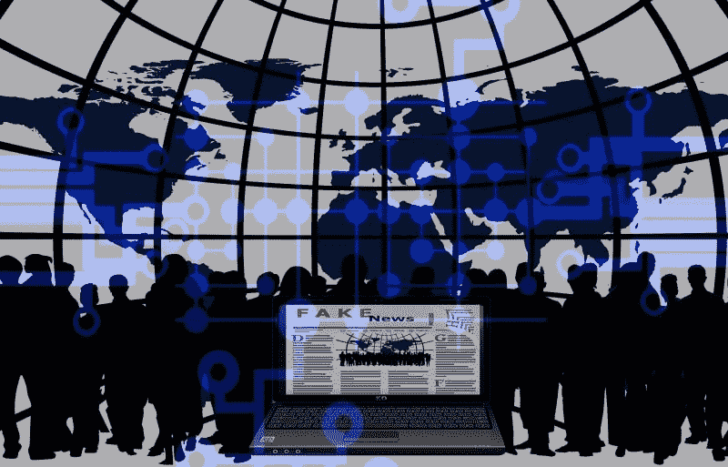
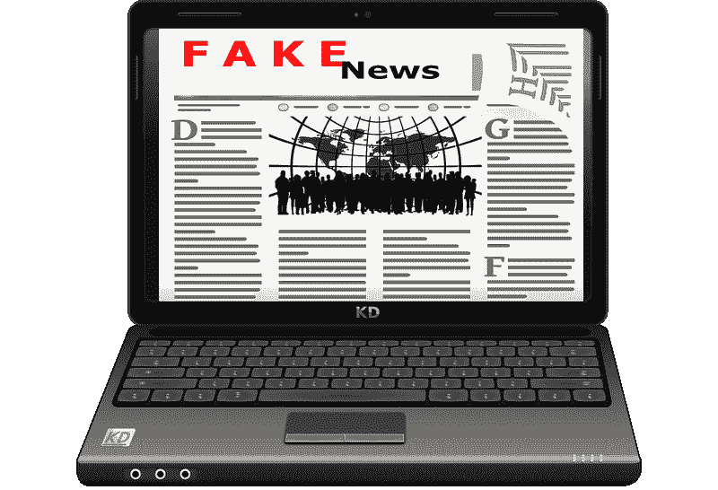
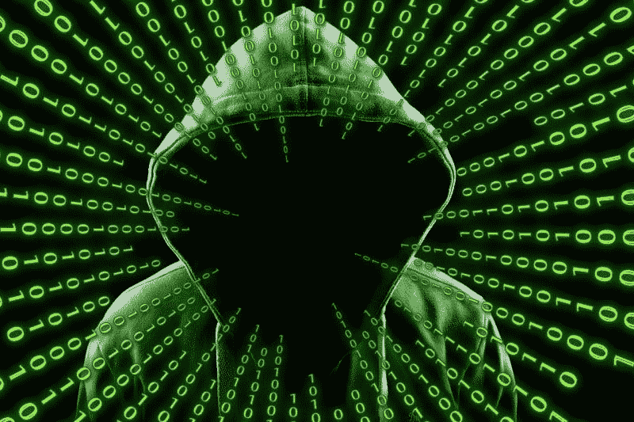
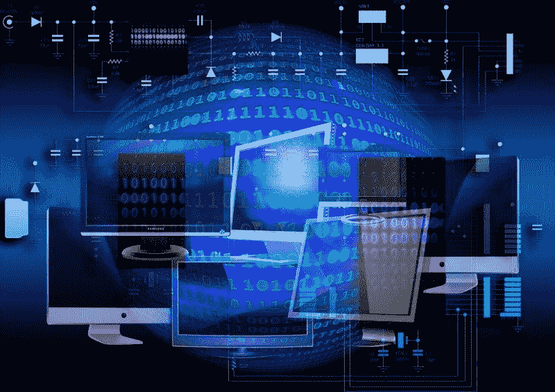
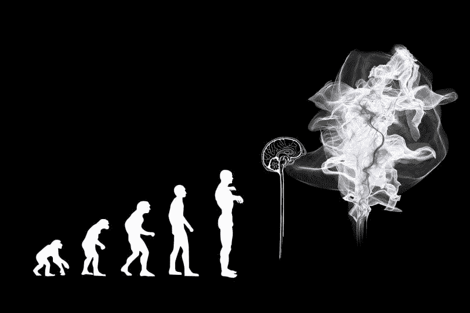
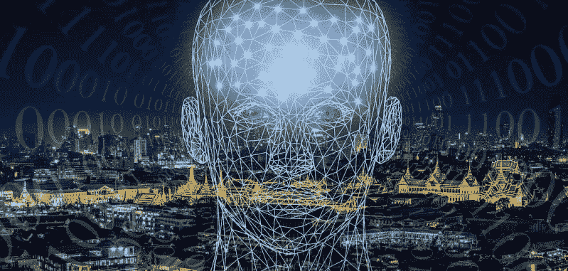
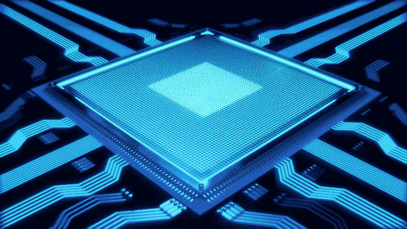

# 人工智能乔·罗根通过图灵测试了吗？—市场疯人院

> 原文：<https://medium.datadriveninvestor.com/did-the-ai-joe-rogan-pass-the-turing-test-market-mad-house-c42fdccc8ab0?source=collection_archive---------8----------------------->

一个简单的视频提出了一个令人不安的问题:人工智能乔·罗根通过图灵测试了吗？因此，重大历史可能会在 YouTube 上上演。

为了解释，来自 [Dessa](https://dessa.com) 的人工智能(AI)可以近乎完美地模仿播客王乔·罗根。AI Rogan 的第一个播客并不令人印象深刻，但它的效果可能会惊天动地。

 [## 数据驱动投资的兴起——数据驱动投资者

### 当 JCPenney 报告其 2015 年 2Q 的财务结果时，市场感到非常震惊。美国零售巨头…

www.datadriveninvestor.com](https://www.datadriveninvestor.com/2019/02/28/the-rise-of-data-driven-investing/) 

为了详细说明，AI Rogan 在没有人类帮助的情况下想出了视频的脚本和主题， *The Verge* [声称](https://www.theverge.com/2019/5/17/18629024/joe-rogan-ai-fake-voice-clone-deepfake-dessa)。在视频中，艾罗根发表了一篇关于组织黑猩猩曲棍球队的咆哮。令人不安的是，AI Rogan 说话，看起来像真正的播客。

图灵测试；或者说模仿游戏，是一种 AI 评价方法，计算机先驱艾伦·图灵在 1951 年设计的。图灵的理论是，第一个真正的人工智能将通过欺骗人们认为它是人类来展示其智能。因此，德萨的假乔·罗根可以通过图灵测试。

# 假政客是假新闻的下一步吗？

因此，你可以使用 Dessa 的 AI 来创建虚假的名人或政治家，他们创建并发布自己的播客、视频、博客、文章等。在线。

这项技术的含义令人恐惧。例如，你可以创造一个假总统唐纳德·j·特朗普(R-New York)发表关于废除社会保障或阿道夫·希特勒天才的咆哮。或者是一个虚伪的俄罗斯总统弗拉基米尔·普京，他称赞约瑟夫·史达林的天才，并颂扬列宁谋杀沙皇·尼古拉斯二世是一种英雄行为。

这种假政客可能会迅速毁掉主要政治人物的声誉和职业生涯。想象一下，一个给所有南方白人贴上“无知的乡巴佬”标签、称《圣经》为“扯淡”的假特朗普会给总统的连任努力带来多大的损害。

# 假新闻中的下一代

看起来像真新闻播音员的人工智能假货可能会造成更大的损害。例如，一个假冒的莱斯特·赫特把虚假的恐怖袭击报道成真实的。

攻击者会使用像霍尔特这样的人；NBC 的主持人，接触到不知道“人工智能深度伪装”存在的不成熟的观众。如果一个看起来像真正的新闻播音员或政治家的恶意 AI 出现在广播电视网络上，有人会造成巨大的破坏。

数据表明许多广播电视观众不使用电脑或互联网。所以这样的人会是 AI 江湖骗子的完美目标。

# 人工智能如何产生歇斯底里和混乱

在这种情况下，没有人会相信任何新闻报道，人们对媒体仅存的一点信任也会烟消云散。虚假的政治领导人发表虚假的声明，有人设计来引发恐慌或暴力，这可能会造成最终的破坏。

这样的攻击者可以利用假总理纳伦德拉·达莫达斯·莫迪(Narendra Damodardas Modi)宣布所有纸币全面贬值的视频在印度造成严重破坏。由于[莫迪](https://www.bbc.com/news/world-asia-india-41896865)已经在 2016 年发表了这样的声明，印度人可能会相信这位假总理引发了恐慌。

最糟糕的是，一个人有可能发动这样的攻击。我认为一个疯狂的天才；或者恐怖分子，利用 Dessa 技术制造全球恐慌。

# Dessa 是 AI 最具颠覆性的公司吗？

罗根人工智能显然运行在[基金会](https://dessa.com/foundations/)，Dessa 的商业人工智能平台。值得注意的是，Dessa 正在向企业出售基金会。

基金会将作为人工智能运作的平台和操作系统。因此，将基金会视为“人工智能的窗户”是一个好方法。请记住，Windows 通过提供易于使用的操作系统将软件带给大众。

我认为基金会可能是破坏性的，因为它可以让任何人用合适的硬件来操作、构建和部署人工智能解决方案。最终，设计师可以创建使用基础来创建人工智能解决方案，并通过 [GitHub](https://marketmadhouse.com/is-microsoft-the-best-value-in-tech/) 或 [Aitheon 提议的人工智能市场](https://www.aitheon.com)来销售它们。

# 人工智能将如何杀死乔布斯

最终，Dessa 计划向商业销售人工智能解决方案和系统，**甲骨文** [市场](https://marketmadhouse.com/how-much-money-is-oracle-orcl-making/)金融软件。

很明显，Dessa 网站[声明](https://dessa.com/foundations/)“Dessa 的人工智能服务使企业能够建立和拥有人工智能知识产权，并揭示该技术的真正影响。”此外，Dessa 吹嘘道，“我们提供软件、基础设施工程服务，并支持大规模设计、构建和部署高级人工智能用例。”

如果这些说法是真的，Dessa 的技术可能会摧毁大量的工作岗位。Dessa 的就业扼杀技术的一个例子是“简化的数据工作流程”简化数据工作流程的人工智能可以消除档案员、编辑、会计、分析师、情报人员，甚至网站管理员。

这些职位处于危险之中，因为这些人的主要角色之一是协调数据流。仅仅是提高数据流的速度和效率就会减少一些工作。

# 经理们注意了，人工智能正在取代你们的工作

Dessa 的 AI 甚至威胁到一些管理职位，因为它可以管理流程。值得注意的是，**沃尔玛(纽约证券交易所:WMT)** 正在[测试](https://marketmadhouse.com/walmarts-ai-customer-surveillance-raises-ethical-questions/)一个人工智能监控系统，该系统管理库存水平并监控长岛的商店状况。

此外，美国消费者新闻与商业频道[声称](https://www.cnbc.com/2019/05/02/walmart-is-testing-ways-to-trim-the-size-of-its-store-management-staff.html)，沃尔玛正在寻求精简管理人员的方法。沃尔玛正在测试新的门店结构，减少助理经理和部门经理。

相反，人工智能可以指导员工执行诸如帮助客户、清理溢出物和重新进货等任务。很明显，人工智能已经在智能零售实验室给同事下命令了；纽约莱维敦的一个沃尔玛社区市场，TechCrunch 报道。

# 人工智能如何威胁零售经理的工作

出于几个原因，取消人力经理对零售商来说是有意义的。

首先，经理的工资比其他零售人员高得多。Payscale 估计零售店经理的平均年薪为 46，609 美元。根据 Glassdoor 的数据，相比之下，零售员工的平均年收入为 33，175 美元。

第二，好的经理通常很难找到。我甚至看到过向推荐一位有经验的零售经理到折扣店的顾客提供**美元树(纳斯达克:DLTR)** 奖励的标志。

第三，人类管理者可能愚蠢、种族歧视、性别歧视、辱骂、无知、偏执、偏执、粗鲁和无能。例如，一个种族主义或性别歧视的经理会赶走顾客并引发诉讼。此外，人工智能不太可能微观管理员工，性骚扰员工，从公司偷窃，或侮辱客户。

因此，人工智能可以带来更好的客户服务，并以更低的成本改善员工的工作条件。就我个人而言，我认为艾会比我工作过的几位老板做得更好。

# 你能投资 Dessa 吗？

在这种情况下，很多人会问怎么才能投资 Dessa。目前， [Dessa](https://dessa.com/contact/) 是一家私人控股公司，在多伦多和纽约设有办事处。因此，公众不能投资 Dessa。

然而，你可以投资 Dessa 的两个合作伙伴硬件制造商**英伟达(纳斯达克股票代码:NVDA)** 和软件巨头**微软(纳斯达克股票代码:MSFT)** 。有趣的是，微软是 [GitHub](https://github.com) 的所有者；世界上最大的软件开发平台，以及 Windows 背后的力量。

具体来说，微软与 Dessa 的合作是通过其[微软 Azure](https://azure.microsoft.com/en-us/free/search/?&OCID=AID719825_SEM_nLUGHrbQ&lnkd=Google_Azure_Brand&gclid=Cj0KCQjww47nBRDlARIsAEJ34bmeQQDRgZR8vQ7qLqOX6HeurxN-wPIkDJl_34jh6HEnZMoRgxcGX7QaAnnSEALw_wcB) 云计算平台实现的。因此，微软可能计划通过 Azure 提供 Dessa AI 解决方案，如 Foundations。另外，我认为 Dessa AI 在 GitHub 上可能会有市场。

# Dessa 会提振英伟达吗？

[**英伟达**](https://www.datadriveninvestor.com/2019/04/23/cash-in-on-video-games-with-nvidia/) **(纳斯达克代码:NVIDA)** 投资 Dessa 是因为它构建了人工智能运行的芯片和处理器。显然，增加人工智能的使用，可以增加英伟达产品的市场。目前，英伟达正在专注于深度学习和人工智能。

Dessa 是一家值得关注的公司，因为它可以像微软在 20 世纪 80 年代商业化和普及软件那样商业化和普及人工智能。归根结底，我认为 Dessa 可能是人工智能领域最具颠覆性的公司。

*原载于 2019 年 5 月 21 日 https://marketmadhouse.com**T21*[。](https://marketmadhouse.com/did-the-ai-joe-rogan-pass-the-turing-test/)

*免责声明:文章所表达的观点和看法仅属于作者，不一定反映 DDI 的立场。这篇文章无意成为投资建议。*