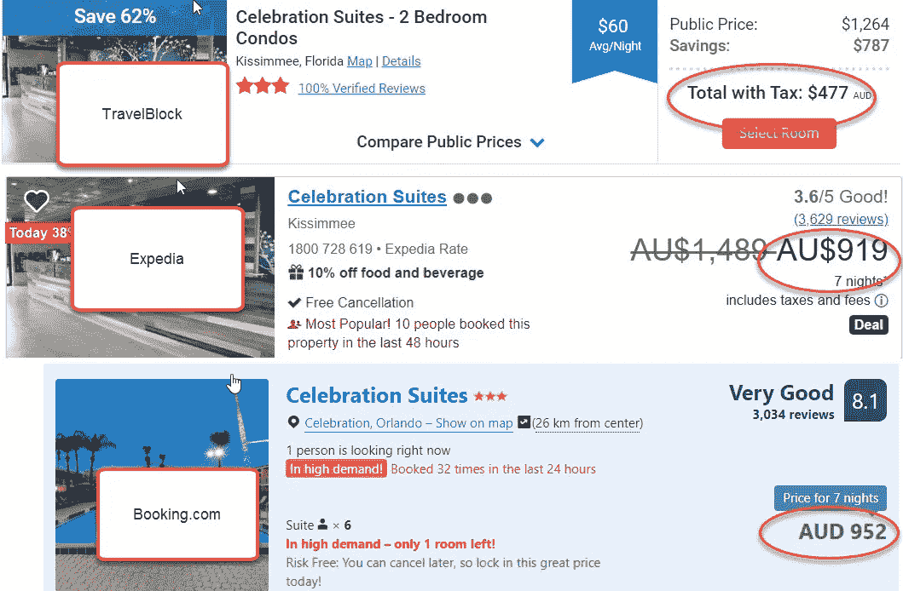
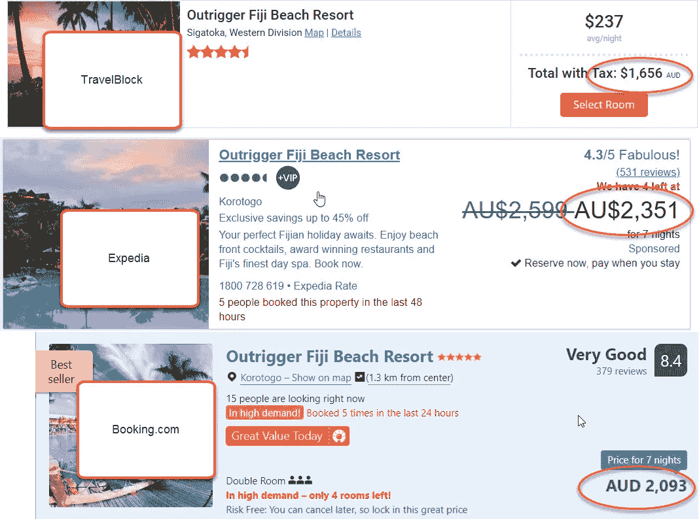

# TravelBlock 送货上门了吗？

> 原文：<https://medium.datadriveninvestor.com/did-travelblock-deliver-b46b524fc69f?source=collection_archive---------3----------------------->

以前我写过一个令人兴奋的 ICO(初始硬币发行),它使区块链上的旅行预订成为可能。

TravelBlock 的代币销售现在已经结束，该公司已经向所有投资者开放了他们的预订平台。

目前，您只能通过菲亚特预订，但他们正在努力使用名为 TRVL 的旅行令牌进行预订。

我个人投资了 TravelBlock，但我相当怀疑他们是否会兑现与其他折扣代理商相比大幅折扣的承诺。

虽然我本人没有通过 TravelBlock 预订任何旅行计划，但我一直在密切关注所提供的交易，老实说，我并没有失望。

在本文中，我们将展示 TravelBlock 的价格比两大在线旅行社 Expedia 和 Booking.com 便宜多少。比较价格是基于两个成年人在同一家酒店住相同的时间。

我挑选了 3 个受欢迎的目的地。巴塞罗那、奥兰多和斐济。参见下面的对比。

# 巴塞罗那:

# 奥兰多:

# 斐济:

如你所见，TravelBlock 节省了大量资金，远远超出了我的预期。

如果你想了解 TravelBlock 以及如何利用这些有吸引力的交易，请访问他们的[电报集团](https://t.me/travelblock)或[网站](https://travelblock.io)了解更多信息。