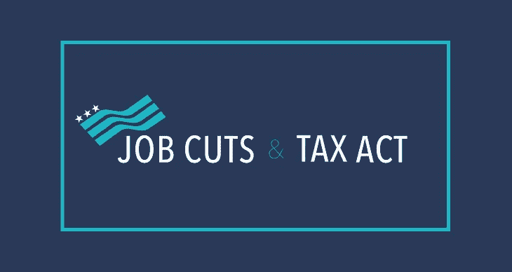
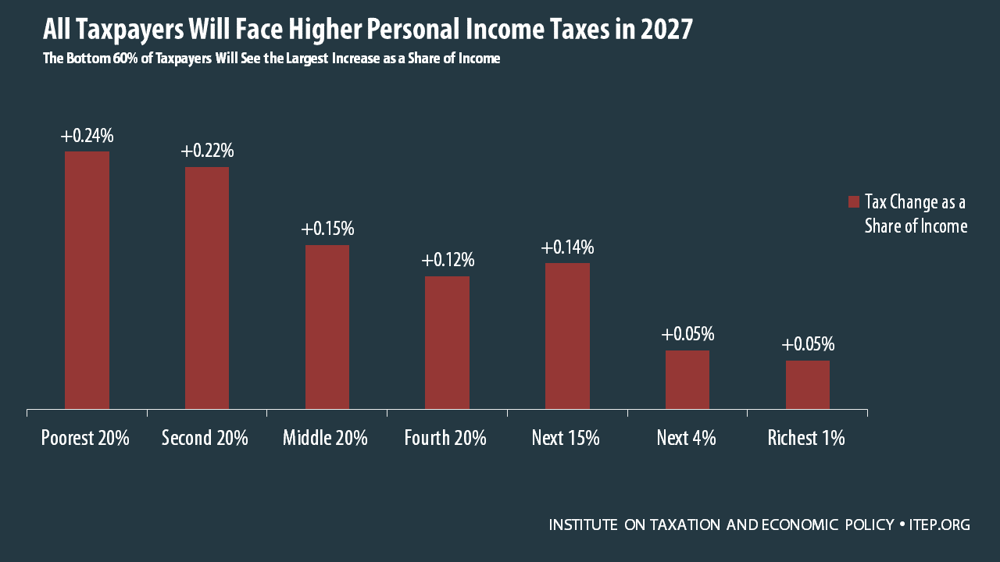
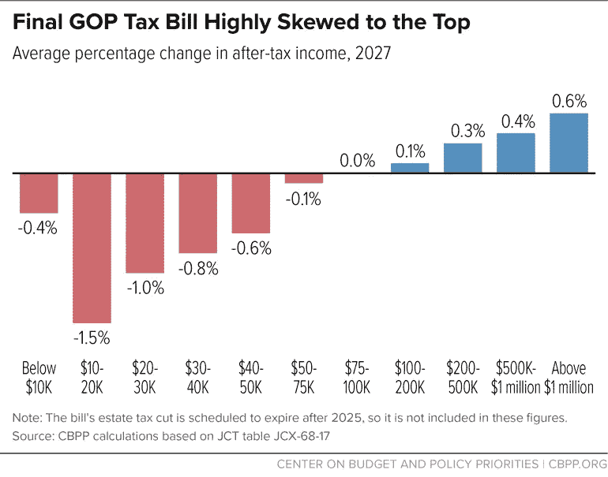

# 你收到的纳税申报单少了吗？明年会更糟。

> 原文：<https://medium.datadriveninvestor.com/did-you-receive-a-smaller-tax-return-next-year-will-be-worse-781dd7da8d0e?source=collection_archive---------10----------------------->

2017 年的税收法案对人们的税收做了一些改变，但该法案的主要目标是降低美国企业的税率，而不是普通美国家庭。我不会争论美国是否需要降低公司税率，或者降低公司税率是否创造了足够多的就业机会，值得它在未来十年增加近 2 万亿美元的国家赤字。我想说的是该法案缓慢增加美国家庭税收的偷偷摸摸的方式，同时使企业减税永久化。

共和党从 2017 年开始的减税计划通过了国会的预算和解，这有助于共和党避开参议院民主党人的阻挠。通常立法需要参议院的 60 票，但由于预算有特殊的规则，他们只需要多数票，这是当时共和党的 51 票。但预算还有其他规则，比如它们不能在预算“窗口”之外增加赤字，在这个例子中是 10 年。这意味着共和党人需要找到一种方法，在 10 年结束时通过赤字中性的减税措施。所以他们需要想出一个收入来源。记住，减税的目标是永久降低公司税率。他们想出的办法是让个人税率走上每年缓慢增长的道路。

 [## 保护主义、政治和经济动荡|数据驱动的投资者

### 美国股市昨日出现 400 多点的大幅反转，为未来的事情发出了警告信号。市场…

www.datadriveninvestor.com](https://www.datadriveninvestor.com/2018/06/28/protectionism-politics-economic-turmoil/) 

他们通过调整税法中鲜为人知的部分实现了这一点，这个部分被称为消费者价格指数(CPI)，即*阻止税收自动上涨。例如，十年前一加仑牛奶可能只值一美元，但现在超过三美元，或者几年前理发可能是 10 美元，现在是 20 美元。为了跟上商品成本的增长，工人要求雇主提高工资。国会认识到，今天挣 30，000 美元的工人能够和十年前挣 20，000 美元的工人购买同样的商品和服务。为了防止人们被过度征税，国会设定税收等级的收入范围每年都要改变，以反映我们购买的物品成本的增加。*

税法的这一部分很少引起注意，因为它变化非常缓慢。根据你收入的多少，有七种不同的税级。税收等级的收入水平每年都在攀升；大约 2%或 3 %,对于大多数税级来说，这可能是几百美元。CPI 的计算每年都在减少每个纳税人的税收，在十年的时间里，它可以为每个家庭节省几千美元。

由于税法的这一部分没有得到太多关注，难怪特朗普和国会共和党人能够在许多(几乎为零)美国人没有注意到的情况下，对他们的税收法案中的 CPI 计算进行大幅修改。

他们没有使用 CPI，而是让我们的税法遵循一种叫做连锁 CPI 的东西。环比 CPI 不同于 CPI，它假设随着商品成本的上升，美国人会购买替代产品。买不起房子，人们会租房子；买不起牛排，人们会吃垃圾食品；买不起汽车，人们将乘公共汽车。连锁消费物价指数是我们税法的“勒紧腰带”的方法。

这种变化对我们缴纳的税有什么影响？未来十年，它将大幅增加*人的税收。低收入人群和那些依靠社会保障的人将感受到最大的影响，你挣的钱越少，影响越大。当你在 CPI 考虑的项目上花费的收入比例较高时，随着额外金额的复合增长，你受到的伤害会更大。*

*为什么美国人没有对特朗普和共和党提高税收感到愤怒？首先，变化的影响在几年内不会被感觉到。类似于从一便士开始，在 30 天内每天翻倍(你得到超过 500 万美元)，CPI 每年都是一个小变化，但在十年内，它会产生巨大的差异。第二，没有人真正谈过。连锁 CPI 不是一件容易解释的事情*(我希望我一直做得不错)*，人们往往不关心未来几年将影响他们的事情。*

**

*但是 CPI 的变化还不是最糟糕的部分。共和党人知道，仅仅改变 CPI 不足以支付长期的企业减税，所以他们将个人减税政策设定为在 2025 年底到期，并恢复到 2017 年的水平。税收法案就像一个糖糖，在最初几年对每个人都有很多税收减免，以防止人们愤怒，但最终只有公司受益。*

*2018 年只是变化的第一年，如果人们现在感到不安，一旦 CPI 的变化真的开始复合，他们将会非常不安。通过改变这种计算方法筹集的资金将用来支付什么？对那些将利润转移给股东的公司永久减税。只有 40%的美国人有足够的财富拥有股票。共和党承诺，企业将创造更多的就业机会，但这方面的数据是不确定的。事实上，让美国人把钱留在美国消费似乎比把钱给在海外开设工厂的公司更好。我敢打赌，国会会做出改变，减轻对美国人的打击，就像他们延长布什的大部分减税政策一样。但是，随着赤字的增长，他们可能需要在其他地方增加收入，或者冒着我们国家的债务超过 GDP 的经济影响的风险。*

*你应该做什么？看看你的税收，为未来几年做些计划。这可能包括在工作中减少你的 W4 上的津贴数量，或者额外节省一点，以期待你将获得更少的纳税申报单，甚至欠钱。*

* [## 获取 DDI 智能获取专家视图

### 编辑描述

www.track.datadriveninvestor.com](http://www.track.datadriveninvestor.com/1B9E)*