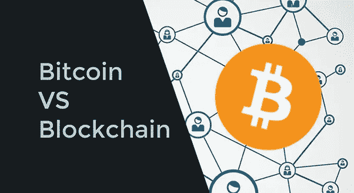

# 区块链与比特币的区别。区块链不仅仅是比特币

> 原文：<https://medium.datadriveninvestor.com/difference-between-blockchain-vs-bitcoin-blockchain-its-not-just-about-bitcoin-ce0e642cba95?source=collection_archive---------2----------------------->

最近，人们的注意力越来越多地被区块链的技术所吸引，这是比特币加密货币的基础。然而，在大多数情况下，这个词被用作某种神奇的咒语，最终，对一个正常人来说很明显，这很酷，但仅此而已。

当然，事实上你不会发现任何魔法。这项技术很美，但并没有看起来那么难。让我们试着用一种简单的方式解释一切是如何工作的——不用深奥的数学公式和专业术语。好吧，没有专业术语我们根本无法应付，不过，让我们开始吧。

**比特币是什么？**

如何用简单的话来判定比特币(btc，Btk，比特币)？这是新一代的去中心化数字货币，仅在互联网上创建和操作。没有人控制它，货币发行是通过世界上数百万台计算机使用一种计算数学算法的程序来进行的。这就是比特币的本质。

对于比特币，你也可以在互联网上购买任何东西，比如美元、欧元或其他货币，它也可以在不同的证券交易所交易。让我们来看看比特币最重要的特征:

权力下放；

-易于使用；

匿名；

-透明度。

**嗯那很好。那么什么是区块链呢？**

“区块链是一个用于存储数据的分布式注册表……”—你肯定听过很多次这样的解释。然而，这种想法并没有澄清这个画面。因此，区块链是一个数据库，同时存储在互联网上相互连接的一组计算机上。每笔交易都被记录下来并安全保存。

**为什么需要它，最好用例子来解释。**

想象一下，你通过银行转账给你在巴西的阿姨寄了 100 美元。你在转账表格上填了十几个字段，然后银行职员从你的个人账户中扣款，并把钱存入一个国际转账的银行账户。然后另一个员工把这笔钱转到代理银行的账户上，代理银行把这些钱转到巴西，在巴西，这些钱会以同样的链条转到你阿姨的个人账户上。

三天后，你阿姨会收到 97 美元(减去所有银行的佣金)——如果转账没有错误的话。最糟糕的是，没有一个参与者能够在这 3 天内追踪这笔钱。

一个突然的服务器崩溃，一个银行家的不诚实或者一个黑客的攻击将会开始一个漫长的调查，并找到负责归还你的钱的人。但同样的事情随时可能发生，你账户里的钱都有了。因此，你必须每天依赖这个系统，信任你的银行。

区块链有能力彻底改变局面。您的交易将在几秒钟内完成，并安全存放在链条上。这样系统的每个参与者都可以追踪交易，而不会暴露你的身份。

区块链在哪里有用？

尽管对区块链的兴趣更多地与金融领域相关，但分布式注册中心技术的范围并不限于此。下面我们将列出适用的主要领域:

-货物和原材料业务；

-宝石的真实性；

-数字身份、认证；

-电子投票；

-私人和公共行政的组织；

-物联网；

还有很多很多。

**区块链用还是不用？**

即使你仍然不相信比特币作为货币，你也绝对应该利用区块链开辟的其他优势；透明度、速度、成本、简单性。如果你在区块链上发送信息，这种交易的证据不能被改变或伪造，因为它被全世界成千上万的计算机所证实。您的数据将永远安然无恙，不泄漏，不丢失。

如果你是一名商人，显然你会喜欢轻松贷款、更便宜的银行服务和电子身份证明的概念。如果你在区块链储存资金和信息，记录永远不会丢失或被篡改，任何市场参与者都可以在任何时候确定你的财务偿付能力。没有第三方和中介，只有完全透明和计算准确性的数学保证。

关于作者:

Ashish Sharma 是 WeDigTech 的首席营销官，这是一家位于美国加州洛杉矶的移动应用开发公司[。他负责与创建、交流和交付对客户或业务合作伙伴有价值的产品相关的营销活动。](https://www.wedigtech.com/mobile-app-development-jaipur.html)