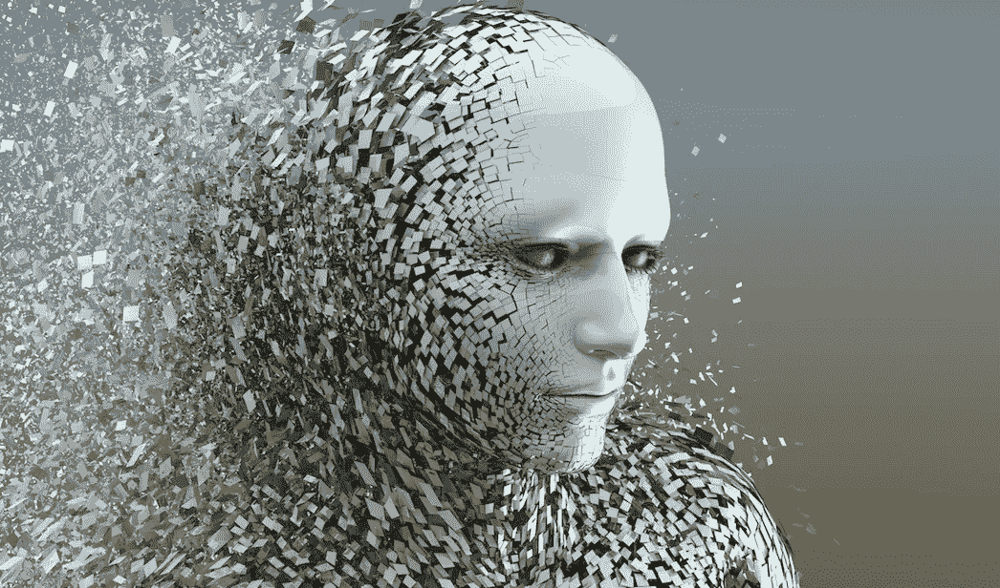
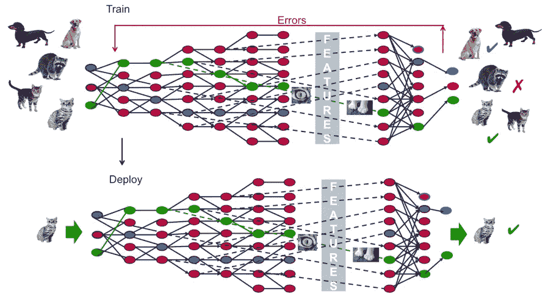

# 机器学习、人工智能和深度学习的区别

> 原文：<https://medium.datadriveninvestor.com/difference-between-machine-learning-artificial-intelligence-and-deep-learning-ea2a9b6d0d02?source=collection_archive---------22----------------------->

如今，人工智能、机器学习和深度学习是每一项现代技术的支柱，也是未来即将到来的技术的支柱。它们背后的基本思想是做一项只能由人类完成的任务，或者像人脑一样工作。

> 那么，**人工智能，机器学习，深度学习都一样吗？**

 [## 人工智能与创造力:梦想成真——数据驱动的投资者

### 人工智能总是让我着迷。不仅作为一套有用的工具，不断发展，而且作为一个…

www.datadriveninvestor.com](https://www.datadriveninvestor.com/2019/01/28/ai-creativity-deep-dream-comes-true/) 

实际上不是，他们可能有相同的背景，但他们并不相同。*人工智能是机器学习和深度学习的根源。*人工智能细分为机器学习和深度学习。

在机器学习中，我们实际上是让机器从已知的输入数据及其结果中学习特定类型的情况，并根据其学习经验预测未知数据在类似情况下的结果。深度学习也是如此。

机器学习和深度学习的区别在于它们的工作方式。在机器学习中，模型将空间中的数据分解成实例或数据点，然后通过形成树或通过形成可以分类两个或更多实例的决策边界平面，或通过计算损失来预测结果并将其与原始结果进行比较，然后以在每次迭代结束时预测后最小化损失的方式再次迭代该过程，来尝试对它们进行排序。在深度学习中，概念是按层分解数据，层越深，它对特定实例的细节了解得越多，其预测就越准确，尽管深度不应该太深，否则会给出不好的结果。

*虽然机器学习和深度学习模型都可以通过图像或音频数据等复杂数据集进行训练，但深度学习尤其适用于图像和音频数据集，因为其通过深层进行学习的方法可以获得更好的精确度和准确性。*

准确性在机器学习模型中起着主导作用，它与模型的性能成正比，而在深度学习中，它也起着至关重要的作用，但它与模型的性能不成正比。这是因为如果深度学习模型被训练来对狗进行分类，并且该模型的训练精度是 1，如果该模型针对脸上有抓痕的狗进行测试，则它不会将其识别为狗。这是因为数据相对于训练数据的微小变化会给出错误的结果。在深度学习的情况下，准确度为 80%或 90%的模型可能比准确度为 100%的模型更好。该模型变得高度敏感。

机器学习和深度学习的概念都围绕着这样一个概念，即它们可以针对特定的实例或情况进行训练，并且只能预测这种情况的结果，但人工智能围绕着这样一个概念，即建立一个模型来执行所有类型的任务，而不管情况如何。人工智能模型也从测试阶段产生的错误中学习，这当然不是机器学习和深度学习的特征。就像人类的大脑一样，它们总是处于一个学习阶段。

如果机器学习或深度学习模型被训练成打网球，那么它只能打网球，如果被要求打板球或足球，那么它可能会以最糟糕的方式比赛，因为它对板球或足球一无所知。然而，一个人工智能模型被训练打网球，并被要求踢足球或任何其他游戏，那么它可能会在开始时犯错误，但很快它会学习它正在玩的当前游戏，并会以尽可能最好的方式玩，不仅如此，它还能够区分它与它被训练的游戏不同，并存储学习到的信息，以便将来在学习到的情况下犯更少的错误。

> 人工智能是机器学习和深度学习之母

人工智能模型是指能够像人脑一样工作、思考和反应的模型。机器学习模型意味着一个人，他的大脑只被训练对特定类型的情况做出正确的反应。深度学习模型意味着人类的大脑只被训练对特定类型的情况做出正确反应，但这次人类可以通过眼睛看到情况，分析并判断其结果。

请在下面评论，让我知道你对这个话题的看法