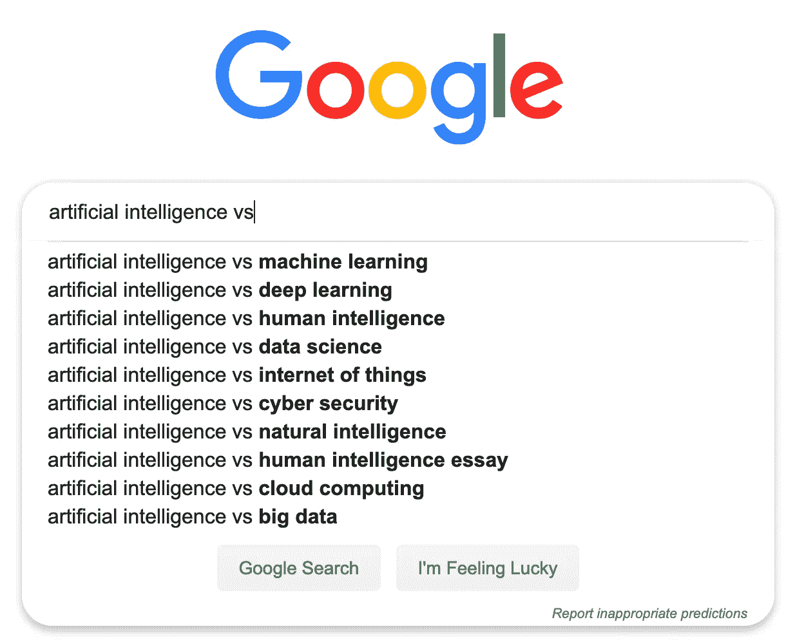
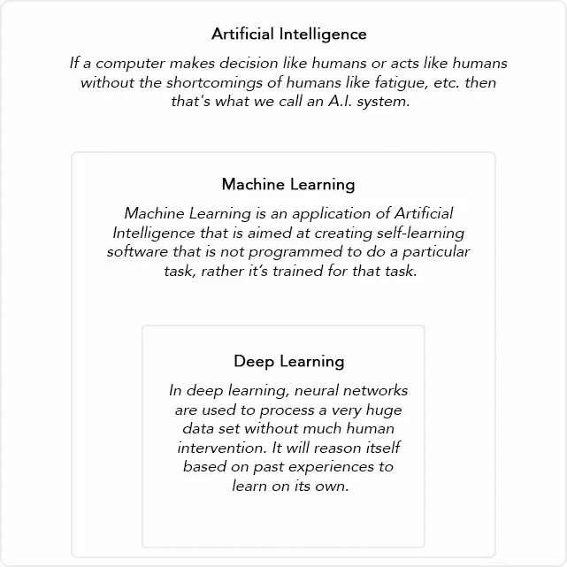

# 机器学习的追求

> 原文：<https://medium.datadriveninvestor.com/difference-between-ml-ai-dl-23db64f7aa2?source=collection_archive---------2----------------------->

[](http://www.track.datadriveninvestor.com/1B9E)

在这里，我们将清除机器学习、人工智能和深度学习之间的巨大困惑。

*由***# GirlDressedInCode**


“What is important is to spread confusion, not eliminate it.” ― Salvador Dalí

在之前的帖子中，我们了解到—

> [什么是机器学习？为什么它会在这里？这是常见的应用——还有额外的人机对话。](https://medium.com/@rashmisangwan/pursuit-of-machine-learning-introduction-dc58744eb3e9)

*在这篇文章中，我们将关注当今互联网上最普遍的困惑。*



*每当人们听到这些流行语——****人工智能、机器学习和深度学习*** *时，都会认为这些词的意思都一样，可以互换使用。网上的很多文章都是这样写的。你是其中之一吗？*

[](https://www.datadriveninvestor.com/2019/02/08/machine-learning-in-finance/) [## 金融中的机器学习——数据驱动的投资者

### 在我们讲述一些机器学习金融应用之前，我们先来了解一下什么是机器学习。机器…

www.datadriveninvestor.com](https://www.datadriveninvestor.com/2019/02/08/machine-learning-in-finance/) 

> 什么事？然后，继续读下去。你今天有很多要学的。
> 
> 没有吗？没问题。对你来说也有好东西。

# 人工智能

```
**Artificial Intelligence** (A.I.) is the theory and development of computer systems able to perform tasks normally requiring human intelligence, such as visual perception, speech recognition, decision-making, and translation between languages.*- Wikipedia*
```

> 简单来说，如果计算机像人类一样做决定或像人类一样行动，而没有人类的缺点，如疲劳等。那就是我们所说的人工智能系统。

自 20 世纪 50 年代以来，*人工智能*遭受了很多失望和资金的损失( *A.I. Winter* )。但是最近曝光率和知名度都很高。我们现在还不能建立一个合适的人工智能，但是我们已经取得了很大的进展。人工智能的一个例子是今天最先进的人工智能模型 ***索菲亚*** 。

人工智能的缓慢发展仅仅是因为要弄清楚如何开发一个能够—

*   创造力
*   整体理解
*   抽象能力
*   建模
*   想象
*   突出的
*   预言；预测；预告

人工智能是一个非常庞大的科学领域，我们有很多东西要探索。到目前为止，我们所做的大部分开发都是在机器学习领域。

> 如果你想成为一个爱因斯坦或牛顿，一定要跟上人工智能。在这一领域还有许多东西有待发现。

在我们继续之前，值得一提的是为人工智能系统设计的第一个测试。

```
If a human judge is engaged in a natural language conversation with a computer where he **cannot reliably distinguish machine from human**, the machine passes the test. Responses from both participants in the conversation are received in the form of a text-only channel.*- Alan Turing (1950s)
[Father of theoretical computer science and A.I.]*
```

# 机器学习

机器学习(人工智能的一个子集)是一个研究领域，它赋予计算机在没有明确编程的情况下学习的能力。我们在之前的帖子中已经讨论了很多关于机器学习的内容，来看看吧—

> [什么是机器学习，为什么它首先出现在这里，以及它的常见应用——还有额外的人机对话](https://medium.com/@rashmisangwan/pursuit-of-machine-learning-introduction-dc58744eb3e9)

*机器学习本身大致分为两个部分——*

1.  *数学模型*
2.  *深度学习模型*

# 深度学习

深度学习(机器学习的子集)的工作方式类似于我们的大脑，使用网状网络，技术上称为 ***深度神经网络*** 。

就像我们的大脑识别模式来分类事物，并从错误中学习一样— *深度学习也是如此*。它将未知数据与已知数据进行比较，从而对其进行相应的分类。

> 这就像一个 4 岁的孩子区分苹果和橘子的推理一样。


这一切都是通过开发一个深度神经网络并通过它处理数据来完成的……咄！！！

冷静……让我们来看一个问题，以便更清楚地理解它——

> **问题:**我们有一个动物图像的数据库，然后我们必须找到哪个图像属于哪个动物。

## 机器学习中的数学模型—

1.  定义用于区分动物的动物特征集。比如头发的颜色，牙齿、眼睛、耳朵、角的形状等等。(*特征提取*
2.  图像数据库被预处理以处理不一致的、空的和无效的数据。(*预处理*)
3.  一部分数据库图像然后被传递给模型(*又名训练数据*)。
4.  模型根据提供的训练数据进行训练，并识别特征，最终为动物分类做好准备。
5.  另一部分数据库图像用于测试模型是否训练正确(*又名测试数据*)。
6.  经过训练的模型很可能不够精确，需要工程师多次介入以减少整体误差。
7.  工程师方面需要大量的数据标记和标签来帮助训练模型。

## 机器学习中的深度学习模型—

在深度学习中，需要非常庞大的数据集，而不需要特征提取和预处理。因为它先行一步，自动识别哪些特征对特定动物的分类很重要。它的工作原理是:

1.  创建一个*深度神经网络模型*来比较未知数据和已知数据集。
2.  模型识别与寻找动物最相关的边。
3.  模型建立一个层次结构来找出它能找到的形状和边的组合，例如。颜色是黑还是白，角的形状等等。
4.  在复杂特征的这种分级识别完成后，模型然后决定这些特征中的哪些负责识别动物。
5.  模型被越来越多地训练以获得最佳效率。

> 查看[围绕赛道](https://www.youtube.com/watch?v=wL7tSgUpy8w)的神经网络赛车，了解更多信息。

> 在深度学习中，神经网络用于处理非常庞大的数据集，而无需太多的人工干预。它会根据过去的经验进行自我推理，进行自我学习。
> 
> 鉴于，
> 
> 在数学模型中，预处理和特征提取是在数据集上完成的。然后使用一些数学模型对样本数据集进行训练，为了提高效率，需要人工干预。

## 奖励——没有机器学习——[点击这里的链接](https://medium.com/@rashmisangwan/pursuit-of-machine-learning-introduction-dc58744eb3e9)

注意事项—

1.  *深度学习模型的准确性优于数学模型。但是我们不知道它到底是如何工作的。就像一个黑匣子。*
2.  *深度神经网络处理数据需要大量的计算能力。随着硬件的进步，尤其是 GPU(图形处理单元)，现在变得容易多了。*
3.  *深度学习在决策方面的工作方式与人脑相似。*
4.  *数学模型和深度学习模型，都有它的用例。对每个应用程序使用单一的方法并不明智。我们将在以后的文章中学习如何在各种算法中进行选择。*

# 摘要

在这篇文章中，我们看了人工智能、机器学习和深度学习之间的区别。



*   *深度学习是机器学习的一种。*
*   *机器学习是人工智能的一个应用。*
*   *人工智能遥不可及。(开玩笑……*🤣 *)*

现在所有这些事情都清楚了——天空看起来更加晴朗了。

在接下来的文章中，我们将了解各种机器学习算法。敬请关注。

< [上一张](https://medium.com/datadriveninvestor/pursuit-of-machine-learning-introduction-dc58744eb3e9) — | — [索引](https://medium.com/datadriveninvestor/pursuit-of-machine-learning-introduction-dc58744eb3e9) — | [下一张](https://medium.com/datadriveninvestor/classification-in-machine-learning-f5f677972a77) >

这是 **#GirlDressedInCode** 暂时结束。Ttyl。👍🏻

> 吃吧。睡觉。代码。重复一遍。👩‍💻