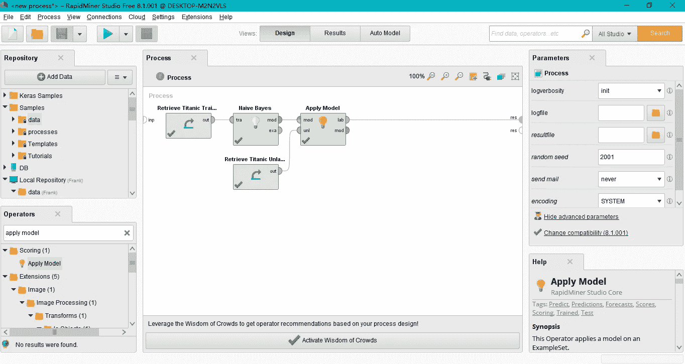
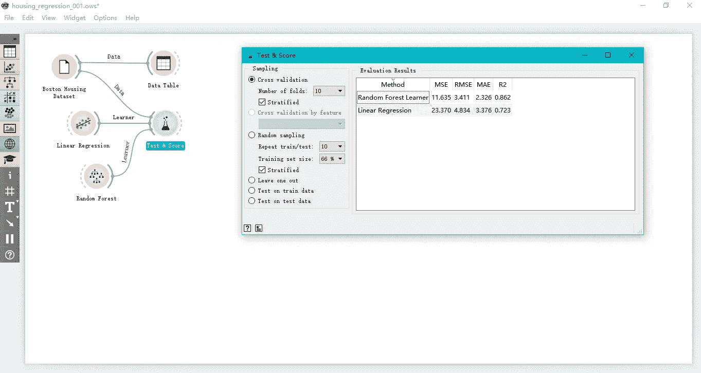
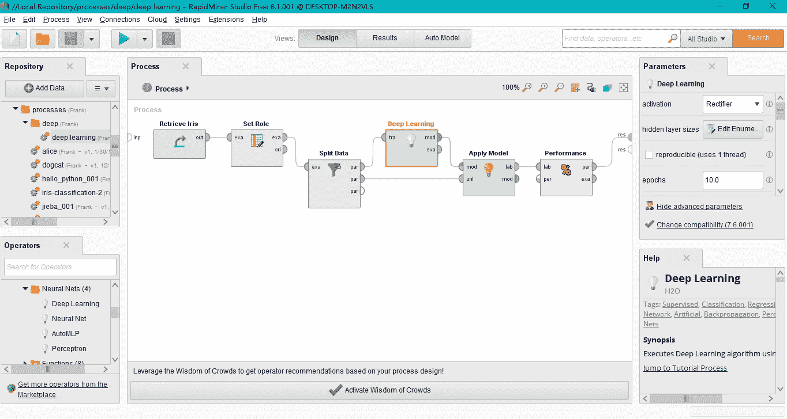
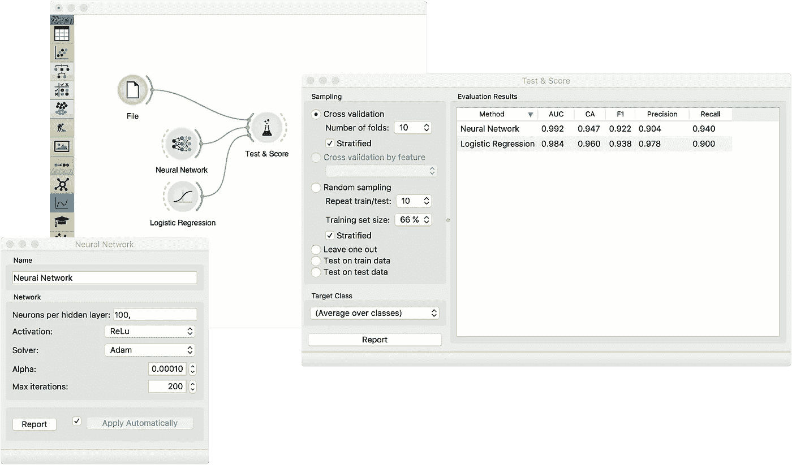
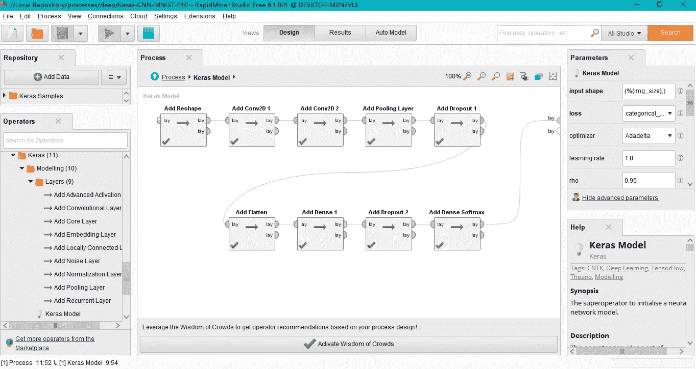
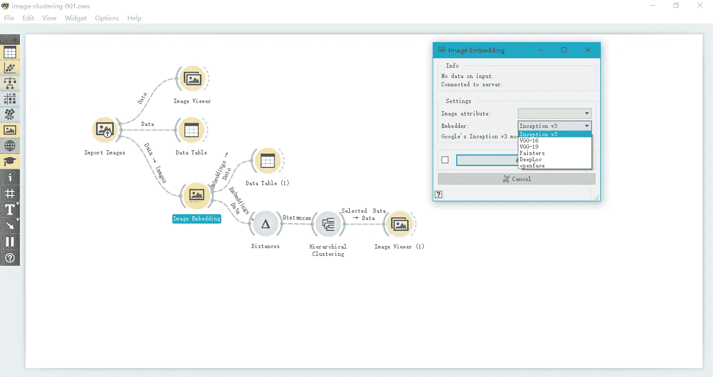
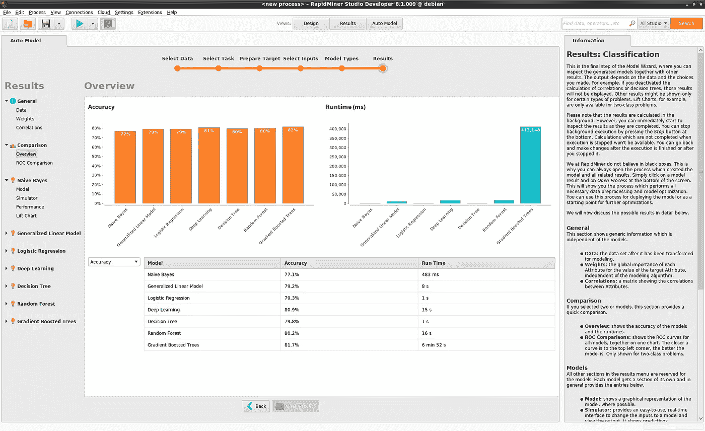

# 可视化编程环境中支持深度学习的不同方法

> 原文：<https://medium.datadriveninvestor.com/different-approaches-to-support-deep-learning-in-a-visual-programming-environment-c5c487ba4c7b?source=collection_archive---------0----------------------->

## RapidMiner 和 Orange 中的深度学习简评

最近跑进了两个数据科学和机器学习的可视化编程环境: [**RapidMiner**](https://rapidminer.com/) 和 [**Orange**](https://orange.biolab.si/) 。这两个系统都允许用户以类似 LEGO 的方式构建数据科学或机器学习解决方案，即拖放组件来构建包括数据准备、建模、评估、验证、可视化等在内的流程。**图 1** 和**图 2** 分别展示了 **RapidMiner** 和 **Orange** 中的示例。

*   **图 1** 显示了 **RapidMiner** 中的一个过程，该过程使用朴素贝叶斯模型来解决具有巨大生存数据集的分类问题。
*   **图 2** 显示了 **Orange** 中的一个流程，该流程使用线性回归和随机森林来解决 Boston Housing 数据集的回归问题，并显示了性能结果。

**Figure 1\. Classification on RapidMiner**

**Figure 2\. Regression on Orange**

关于这些可视化编程环境的一个有趣的问题是，这些系统应该如何实现深度学习机制，以不仅支持对结构化数据的分类或回归，还支持复杂的应用，如[图像识别](http://cs231n.stanford.edu/)、[自然语言处理](http://web.stanford.edu/class/cs224n/)、[视觉问题回答](https://github.com/JamesChuanggg/awesome-vqa)、[生成模型](https://blog.openai.com/generative-models/)等等。通常深度学习的研究人员和从业者对 Tensorflow、Keras、Torch/PyTorch、Caffe/Caffe2、MXNet 等[深度学习软件库](https://en.wikipedia.org/wiki/Comparison_of_deep_learning_software)比较熟悉。然而，设计一个可视化编程环境来支持深度学习初学者和深度学习专家，需要一套设计选择。这篇文章简要描述了 **RapidMiner** 和 **Orange** 中关于深度学习的四种方法。

1.  ****rapid miner**和 **Orange** 中的**
2.  ****rapid miner 的 Keras 扩展**中的【作为组件的层】**
3.  **【特征提取组件】**在**桔子的图像嵌入中**
4.  ****rapid miner 汽车模型**中的**

**认领**:本帖呈现我在 **RapidMiner** 和 **Orange** 深度学习的亲身经历。它不是关于这个主题的全面调查，也不是对这些解决方案的认可。

# **作为组件的多层感知器**

**RapidMiner** 和 **Orange** 都支持**多层感知器组件**方法，其中层数和神经元数量可以由用户指定。

*   如图**图 3** 所示， **RapidMiner** 使用术语*深度学习*来指代一个多层感知器，它是使用 **H2O** 中的库来实现的。
*   如图**图 4** 所示，**橙**用术语*神经网络*指代一个多层感知器，它是用 **Scikit-Learn** 中的库实现的。

**Figure 3\. The “Deep Learning” Component in RapidMiner**

**Figure 4\. The “Neural Network” Component in Orange**

# RapidMiner 的 Keras 扩展

**RapidMiner** 已经实现了一种**a-layer as-a-component**方法来将 [**Keras**](https://keras.io/) 集成到其平台中。如图**图 5** ， **RapidMiner** 允许用户拖拽一个卷积层作为组件，一个汇集层作为组件，一个脱落层作为组件等。在撰写本文时，RapidMiner 只支持 Keras 中的[顺序模型，不支持 Keras](https://keras.io/getting-started/sequential-model-guide/) 中的[功能模型。然而，这种**a-layer as-a-component**方法在构建多输入/多输出模型方面有很大的潜力。](https://keras.io/getting-started/functional-api-guide/)

**Figure 5\. RapidMiner’s Keras Extension**

# 奥兰治的图像嵌入

使用[预先训练好的模型](https://keras.io/applications/)来提取一幅或多幅图像的特征，然后进行图像分类或图像聚类是深度学习中的常见做法。 **Orange** 已经在它的*图像嵌入*组件中实现了这样的特征提取机制，它涵盖了一些最先进的预训练模型，如 **Inception v3** 、 **VGG16** 和 **VGG19** 。**图 6** 给出了一个关于特征提取和图像聚类的完整例子。下面的教程视频很好地概述了整个过程。

**Figure 6\. Image Embedding in Orange**

# RapidMiner 的汽车模型

[自动化机器学习](https://github.com/hibayesian/awesome-automl-papers)在机器学习社区和深度学习社区都是一个活跃的研究领域。 **RapidMiner 的自动模型**是自动化机器学习的一个很好的例子，它可以自动选择不同的模型来执行分类、回归、聚类和离群点检测。如图 7 所示， **RapidMiner** 使用七个机器学习模型来处理泰坦尼克号生存数据集上的分类问题。注意，“*深度学习*”(指的是“*多层感知器*”)就是这七个机器学习模型之一。下面的教程视频很好地概述了 **RapidMiner 的汽车模型**。

**Figure 7\. Auto Model in RapidMiner**

# 结论

这篇文章简要回顾了在可视化编程环境或基于拖放组件的软件中支持深度学习的不同方法。具体来说，我们研究了 **RapidMiner** 和 **Orange 采用的四种方法:(1)将整个网络作为一个组件，(2)将单层作为一个组件，(3)将特征提取作为一个组件来实现，以及(4)在自动化过程中提供深度学习。尝试不同的方法来解决不同的问题是令人兴奋的。然而，这些方法肯定不能覆盖深度学习的全部范围。比如 **RapidMiner** 和 **Orange** 都不能支持**生成式对抗网络**或者**视觉问答**。但是，我们可以看到 **RapidMiner** 和 **Orange** 背后的人在将深度学习放入他们的系统方面做出了巨大的努力。如果您有任何意见，请随时告诉我。谢了。**