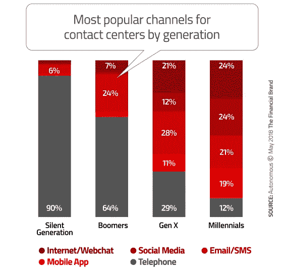
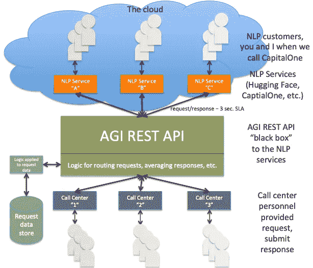
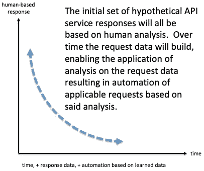
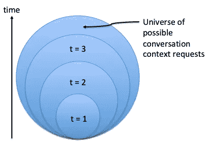

# 区分自然语言处理和 NLG 对话的高质量响应

> 原文：<https://medium.datadriveninvestor.com/differentiating-nlp-and-nlg-conversations-with-quality-responses-48bbf6475f19?source=collection_archive---------9----------------------->

Photo by [Alex Kotliarskyi](https://unsplash.com/photos/QBpZGqEMsKg?utm_source=unsplash&utm_medium=referral&utm_content=creditCopyText) on [Unsplash](https://unsplash.com/search/photos/call-center?utm_source=unsplash&utm_medium=referral&utm_content=creditCopyText)

## 改善 NLP 客户体验的商业模式

在我的上一篇文章中，[AGI 增强自然语言处理](https://becominghuman.ai/natural-language-processing-augmented-with-agi-40f61693c0d8)，我提供了一些关于像 Alexa 这样的服务如何工作的见解，并暗示了这一细分市场的重要性和预期增长。我最后说:

> 请继续关注，关于支持人工智能深度学习和自然语言处理和生成，并辅以通用智能 REST 应用程序编程接口，以及如何在不久的将来实现这样一个 API 的主题，还有更多文章要写…

在开始之前，让我们先了解一下缩写和定义。

*   人工智能
*   AGI:人工通用智能
*   DL:深度学习，构建神经网络计算机模型来有效解决模式匹配问题的领域
*   NLP:自然语言处理——在本文中，依赖于人工智能模型
*   NLG:自然语言生成——在本文中，依赖于人工智能模型
*   REST:表述性状态转移 web 服务的通用请求/响应 API
*   API:一个应用编程接口实现
*   “黑匣子”“一种设备、系统或物体，可以根据其输入和输出(或[传递特性](https://en.wikipedia.org/wiki/Transfer_function))来查看，而不需要了解其内部工作原理”[维基百科](https://en.wikipedia.org/wiki/Black_box)
*   SLA:服务水平协议，或者服务已经建立的用于测量的性能定义，或者定义其操作的性能标准

这种连接应该被认为是一种对话，一种为现有 NLP 提供商补充信息的可能方法的探索，使他们能够解决他们的 AI DL NLP 响应，这些响应超出了 DL NLP 培训，以便提供改进的基于 NLP 的客户响应和体验。当然，这个假想的 AGI REST API 服务的最初实现不是 AGI。我想澄清这一点，然而，作为一个 AGI API“黑盒”,它确实完成了:

1.  为 NLP 提供商提供 AGI REST API“黑盒”服务，这种服务能够改善对客户对话的响应，起初是一个小范围，随着时间的推移而增加
2.  NLP 提供者会有一些东西，他们可以从这些东西开始回答这个问题，“我们如何将 AGI REST API 集成到我们的 NLP 模型中？”如果只是作为一个初步的探索，比如说成本/收益分析
3.  数据和分析结果将使一种类型的 AGI 以更快的速度发展，同时由于规模经济，以更低的成本提供更高的 NLP 质量，数据由 NLP 生态系统提供，这是这种假设的实现所固有的。换句话说，这个基本的起点将资助并最终促成一种形式的 AGI

自从写了上一篇文章之后，几乎每天都有关于 NLP 空间的新文章。我还联系了我在大型“人工智能即服务”提供商的联系人，以学习和了解他们在改善 NLP 结果方面的情况，并从他们的反馈中获得这种假设方法。结果很有趣。我明白了:

1.  一些联系人很快就消失了，虽然不是全部。嗯。一句由衷的“谢谢！”给那些回复我的聊天请求的人。
2.  有一个重点是什么被认为是较低的人工智能需求，可以更容易地解决，从而产生一个更直接的基于人工智能的收入流。换句话说，这不是他们现在认为的一个重要的业务差异化领域。

在这篇文章中:

*   我将分享过去几周的研究数据，主题为“是否有足够的市场需求来证明 NLP 提供商的经济实惠的解决方案，他们的客户对话超过了他们的 AI DL 培训，目标是支持改善客户体验？”
*   一个假想的“第一阶段”AGI REST API 业务模型，它将解决一小部分对话“泛化”问题，但仍处于规模化阶段
*   “第一阶段”AGI REST API 模型
*   用一个结论和一些额外的支持想法来结束它

## **NLP 市场:AGI REST API 需求**

NLP 市场涵盖了大量的垂直行业，从银行到医疗，再到娱乐，几乎涵盖了日常活动的每个方面，这意味着 NLP 是一个巨大的市场。

[自然语言处理市场预计到 2021 年价值**160.7 亿美元**](https://www.marketsandmarkets.com/PressReleases/natural-language-processing-nlp.asp) **，到 2025 年价值**[**【223 亿美元**](https://www.tractica.com/newsroom/press-releases/natural-language-processing-market-to-reach-22-3-billion-by-2025/) 。

有很多 R&D 进入了 NLP 领域。理解语言的细微差别是人工智能的下一个巨大挑战。毫无疑问，理解语言的细微差别也是这个假想的 AGI REST API 服务的中心目标。

拥抱脸甚至建议作为他们视觉对准的一部分:

> [“…5 年后，每个人都将每天与人工智能对话…”](https://angel.co/hugging-face/jobs/357929-software-engineer)

这是否意味着在未来 5 年内，拥抱脸预计将有 75 亿人在一天中的某个时刻与 NLP 互动？**75 亿是一个非常大的潜在市场总量**。这或许可以解释为什么有这么多投资追逐 NLP。下面是一篇文章的链接，列出了播种和发展这个领域的风险投资和投资角度，恰当的标题是“**跟着钱走**……”。请务必在这篇文章的末尾查看“附录 I: CB Insights 对 AI M & A 活动的概述”，这非常令人大开眼界。

[跟钱走:见对话 AI 的投资人](https://chatbotslife.com/follow-the-money-meet-the-investors-of-conversational-ai-47aea60a2688)

关于聊天机器人市场的增长:

> …(聊天机器人)的存在预计只会增长，Gartner 称，到 2020 年，25%的客户服务运营将使用聊天机器人或虚拟客户助理。
> 
> **使用聊天机器人的企业报告说客户满意度提高了**——但是一个好的客户体验难道不是有一个风度翩翩、训练有素的人参与的吗？
> 
> [不管你喜欢还是讨厌故障聊天机器人，它们对小企业有很大好处](https://www.forbes.com/sites/nigeldavies/2019/01/14/love-or-hate-glitchy-chatbots-they-are-first-step-in-business-automation/#6f772fc15bfd)

在所有使用或计划使用人工智能 NLP 的垂直行业中，银行业正以令人印象深刻的活力拥抱这项技术，并且理由充分。请查看以下关于银行业人工智能和自然语言处理的简要概述:

> 千禧一代的消费者比老一代人更愿意联系他们的银行或信用合作社，而不用与真人交谈。90%的沉默一代(出生于 1925 年至 1945 年)更喜欢通过电话获得人工服务，而只有 12%的千禧一代喜欢电话，几乎所有其他人都在寻找聊天、社交或短信渠道。

> [**Finn AI**](https://www.finn.ai/) 是一家加拿大公司，为金融机构提供聊天机器人，该机器人可以集成到遗留的核心系统和 Facebook Messenger 等对话应用程序中。他们目前正在与四大洲的一级和二级银行合作，以自动化超频繁的前台任务，并将支持人员在此类活动上花费的时间减半。
> 
> …您可以期待看到更多的金融机构推出改善消费者体验的**对话界面** …
> 
> [*人工智能和银行业的 1 万亿美元机遇*](https://thefinancialbrand.com/72653/artificial-intelligence-trends-banking-industry/)

显然，NLP 是银行业现在和未来的客户体验。然而，尽管银行部门在 NLP 方面非常积极，但 NLP 的响应能力存在非常实际的限制，这将影响客户体验。人工智能自然语言处理的反应受到训练的限制。当客户对话超出 AI NLP 培训时，NLP 响应会受到限制，从而影响客户体验。下面有几个参考文献解决了当今 NLP 的局限性。

为了更好地了解 NLP 的现状，请访问 [NLP Progress](http://nlpprogress.com/) 网站。

## **假设 REST API 服务的财务模型**

让我们为假设的 AGI REST API 构建一个财务模型，它:

1.  展示了这个假设的 AGI REST API 服务的价格、利润和成本
2.  其“dials”可以应用于多种实现，无论是订阅、按使用付费还是某种其他收入模型。

因为我们才刚刚开始，所以让我们从一些非常基础的东西开始，尽量保持这个初始模型简单。假设 API 的消费者为每秒的请求时间付费。让我们定义这个假设的 AGI REST API 服务的消费者。该服务旨在为超过 NLP 训练数据的对话数据提供人类洞察力，因此服务的消费者是 NLP 实现者。

作为一个 NLP 解决方案提供商，这个假设的 AGI REST API 的使用者的使用场景是，NLP 流程已经到达其工作流中的一个点，它已经确定“对话”已经超出了它的训练范围，并且希望对对话有更多的了解，以便用一些有意义的东西来响应他们的客户，从而提供出色的客户体验。在这个提议的实现中，NLP 进程将向假设的 AGI REST API 发送一个请求。由于消费者对响应有时间限制，NLP 请求者正在等待，以便它可以完成其任务，因此，让我们创建一个完全任意的，但有点合理的 3 秒的服务级别协议(SLA)响应时间。为了让这个模型尽可能简单，现在，让我们假设服务对每个请求每秒收取两便士。因此，根据 SLA，AGI REST API 客户可能期望支付的最大金额是 2 便士乘以 3 秒，或者每个请求 6 美分。

我们还可以说，我们提供响应的成本是每秒每请求 1 美分。在这个过于简单的模型中，**产生了每秒 1 美分的差额**。

这是参考下面的服务实现模型解释的一个好点，因为它说明了假设的服务将如何降低消费者连接成本。下面的便士模型只是为了说明一个假设的收入模型，作为未来探索的基线。

只是回顾一下基本模型，作为我们谈话的起点:

*   收入:0.02 美元/请求秒
*   费用:0.01 美元/秒
*   保证金:0.01 美元/秒

众所周知，一天有 864000 秒。我让你做一年的数学。目前，这个每秒两美分的使用量、每秒一美分的成本和每秒一美分的利润的简单模型足以为这个主题上任何看起来合适的变化打下基础。假设你坚持 1 美分/秒的利润，并改变了收费和成本。在 1 美分/秒的利润率下，这个假设的模型“感觉”像是一个相对强大的业务，每秒有数千个请求。

假设这个假设的实体在第一年只能参与并帮助 1 个 NLP 提供商，比如像[拥抱脸](https://huggingface.co/)这样的实体。拥抱脸每天有超过一百万条信息。如果拥抱脸在 3 秒 SLA 下仅使用这一假设服务的百万条消息的 1/100，拥抱脸的成本为每请求响应秒 2 美分，则它将等于每 SLA 2 美分/秒 X 3 秒 X 10，000 条消息(每天百万条消息的 1/100)或当天大约 600 美元。随着时间的推移，这一成本有望大幅下降。有关如何降低成本，请参见下面的“实施思路”一节。预计第一年后，由于 AGI REST API 提高了效率，每 10，000 个请求的成本会下降 1/10 到 60 美元。这对拥抱脸来说是一笔很大的交易，可以帮助他们向客户提供改进的消息响应，支持他们的 10x(来自拥抱脸软件工程师的招聘广告)改进目标。事实上，这个假设的实体可能会签订一个浮动比例协议，保证每个请求的成本会随着时间的推移而降低。

为什么[拥抱脸](https://huggingface.co/)会考虑使用这项假设的服务？答案就在他们的软件工程师职位描述中:

> “…您的任务将是在这个系统的基础上进行构建，并**让它变得更加智能 10 倍。**”
> 
> [https://angel.co/hugging-face/jobs/357929-software-engineer](https://angel.co/hugging-face/jobs/357929-software-engineer)

拥抱脸的目标是在一项具有非常真实的“一般化”约束的技术内将他们的响应提高 10 倍！

更多来自[拥抱脸](https://huggingface.co/):

> “我希望聊天机器人([拥抱脸](https://huggingface.co/) ) **会随着时间的推移变得越来越好，因为公司可以开始聚合对话数据**。**这可能会把拥抱脸从伟大的初次体验变成持久的友谊**。
> 
> [https://TechCrunch . com/2017/03/09/抱抱脸想成为你的人造人-bff/](https://techcrunch.com/2017/03/09/hugging-face-wants-to-become-your-artificial-bff/)

可以说，拥抱脸表达了改善其自然语言处理反应的充分理由。拥抱脸需要把最初的第一次变成“持久的友谊”上述每天美元的假设情景似乎是一个合理的数额，可以帮助拥抱脸实现 10 倍的改善目标，将他们的第一次经历转变为“持久的友谊”

拥抱脸只是在 NLP 差异化需求的海洋中希望提高他们的 NLP 返回值的一个实体。他们的目标非常真实，也非常艰难，因为风险投资资助的初创企业非常有动力去利用他们所能利用的一切来实现他们的目标。

或者，考虑一下最近构建了自己的 NLP 解决方案的[capital one](https://medium.com/capital-one-tech/capital-ones-intelligent-assistant-why-we-built-eno-s-nlp-tech-in-house-8c0007c3c102)。

> “…Eno，Capital One 的智能助手，我们决定构建自己的自然语言处理(NLP)技术。能够在一个深刻理解金融服务术语的平台上构建 Eno 非常重要，**这使我们能够为用户提供最佳体验**。 **Capital One 致力于在每次与客户互动时提供以人为本的体验。**

Capital One 使用可负担的服务来帮助他们在按需基础上实现目标的动机(假设的按需 AGI REST API)在上面已经非常清楚地陈述了，“ **Capital One 致力于在每次与客户互动时提供以人为中心的体验。**

通过这两个例子可以看出，NLP 提供商在客户交互过程中需要时可以利用按需服务，这也是 segway 进入这一财务模型的原因。

考虑上面的模型，我们从拥抱脸开始，然后添加了 CapitalOne。如果上面关于 AGI REST API 服务以每秒 2 美分的初始价格使用的论点有道理，那么每秒请求数的假设实体目标可能保守地看起来像这样:

*   第 1 年末:平均每秒 10 个连接请求，平均每秒 1 美分
*   第 2 年末:平均每秒 20 个连接请求，平均每秒 1 美分
*   第 3 年末:平均每秒 100 个连接请求，平均每秒 1 美分

以此类推……在第四年末，收益倍数为的“以此类推”就是风险投资赚钱的地方。到第 4 年，在根据对前 3 年的请求数据的分析改进其支持流程并增加人工智能响应后，这将使其能够降低其定价结构并扩大其消费者基础，这一假设的 AGI REST API 服务预计将每秒提供数千个响应。

让我带着一个想法离开财务模型探索。另一种看待这项服务的方式类似于土地储备投资模式。可能只是这个假设的 AGI REST API 实体的价值是长期的，而不仅仅是上面提到的短期收入:

1.  率先进入 AGI 市场，其商业模式适合“现在”(或基础设施建成后)使用，支持一个面向未来发展的行业
2.  它正在收集的底层数据，这些数据使它能够增长，并在其消费者生态系统中提供相应的自动响应

## **假设的“第一阶段”AGI REST API 模型**

这个概念是从“简单”开始，通过构建一个近似的模型来实现我们今天想要达到的目标。由于 AGI 是人类直觉的代表，AGI 的近似值被提议作为模型最终要模拟的人类元素。这个想法是将人的元素包装在 API 中，这样对于 API 消费者来说，响应看起来就像他们期望从 AGI 实现中得到的一样。

Hypothetical REST service API for human insight responses

Over time, as the request data builds, it enables analysis and aggregation of request types for future response automation — driving toward a true AGI with time.

The bubble “t=1” illustrates that the initial set of responses will be a focused subset of conversational context possibilities. With time, the subset will grow to “t=2” and then “t=3”.

上面的三张图说明了最初的 API 请求响应集合最初将被限定在一个非常小的会话“类型”子集的范围内，以确保最初的成功，同时为服务消费者提供价值。这既确保了最初的成功，又使数据能够确定何处增长。随着时间的推移，随着会话请求数据的增加，子集将会增长，从上面的 t=2 到 3，从而为 NLP REST API 消费者提供更大的价值。

## **结论**

NLP 市场是:

1.  在其初期
2.  与寻求通过产品/服务对话质量实现**差异化以支持改善客户体验的提供商竞争激烈**
3.  非常非常大的人工智能领域，从金融服务到娱乐和游戏，再到独特的独立服务(比如拥抱脸)
4.  然而，NLP 只是人工智能领域中受到“泛化”问题约束的一个垂直方向。这意味着，人工智能“通用化”API 解决方案还有其他假设的消费者，例如，自动驾驶汽车领域

在人工智能领域，该领域一些最受尊敬的领导者表示，通用化解决方案 AGI 至少还需要 10 年时间。根据我们今天的了解，10 年 AGI 解决方案的理由是合理的，但这不应该阻止提供 NLP 提供商期望从 AGI API 获得的响应的实施。

**这个假想的 AGI REST API 实体可能看起来有点像**(一个巨大的“谢谢！”致[戴夫·帕克和他的“6 个月创业”](http://www.dkparker.com/6-month-startup/)计划:

我们正在解决聊天机器人在对话上下文中存在的泛化问题，当他们的客户对话超出他们的人工智能神经网络训练时，他们需要这些信息，以便他们可以适当地回应他们的客户，**从而改善客户体验**。

我们的产品是为世界上的自然语言处理和聊天机器人提供商设计的，例如，CapitalOne 和世界拥抱脸。

我们通过每秒向我们的 AGI REST API 请求上下文的每个假设大写 1 或拥抱脸来赚钱。

我们的团队是合适的团队，因为我们拥有通过在线请求响应 REST API 服务提供基于人的上下文洞察的专业知识。

我将带着两个人工智能领导者对 AGI 的概述离开这篇文章:

杰佛瑞·辛顿和戴密斯·哈萨比斯:AGI 离现实还差得远

AGI 可能离成为现实还很遥远，尽管有了合适的创意人员、实施和投资，可能不到 10 年就能实现。

## 实现模型思想和实例

本着对话的精神，我想我应该添加一些示例来帮助构建这个假设的服务。

微软在其参与的生态系统中收集有关 Windows 10 以及设备和应用程序兼容性的数据。然后，微软使用这些数据来:

1.  了解 it、微软需要在哪些方面解决 Win10 问题
2.  对于参与的企业客户，分析服务提供这些数据来帮助参与的企业 IT 客户管理其设备和应用环境中的 Win10 升级。设备/应用洞察基于生态系统数据。

整个参与的生态系统都将从这些共享的基础数据中获得洞察力。

Sift Science 提供了一个概念上类似的生态系统模型，以帮助其客户应对欺诈风险。Sift Science 利用其生态系统中的数据，在客户请求后几毫秒内提供欺诈风险分析。

> [“我们的模型从来自全球数千个网站和应用的实时数据中学习……”](https://siftscience.com/how-sift-works)

Sift Science 提供了一个额外的相关模型。他们的人工智能模型能够利用海量数据，然后在请求的几毫秒内提供欺诈风险值，这使得 Sift 科学基础设施模型值得理解和学习。任何提议的 AGI REST API 都需要接近类似的性能指标。

以上两个例子说明了单个企业为了自身利益而承担的成本过高的服务。相反，通过为生态系统提供服务，降低了成本，从而使整个生态系统受益。

一个提供企业费用报告服务的软件即服务(SaaS)使其客户能够简单地提供扫描/数字化的收据图像，然后这些图像被神奇地转换成公司报告系统可以使用的数据。SaaS 费用报告服务发现光学字符识别(OCR)存在某些限制问题。SaaS 的这项服务将扫描的收据拿出来，让人们阅读图像，然后将字符重新输入计算机系统。使用该 SaaS 企业费用报告服务的客户只关心他们的流程变得更简单，因为他们只需提供扫描图像，该服务就会自动将这些费用报告详细图像转换为可用于其公司报告系统的数据。

在第 1 年和第 2 年，假设的 AGI REST API 实体可能只与几个 NLP 合作伙伴一起改进初始的上下文响应集，然后随着它的响应集的增长而增长它的消费者基础。随着来自整个 NLP 生态系统的底层数据变得越来越大，对请求所提供的数据的分析将实现诸如请求/响应类型之类的东西，因此自动化响应将取代人类的洞察力，这似乎是合理的。这些见解将降低响应成本，这将传递给假设的 AGI REST API 消费者。

这个模型还有另一个有趣的元素，那就是人类潜在的洞察力。这个模型利用人类来提供对请求的洞察。人们可以想象这种人类洞察力服务通过这种“黑盒”API 实现在 NLP 领域和人工智能领域都得到发展。随着自动化取代某些已被充分理解的请求，需求集将会扩大，从而保持对人类洞察力的需求。也许 10 年后，一个真正的 AGI 将会存在。可能仍然需要人工审计。这是一个真正的人/技术混合解决方案，而不是一个人的替代解决方案。

*“Cheers!” “乾杯 / Kanpai” “Salud!” “Prost” “Salud!” “Santé!” “건배 / Geonbae” “skål” “Gesondheid” “gānbēi” “Υγεία / Yamas”*

**部分参考:**

[人工智能(AI)在商业和社会中面临的最大挑战](https://www.forbes.com/sites/bernardmarr/2017/07/13/the-biggest-challenges-facing-artificial-intelligence-ai-in-business-and-society/#1719a2692aec)

[跟着钱走:见对话 AI 的投资人](https://chatbotslife.com/follow-the-money-meet-the-investors-of-conversational-ai-47aea60a2688)

[https://venturebeat . com/2018/12/17/Geoffrey-hint on-and-demis-hassa bis-agi-nowhere-close-to-be-a-reality/amp/](https://venturebeat.com/2018/12/17/geoffrey-hinton-and-demis-hassabis-agi-is-nowhere-close-to-being-a-reality/amp/)

[https://medium . com/capital-one-tech/capital-ones-intelligent-assistant-why-we-build-eno-s-NLP-tech-in-house-8c 0007 C3 c 102](https://medium.com/capital-one-tech/capital-ones-intelligent-assistant-why-we-built-eno-s-nlp-tech-in-house-8c0007c3c102)

[https://www . Forbes . com/sites/Nigel Davies/2019/01/14/love-or-hate-glitchy-chatbots-they-is-first-step-in-business-automation/# 5 f 76d 33 a5 bfd](https://www.forbes.com/sites/nigeldavies/2019/01/14/love-or-hate-glitchy-chatbots-they-are-first-step-in-business-automation/#5f76d33a5bfd)

[https://www . technology review . com/the-download/612750/one-day-your-voice-will-control-all-your-gadgets-and-they-will-control-you/](https://www.technologyreview.com/the-download/612750/one-day-your-voice-will-control-all-your-gadgets-and-they-will-control-you/)

[2016 年至 2025 年全球自然语言处理(NLP)市场的收入，按细分市场(百万美元)](https://www.statista.com/statistics/759234/worldwide-natural-language-processing-market-revenues-segment/)

[到 2021 年，自然语言处理市场价值 160.7 亿美元](https://www.marketsandmarkets.com/PressReleases/natural-language-processing-nlp.asp)

[自然语言处理市场到 2025 年将达到 223 亿美元](https://www.tractica.com/newsroom/press-releases/natural-language-processing-market-to-reach-22-3-billion-by-2025/)

[人工智能和银行业 1 万亿美元的机会](https://thefinancialbrand.com/72653/artificial-intelligence-trends-banking-industry/)

[https://www . Google . com/amp/s/blog . Floyd hub . com/automate-customer-support-part-two/amp/](https://www.google.com/amp/s/blog.floydhub.com/automate-customer-support-part-two/amp/)

[创业公司数据科学项目流程](https://towardsdatascience.com/data-science-project-flow-for-startups-282a93d4508d)

[NLP-进度](http://nlpprogress.com/)

[自然语言处理](https://www.prnewswire.com/news-releases/natural-language-processing-300770976.html)——这份 Tractica 报告研究了 43 个 NLP 用例，确定了最适合商业使用的应用。此外，该报告详细介绍了市场趋势**和围绕自然语言处理的技术问题**，并对 2017 年至 2025 年期间的自然语言处理硬件、软件和服务进行了预测。**该报告还提到了 60 多家公司，包括 43 家主要行业参与者的详细资料。**

人工智能的下一个巨大挑战:理解语言的细微差别

[大脑智能:超越人工智能](https://link.springer.com/article/10.1007/s11036-017-0932-8)“人工智能的局限性”一节中的精彩描述

一些 NLP 提供商:

[最佳自然语言处理软件](https://www.g2crowd.com/categories/natural-language-processing-nlp)

[最高评级的 NLP 软件= SpacY](https://www.g2crowd.com/categories/natural-language-processing-nlp#highest_rated)

空间是由爆炸产生的。艾

[用 Python 和 spaCy 对 NLP 的简短介绍](https://towardsdatascience.com/a-short-introduction-to-nlp-in-python-with-spacy-d0aa819af3ad)

 [## Zalando Research 发布“天赋”——Zalando 技术博客

### 两年前，扎兰多研究发起了一个明确的目的，以确保扎兰多技术是在…

jobs.zalando.com](https://jobs.zalando.com/tech/blog/zalando-research-releases-flair/?gh_src=4n3gxh1)  [## 时尚的自然语言处理:Zalando 的自然语言处理框架——jax enter

### Shutterstock / CatwalkPhotos 谁说自然语言处理和时尚不重叠？Zalando 研究带来了…

jaxenter.com](https://jaxenter.com/zalando-flair-nlp-154250.html) 

竞争:

 [## 微信人工智能对话系统首次亮相-新华| English.news.cn

### 广州，1 月 9 日(新华社)-由微信背后的团队开发的人工智能(AI)对话系统…

www.xinhuanet.com](http://www.xinhuanet.com/english/2019-01/09/c_137731587.htm) 

️ 2019 Malcolm Dickson，保留所有权利