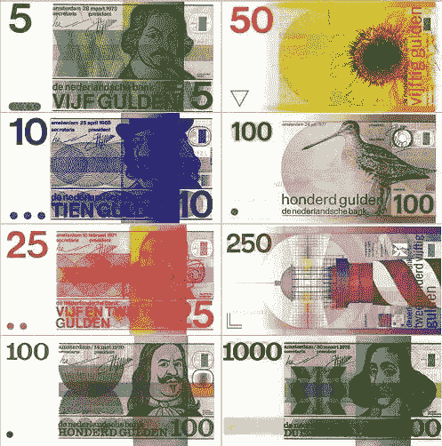
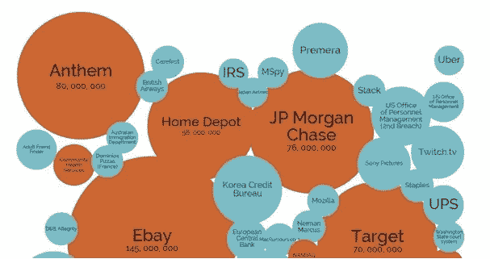

# DigiByte 将使世界符号化

> 原文：<https://medium.datadriveninvestor.com/digibyte-will-tokenize-the-world-b203e5de854d?source=collection_archive---------14----------------------->

5 年前，我收到了大约 20 张生日贺卡。
今年刚好 3。手写的，来自我妈妈，婆婆和一个老阿姨。
没必要觉得抱歉。并不是我没有那么多朋友了。
卡片正在数字化。我们通过电子邮件、手机、电报收到信件和卡片。

**世界变了。**

5 年前，我带着一个皮革钱包，里面塞满了一些色彩鲜艳的荷兰钞票。现在我有一张信用卡、一部装有银行应用程序的手机和一个装满 DGB 加密货币的 DigiByte 钱包。

世界变了。

5 年前，我使用各种文件和表格，如电话簿、保险单据和纳税申报表。现在我们使用在线页面、电子邮件附带的 PDF 文件和在线表格。

世界变了。

但这些变化也包含更大的风险。在这个新的数字世界中，安全漏洞急剧增加。大公司仍在努力解决我们个人数据的安全和保护问题。我们仍然经常在新闻中读到关于数据泄露的报道。
在当前的数据基础设施下，找到解决方案似乎相当困难，甚至是不可能的。

是时候意识到并认识到区块链技术是这个问题的解决方案了。

5 年前，DigiByte 区块链的第一个区块被开采，即所谓的 Genesis 区块。基于比特币的代码，但没有缺陷的改进，Jared Tate 创建了 DigiByte 区块链。他看到了修复当今互联网安全漏洞的机会。
今天，经过近 800 万个街区，我们迎来了它的五周年纪念日。

世界仍在变化。

今天，我们传递文件的方式已经数字化。
如今，我们转账的方式已经数字化和符号化。明天，我们转移资金、文件、票据、货物或任何东西的方式都将被令牌化。

今年 DigiByte 将发布 DigiAssets 协议。
一个符号化世界的生态系统。通过 DigiAssets 的令牌化意味着任何东西的转移。防伪，不可改变和永久记录在数码字节区块链，没有安全漏洞。

今天，我们使用不同的浏览器、电子邮件应用程序、操作系统等等。并非只有一种协议可以解决所有问题。
DigiByte 不会是世界令牌化的唯一解决方案。但我确信，由于其卓越的技术，DigiByte 可以在一个新的令牌化世界中发挥主导作用。

过去的五年是令人惊奇和兴奋的，接下来的五年更是如此。
DigiByte 已经准备好了。是吗？