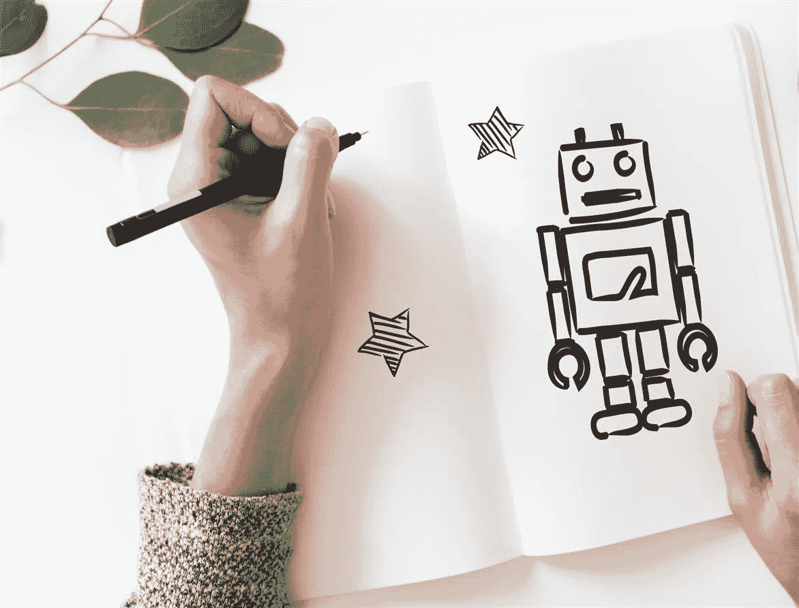

# 数码人:见见爱上性爱机器人的人

> 原文：<https://medium.datadriveninvestor.com/digisexuals-meet-the-people-who-fall-in-love-with-sex-robots-27884f24a3d5?source=collection_archive---------11----------------------->

Photo by [rawpixel](https://unsplash.com/photos/wbu4q8xk2Kc?utm_source=unsplash&utm_medium=referral&utm_content=creditCopyText) on [Unsplash](https://unsplash.com/search/photos/robots?utm_source=unsplash&utm_medium=referral&utm_content=creditCopyText)

未来就是现在。技术时代正在向我们走来，性爱机器人不仅仅是过去富有想象力的笑话，它们实际上已经上市了。事实上，目前有许多不同的机器人可用，所以如果你是高度选择性的类型，知道你想要什么样的机器人，放松，工厂里有很多机器人可供[从](https://metro.co.uk/2017/09/13/looking-for-robot-love-here-are-5-sexbots-you-can-buy-right-now-6891378/)中选择。

自从人类和动物开始发明石头工具以来，直到现在，人类一直在寻找新的方法来利用物体帮助他们完成需要完成的任务。从某种意义上来说，性爱机器人只是被美化了的性玩具，是旧玩具的数字再现，比如所谓的埃及艳后的蜜蜂[动力振动器，但随着技术进一步侵入我们的性爱生活，我们正在目睹一些变革性的事情发生——数字性爱的兴起。](https://gizmodo.com/the-bizarre-history-of-the-vibrator-from-cleopatras-an-5909857)

**什么是 Digisexual？**

根据定义，数码性爱者主要被性爱机器人而不是人所吸引，这可以包括性爱机器人，但也包括更广泛的任何技术辅助的性行为。一些人认为数字性爱者正在增加，并将很快占据人口的很大一部分，他们说，到 2030 年，大多数人将与机器人进行虚拟性爱，这是大多数人现在观看色情作品的方式。对于数码人来说，用电子技术做爱不仅仅是一点娱乐或者新奇的事情，它是一种生活方式，而且要花很多精力来维持与机器人伴侣的关系。

**进化的文化**

引人注目的是，有人预测，到 2025 年，更富裕的家庭将拥有自己的性爱机器人，更奇怪的是，有人提出，到 2050 年，与机器做爱的人将超过其他人。这意味着大多数性关系将发生在我们和机器之间，而不是我们和其他人之间。人们认为，这将导致爱情、家庭伴侣关系和性之间的差距越来越大，因为人们开始理清他们生活中的这两个要素。我个人对此表示怀疑，因为许多人更喜欢这两种元素来自同一个来源。

> 当然，这为那些仍然有兴趣在同一个实体中找到性与爱等式的两个元素的数码人铺平了道路；只有那个实体会是机器人。

**结婚**

有些人甚至说，在未来，与机器人结婚将会是司空见惯的事情。他们从哪里得到这个想法的？至少在理论上，与机器人结婚已经存在。一位名叫近藤明彦的 35 岁日本男子声称，事实上，他娶了一个机器人。他“爱上”了一张三维全息图。令他沮丧的是，世界其他地方并不认同他与一个[全息图](https://www.inquisitr.com/5159199/akihiko-kondo-married-to-a-virtual-reality-3d-hologram-that-cant-cheat-age-or-die/)的婚姻。他大力提倡与机器人或全息图结婚的权利，并自豪地说，他从自己的全息图中获得了他从女人那里永远得不到的东西。

> 近藤强调了一些有趣的观点，例如机器人不会衰老或死亡，而且他总是会得到他想要的东西，不管它在今天对我们来说有多奇怪。他觉得他的 3D 全息图，名为索菲亚，应该有权利，她实际上是沙特阿拉伯的公民，信不信由你。

近藤昭彦向我们展示了人类爱和欲望的力量和灵活性，以及它在表达上的多样性，让我们质疑我们的课程以及我们真正意义上的浪漫爱情——以及对一些人来说，什么是禁忌。我倾向于认为这是绝对无害的，只要他不伤害任何人，任何可能让他高兴的事情都是他的明彦的事情——而不是我的。

我们大多数人都记得同性恋婚姻在美国是完全非法的，第一次同性婚姻发生在 15 年前，2004 年 5 月 17 日。直到后来，在奥巴马政府的领导下，同性婚姻才在所有 50 个州合法化。在此之前，许多人认为同性婚姻永远不会合法或合法。我们也许正在对数码相机做同样的事情吗？或者，对一个无意识的，虽然有生命的物体的爱，对我们来说太遥远了，无法舒服地消化？时间会告诉我们人类如何适应具有浪漫能力的机器人新世界。

**性别认同和表达**

性表达和性身份在当今世界对人类的意义中扮演着重要角色，在不久的将来，人们可能很快就会发现与性爱机器人的虚拟性爱是他们性身份的重要组成部分。这已经开始在我们现代的[世界](https://www.nytimes.com/2019/01/19/style/sex-robots.html)中发生了。近藤明彦说，他认为自己是第一个选择与机器人发生关系的受歧视阶层。在他的祖国日本，大多数人不认为他的婚姻是合法的。

> 以一种非常真实的方式，我们的身份与我们的性生活融合在一起，性生活构成了我们人格的一个主要组成部分，并要求人们在关系、性和爱情方面表达自己的权利，包括那些喜欢机器人的人。

这里更大、更重要的叙述是，当与思考非常相似的机器在我们的世界变得更加普遍时，我们会做什么？他们会有什么权利，他们的主人会有什么权利？数码性行为应该像其他性取向一样被认可吗？有些人认为是这样，有些人认为不是，但这些迫在眉睫的问题是我们应该在机器人进入每个家庭之前就开始解决的问题，因为我们急于了解机器人的爱情是什么。

*2019 年；乔·邓肯。保留所有权利*