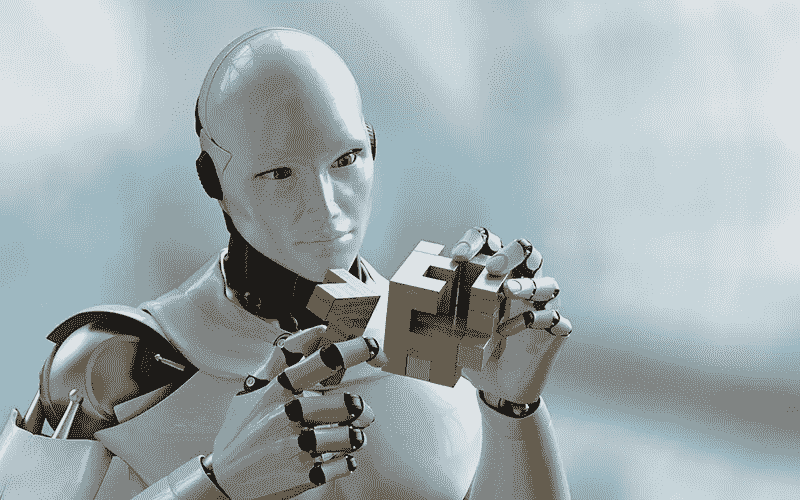

# AI 到底能做什么？

> 原文：<https://medium.datadriveninvestor.com/digit-recognition-a04de96b3407?source=collection_archive---------17----------------------->

The sequel image to [my previous article](https://blog.goodaudience.com/how-to-get-our-tech-to-tell-objects-apart-d4a0a5f84081) ;)

我想象一个平常的一天，在课堂上根据老师的讲课内容写笔记。然而，你知道，不幸的是，这些笔记将不会被使用，因为你几乎看不懂自己的笔迹。

**如果我告诉你，你可以让电脑为你做这件事，你会怎么样？这个程序可以阅读你所有的手写笔记，并将其翻译成文本。**

 [## 挑战你对人工智能和社会的看法的 4 本书——数据驱动的投资者

### 深度学习、像人类一样思考的机器人、人工智能、神经网络——这些技术引发了…

www.datadriveninvestor.com](https://www.datadriveninvestor.com/2019/02/28/4-books-on-ai/) 

# 我的项目

等等，不。我还不能那么做。我对人工智能比较陌生。我还不能构建和编码超级复杂的项目，但我正在努力。 [**我建立了一个数字识别器**](https://github.com/ninakhera/mnistdigitrecognition) **，使用 MNIST 数字数据库训练它。你可以写下一个数字，它使用它的数字数据集来训练它的模型识别它们。(很酷吧？)**

即使它现在看起来很简单，不太像，但以后，如果我们输入一个字母数据集，并在此基础上训练它，我们就可以有一个手写识别器。我们可以用这个来识别笔迹。不要再急着给你的朋友打电话，因为你看不懂她借给你的便条。我会替你做这项工作。

当我从我的一个朋友[那里发现我可以做到这一点](https://medium.com/@deviupadyay18/how-to-make-a-handwriting-recognition-app-ccb7b4ec9010)(如果你喜欢，可以拍拍她的文章)**我惊讶地发现，一部简单的手机使用一点代码和人工智能就可以做到这一点。**

对于那些不知道的人，根据谷歌的说法，**人工智能是计算机系统的理论和发展，能够执行通常需要人类智能的任务，如视觉感知、语音识别、决策和语言之间的翻译。**

你可能听过人们谈论它，要么谈论**它有多酷**，要么谈论它可能如何接管世界并控制我们所有人。它们都是有效的论点(只是开玩笑，不要大惊小怪)。只要 AI 在我们的控制之下，我们就没事(希望如此)。

# 人工智能的潜在应用

对于那些不熟悉我的帐户的人，你可能已经注意到我不再写那么多生物学文章了。别担心，我不会停止做这些事情，但最近我对人工智能及其在生物技术方面的潜在应用产生了兴趣。

到目前为止，我一直在考虑编码一个卷积神经网络，将衰老细胞与其他类型的细胞进行分类。这是一个巨大的问题。衰老细胞是漫游在你体内的“僵尸”细胞(更好地描述为处于死亡和活着之间状态的细胞)。它们对衰老也有很大的影响，并且没有任何特定的生物标志物。

根据谷歌(我们永恒的救世主)的说法，生物标志物是:**生物体中的一种可测量物质，它的存在表明了一些现象，如疾病、感染或环境暴露。**衰老的细胞会停止生长并扩大(有时会扩大一倍)。

**卷积神经网络(CNN)本质上是对图像进行分类**，因此我认为我们可以让 CNN 查看我们知道是否正在衰老的细胞，并训练自己具有高精度。注意这一点，它可能很快就会到来。；)

**另一个潜在的应用是使用 CNN 对乳腺癌的类型进行分类。如果你感兴趣并想做一个项目，网上有很多数据集和教程。我也可能会做类似的事情，这对医疗保健行业既有用又具有革命性。**

**另一个正在被广泛使用的可能应用是使用人工智能来预测模式。**这将通过使用机器学习和识别趋势的关键特征来创造新的可能价值来实现。你可以预测股票市场、交通等等的模式。这个概念本身有很多应用方式。

我在这篇文章开始时谈论了我很酷的数字识别器，最后讨论了潜在的进一步应用。这是因为我构建了一个数字识别器这一事实很酷，但是**我们可以使用 AI 做的事情甚至更酷**:)。

另一个问题。**你见过** [**网站**](http://thispersondoesnotexist.com/) **向你展示并不真实存在、只是人为生成的人物图片吗？**超级酷吧？嗯，事情是这样的……这些都是由生成性敌对网络(GANs)创造的。本质上，他们所做的是拍摄一堆照片，然后根据关键特征创建一张新的照片。

然而，这似乎没有用。生成新图片会给我们带来什么？嗯，你可以使用 GANs 根据人们最喜欢的名人照片为他们推荐商品(对商业来说很神奇)，改变照片中人的姿势，并把一幅画变成许多不同画家的风格。

另一个应用是提高图像的分辨率。很多时候，我们想要发送给人们的图像分辨率太低，但它们仍然很重要。通过使用生成对抗网络，你可以提高图像的分辨率。

**不，我不打算用这篇文章来谈论潜在的应用。**这是因为它们太多了，我甚至无法涵盖其中的四分之一。我们可以肯定的一点是 **AI 可以和任何行业**结合。

那是艾的强项。相对于很多其他行业，这个行业可以真正做到与一切结合。你说吧。财经:股市预测。长寿+保健:衰老细胞和细胞分类。服装，商业:根据你最喜欢的名人的穿着，利用 GANs 向你出售服装。

是的，我会承认:我再怎么爱长寿，也无法和很多行业结合。这很不幸，但 AI 可以！**人工智能是一个非常有用的行业**，编程是一项非常有用的技能。我建议尽快跟上潮流。

# 关键要点

*   人工智能有如此多的潜在应用，每一个复杂的系统都源于一个简单的系统。
*   没有基础知识，我们就做不出很酷的东西，所以你的项目实际上对于技术和技能的发展是非常必要的
*   人工智能可以和很多行业结合。

谢谢你看我的文章！如果你喜欢它，[看看我的其他文章](http://medium.com/@kheni)并留下一些掌声！

*原创发布:*[*https://ainews.spxbot.com/2019/03/11/digit-recognition/*](https://ainews.spxbot.com/2019/03/11/digit-recognition/)