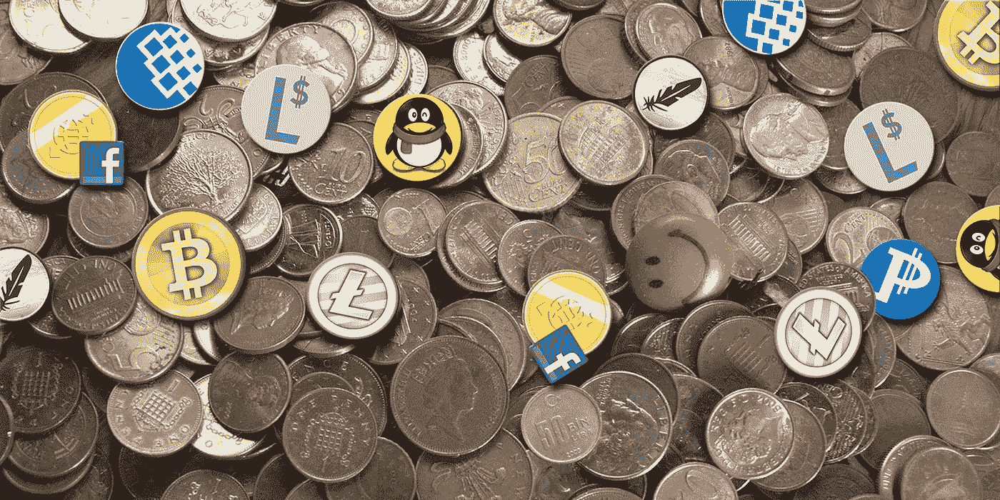

# 数字货币对社会有益？(Psst，它适用于现实世界中的“虚拟”货币)

> 原文：<https://medium.datadriveninvestor.com/digital-currency-for-social-good-psst-it-works-for-invented-currency-in-the-real-world-26e32722a638?source=collection_archive---------25----------------------->

实施我们全新的去中心化技术的相关性和及时性取决于我们作为一个社会是否准备好选择自由而不是法令。

All “invented” currencies are not created equal — *including* fiat

这是一个很关键的选择，因为选择菲亚特会导致社会经济屈从和国家操纵的黑暗面，而自由会导致…嗯，到底是什么？用可以替代菲亚特*什么？(提示:如今剧烈波动的加密货币不是一个稳定的答案。咳咳，比特币泡沫，有人吗？)*

我们全新的技术，一个叫做 Decentr 的平台，提供了一个去中心化的解决方案，用数据货币取代现金货币；数据可以几乎即时、无摩擦地在全球范围内传输。这消除了对政府支持的菲亚特*和* crypto 作为交换媒介的需求——随着我们各种物联网和智能城市设备和应用的发展，在线和越来越离线。

换句话说，Decentr 用记录在一个不可变的安全数字 ID 上的积极的用户参与度代替了现金，该 ID 对每个用户都是唯一的，并由每个用户控制。这种思维和技术范式转变的最终结果是，内容和货币实际上共存于同一个空间，让一种新型的“数字货币”有机会重新融入社区，成为社会公益的参与者。

是的，社会公益——尽管主流经济学家和银行家之流讨厌人们出于如此恶劣的目的(对他们来说)随意发明和流通自己的货币。这样的刻薄从何而来？这源于他们知道它*有效*的事实。

We know “invented” currencies work because all currencies are a human-made invention

他们是怎么知道的(你也应该知道)？因为历史上和当代的真实世界中，这种事情实际上发生过(并且还在继续发生)，这就是原因。

在货币发行发生的地方——不是针对黄金储备和不断增长的债务的任意发行——而是为了公共利益，主流经济理论的愚蠢在实践中暴露无遗。正如历史所证明的那样，印制你自己的货币，纯粹是为了换取提供的商品或服务(而*不是*为了从国际银行卡特尔那里借来的钱)，你实际上*刺激了*平等的供给和需求，消除了债务、通货膨胀或繁重的所得税需求。

在这种情况下,“恶性通货膨胀”实际上应该被重新命名为“hyper- *合并*”,因为银行家和他们谄媚的经济学家朋友们已经准备好把它作为捏造问题的“警告”推出来，在这个过程中完全摒弃了非正统的经济学派，转而支持他们对新古典经济学的执着。

Decentr 创造了一种范式，通过这种范式，数字资产由参与证明支持，而不是当前区块链节点的资源密集型“挖掘”价值活动(“数据挖掘”，顺便提一下，强调非正统经济学的合法、真实应用)。因此，我们的技术创造了一种有效支持物物交换经济的交换媒介，而不是要求作为国家强制的先决条件的外部强加的交换媒介，我们都必须使用它作为双方同意的价值储存手段。

最终结果是，这种新的数字交易媒介包含了*固有的*价值(不仅仅是财政*价值*)。

固有的*价值*的概念对权力者来说只是一个危险的想法，因为它比他们固有的*无价值*菲亚特更有效；它致力于公平的支付和交易；它为公众利益服务——只是对政府保持对其非劳动所得的控制不太好。

通过与现实世界的例子进行类比，你认为国际银行卡特尔为什么会盯上委内瑞拉？随着 100 万%的恶性通货膨胀和现金的缺乏，经济已经回归到物物交换，仅仅是因为它有效(在现金不存在或不可获得的地方)——更糟糕的是，它有效却没有任何征税的能力。哎哟。

而*那*绝对不会做。上一次有人成功实施政府支持的“易货经济”时，它引发了一场世界大战——并联合盟国的战略、经济和工业力量，打破了这个独特而强劲的经济体催生的表面上“破产”且资源匮乏的政权。(不要假装你看不到委内瑞拉的相似之处，因为美国对一个他们认为过于“专制”的政权实施了制裁。)

更糟糕的是，这个新贵上次并没有坐拥全球最大的石油储量。(随你怎么想。)

数字货币为所有人提供了这种创造好货币的选择。我们的平台将它与方便、分散的数据再利用和交换结合起来，保证了这种新货币的价值、稳定性和实用性，使其适合大众采用。游戏改变了。

请随时通过我们 [**网站**](https://decentr.net/) **上的联系表格与我联系，了解有关 Decentr 的更多详情，或者您可能有的任何问题或建议。**

*原载于 2019 年 2 月 21 日*[*www.datadriveninvestor.com*](https://www.datadriveninvestor.com/2019/02/21/digital-currency-for-social-good-psst-it-works-for-invented-currency-in-the-real-world/)*。*