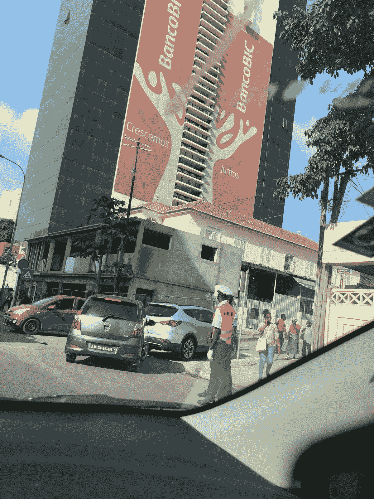

# 数字货币，它在安哥拉和非洲其他地方的地位

> 原文：<https://medium.datadriveninvestor.com/digital-currency-its-place-in-angola-and-the-rest-of-africa-970da6a2f133?source=collection_archive---------6----------------------->

> 比特币、以太坊和 Ripple 等数字资产能帮助非洲吗？

Downtown Luanda

安哥拉问题

2016 年 8 月，当我第一次访问安哥拉时，时任安哥拉总统的多斯桑托斯刚刚做出了 2018 年下台的决定。我飞到安哥拉，知道该国正经历经济衰退。我很快了解到，该国的往来账户已经耗尽了外汇储备。向国外发送银行电汇几乎是不可能的。多斯桑托斯政权继续印钞，拒绝让宽扎贬值，从而导致黑市交易大幅扩大，并加剧了通货膨胀。事实上，正是因为这个原因，安哥拉对我来说是一个很有吸引力的机会，让我首先来完成交易。

带着欧元或美元飞往安哥拉是更好的选择，因为银行和金融机构的美元或欧元都快用完了。从你在安哥拉的银行账户中提取 100 美元的过程会给你带来提供文件的障碍。最后，你会因为可能得不到而沮丧。因为这个事实，黑市是你获得美元或欧元的唯一途径。

持有 10，000 美元现金会给你带来麻烦，并作为外国人受到质疑。这是因为当时多斯桑托斯政权没有做好让安哥拉宽扎贬值的准备，而这些钱可以在黑市上以高于银行利率的价格兑换。尽管安哥拉是一个资源极其丰富的国家(在我看来是非洲前五名)，但它的经济与世界其他地区在金融上是隔绝的(今天大部分情况仍然如此)。美元的黑市汇率是银行汇率的 4 倍，投资者、商人和其他类似的人只能在街上交易。官方注册的货币交易所甚至不信任银行，也不按照银行汇率交易。在银行兑换美元也没有意义。你会损失 60% — 80%在街头获得的价值(金格拉 640kwz = 1 美元，商业银行 165 kwz = 1 美元)。因此，许多建筑公司、食品进口商、商人都受到了影响。由于安哥拉是一个主要的商品进口国，如果你不能把钱转移到国外支付货款，你就很难脱身。我对自己说，比特币是解决方案，尽管直到我到达美国 6 个月后，我才知道或明白它到底是如何工作的。

**数字货币的兴起**

2017 年 2 月/3 月，比特币的价格开始飙升。2011 年，一个比特币的价格不到一美元。但截至 2017 年 3 月，其涨幅已超过 427，000%。作为一名精通金融市场的交易员，我发现这非常不寻常。在这一年中，每次比特币价格上涨，都会让我想起我在安哥拉的情况，以及在安哥拉提供比特币可能是一个巨大的机会。我开始参加比特币和区块链会议，越来越了解分布式账本技术。我对比特币背后的技术——区块链——产生了兴趣。

我作为非洲矿产交易商和金融市场交易商的经历使我抓住了区块链技术的早期趋势、其应用以及对非洲的可能影响。从创建可编程的智能合约、去中心化的货币，到“带有时间戳和独特属性的动态云”

区块链和数字货币比一般人理解的要多。在津巴布韦金融危机最严重的时候，比特币首次突破 1 万美元。在津巴布韦，比特币可以卖到 2 万美元。当时，我确信区块链解决方案和数字资产可以在非洲带来巨大的潜力和投资机会。

**Stablecoins &非洲数字货币**

非洲的数字货币和区块链空间仍处于初级阶段。非洲政府可能会根据特定市场的参与者和渗透点进行调整。Stablecoins 可能只是一条路要走。

稳定货币指的是一种新的数字货币，这种货币提供价格稳定性和/或由储备资产支持，无论是商品还是法定货币。它们对非洲的吸引力在于其稳定的价值，这是大多数其他加密货币所不具备的。

委内瑞拉成为第一个创造自己的硬币“石油”的国家，这种硬币由该国的石油储备支持。这对非洲有用吗？也许是，也许不是。以刚果为例，该国拥有世界钴储量的 60%以上。钴目前的价格是每吨 57，750 美元。这对刚果有用吗？精神食粮。

有很多关于给非洲一枚硬币的讨论。问题是，这行得通吗？我认为现在确定还为时过早，因为已经有太多的数字货币了。然而，随着欧洲大陆推进经济一体化，这种可能性不能被否定。例如，2018 年 3 月，44 个非洲联盟成员国签署了建立非洲大陆自由贸易区的协议。该协定第 3 条创建了一个货物、服务和人员流动的单一市场，以深化非洲大陆的经济一体化。与此同时，西非国家经济共同体已经就推出单一法定货币 Eco 进行了 10 多年的讨论。

团结 3.85 亿(西非经共体次区域人口)市场的政治意愿是存在的。非洲也是如此(估计有 13 亿人口)。有一点是肯定的，如果人员和货物的自由流动是目标，非洲需要在经济上联合起来。数字货币能成为金融一体化的催化剂吗？只有未来知道答案。我的观点是，非洲各国政府应该考虑利用数字货币，特别是在自然资源开采领域，以提高效率。以刚果为例，刚果每年出口 3000 亿美元的矿产，但其银行系统效率低下。

Ripple 越来越多地被先进司法辖区的银行使用。它的基础设施允许用户和企业在瞬间进行跨货币交易。我觉得像 Ripple 这样的数字货币可以解决刚果银行系统和其他非洲国家中央银行系统的低效问题。我总是告诉投资者和政府官员，比特币、Ripple、Litecoin、Gemini Dollar、USDCoin 或任何其他知名数字货币的卖点在于其可转让性，而不是作为投资。随着 Gemini Dollar 作为美国监管机构首批全面监管的硬币之一发行，非洲有了一个独特的机会来探索 Stablecoins 和其他数字资产作为交换媒介。

**回到安哥拉**

2018 年 10 月回到安哥拉。这个国家在一个月前经历了 T2 的权力转移。新政府的重点是促进外国投资和便利货物流动。这个国家仍然受到通货膨胀的抑制。

安哥拉首都罗安达被美世 2018 年度生活成本调查评为全球第六贵城市。与 2017 年的调查相比，这是一个进步，当时它是世界上最昂贵的城市。安哥拉政府已将货币逐渐贬值 95%，以弥合黑市上的外汇缺口。由于当地货币的不值钱，这个决定伤害了它的公民。目前，黑市上的汇率为 390 肯尼亚先令兑 1 美元，安哥拉中央银行的汇率为 300 肯尼亚先令兑 1 美元。安哥拉没有秘密交易所。

政府面临的最大挑战是让本币保持稳定，并能兑换成其他资产。北岩已经提出了一些解决方案。鉴于安哥拉目前的局势，预计比特币或任何其他数字资产的价格至少会比市场价值高出 50%(等值美元)，以换取当地货币。企业对外汇的需求仍然很大，可以向安哥拉进口商品、服务、食品和建筑材料。

数字货币、区块链技术和非洲大陆自由贸易区的进一步实施，将使非洲大陆跨越进入非洲 3.0。从未创造或看到的金融产品、混合解决方案和服务将有机会改造证券交易所，革新土地登记系统，通过 RFID 在区块链上进行身份验证，甚至分散免费数据。对于发展中国家来说，除了互联网的发现之外，区块链确实是下一个最好的东西，而非洲处于最前沿。