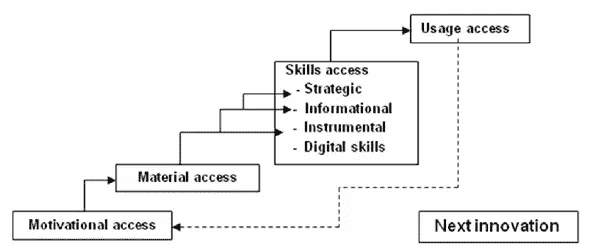

# 社交媒体的分歧阻碍了那些想要简单治疗的人

> 原文：<https://medium.datadriveninvestor.com/digital-divide-resistant-to-cure-7d26b8723b80?source=collection_archive---------9----------------------->

## 医生寻找解释真实和虚构的最佳方式

数字鸿沟是社交媒体的话题，医疗专业人员也不能幸免。事实上，当医生在玩追赶游戏时，病人往往占了上风。

整形外科医生[Remo-Tito Aguilar](https://twitter.com/bonedoc)博士说:“许多医疗保健专业人员已经可以通过材料和实物访问互联网。他是达沃市南菲律宾医疗中心桑托斯将军医疗中心的诊所主任。

阿吉拉尔也是医疗保健社交媒体的传播者，并在[剧组&好奇](http://remomd.com/)撰写他的医学思考。

 [## 社交是一颗容易吞下的药丸

### 没有衡量标准，很难评估医生和患者的进展

medium.datadriveninvestor.com](/being-social-is-an-easy-pill-to-swallow-20a90514d3d7) 

“健康信息越来越多地通过互联网获得，”他说。“医疗保健专业人员需要越来越复杂的技能来使用电子资源改善医疗保健服务。”

在阿吉拉尔看来，其结果是医患关系紧张。“当任何一方在这个数字鸿沟中属于对立的一方时，学院合作也会受到影响。”

在与其他医疗保健提供者交谈时，阿吉拉尔想知道数字鸿沟是否真实存在。答案通常是肯定的。

# 常见疾病

每个部门——医疗保健或其他——都可能存在数字鸿沟。它伴随着代际、技能和兴趣的差异。

“我喜欢这个答案，”阿吉拉尔说。“在一些发达国家，微小的差距来自技能和信息获取，而不仅仅是纯粹的基础设施。”

护士兼健康社会科学家杰罗姆·克莱奥法斯博士证实数字鸿沟是真实存在的。

 [## 预防的好处需要克服剩余的恐惧和焦虑

### 文化和错误信息导致疫苗犹豫不决

medium.datadriveninvestor.com](/benefits-of-prevention-need-to-overcome-remaining-fear-and-anxiety-ef611cd7a7a8) 

“有些医疗机构的互联网连接比其他的要好，”他说。“更好的机构拥有将健康信息学整合到组织中的人力、结构和政策。

他说:“人口中也存在数字鸿沟，这种鸿沟也伴随着社会不平等。”。“与富裕的客户相比，负担不起互联网连接的客户可能无法获得更多的健康信息。”

通路是经济和基础设施的一个因素。

“连接到互联网的能力——搜索、获取、处理和理解 WWW 上的健康信息——是数字时代健康素养的一个组成部分，”克莱奥法斯说。“不幸的是，不是每个人都有这种能力。

“对于那些有权限的人来说，有些人可能缺乏整理和理解网民可能接触到的大量健康信息的能力——更不用说错误的信息了，”他说。

# 越过海洋

那些认为数字鸿沟仅限于菲律宾的人应该三思。

“由于连接问题和采用理念，医疗保健领域肯定存在数字鸿沟，”马里兰州的医疗保健策略师 Shereese Maynard 说。“如果我能教给你一件事，那就是放眼全球，立足本地，缩小差距。

“这是有等级之分的，”她说。“获得并不总是等于公平。有些有更好的互操作性方法，而有些则没有。有些公司没有合适的基础设施，而其他公司有基础设施，但没有能力。”

 [## 社交媒体如何成为医疗保健的处方

### 教育有助于增强和激励患者

medium.datadriveninvestor.com](/how-social-media-is-a-prescription-for-healthcare-22f50bb0fab7) 

前景远非暗淡，而是积极的。

梅纳德说:“数字卫生为接触偏远地区的患者提供了一个巨大的机会，从而增加了改善结果的可能性。”“现在就需要引导资源，以便将来获得最大的利益。

“监管是创新的敌人，”她说。“许多领导者无法理解互联健康的长期价值。教他们成为另一项艰巨的任务。”

解决方案需要不止几个人的努力。

“无障碍问题需要协同合作来解决，”梅纳德说。“必须有全球协作，但也要在当地采取行动，为利益相关者带来有意义的变化。这包括基础设施和扫盲。”

医疗保健行业与急于创新的人竞争，与满足于现状、希望保护自己地盘的老兵冲突。

“在我看来，这是卫生部门——具体来说是学术界——应该处理的问题，以缩小医疗保健中的差距或数字鸿沟，”阿吉拉尔说。

“虽然就个人而言，对于大多数医疗保健专业人员来说，我们真的被困在技能和信息访问障碍中，”他说。"物理接触似乎不是最大的问题."

克莱奥法斯看到了两个主要挑战:

*   缺乏使互联网连接更加普及的基础设施。
*   基础教育课程中仍需加强的媒体和数字扫盲内容。

“移动技术、物联网设备和社交媒体的激增，加上长期无法向农村地区提供基于速度的宽带连接，是造成这种差距的原因，”梅纳德说。"这是一个终极的“有”对“无”的场景."

数字鸿沟不是一夜之间就能弥合的——如果能弥合的话。人与人之间存在差异是很自然的。

最好的方法是思想开放，灵活变通。只要有可能，就欢迎进步，并与那些跨越鸿沟的人一起工作，把患者的福祉放在心上。

无论你采取什么方法来解决数字鸿沟，都不要沉迷于技术而忽略了最终目标，即病人护理。伟大的思想可以在策略上有所不同，但是他们的目标应该是一致的。

“一点不错，”阿吉拉尔说。“这整个工作实际上是为了改善卫生服务的提供，把病人放在心上。一些患者甚至比他们的医疗保健提供者更懂数字技术。这使得他们之间关系紧张。”

# 入学加教育

克莱奥法斯期待改善准入。

“我们希望有更好的基础设施——为互联网接入较少的地区带来更多支持，”他说。“培养卫生专业人员和卫生管理人员使用互联网和信息学改善医疗保健的能力。

“在我们的护理科学学士课程中，在信息学方面有许多需要改进的地方，”克莱奥法斯说。"我希望拥有良好信息学实践的医院能够让学生们亲身体验."

 [## 医生为患者联系开出应用程序

### 即时连接也可能导致即时隐私问题

medium.datadriveninvestor.com](/doctors-prescribe-apps-for-patient-connections-fdb8cd90c166) 

他还希望针对普通民众的媒体和数字素养教育能够得到改善和加强。

“从幼儿园到 12 年级的课程已经为 11 年级设置了这样的内容，”克莱奥法斯说。"媒体和数字素养教育也可以通过非正式的方式进行，比如社区项目."

梅纳德避开了复杂的问题。

“让我来说明一下——简单点，笨蛋，”她说。“你可以通过同时解决识字率和鸿沟来缩小差距。这两个问题不能相互排斥。”

阿吉拉尔提倡深思熟虑的方法。

“建设基础设施应该伴随着技能和信息培训，以免产生白象结构，”他说。

他提出了最后一个问题，供同行在离开时考虑:

“作为一名医疗保健专业人员，你认为你对倡导或促进医学领域的数字文化或学术的最大贡献是什么？”

**关于作者**

吉姆·卡扎曼是[拉戈金融服务公司](http://largofinancialservices.com)的经理，曾在空军和联邦政府的公共事务部门工作。你可以在[推特](https://twitter.com/JKatzaman)、[脸书](https://www.facebook.com/jim.katzaman)和 [LinkedIn](https://www.linkedin.com/in/jim-katzaman-33641b21/) 上和他联系。