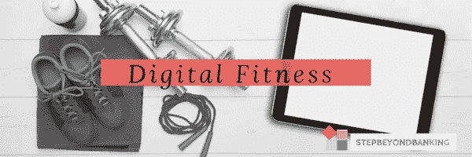

# 数字健身:去健身房真的能得到报酬吗？

> 原文：<https://medium.datadriveninvestor.com/digital-fitness-can-i-really-get-paid-for-going-to-the-gym-ccc6ea1a9531?source=collection_archive---------15----------------------->

更新:在发表这篇文章的时候，介绍词应该是“我刚刚在利马索尔海边跑完不寻常的 5 公里后回到家”。

我刚刚回到我的办公桌后，我通常午餐健身会议。今天又是这样的一天，我不得不说服自己离开舒适的办公椅，停止告诉自己“我今天太忙了，我明天去”，把自己带到健身房门口。

开车去那里的时候，我对自己说，如果我在健身房付出的努力得到回报，我会更有动力；不仅仅是你在健身房后得到的“满足感”(没有抱怨，那也是一个巨大的回报！)但也许是更具体的东西..？

 [## 2019 年移动应用开发之路——数据驱动投资者

### 任何在移动应用程序开发行业工作的人，无论他们是专注于在伦敦开发 iOS 应用程序还是…

www.datadriveninvestor.com](https://www.datadriveninvestor.com/2019/01/15/the-path-of-mobile-app-development-in-2019/) 

已经是三月底了，不可否认的是，对我们大多数人来说,“海滩身材倒计时”已经开始了。你曾向自己承诺过，就像每一年一样，今年，**今年**，你会成功并实现你的纽约决心“健身——*在此插入手臂表情符号*——！!"。

如果你已经成功地坚持了你的新年健身计划——恭喜你，你的传奇！不幸的是，虽然[统计](https://yougov.co.uk/topics/lifestyle/articles-reports/2018/12/31/only-one-five-intend-make-new-years-resolutions-20)通常支持相反的情况。

可以说，有 62%的人宣称他们将会制定新年计划，但只有 15%的人会真的去做，而且只有四分之一的人会坚持到底。

在 9/10 的情况下，注定的 NYR 名单包括健康的元素，例如:

常见的模糊/不切实际的那种“无论如何都要多去健身房/一周中的每一天”；或者

**B.** 更具体的目标(有人告诉你，如果你把目标具体化，就更容易实现……)，比如“跑步完成 300 公里”，或者

C. 非常普通和令人欣慰的，(给他们的创造者一个机会说至少他们*把它放在那里了)，像“今年更健康更健美！”。*

在这一切的阴霾中，在每年失败的纽约青年队的失望中，在午餐时间的健身房决策斗争中，你有没有考虑过，如果你的健康和健身目标实际上更加**可衡量**，更好的**跟踪**，**分析**，甚至**货币化**，事情会有多么不同？

如果来自你的健身追踪器/手机/其他可穿戴技术的数据被汇总、共享并得到**奖励**，你会觉得更有动力吗？

嗯，这就是 Lympo 的用武之地。

Lympo 生态系统由用户生成和控制的健身和健康数据驱动，通过引入 LYM 公用事业代币实现价值交换。

他们的目标是:创建一个生态系统，让所有行业利益相关者都能高效利用数据，每个人都能得到公平的回报。

实际上，通过在手机上下载 Lympo 应用程序*，您可以在应用程序市场中使用您的 LYM 代币完成挑战、获得奖励和购买产品。换句话说:你锻炼——你挣钱——你用挣来的钱买东西。有道理，不是吗？

要么你每周去 3 次健身房，要么你从事的职业要求你每天大部分时间都要走路，甚至每天晚上带你的狗出去散步都是你可以得到回报的锻炼。

本着类似的想法，塞浦路斯通用保险公司(塞浦路斯银行集团的一部分)也推出了一款名为“ [Drive Safe](https://www.gic.com.cy/en-gb/gic-homepage/personal/Drive-Safe/Drive-Safe-App/) ”的应用程序。该应用程序通过您手机的 GPS、位置和移动跟踪系统识别您的驾驶状况——在上班的路上，在回家的路上，从一个会议加速到另一个会议。然后，在旅程结束时，它会给你一个从 0 到 100 的分数，你收集的分数可用于奖励，如保险计划的折扣和公路旅行的奖金。尽管没有引入效用令牌(好吧，这是 BOC 的一个想法)，Drive Safe 应用程序与 Lympo 有类似的目的——它们都是为了帮助你以最有趣的方式实现目标(无论是健身还是成为更好、更安全的司机)，同时为你的努力获得真正的价值回报。

所有这一切是否意味着我们正在走向一个生态系统，在这个系统中，你每天的健身或每天的上班开车实际上可以给你带来一些东西？我们是否应该开始考虑所有可能的方法，利用科技来“回馈”用户、运动员、司机，甚至厨师？

金融科技能以什么样的新方式给我们迄今为止认为是标准的日常事务增添一点色彩，带来一点颠覆，还有待观察。

Lympo 应用程序目前可以在美国和韩国的 iPhones 和 Androids 上下载，更多地区将很快公布。来吧林波，欧洲也很适合！

*你知道有其他团体或初创公司推出过类似的概念吗？我们会很高兴发现更多，并查找他们。*

> 你可以在 www.stepbeyondbanking.com的博客上阅读更多类似的文章